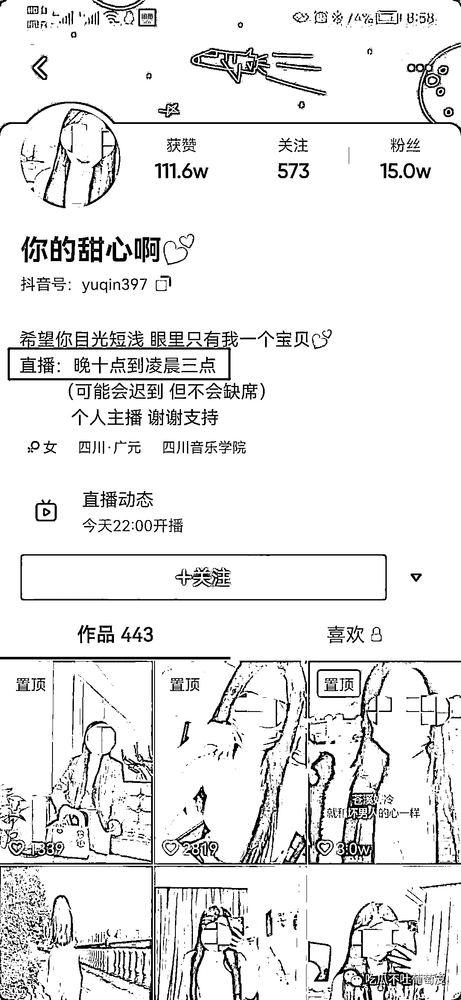

# 24 岁女网红被丈夫藏尸冰柜？竟因为发现手机上有不雅视频

> 原文：[`mp.weixin.qq.com/s?__biz=MzIyMDYwMTk0Mw==&mid=2247524831&idx=2&sn=05d57f12eaff6ee8a7b3303bccce1c96&chksm=97cbaae7a0bc23f1c46a956961a5398e517a3b38f2cf1e53c5a7206d12d5becc6564285d8232&scene=27#wechat_redirect`](http://mp.weixin.qq.com/s?__biz=MzIyMDYwMTk0Mw==&mid=2247524831&idx=2&sn=05d57f12eaff6ee8a7b3303bccce1c96&chksm=97cbaae7a0bc23f1c46a956961a5398e517a3b38f2cf1e53c5a7206d12d5becc6564285d8232&scene=27#wechat_redirect)

昨天在吃瓜群里疯传一段聊天记录，据了解是四川广元市苍溪县一名 24 岁的网红被丈夫杀害。嫌疑人家的大门已被警方贴上了封条，而丈夫杀害妻子一事，在当地人中间传开。 

邻居们称，20 日早上，警方在嫌疑人王某家中将其抓获，同时在其家中的冰柜中找到了尸体。有邻居还称，早在 9 月 14 日，王某就用一根绳子将其妻子勒死，然后买了一个二手冰柜藏尸。不过，也有邻居称，藏尸的是一个小冰箱。被害者是绵阳市盐亭县人，其母亲长期联系不上女儿，于是报了警。

那么，王某为何要对自己的妻子下此毒手呢？通过聊天记录得知，其妻子在家中做直播，时间为晚上 10 日至次日凌晨 3 时，**有一天王某发现妻子手机上有不雅视频，于是下了杀手。**

抖音账号显示，其粉丝有 15 万，获赞 100 多万，简介上显示：直播，晚上 10 点至凌晨 3 点（可能会迟到，但不会缺席）。

瓜友称嫌疑人是其读幼儿园孩子的同学的父亲，嫌疑人的妻子是一名直播网红，靠直播挣钱养娃儿和老公，她老公是吃软饭的，天天和他们一起接送娃儿，嫌疑人不上班，别人肯定要说闲话呀！

嫌疑人的妻子在抖音上都是很露很显身材的那种视频，为了博眼球，她娃都上幼儿园了，她发抖音说她没生育能力。

据邻居说被害人靠粉丝刷礼物赚钱，平时开一辆宝马，特别炫酷那种，拍的短视频很诱惑。 

根据网友透露的直播号，瓜姐发现该账号已设置为私密状态。

一位邻居介绍，嫌疑人姓王，20 多岁，从房屋建成起，他就随父母在此居住。在这位邻居的印象中，王某为人老实，以前在外打工，认识了自己的妻子，两人结婚生子。

对于王某被抓，作为邻居现在仍然感到有些害怕，她称自己亲眼见到王某被抓的场景，都不敢送孩子去学校。

有位邻居说，20 日早上 8 时左右，她买菜回家，上楼时发现了几名陌生人，后来对方介绍是警察。当时，民警敲王某家的房门，但没有敲开。

“因为我当时还有事，民警也让我离开现场，我就先走了，没过多久我回家时，警察就把王某抓走了。”邻居回忆，后来又来了很多民警，在王某家中拍照等。中午时分，从王某的家中将其妻子的尸体抬走了，“说的是王某 9 月 14 日就将妻子杀害了。”

[`mp.weixin.qq.com/mp/readtemplate?t=pages/video_player_tmpl&action=mpvideo&auto=0&vid=wxv_2151751870971740162`](https://mp.weixin.qq.com/mp/readtemplate?t=pages/video_player_tmpl&action=mpvideo&auto=0&vid=wxv_2151751870971740162)

邻居称，王某家中，平时就是王某夫妇和其孩子在居住，王某的母亲在外打工，偶尔回家一次。事发前一天，她遇到了王某的母亲，因为很久没见，两人还有简短的交谈。

“王某将妻子杀害后，买了一个二手冰柜回家，将尸体藏在冰柜中。而冰柜也放在其妻子的卧室内，王某的母亲虽然回过几次家，但从来不进儿媳的房间，所以也不知道具体情况。”邻居说。

王某杀害妻子一事，是如何被发现的呢？一位女性邻居介绍，被害者的母亲多次联系自己的女儿，但均未联系上，王某则称“外出打工了”，后来被害者的母亲报了警。同时，这位邻居称，据她了解，曾有人到王某家中找过其妻子，但并没有找到，因为王某曾将冰柜搬上了楼顶藏匿。

对于王某为何要对其妻子下毒手，一位知情人透露，王某的妻子确实是做直播的，王某作案前，发现了其妻子的手机中有不雅视频，然后下了杀手。

一位邻居称，王某是用一根绳子将其妻子勒死的。24 日下午，苍溪当地相关部门表示，嫌疑人已被刑拘，案件正在进一步调查中。

来源：红星新闻，吃瓜不吐葡萄皮

← 向右滑动与灰产圈互动交流 →

