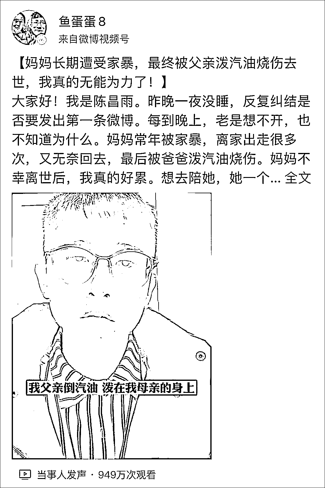
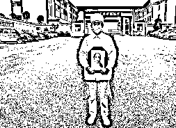
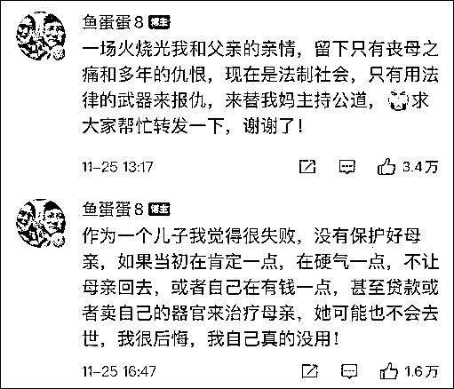
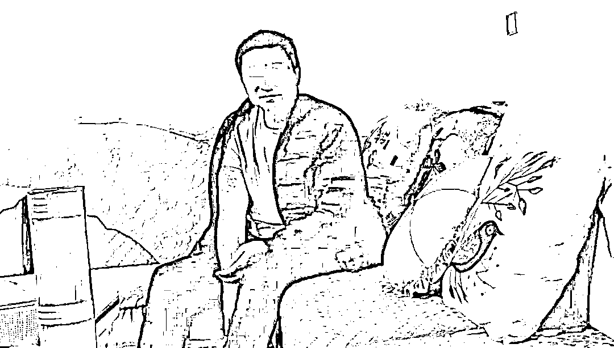

# 网友称父亲将母亲烧伤致死仍逍遥法外，当地回应

> 原文：[`mp.weixin.qq.com/s?__biz=MzIyMDYwMTk0Mw==&mid=2247524831&idx=3&sn=773f064363f18398fc39200536b776df&chksm=97cbaae7a0bc23f1861cec6964a191b9c001fea7f3479492cedca0f1a3b60e74b045563d60da&scene=27#wechat_redirect`](http://mp.weixin.qq.com/s?__biz=MzIyMDYwMTk0Mw==&mid=2247524831&idx=3&sn=773f064363f18398fc39200536b776df&chksm=97cbaae7a0bc23f1861cec6964a191b9c001fea7f3479492cedca0f1a3b60e74b045563d60da&scene=27#wechat_redirect)

昨天（25 日），网友@鱼蛋蛋 8 在微博发帖求助称，母亲长期遭受家暴，今年 3 月，在家里被父亲泼汽油烧伤并于 7 月份去世，然而，父亲至今依旧没有被逮捕，“真的无能为力了”。 

据澎湃新闻报道，昨晚，当地政府办公室工作人员回应称，犯罪嫌疑人已于 11 月 20 日被当地警方刑事拘留，接下来警方将报请检方批捕。

<mpvideosnap class="js_uneditable custom_select_card channels_iframe" data-pluginname="videosnap" data-id="export/UzFfAgtgekIEAQAAAAAAZugqfBvP-QAAAAstQy6ubaLX4KHWvLEZgBPEpIN0GlAWWLL9zNPgMIvEV6n2H39iOP_1zDPP07ig" data-url="https://findermp.video.qq.com/251/20350/stodownload?encfilekey=oibeqyX228riaCwo9STVsGLPj9UYCicgttvrVJFU9j0Cf0Q8sbyWHorib0rD4LOvhPatsCwjW4cpn8IhX9K336ibibq62mw96aiaT9dHqf7E5J2b6jw0RiaoqWAJlgG6WkwMbCk6&amp;adaptivelytrans=0&amp;bizid=1023&amp;dotrans=0&amp;hy=SH&amp;idx=1&amp;m=560ec4dd2ba910e892df292d55bcb74d&amp;token=AxricY7RBHdWozDia5cwuBJO845C5IxItCH0wnUZHlIXp9tdFHhW4wmVQcA3p2gt2DfVPq8SO3QqE" data-headimgurl="http://wx.qlogo.cn/finderhead/PiajxSqBRaEISAKibugHhUQs74zK9sdqn9QvawbxCzU7AuxCgU4kpS0A/0" data-username="v2_060000231003b20faec8cae18b1bcad5cb00e937b0779ef044c516b0481d185bbca60dd9c21f@finder" data-nickname="灰产圈" data-desc="【妈妈长期遭受家暴，最终被父亲泼汽油烧伤去世，我真的无能为力了！】大家好！我是陈昌雨。昨晚一夜没睡，反复纠结是否要发出第一条微博。每到晚上，老是想不开，也不知道为什么。妈妈常年被家暴，离家出走很多次，又无奈回去，最后被爸爸泼汽油烧伤。妈妈不幸离世后，我真的好累。想去陪她，她一个人太孤独了。2021 年 3 月 14 日晚，妈妈在家里被他泼汽油烧伤，家也毁了。送去医院后，报告显示：“颜面颈、躯干、四肢多处汽油烧伤 6 小时”。等我赶回到医院，不敢相信躺在床上的那人是我妈妈。她的身体包裹着纱布，时常因痛苦而发出无望的呻吟。我听着、看着，感到非常难受，每天哭、每天哭，不知道该怎么办。太无力了。三月报警，十月立案。直到今天，父亲还是没有被拘留。我不敢回家，因为担心父亲报复。母亲的遗物，也来不及整理。我觉得自己好没用，连自己的母亲都保护不了。本来以为我长大了，日子就会好起来，没想到发生了这样残忍的事。现在的我，不知道该怎么办才能惩罚父亲，还母亲一个安慰。我迫切希望将父亲绳之以法，让母亲早日入土为安。请帮帮我吧！#云南女子被家暴烧死丈夫仍逍遥在外@灰产圈 " data-nonceid="17679422372995976334" data-type="video"></mpvideosnap>

@鱼蛋蛋 8 名叫陈昌雨，来自云南省宣威市热水镇，昨天，他在微博中称，其母亲长期遭受父亲家暴，离家出走很多次，又无奈回去，更深的悲剧发生在今年 3 月份，“当时，我父亲泼汽油倒在我母亲的身上，烧伤面积达到 55%以上，到医院的时候我简直认不出来那是我的母亲，全身浮肿黝黑。”

陈昌雨称，7 月份，他母亲去世了，但直到现在，其父亲还没有被拘捕，“真的无能为力了，当天，公安机关对我母亲进行了尸检，我已经看不下去了，你说她生前受了那么大的罪，直到她去世之后，都没有得到一点安宁，那画面我简直不敢想，直到现在，我有时候都会从噩梦里面惊醒，但是我没有办法呀，我真的没有办法了，没有人替我妈主持公道呀。”

在评论区，他还表示，一场火烧光了他和父亲的亲情，留下的只有丧母之痛和仇恨，希望用法律武器来替母亲主持公道。

此事在微博上引发热议，截至目前，视频点击量已超过 1000 万，转发近 8 万，网友们也为其鸣不平。

北京青年报@北青深一度 也曾报道，陈昌雨的母亲曾在烧伤后面对镜头讲述此事的经过，称事发当晚，她和丈夫因为琐事发生争吵。想到以往每次发生争执后，身上总被丈夫掐得青一块紫一块，她便睡到了沙发上。半夜时，丈夫起床从屋外拎了一桶汽油进来，“满屋子撒，我去抢，身上也被撒上了汽油。”

次日，警方来到医院进行调查，当民警询问陈昌雨的父亲为什么倒汽油点火时，后者的回答是“不想活了”。父母都被烧伤并住院，俩人住在同一间病房，在陈昌雨报警后，很多亲戚认为他不应该报警，“就算你爸再做错什么事，也不能那么冲动。”

陈昌雨的叔叔还因为认为陈昌雨没有好好照顾父亲，将其父亲的费用结清后，转往其他病房。后来，他父亲恢复得很好，出院了，母亲去世。

陈昌雨的父亲，图自北京青年报

据澎湃新闻昨晚（11 月 26 日）报道，云南省曲靖市宣威市热水镇政府办公室称，犯罪嫌疑人已于 11 月 20 日被当地警方刑事拘留，接下来警方将报请检方批捕。

热水镇政府办公室一名工作人员介绍，案发后，当地公安部门介入处理，政府相关职能部门也为当事人的家庭提供帮助。今年 10 月份，在知悉当事人家中经济困难的情况后，政府部门为他申请了大额临时救助，目前正在公示期间。

前述工作人员介绍，他们通过走访得知，当事人的父母存在复杂的感情纠葛。案发时只有当事人的父母在场，两人均被烧伤。且事发后两人的说法存在矛盾。“他父亲说是他母亲向他泼汽油、点的火，他母亲说是他父亲泼汽油、点的火。”工作人员表示，具体以公安机关的调查结果为准。

<mpvideosnap class="js_uneditable custom_select_card channels_iframe" data-pluginname="videosnap" data-id="export/UzFfAgtgekIEAQAAAAAAXbwZXiGDAAAAAAstQy6ubaLX4KHWvLEZgBPEwYJYIxZtWbL9zNPgMItbElt7YzVREVJl6NcIfex2" data-url="https://findermp.video.qq.com/251/20350/stodownload?encfilekey=oibeqyX228riaCwo9STVsGLPj9UYCicgttvZEibWRIJBg6JaM3qehCEiapThH1H2z7u9A0uX2rbXSQaGFWKzrJhB2EEFG4E0dWWwKO2DuicKxNP3QO1nq8f50hjGWYcAXWEh4L&amp;adaptivelytrans=0&amp;bizid=1023&amp;dotrans=0&amp;hy=SH&amp;idx=1&amp;m=99183b74e6ebf1b130341b1fd06b23a7&amp;token=AxricY7RBHdWozDia5cwuBJNFHDCT28KjsQ4YzcbEttw0V5egan8G7vgXUx3CqdzbaoDiaouV2MXwo" data-headimgurl="http://wx.qlogo.cn/finderhead/PiajxSqBRaEISAKibugHhUQs74zK9sdqn9QvawbxCzU7AuxCgU4kpS0A/0" data-username="v2_060000231003b20faec8cae18b1bcad5cb00e937b0779ef044c516b0481d185bbca60dd9c21f@finder" data-nickname="灰产圈" data-desc="从我母亲 3 月 14 日烧伤之后，3 月 22 日报警，警方来医院做了笔录，用执法记录仪对我父亲进行了记录，当天警方也去事发现场看过了，现场遭到破坏。

警方问我父亲是不是他泼的汽油，我父亲回答是。
警方问我父亲，是不是他点了火，我父亲回答是。
警方问他说为什么要这样做，他给警方的回答是，我不想活了。说完之后，情绪失控哭了。

我母亲 7 月 28 日去世，直到 10 月 16 日，警方电话通知我，尸检报告已经下来，我从广东赶回了云南，10 月 18 号，警方对我跟我小姨进行了第二次笔录，告知了尸检报告的内容，然后说让我们回去，等通知。

媒体报道出来之后，昨天接到警方电话，透露父亲已被拘留，案子进入侦查阶段。感谢大家的支持，感谢政府和社会媒体对这件事的关注！后续如有进展，我会及时告诉大家。@灰产圈 " data-nonceid="6041456171156682033" data-type="video"></mpvideosnap>

来源：观察者网，微博@鱼蛋蛋 8

← 向右滑动与灰产圈互动交流 →

