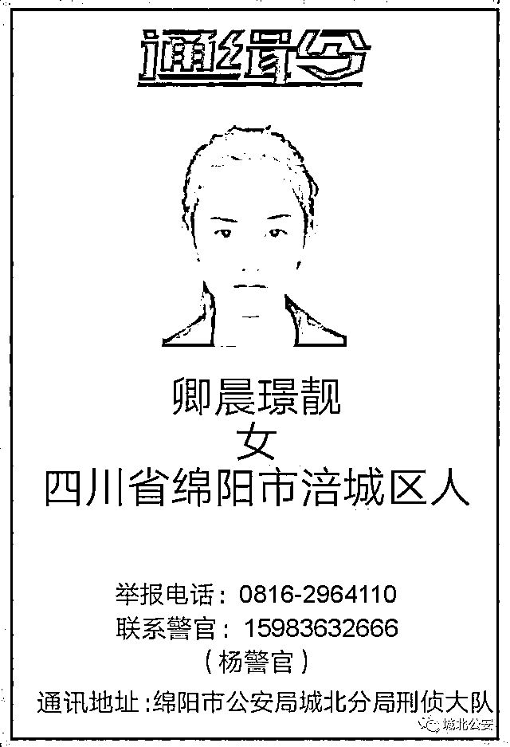
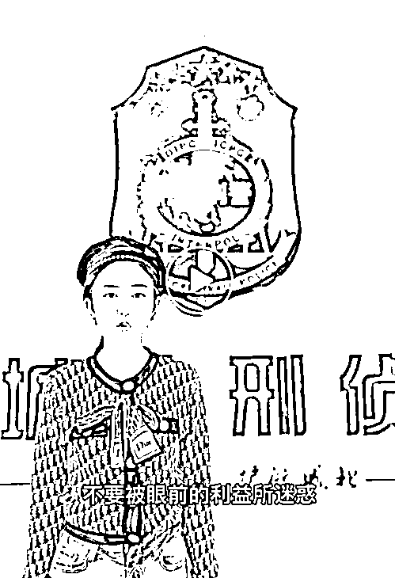

# 曾因高颜值通缉照走红的酒托，出狱后拍摄官方反诈宣传片引关注，警方回应……

> 原文：[`mp.weixin.qq.com/s?__biz=MzIyMDYwMTk0Mw==&mid=2247524831&idx=4&sn=2013af0fee3aed130bad8eefcc7fa107&chksm=97cbaae7a0bc23f19e313be7bfb64a7827499f5a9192ca7f231576d7f05eb9267e60a9bf88cc&scene=27#wechat_redirect`](http://mp.weixin.qq.com/s?__biz=MzIyMDYwMTk0Mw==&mid=2247524831&idx=4&sn=2013af0fee3aed130bad8eefcc7fa107&chksm=97cbaae7a0bc23f19e313be7bfb64a7827499f5a9192ca7f231576d7f05eb9267e60a9bf88cc&scene=27#wechat_redirect)

11 月 25 日，四川省公安厅反电信网络诈骗中心官方抖音号“熊猫反诈”发布的一则“反诈宣传”视频引发关注。出演此视频的女主角，正是被称为绵阳“最美酒托”的卿晨璟靓，她曾因高颜值通缉照刷屏全网。 

[`v.qq.com/iframe/preview.html?width=500&height=375&auto=0&vid=z3310elylo0`](https://v.qq.com/iframe/preview.html?width=500&height=375&auto=0&vid=z3310elylo0)

**最美通缉照走红，**

**女子出狱后参与反诈宣传** 

2018 年 11 月，四川绵阳警方发布检举“酒托”诈骗犯罪团队在逃人员的通告，该团队以酒托为名进行诈骗，涉案金额高达 140 余万元，而犯罪嫌疑人之一卿晨璟靓因漂亮的容貌受到广泛的关注。2018 年 11 月 28 日上午，卿晨璟靓选择投案自首。

此次的反诈视频的内容，讲述了卿晨璟靓在出狱后，有诈骗团队邀请她再次入伙，她毅然选择报案的故事。记者注意到，视频结尾字幕落款单位为绵阳市公安局城北公安分局。

**本人回应：**

**自己主动作为**

卿晨璟靓出镜解释此次作为“反诈宣传人员”一事，她称自己出狱后又有人找她做“酒托”。她认为，虽然自己拒绝了，违法人员可能还会去找其他小朋友和年轻人，所以她选择报警，并且联系到公安志愿成为“反诈宣传人员”，普及诈骗危害性。

**绵阳警方回应：**

**分局策划并未报备，**

**暂时没有下一步宣传动作**

对此，绵阳市公安局宣传处工作人员回应极目新闻记者称，这次反诈宣传视频是城北公安分局制定的策划，当时并没有向市局报备。目前，暂时没有下一步宣传动作。

“别人的评价都是小事，只要把宣传做到位就好了。”卿晨璟靓在接受媒体采访时表示，自己做反诈宣传不光是不让人被骗，而是让更多人不要参与到诈骗活动中来。

来源：潇湘晨报，城北公安

← 向右滑动与灰产圈互动交流 →

