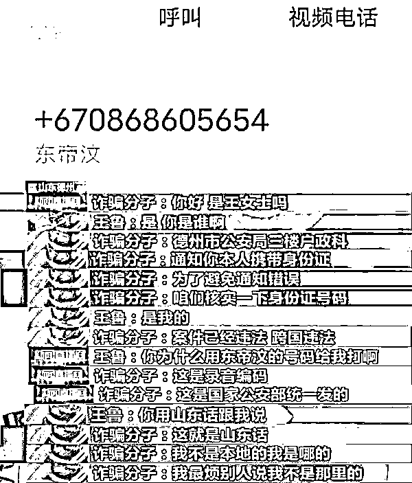
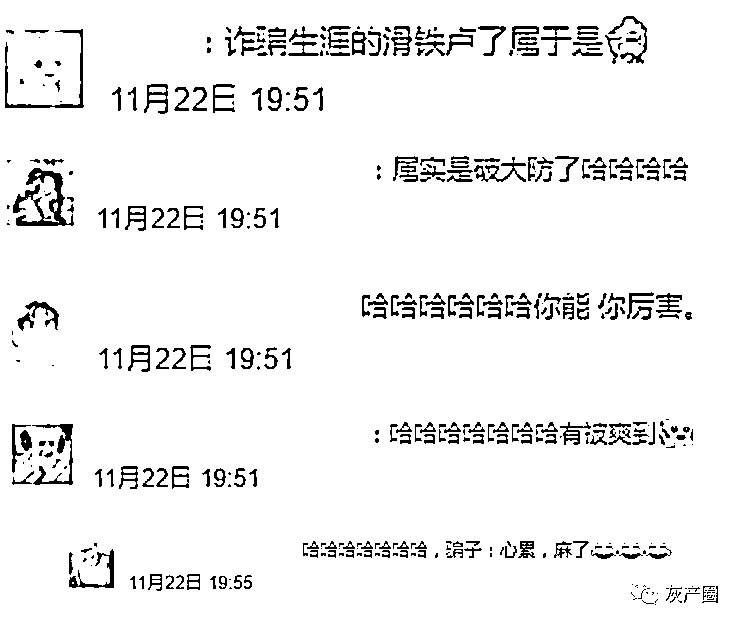
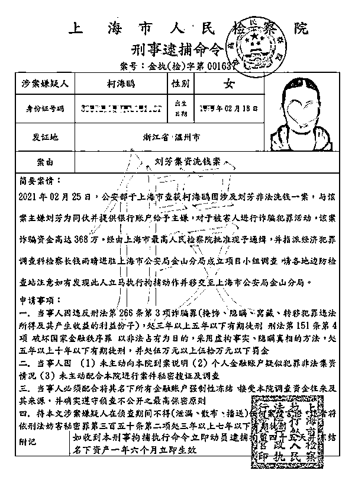
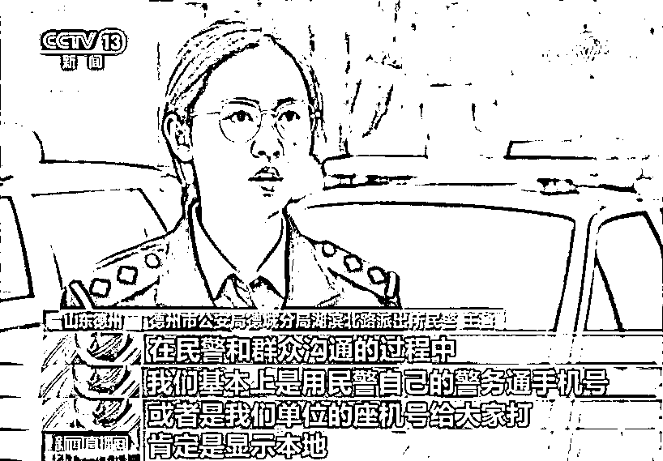
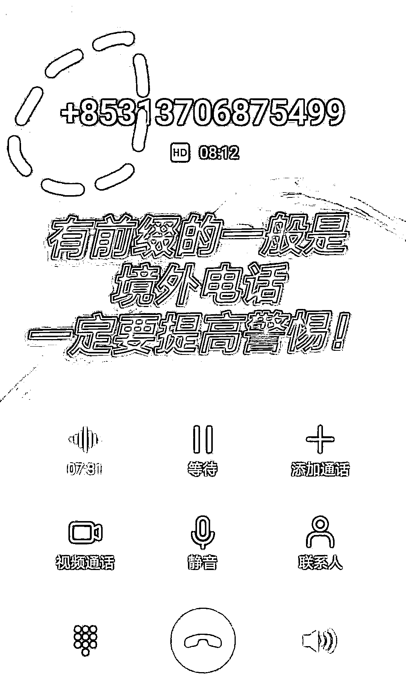

# 笑不活了！一通来自“东帝汶”的电话被警察“群嘲”......网友：有被爽到！

> 原文：[`mp.weixin.qq.com/s?__biz=MzIyMDYwMTk0Mw==&mid=2247524831&idx=5&sn=b1086c0fd04761ab4e5cbe762c314a8c&chksm=97cbaae7a0bc23f1fc1d2ebcb3fa5d4a1a1ac5805e19edad883710f4113f115960b0712754b2&scene=27#wechat_redirect`](http://mp.weixin.qq.com/s?__biz=MzIyMDYwMTk0Mw==&mid=2247524831&idx=5&sn=b1086c0fd04761ab4e5cbe762c314a8c&chksm=97cbaae7a0bc23f1fc1d2ebcb3fa5d4a1a1ac5805e19edad883710f4113f115960b0712754b2&scene=27#wechat_redirect)

一定是特别的“缘分”
冒充警察的诈骗分子

居然把电话打到了警察的手机上

**结果被一顿“灵魂回怼”后**

** 骗子逐渐心态崩了……******

[`mp.weixin.qq.com/mp/readtemplate?t=pages/video_player_tmpl&action=mpvideo&auto=0&vid=wxv_2152774113772240897`](https://mp.weixin.qq.com/mp/readtemplate?t=pages/video_player_tmpl&action=mpvideo&auto=0&vid=wxv_2152774113772240897)

近日，山东省德州市公安局德城分局民警王鲁接到一个来自**“东帝汶”**的诈骗电话，骗子自称是德州市公安局户政科民警，告知王鲁**涉嫌跨国犯罪**，要求其去市公安局户政科核实情况......

电话中，骗子“一本正经”地声称民警王鲁涉嫌“跨国违法”，需要配合“警方”调查。王鲁立即断定对方就是诈骗分子，但是并没有马上揭穿。

起初骗子还假装淡定，要求民警自行前往德州市公安局。随后，王鲁的同事也忍不住加入“群聊”，一起对骗子展开“灵魂回怼”，接连指出漏洞：**警号不对、口音不对、楼层不对：**

“你办公室电话多少？”

“你警号多少？”

“你是山东本地的吗？”“用山东话说！”

“你在公安局三楼哪个办公室？”

“我在四楼，你上来找我吧！”

‍‍‍‍

因骗子的话术太拙劣，民警几度笑出声，边笑边给骗子“上了一课”。一顿灵魂发问，骗子早已没了刚开始的气势，心态也崩了，只能认怂：**你最厉害！你能！你多厉害！**

**网友：有被爽到******

也有一些网友反映

自己也接到过类似的诈骗电话

近些年 

“冒充公检法”的诈骗案例

其实并不鲜见

剧本套路也都大同小异

骗子往往以**震慑+恐吓**

骗取受害者的信任

逐步击破其心理防线 

等到受害者六神无主之际

骗子便上演“请君入瓮”的戏码

要求对方下载指定软件

提供银行账号、密码等

**“交钱平事”**

▼

**“这里是 xx 公安局，您涉嫌 xx……”**

“是 xx 吗？这里是公安局，您涉嫌洗黑钱，将冻结你的银行账户！”

“你名下的手机卡发送大量违法信息，将被停用！”

“你涉嫌骗取保险！”

……

**“你被通缉了！这是你的通缉令！”**

好家伙！

若是接到这样的电话

收到带有自己照片、姓名的

“通缉令”“逮捕令”

是不是吓得浑身哆嗦？

但是千万别被这些演技“炸裂”的骗子唬住！

真正的“公检法”

**根本就不会在电话和网络上办案**

** 也不存在所谓的“安全账户”！**

凡是电话中自称“公检法”工作人员

要求进行转账的

都是诈骗！ 

民警在和群众沟通时

一般使用警务通手机号或单位座机号

号码会显示本地

当发现对方电话号码显示异常时

务必要提高警惕

第一时间进行核实！

不管骗子的招数怎么变 

最后的终极目标

一定是让你转账、打钱

所以最重要的一点就是

只要我们**不轻信、不透露、不转账**

骗子的手段再高明

也是徒劳无功！

来源：拒绝跨境赌博综合自人民日报微博、央视《新闻直播间》、闪电新闻、德州公安、网友评论等

← 向右滑动与灰产圈互动交流 →

