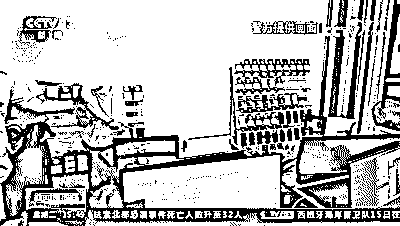

# 注册 300 多万个微信号！山东警方打掉一个特大非法注册贩卖微信号犯罪团伙

> 原文：[`mp.weixin.qq.com/s?__biz=MzIyMDYwMTk0Mw==&mid=2247524831&idx=6&sn=8c598c22de448945c7346657fca89c9d&chksm=97cbaae7a0bc23f1e76eaf32ceecfd71a97420c39daa8db2d3f5fe36a63dee4f81727d593ef2&scene=27#wechat_redirect`](http://mp.weixin.qq.com/s?__biz=MzIyMDYwMTk0Mw==&mid=2247524831&idx=6&sn=8c598c22de448945c7346657fca89c9d&chksm=97cbaae7a0bc23f1e76eaf32ceecfd71a97420c39daa8db2d3f5fe36a63dee4f81727d593ef2&scene=27#wechat_redirect)

近日，山东淄博警方打掉一个特大非法注册贩卖微信号的犯罪团伙，抓获犯罪嫌疑人 12 人。这个犯罪团伙自 2019 年以来注册了 300 多万个未实名的微信号卖给境外电信网络犯罪团伙，目前已查实涉案金额 3000 多万元。

[`mp.weixin.qq.com/mp/readtemplate?t=pages/video_player_tmpl&action=mpvideo&auto=0&vid=wxv_2140880194168029186`](https://mp.weixin.qq.com/mp/readtemplate?t=pages/video_player_tmpl&action=mpvideo&auto=0&vid=wxv_2140880194168029186)

今年 9 月，淄博市公安局周村分局民警查获线索，山东某电子科技有限公司法人代表龚某伙同张某等人，通过技术手段大量注册未实名的微信号向境外赌博诈骗平台销售。

接警后民警迅速成立专案组，对这家科技公司进行研判，经调查这家科技公司是一个皮包公司，没有正常的工作地址。负责该公司平台编程的原技术员孟某已于今年 4 月离职，民警很快找到孟某并获取了更多线索。

孟某 2020 年 9 月份入职，在今年 4 月份的时候发现这家科技公司卖这些社交账号卖给嫌疑人，都是从事犯罪活动，所以孟某离职。在掌握了涉案团伙的主要犯罪事实和活动规律后，周村警方组织 30 多名警力，分别对三个作案窝点开展抓捕行动。

分工明确，3000 余部手机不间断工作 

收网行动当中，专案组的民警发现在其中一个窝点内多达 3000 多部手机在同时工作，抓捕时仍有一些手机正在不间断的注册未实名微信号，这些微信号被犯罪团伙销往境外，用来帮助电信诈骗、网络赌博等犯罪转账收款使用。

[`mp.weixin.qq.com/mp/readtemplate?t=pages/video_player_tmpl&action=mpvideo&auto=0&vid=wxv_2140881168387407881`](https://mp.weixin.qq.com/mp/readtemplate?t=pages/video_player_tmpl&action=mpvideo&auto=0&vid=wxv_2140881168387407881)

位于周村某居民小区的窝点内，犯罪团伙正在用手机注册微信号。窝点内 6 个金属架上整齐的摆放着许多手机，桌上的一些手机也正在工作状态，这些手机都是从网上买来的二手智能机，每部售价 200 元左右，他们在电脑的控制下可以自动注册微信号。

办案民警：三七平台是干什么用？这是群控平台还是中转平台？

犯罪嫌疑人：控制手机用的。 

办案民警：是批量控制手机是吧？

犯罪嫌疑人：是的。

这个被称为三七平台的群控平台，由团伙的技术人员开发，这个程序可以实现整个注册程序的自动化，节省人力，节省成本。同时可以记录注册成功的手机号，方便下一步销售。

设在张店某小区的窝点，主要负责技术开发。民警抓获主要犯罪嫌疑人宋某，查扣电脑服务器和测试用的手机一批。设在高新区的窝点负责注册新的社交账号等，民警在这里抓获团伙头目龚某等人。与此同时，以入股方式参与犯罪活动的赵某、杨某相继在杭州和深圳落网。

 月注册 41 万个微信号，用虚拟币交易出售

警方初步查明，犯罪团伙以注册公司为掩护，实行股份制模式，公司法人代表龚某占股 40%，赵某、杨某以及技术入股的王某共占股 40%，其余的 20%的股份用于团伙共用。

[`mp.weixin.qq.com/mp/readtemplate?t=pages/video_player_tmpl&action=mpvideo&auto=0&vid=wxv_2140881913631342592`](https://mp.weixin.qq.com/mp/readtemplate?t=pages/video_player_tmpl&action=mpvideo&auto=0&vid=wxv_2140881913631342592)

犯罪嫌疑人向警方供述，几名团伙骨干人员都是在 QQ 群里认识的，这个 QQ 群里的人大都是从事贩卖微信号等社交账号活动，几人结识后便决定由巩某出面组建公司，搭建平台，注册社交账号，用于销售牟利。

平台的作用主要是负责从卡商那边抽取电话号码，通过自动识别这些手机号码的归属地，根据这些归属地找到 VPN 代理，最后把这一套程序统一上传到手机上，由手机自动完成注册社交账号的这套程序。民警在梳理这个平台时发现，2020 年 10 月 21 号到 11 月 26 号仅一个多月的时间，这个平台就注册微信号 41 万多个。

为什么网络赌博和电信诈骗违法犯罪嫌疑人需要使用大量微信号？

一方面可以隐藏自己的身份，另一方面随着我们国家对电信诈骗跨境赌博打击的力度变大，这些社交账号在不停的被封禁、关闭，犯罪嫌疑人需要不停的更换。

民警在梳理团伙涉案资金时发现，犯罪嫌疑人龚某名下有多个虚拟币钱包，据交代，钱包里的虚拟币都是向境外犯罪团伙销售微信号后获取的。其中有一个钱包在 2020 年 9 月份到今年 9 月份，总共中转泰达币近 500 万个，折合人民币在 3000 余万元。

目前龚某等 7 名犯罪嫌疑人因涉嫌帮助信息网络犯罪活动罪被检察机关依法批准逮捕，其余 5 名刚到案的犯罪嫌疑人已被警方依法刑事拘留，案件仍在进一步侦办中。

来源：淄博公安 ，央视新闻，巴蜀反诈

← 向右滑动与灰产圈互动交流 →

