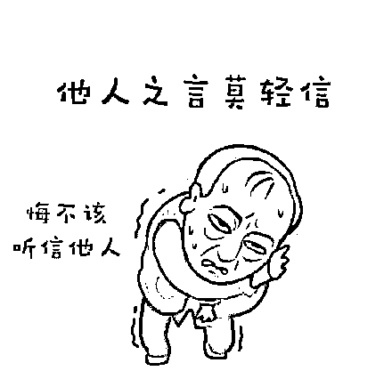
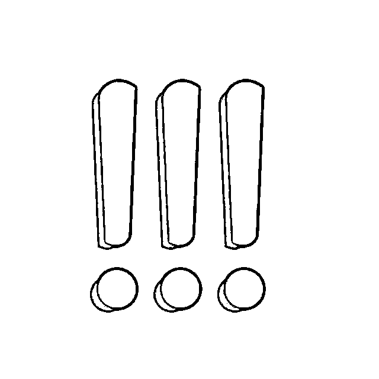

# 花式围猎，虚拟货币骗局向老年人举起“镰刀”！

> 原文：[`mp.weixin.qq.com/s?__biz=MzIyMDYwMTk0Mw==&mid=2247524831&idx=7&sn=000a88832aeaef6de75aaa7930367631&chksm=97cbaae7a0bc23f12a0ab70a29fcb92467c184d3ca6a121333b9b95d34b5355ea4a6d89eb72a&scene=27#wechat_redirect`](http://mp.weixin.qq.com/s?__biz=MzIyMDYwMTk0Mw==&mid=2247524831&idx=7&sn=000a88832aeaef6de75aaa7930367631&chksm=97cbaae7a0bc23f12a0ab70a29fcb92467c184d3ca6a121333b9b95d34b5355ea4a6d89eb72a&scene=27#wechat_redirect)

不用投钱可以“**零撸”？** 

用户通过手机就能**“挖矿？**

发展下线就能**“推荐返利”**？

**......**

近日，一种名为 Pi 币的虚拟货币

开始向**老！年！人！**发起**“花式围猎”**！

今天，小编就带带大家看清这类骗局 

家里有老人的一定要注意！

************

11 月 24 日，老家新疆的李明告诉北京商报记者，近几个月在新疆不少人都开始接触虚拟货币，其中这个号称“0 成本、高收益”的 Pi 币，尤其被待业或退休的中老年人群青睐，玩得不亦乐乎。

李明称，他母亲主要是在朋友的推荐下得知了 Pi 币，因为宣称近期将主网上线，这也刺激了越来越多中老年人加入。确实，自虚拟货币严打以后，有一些山寨币、传销币瞄准了下沉市场，甚至拿中老年人“开刀”。**今天，就****让我们来慢慢拆解他们的“围猎套路”！**

****

**套路第一步：“零撸”**

**先给中老年人的一点“小甜头”**

**所谓“零撸”，就是不用投资本金，主要用手机签到，就可以进行挖矿，获得少部分代币。**

李明说：**“我老妈现在都已经挖了好几百个了，一听主网上线能快速涨价，后续还要上线多个交易所，她就跟着了魔似的天天梦想着‘暴富’。”**

但要注意， “零撸”仅是作为一点小甜头吸引中老年人参与的第一步。

**套路第二步：“讲故事”、“画饼”**

**给代币抬高价值，吸引更多人参与**

北京商报记者从 Pi 官网发现，要想获得更多代币，除了每 24 小时签到一次，点击闪电按钮开始挖矿外，**该平台还要求用户通过“邀请可信赖的朋友和家人加入社区来提高小时费率”，并宣称“早期成员将比其后的成员以更高的速度开采，从而获得更多代币”。**

一业内资深人士告诉北京商报记者，“零撸”只是吸引用户参与的一种常见方式，算作一个流量入口，也能获得一小部分代币，但要注意的是，这时一般都会有**平台人员通过“讲故事”“画饼式”的方式去给这个代币抬高价值**，在平台鼓动下，这个时候就会源源不断有人在高利的诱惑下投资充值。

事实也是如此，李明告诉北京商报记者，这个号称 Pi 币的山寨币，除了手机免费挖矿吸引用户入场外，还通过对外售卖算力，吸引用户充值投资，其中就有**不少人为了挖到更多代币获取更多收益，投资了数百甚至数万元。**

****

**套路第三步：“推荐返利”**

**典型的资金盘套路**

公开信息显示，Pi 币的总量由三部分组成，分为**挖矿收益、裂变收益和开发者奖励**。其中挖矿收益将越来越少，直到消失。如果网络的总人数始终不上涨，Pi 将会无限增发，但一旦总人数达标，挖矿奖励将减少，Pi 币的发行量将进行通缩，获取 Pi 币将变难，这种设计使得每一个用户和持币者都不断发展新用户，直到挖矿奖励归零。

北京商报记者注意到，该团队还创造了一个所谓“大使”的角色，当新成员注册 Pi Network 时，**每邀请一个人加入网络便可成为大使，基本采矿率将获得 25％的奖金。此外，收入团队中的每个成员在进行挖矿时，都会使“大使”的收入提高 25％。**

这种“推荐返利”的方式引诱用户发展下线，其实就是典型的“传销模式”。实际上很多传销币都是直接拿传销的一套直接套在自己发行的加密货币上，就成了宣传中的数字货币或者 XXX 项目币。

需要注意的是，看似投资者通过吸引新的成员挖矿，可在短时间内获利。**但随着更多人加入，资金流入不足时，最下线的投资者很容易蒙受损失。**

针对李明讲述的 Pi 币，北京商报记者通过邮箱采访了该币种运营人员，但截至发稿未收到回复。

需要注意的是，国内针对虚拟货币的挖矿活动已被禁止，虚拟货币交易等行为已被认定为非法金融活动。

北京市中闻律师事务所律师李亚提醒，山寨币市场是风险的高发区域，极易涉及非法发售代币票券、擅自公开发行证券、非法集资等违法犯罪行为。从投资的角度上，建议中老年人慎入虚拟货币市场，尽量选择境内持牌金融机构所发行的金融产品。

**好了，最后说一下重点**

**山寨币市场是风险的高发区域**

**如何预防老人们被骗**

**如何**

**&**

**防范**

**Q **

**打着“钱包”、“挖矿”、“互助”等概念的资金盘接连出现，而中老年人群，尤其是离退休员工，往往成为主要的被围猎对象。总结来说，这类虚拟币资金盘往往是初始用户尝到甜头后，为了拿到更多返佣，发展下线，而后来者都会血本无归，这就是击鼓传花的游戏。**

**如果家里有老人正陷入此类“骗局”，多和老人沟通，告诉他们骗子真实的套路，不要相信天上掉馅饼的事，赶紧制止他们！**

来源：北京商报，成都链安

← 向右滑动与灰产圈互动交流 →

