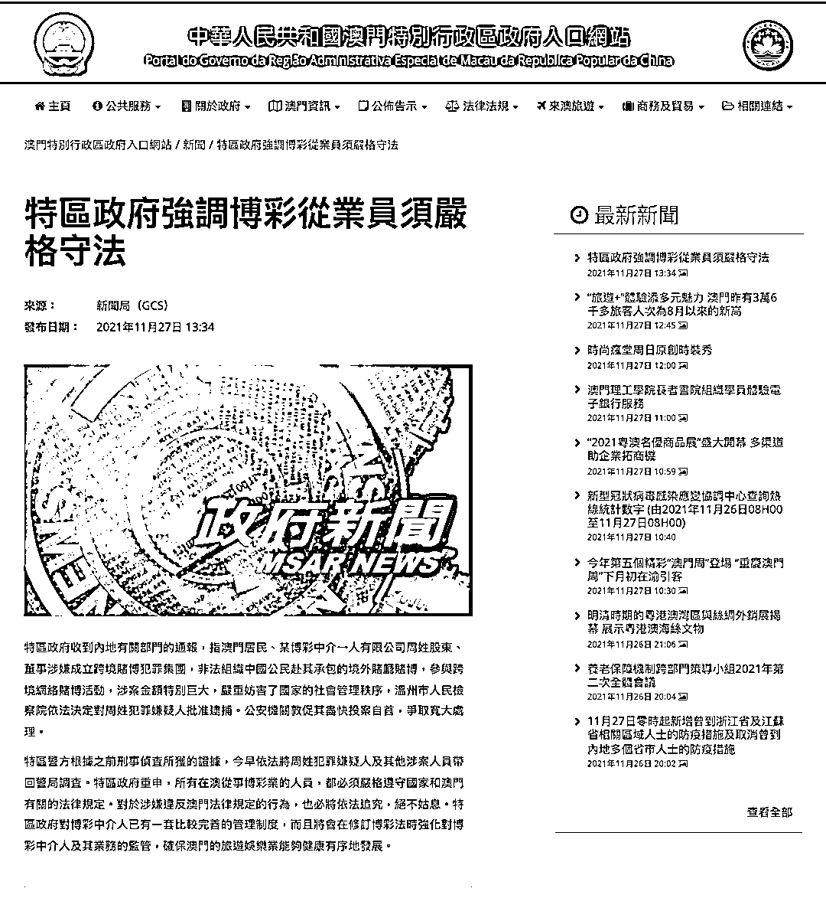
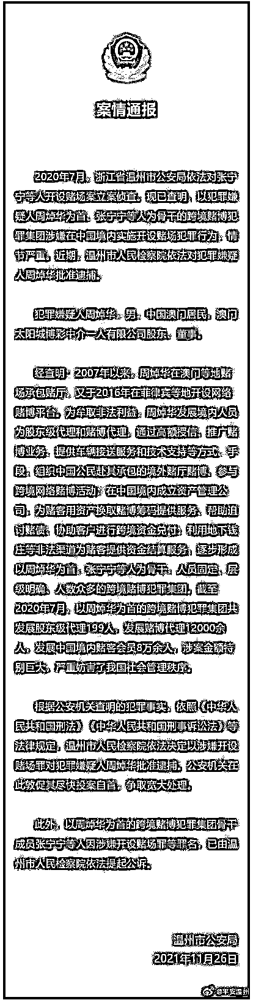
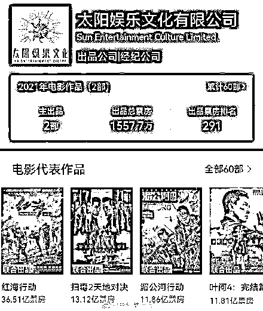

# 澳门“赌厅之王”洗米华的瓜

> 原文：[`mp.weixin.qq.com/s?__biz=MzIyMDYwMTk0Mw==&mid=2247524892&idx=2&sn=f752e9fc27f306fbf59da9ddebd4bb0e&chksm=97cba924a0bc2032cd4971b15ccb83777fff22cfd29b964841ebc235f366748974a9e90ea6c3&scene=27#wechat_redirect`](http://mp.weixin.qq.com/s?__biz=MzIyMDYwMTk0Mw==&mid=2247524892&idx=2&sn=f752e9fc27f306fbf59da9ddebd4bb0e&chksm=97cba924a0bc2032cd4971b15ccb83777fff22cfd29b964841ebc235f366748974a9e90ea6c3&scene=27#wechat_redirect)

澳门“赌厅之王”周焯华（绰号“洗米华”）今天还是“落网”了。

**澳门特区政府：周焯华被带回警局调查**

澳门赌场集团太阳城实际控制人、人称“洗米华”的周焯华因涉嫌在中国境内实施开设赌场犯罪行为，近期已被温州市检察院批准逮捕。11 月 26 日，温州市公安局通过官方微信公众号“平安温州”公开喊话，敦促周焯华尽快投案自首，争取宽大处理。

11 月 27 日中午，澳门特区政府在官方网站发布声明表示，收到内地有关部门的通报，指澳门居民、某博彩中介一人有限公司周姓股东、董事涉嫌成立跨境赌博犯罪集团，非法组织中国公民赴其承包的境外赌厅赌博，参与跨境网络赌博活动，涉案金额特别巨大，严重妨害了国家的社会管理秩序，温州市人民检察院依法决定对周姓犯罪嫌疑人批准逮捕。公安机关敦促其尽快投案自首，争取宽大处理。

澳门特区警方根据之前刑事侦查所获的证据，今早依法将周姓犯罪嫌疑人及其他涉案人员带回警局调查。

澳门特区政府重申，所有在澳从事博彩业的人员，都必须严格遵守国家和澳门有关的法律规定。对于涉嫌违反澳门法律规定的行为，也必将依法追究，绝不姑息。澳门特区政府对博彩中介人已有一套比较完善的管理制度，而且将会在修订博彩法时强化对博彩中介人及其业务的监管，确保澳门的旅游娱乐业能够健康有序地发展。

据“平安温州”11 月 26 日消息，2020 年 7 月，浙江省温州市公安局依法对张宁宁等人开设赌场案立案侦查。现已查明，以犯罪嫌疑人周焯华为首、张宁宁等人为骨干的跨境赌博犯罪集团涉嫌在中国境内实施开设赌场犯罪行为，情节严重。近期，温州市人民检察院依法对犯罪嫌疑人周焯华批准逮捕。

犯罪嫌疑人周焯华，男，中国澳门居民，澳门太阳城博彩中介一人有限公司股东、董事。

经查明：2007 年以来，周焯华在澳门等地赌场承包赌厅，又于 2016 年在菲律宾等地开设网络赌博平台。为牟取非法利益，周焯华发展境内人员为股东级代理和赌博代理，通过高额授信、推广赌博业务、提供车辆接送服务和技术支持等方式、手段，组织中国公民赴其承包的境外赌厅赌博、参与跨境网络赌博活动；在中国境内成立资产管理公司，为赌客用资产换取赌博筹码提供服务、帮助追讨赌债、协助客户进行跨境资金兑付；利用地下钱庄等非法渠道为赌客提供资金结算服务，逐步形成以周焯华为首，张宁宁等人为骨干，人员固定、层级明确、人数众多的跨境赌博犯罪集团。截至 2020 年 7 月，以周焯华为首的跨境赌博犯罪集团共发展股东级代理 199 人，发展赌博代理 12000 余人，发展中国境内赌客会员 8 万余人，涉案金额特别巨大，严重妨害了我国社会管理秩序。

根据公安机关查明的犯罪事实，依照《中华人民共和国刑法》《中华人民共和国刑事诉讼法》等法律规定，温州市人民检察院依法决定以涉嫌开设赌场罪对犯罪嫌疑人周焯华批准逮捕。公安机关在此敦促其尽快投案自首，争取宽大处理。

此外，以周焯华为首的跨境赌博犯罪集团骨干成员张宁宁等人因涉嫌开设赌场罪等罪名，已由温州市人民检察院依法提起公诉。

**扒一扒洗米华的江湖往事** 

周焯华，江湖人称洗米华。同样是“叠码仔”出身的赌场大亨，纵横于港澳的资本圈和娱乐圈。其在香港控制着太阳城集团、先机企业集团、帝国集团环球控股等多家上市公司。

原名周焯华的他，早年在赌场从事“扒仔”工作，也就是负责拉客的业务员。后来被据称是澳门黑帮“教父”尹国驹(花名“崩牙驹”)看中，收作手下，同样也赐了个花名，即洗米华。

在澳门开赌厅，洗米华的模式和其他不一样。1998 年，他看准网络时代兴起，于菲律宾取得网络博彩牌照，经营太阳城博彩网站，提供各式赌博，更直播真人庄家开牌，大受赌客欢迎。

澳门总共有 6 张赌牌，一张赌牌可以开多个赌场，一个赌场可以有多个赌厅，一个赌厅也可以有多张赌台。要额外申请开新赌场，也要向政府申请；同样的，纵是成功被批准开赌场，要想把规定了的赌桌数目再增加，也得重新申请。

在澳门，洗米华只是小字辈，他没资格拿到赌牌和开办赌场，只是在几大赌场里包下了几个贵宾厅，即便能揽到贵客，抽到的水钱扣掉七七八八的费用，真正落到口袋里的也有限。

洗米华能崛起，是因为他懂得与时俱进，瞅准了互联网新机会，他拿下菲律宾和柬埔寨的网上赌博牌照，隆重上线了太阳城网络平台。这个号称“世界顶级、亚洲最大”的网络平台，有别于一般的平台，是用高清摄像机将赌桌画面实时传送过来，现场发牌情况一览无余，顾客看着网络直播同步下注，如身临其境。

早在 2019 年，经济参考报就有报道，由“亚洲新赌王”周焯华（绰号洗米华）控制的菲律宾和柬埔寨太阳城网络赌博平台（以下简称“太阳城网络赌博平台”），赌场和网络服务器设在境外，赌客主要集中在中国内地。中国赌客借助视频远程下注，片刻见输赢，足不出户就可实现在境外参赌。

这个拥有菲律宾和柬埔寨网上赌博牌照的线上赌博平台，号称“世界顶级、亚洲最具公信力”，已经深度渗入中国内地，赌资可在内地以人民币结算，参赌者遍布各个省份，且规模和人数持续扩大。太阳城网络赌博在大陆每年的赌注额在万亿元以上，相当于中国彩票年收入的近两倍，其每年盈利更是高达数百亿元，这些资金通过地下钱庄流向境外。专家称之为绽放在中国的网络赌博“最大罂粟花”，认为其对中国社会经济秩序和金融安全产生了巨大危害，应当引起监管部门的高度重视。

“太阳城网络赌博项目的玩法，与澳门百家乐几乎一模一样，赌场的客人主要集中在中国内地，已在国内发展会员数十万人。”太阳城推广员说，太阳城网络赌博平台不受地域限制，设在境外的服务器非常安全，在玩家中积累了很好的口碑，规模也越来越大，目前已经是最大的网络赌博平台。

太阳城网络赌博平台专门成立了中国内地赌资结算部门，通过无数个境内银行卡汇集资金和结算，最终再通过地下钱庄将大部分盈利流向境外，其每年流向境外的资金高达数百亿元。

尽管赌场远在菲律宾和柬埔寨，但身在中国大陆的赌客只要打开电脑和手机登录其平台，就可看到赌场全景，包括赌场荷官（发牌员）现场发牌的实况。点击放大后，连荷官面前两侧摆放的“闲”和“庄”都可一览无余。赌客观看同步视频现场，同时下注，太阳城的电投员与赌客通话予以确认，如身临其境。

在该赌博平台下注，玩家可选择“电投”或“好 E 投”等方式参与赌博。前者为玩家用电脑或手机查看现场实时直播，通过电话指挥在现场的太阳城电投员代为下注；后者则是赌客不方便打电话遥控指挥时，可直接在手机上观看现场同步视频，点击筹码下注。

太阳城网络赌博平台的“电投”或“好 E 投”赌博方式，分别有四处和六处场地，分布在菲律宾的新濠天地、卡卡湾度假村等赌场，以及柬埔寨西湖度假酒店赌场；“电投”赌博方式筹码最低 5000 元，最高 250 万元；“好 E 投”赌博方式的筹码最低 1000 元，最高 4000 万元。视频显示，太阳城网络赌博平台至少有 100 桌以上百家乐赌台，玩家可快速切换赌桌。

据知情人士透露，该平台招募有千余名电投员，对网络赌客提供一对一 24 小时全天候服务。其 APP 界面设置的语音功能，除了支持普通话外，还设置有粤语、东北话等个性化语言，几乎专门针对中国市场设计。该平台的赌客主要集中在中国内地，人民币是赌场里的“硬通货”。

据知情人士介绍，太阳城网络赌博平台运营四年多，会员估算有数十万人之众，近期平均每月来自中国内地的投注金额高达 1000 亿元以上，一年的投注额在万亿元以上，这个数字相当于 2018 年中国彩票总收入 5114.7 亿元的近两倍。

该报道一出，太阳城集团股价一度大跌 20%，随后太阳城集团旗下太阳城博彩中介一人有限公司发表澄清声明，否认经营网络博彩业务。

在最新的视频回应中，洗米华再次强调：“从来没有派驻过任何一位同事在内地从事任何推广或进行任何博彩业务，也从来没有参与过任何的地下资金转移的业务，我们的员工、我们的资金、我们的公司、我们的业务，都局限于澳门以内。”

除了家大业大，洗米华的私人生活也是坊间常谈论的话题。年轻多金，自称“澳门古天乐”的他曾和多位嫩模，以及 TVB 艺人都传过绯闻。洗米华 39 岁生日派对，也是邀请大批嫩模热舞。而他的感情纠葛更是持续多年，说也说不清。

虽然声称博彩业务不在内地，但太阳城集团旗下的影视发行业务早在内地风生水起。

据官网介绍，太阳娱乐文化有限公司自 2011 年成立以来投资及制作接近 65 部电影，总票房高达 130 亿港元，成绩斐然。知名作品包括《春娇救志明》、《赌城风云》系列、《杀破狼 II》、《杀破狼‧贪狼》、《狂兽》、《湄公河行动》、及《红海行动》等，其中不乏票房数十亿元的爆款。

来源：中国基金报，吃瓜不吐葡萄皮 作者： 泰勒

← 向右滑动与灰产圈互动交流 →

