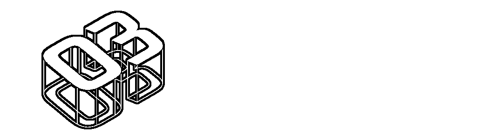

# 规模百亿的盲盒市场，暗藏了哪些黑灰产？

> 原文：[`mp.weixin.qq.com/s?__biz=MzIyMDYwMTk0Mw==&mid=2247524892&idx=5&sn=5295f57c8b6e27915c183b7e531e3ed6&chksm=97cba924a0bc20323feb54d414ef66d6f62bc02837a42e78cb534b60c65a05e0897b0b2b201a&scene=27#wechat_redirect`](http://mp.weixin.qq.com/s?__biz=MzIyMDYwMTk0Mw==&mid=2247524892&idx=5&sn=5295f57c8b6e27915c183b7e531e3ed6&chksm=97cba924a0bc20323feb54d414ef66d6f62bc02837a42e78cb534b60c65a05e0897b0b2b201a&scene=27#wechat_redirect)

**2020 年以来，“不确定性”成为疫情下的全球热词，也带火了贩卖“不确定性”的经济——盲盒新零售。食品、文具、宠物乃至爱情**都可以放置其中，**黑灰产也趁虚而入。** 

盲盒到底如何被玩坏的？

今天我就来跟大伙儿“严肃”聊聊盲盒中的黑灰产。

**盲盒如何成了全民游戏？**

盲盒营销玩法最早起源于日本明治末期的“福袋营销”，兴于 80 年代日本动漫玩具、模型类的扭蛋机。90 年代，中国开始了一系列的“集卡式营销”，最为典型的就是小浣熊、小当家等干脆面的水浒英雄卡，成为几乎所有 85、90 后的集体童年回忆。

如今，盲盒新零售产业已经发展成百亿规模，预计到 2024 年将会超过 300 亿元。

图片源自

Mob 研究院 2020 盲盒经济洞察报告

随着盲盒商业模式的推广，一个“万物皆可盲盒”的时代也已然到来：**各类物品与盲盒结合，产生了玩具盲盒、首饰盲盒、口红盲盒、快递盲盒等各类盲盒，甚至还有“只花一元钱就能找到有缘人”的“脱单盲盒”。**

**盲盒的营销模式并不新鲜，和以前的扭蛋、干脆面集卡一样，实质上都是****概率商品。**

无论是盲盒还是彩票或老虎机，甚至是朋友间的打赌，本质都是“玩骰子”，都是一种“赌博”，输赢与否由偶然事件来决定。 

一些较为火爆品类的盲盒甚至产生了次级市场，在盲盒玩家之间进行流通，不断炒作加码，一个百亿盲盒市场被快速“拆”了出来。

**盲盒圈内甚至有了自己的黑话，隐藏款、热门款、雷款、端盒等等。**

图片源自

Mob 研究院 2020 盲盒经济洞察报告

**“上帝不会玩骰子”，人类却总爱玩骰子。**

**正是利用了人们对于不确定性的赌博心理，盲盒市场成了全民游戏场，异常火爆。**

**盲盒是怎么被玩坏的？**

最初的福袋是商家想出来回馈消费者的一种打折手段，商家通过福袋清理库存，买家则享受物美价廉的体验，商家买家均能获益。

然而，盲盒独特的商品销售模式为黑灰产提供了天然的寄生条件。渐渐地，天真的游戏也被玩坏了。

我观察到，市面形形色色的盲盒玩法大致可以分为三种主要类型，不同的盲盒都有着不同的交易风险：

1、购买型盲盒

**购买型盲盒，也就是常见的盲盒模式，本质还是商品，其核心在于从确定的商品交易演变为不确定的商品交易，**但其不确定的商品范围又是确定的（晕）。

以泡泡玛特为例，其不断创造不同系列盲盒产品，每个盲盒都存在多种基础款和一个隐藏款，买家确定能获得该系列中的一款，但无法确定获得哪一款。

**根本上，购买正规盲盒买的还是商品，其法律关系还是属于商品买卖合同，**“盲”的只不过是商品的具体类型，价格之所以有高有低，在于不同系列商品的**IP 价值、社交价值和人为制造的稀缺价值。**

但这并不代表这类盲盒不存在风险与问题。

一些盲盒特殊款、隐藏款的设置和抽取概率完全由生产厂家和商家决定，在抽中概率上极度不透明，既不公布抽奖概率，也无从考证概率的准确性。一些极端情况可能出现完全没有隐藏款现象，消费者消耗大量资金重复购买也一无所获，权益很难得到保障。

典型代表就是前几年街头常见的幸运盒子，以 20 元买个盒子，有可能抽取手机等高价商品，但大部分都是廉价的三无商品。

广受诟病的是盲盒中屡见不鲜的伪劣商品。大部分商家对已开盒盲盒商品“只换不退”，一些不良商家为了利益不择手段，产品质量难以保证。有些是过期产品，有得可能不符合有关国家标准安全性指标，有的可能是假冒的山寨品或者二次销售品。

甚至还有违背人性的活体宠物盲盒，已然形成一条带血的黑色产业链。今年，苏州邮政管理局执法人员在当地查处了一起宠物盲盒事件，被发现时二十余只被装入盲盒的动物已死亡。虽然我国《邮政法实施细则》第 33 条明确规定禁止邮寄活体，但只要买家有需求，伤害就屡禁不止。

2、促销型盲盒

促销型盲盒就是常见的买一赠一、买房砸金蛋等等，同样以促进商品销售为目的，但其射幸机会并不在于商品本身，而是在于是否额外提供奖品。促销型盲盒的**本质属于《反不正当竞争法》《规范促销行为暂行规定》中规定的有奖销售。**

3、机会型盲盒

购买正规商品盲盒，获得商品的概率是 100%，同时获得不同类别商品概率有大有小。**而机会性盲盒，购买的并非商品，而是获得商品的机会，换句话说，你有概率获得高额商品，也有可能空手而归（投入价值归零），而这其中就暗藏各类“猫腻”。**

这种盲盒近似于彩票，但相关商家显然没有经营博彩行业的资格。

最典型的例子就是近些年来在一些电商平台极其火爆的**“一元购”：将一件商品平分成若干等份出售，其中每份 1 元，购买者中的一人可抽中商品，其他购买者的款项不予退还。**

**对于这种让大多数人“竹篮打水一场空”的盲盒，国家自然是重拳出击将其认定为行政违法乃至刑事犯罪意义上的赌博或诈骗。**

**如何安全开盲盒？**

纵观各类盲盒，千奇百怪，乱象丛生，**当你打开盲盒，打开的可能不是合格商品，而是涌现各类“妖魔鬼怪”的“潘多拉魔盒”。**

监管机关已经注意到了问题的严重性，**今年首次提出要重点依法打击网络销售“盲盒”中的违法违规行为。**

**如何安全开盲盒？纵览相关案例及规定后，我总结出“四看”要诀，教你轻松看透盲盒：** 

一“看”：盲盒里装的什么？ 

这一“看”的关注点不在于盲盒里装了什么，而在于它有没有装什么不该装的东西，比如：**交友盲盒中的微信号等公民个人信息、活体、违禁品等。** 

倘若涉及上述限制交易的物品，卖方一定涉嫌违法甚至犯罪，买方也难辞其咎。

二“看”：购买盲盒时支付的现金对应的是什么？

如果支付现金对应的是获取商品的机会，妥妥的赌博，进而按照违法赌博或赌博犯罪评价。 

价格远远高于商品价值或者根本不值一文、空无一物，很有可能就是诈骗。 

对应的是价值基本相当的商品，就要继续第三“看”、第四“看”综合判断。 

三“看”：盲盒中不同物品的抽中概率或奖品种类是否公示？

**如果购买的盲盒都是价值相差不多的商品呢？那这些盲盒是不就没问题了呢？非也非也。**

综合我国《反不正当竞争法》 的相关规范，促销型盲盒销售的合规条件有以下三个：**最高内容物对应的价值不得超过 万元；公示抽中各款式概率与规则等决策必要信息；不得以内定或其它方式舞弊。**合规条件不满足，该类盲盒促销行为即构成不正当竞争，由相关监管责令停止违法行为，并处以罚款。

四“看”：盲盒中的商品是否可以通过回购等方式变相兑换资金？

“两高一部《关于办理利用赌博机开设赌场案件适用法律若干问题的意见》第一项：设置具有退币、退分、退钢珠等赌博功能的电子游戏设施设备，**并以现金、有价证券等贵重款物作为奖品，或者以回购奖品方式给予他人现金、有价证券等贵重款物**（以下简称设置赌博机）组织赌博活动的，应当认定为刑法第三百零三条第二款规定的开设赌场行为。 

**可见，非法赌博机最典型的特征就是“筹码”可以双向兑换。**

**所以，如果出售盲盒的商家还通过回购或设置二级市场等方式提供“商品”的双向兑换，那么就是变相设置赌博机，很有可能构成开设赌场罪。**

**实践中，就出现了一种号称“一元嗨购”的自动售货机，**被告人通过在店铺摆放上述自动售货机、印发宣传单等方式，吸引不特定人选择扫描相应二维码进入一元嗨购网络平台参与赌博并从中获利。参赌人员选择支付不等倍率的钱款进行押注赌博，以博取自动售货机内的卷烟、饮料、食品等商品，且若参赌人员不需要所博取的货品，被告人即指使他人以商品回购的形式向参赌人员支付相应钱款。被告人最终以开设赌场罪定罪处罚。

盲盒本无罪，但被人性中的阴暗面利用，就会成为赌博乃至诈骗的“魔盒”。

随着国家监管的日趋严格，盲盒经济也将向着更规范透明的方向发展，但在之前，这一良莠不齐的市场显然对于消费者还是鱼龙混杂、危机四伏的。

我呕心沥血为大家总结三类盲盒的特征与“四看”的方法，还希望大家都擦亮眼睛，适度开盒，娱乐身心，诈骗不侵！**盲盒虽有趣，但不要沉迷其中，中了灰黑产分子与骗子的圈套，让自己“落地成盒”啊！**

来源：守护者计划 作者:鹅师傅

← 向右滑动与灰产圈互动交流 →

