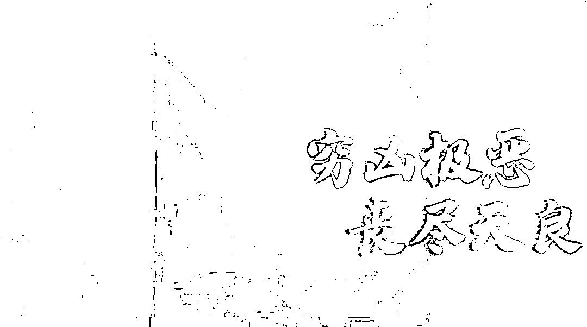

# 喷辣椒水、暴打、浸猪笼……亲历者讲述缅北可怕遭遇

> 原文：[`mp.weixin.qq.com/s?__biz=MzIyMDYwMTk0Mw==&mid=2247524938&idx=2&sn=727d4133a227933bce2f11931f6c1821&chksm=97cba972a0bc20645127d8711194eb809429a63107186c098a9f2e1585284dae8de7c29b06fd&scene=27#wechat_redirect`](http://mp.weixin.qq.com/s?__biz=MzIyMDYwMTk0Mw==&mid=2247524938&idx=2&sn=727d4133a227933bce2f11931f6c1821&chksm=97cba972a0bc20645127d8711194eb809429a63107186c098a9f2e1585284dae8de7c29b06fd&scene=27#wechat_redirect)

“高薪招聘，轻松月入过万，舒适的办公环境，工作自由自在……”网络上这些看起来“钱”程似锦的缅甸北部地区的招聘广告，让无数人趋之若鹜。

但事实真是如此吗？一起来看看侥幸离开犯罪窝点后回国自首的嫌疑人李贤（化名）的亲身经历。

去年疫情严重时，李贤每天躺在家里打游戏，期间认识了网友王某。

在聊天中，王某称其在缅甸当司机，月薪 15000 元，表示最近在大量招人，从事司机、保镖等月薪都有上万元，劝说李贤前去工作。

当李贤提到自己手头紧张后，王某称可以报销路费，随即转了 1500 元过来。经受不住高薪诱惑的李贤，在一个月后不顾家人的劝阻，踏上了前往缅北的“淘金”之旅。

但他没想到，这段旅程分外曲折，坐车到云南孟连县后，还要爬山、走水路、再坐车……全程走了约 15 个小时。

走着走着，李贤才知道这是在偷渡。虽然知道是违法行为，但身处大山又不想独自冒险离开的李贤仍抱有一丝侥幸心理。

和李贤一起偷渡的有 20 多人，到缅北后，当地武装开着部队的军车来接他们。

一到公司，那里的人就把他们的手机、身份证等能与外界通信的东西全都没收了。

李贤感觉这公司跟监狱一样，有着高墙电网，门口有枪兵拿着冲锋枪站岗，他表示“当时想死的心都有了，曾想过自杀，但在里面连自杀的机会都没有。”

到公司后，李贤才知道所谓的“高薪工作”其实是电信诈骗。他不愿意做，结果每天都遭受毒打，一直被打到站不起来为止。

犯罪分子见硬的对他行不通，便玩起了心理战术，让主管和那些挨打过现在从事诈骗的过来人对李贤进行劝说。

这样过了 15 天后，受不了非人折磨的李贤在威逼利诱之下，还是屈服了。

李贤原以为只要顺从了犯罪分子帮忙诈骗，就可以免遭毒打虐待，却没想到他走上的是一条一眼望不到头的“黑道”。而与他有相同经历的人不在少数。

嫌疑人张涛（化名）、李滨（化名）等 4 人也是因为轻信朋友说的高薪招聘信息来到缅北，本以为等待他们的会是一条通向财富之路的康庄大道，却不曾想这实则是一条通往地狱的路。

李滨到公司后被安排负责添加好友聊天，加不到人就会被惩罚，喷辣椒水、浸猪笼等。

张涛称他是负责拉客的，拉到客就交给下一个负责聊天的团队。

如果做得不好也会受罚，“我被逼喝醋、被喷辣椒水，因为被喷得多，我现在都近视了，也落下胃痛的毛病。但逃跑是不可能的，如果被抓到不是死就是残废。”

穷凶极恶的犯罪分子还会做一些威胁他们生命安全的事，并拍下视频以索要偷渡费用的名义，要胁家属转账赎人。

在缅北从事电信诈骗的每一天，对李贤来说都是一种煎熬，原以为这种日子会一直望不到头，但接下来发生的事情却让他看到了希望。

去年 11 月底，受新冠疫情影响，在当地政府的管控下，犯罪团伙不得不先解散部分成员，业绩不突出、且虐待后仍无法从其家人身上榨取利益的李贤成为了其中一员。

最后身无分文的李贤在老乡的帮助下，靠摆摊卖炒饭攒足了路费，才回到国内自首。

回国后，李贤主动向警方供述称，其曾以刷单的方式，诈骗了陈女士 15000 元。在向受害者调查取证后，李贤被警方依法刑事拘留。

李贤称，缅北的犯罪团伙本来承诺有 12%的提成，但其实一分钱都没给过他。如果给他重来一次的机会，他无论如何都不会去缅北。

最终，张涛、李滨等一行 4 人，在犯罪团伙的暴力威胁下，分别联系了家人，给犯罪团伙“赔付”了 3 万元到 6 万元不等的偷渡费后，才顺利逃脱了犯罪团伙的魔爪。

张涛、李滨等 4 人回国自首后，因涉嫌违反偷越国边境罪，被警方依法刑事拘留。

为严厉打击治理电信网络诈骗犯罪，整治中缅边境跨境违法犯罪活动，全力劝返滞留缅甸人员，我国与缅甸相关部门进行了紧密的合作，陆续出台的劝返政策也让越来越多的犯罪嫌疑人回国投案自首。

警方在此郑重警告，目前仍在缅北从事电诈违法犯罪活动的人员，尽快自己或通过家属联系公安机关，回国投案自首，争取从轻或减轻处罚，甚至免除刑事处分的机会。

天上不会掉馅饼，一夜暴富的背后往往是陷阱，广大群众外出务工一定要通过正规的中介公司。

来源：十堰人民路派出所

← 向右滑动与灰产圈互动交流 →

