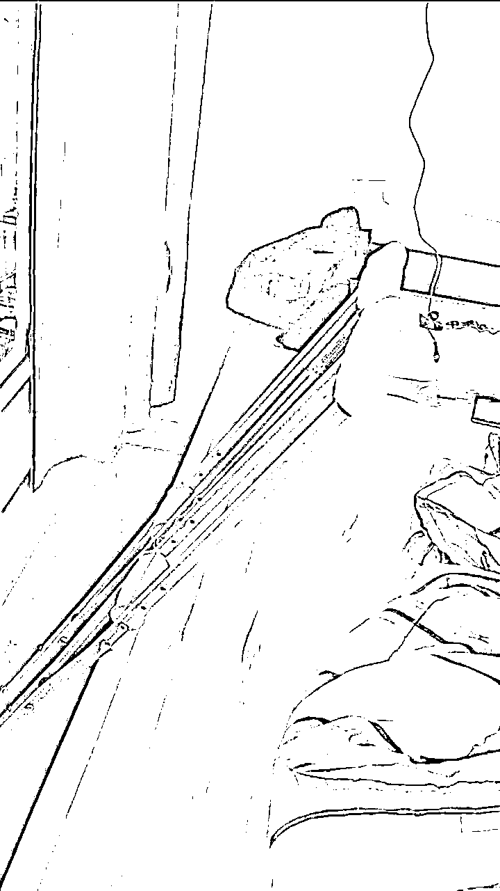
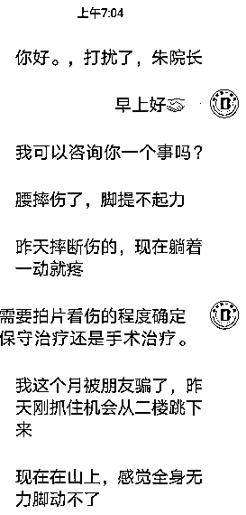
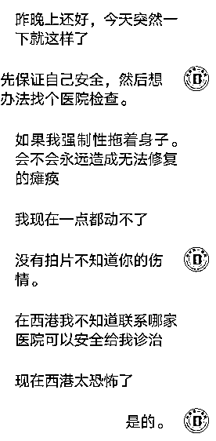
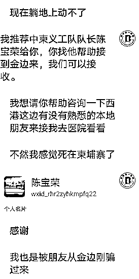
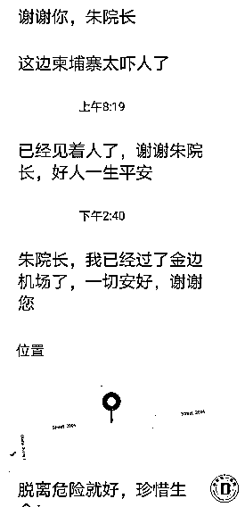
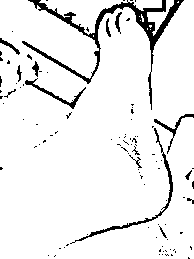
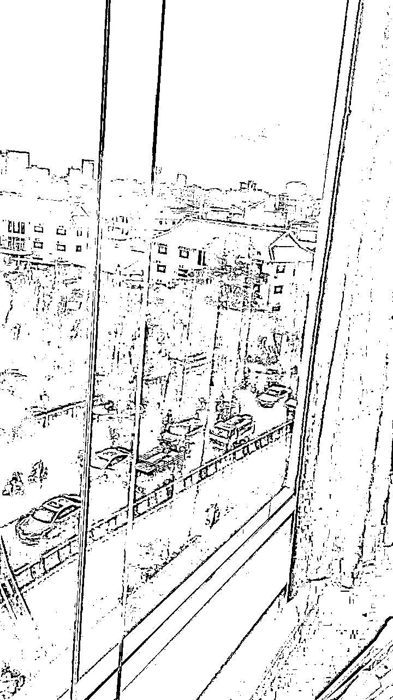

# 老柬漂也没能躲过！说去 KTV 结果被$2 万卖进西港园区

> 原文：[`mp.weixin.qq.com/s?__biz=MzIyMDYwMTk0Mw==&mid=2247524938&idx=3&sn=711078fb4f226013860d50ad2df8a1d7&chksm=97cba972a0bc20648b01b598212cfd3384b954498a37beea328fdade278d16b01d07670a6531&scene=27#wechat_redirect`](http://mp.weixin.qq.com/s?__biz=MzIyMDYwMTk0Mw==&mid=2247524938&idx=3&sn=711078fb4f226013860d50ad2df8a1d7&chksm=97cba972a0bc20648b01b598212cfd3384b954498a37beea328fdade278d16b01d07670a6531&scene=27#wechat_redirect)

11 月 25 日早上，中柬第一医院救助了一位腿部受伤的中国男子，这名中国男子是被朋友卖到西港园区后，从二楼跳下历经一个晚上的躲藏成功逃回金边。 

25 日下午在医院见到中国男子重生（化名）的时候，重生已经处于很轻松的状态了，和大家说笑打趣的讲述着自己的遭遇，认为自己成功从泥潭中逃出来如获新生，以下为重生自述：

我今年 25 岁，在柬已有 3 个年头了，一直从事着二手商品和签证办理及帮忙叫车等业务，因为业务关系在柬埔寨也认识了不少人，与朋友哈利（化名）认识也有半年多了，但没仔细问过他相关个人的信息，年龄应该比我大两三岁，大概在 27、28 岁的样子。

**初识是业务往来关系**

**后来是朋友一起喝咖啡、哈啤酒** 

起初跟他有业务方面的往来，我记得好像是给他安排车从金边去西港，又从西港回金边好几次都是找我帮忙叫车，慢慢的就熟络了起来，约过几次咖啡，参加了几次他组的饭局，和他几个朋友一起吃过饭，在我心里觉得哈利是个正经人。

11 月 7 日，他主动约我去西港玩，虽然平时也有看到西港的一些负面消息，但是自己也因业务的关系去过西港好几次了，也没有往那方面想，就想着经历了这么久的疫情，现在各地都已开放，是时候好好放松一下心情，便爽快的应约去了。

**说是去 KTV
结果被 2 万美元卖进园区**

**11 月 10 日，便出发去了西港，到西港见到了哈利，一起吃过饭后，说去 KTV 玩一下，便上了他的车，我也不知道要去哪里，没有想到的是车就这样开进了园区，突然哈利对我的态度就不一样了，很凶的叫我把身上所有的钱物掏出来，当时身上带了 3000 多美元现金，全部交出来给了他们，然后被带到了一栋楼的 5 楼，他们转手就把我卖了 2 万美元。**

他们怎么商量的我不清楚，带头的管理人就直接说：“现在给你两个选择，一是你叫家里拿 2 万美元给我们，就可以放你走；二是拿不出钱来，你就得留下来工作；反正现在你是出不去了。”

我心想：“如果是人民币的话还能拿得出来，2 万美元我确实是拿不出来，并且就算真的给了这么多钱给他们，他们真的能放我出去吗？之前看过一些人给钱后又被转手卖到另外的园区，又要重新高价给赔付，想到这些确实心里没底，就说确实拿不出这么多钱，还是留下来工作吧。” 

随后管理人就给我发了电脑等工作用品和安排工位，看眼前的形势也不好反抗，就假装很顺从他们的安排，先服从他们的命令，同时也默默的观察着的周边的环境，心里盘算着怎么样才能从这里脱身，一想到现在在的是 5 楼心里觉得出去的困难很大。

每天照常跟着大家上下班，尽量作出已安心留下来上班的样子，大家做什么、讨论什么都假装附和，让大家放松警惕，我们工作都是在纸飞机（telegram）上进行，主做国外网站针对外国客户，语言交流都通过翻译软件来沟通，里面也有周边其它国家的人在工作，业绩要求很高，大家压力都挺大。

**每次开会，管理人都会对大家说：公司不养闲人，每天的业绩必须完成，谁不想干的？当场就有个人出来顶嘴，谁知道马上就被拉去关小黑屋，反抗的还有电棍伺候！**

**踩过水坑、杂草丛、荆棘、**

**抱了一晚上的大树成功逃出**

后来搬到另一个园区，发现二楼有一个房间是空的没有人住，当时心里就有了逃走的想法，留意着周边的地形和环境，时刻保持着手机满电。

到了晚上大家在对管理人说搞钱去吃东西，我也跟着附和喊着搞钱吃东西，大家一群一群的走，我也跟着去，走着走着便往后溜，返回到宿舍穿上衣服，跑到二楼那个空房间，马上把门反锁上，爬上窗台就往下跳，由于紧张没有跳好，摔地上有点疼。

也没有顾那么多，赶紧起来拼命的跑，踩过水坑、杂草丛、荆棘，等他们撬开锁听到来追我的声音时，已离他们挺远的距离了，怕他们找过这边来，便跑到一个大树下，担心被找到，便爬树上去，爬到很高的位置确保很难被发现，才停下来抱着树休息，听到他们就在周边不停的找，还好没有找到这边，大概坚持了 3 个多小时的样子，就没有找到他们的声音了。

此时，手已经抱得很酸了，可是没有办法现在是晚上的，下去了不知道往哪里走，我也很害怕不敢下去，只有在树上坚持到天亮再作打算。

**害怕会死在这里**

**四处求助、终于得到了回应与救助**

同时，也在想：要找谁来帮助我呢？我的其他朋友都在其它省离这里很远。

此刻感觉到腰和腿疼痛，躺地上一点都动不了，可能是从二楼跳下来的时候没跳好，摔伤了。

终于熬到天亮，试着给可能有办法救我的几个人发信息，可能太早都没有收到回复，便又想到之前在微信聊天群里，添加过中柬第一医院的朱院长，也常看到朱院长帮助同胞的事迹，试着给他发信息求助看看。

就这样抱着试试的想法，给朱院长发了条微信消息，没想到马上收到朱院长的回复，由于担心自己的伤势和安全，甚至想到自己会死在这里，就直接跟院长讲了我的身体情况和遭遇，马上朱院长就推荐了中柬义工队队长的微信给我，我向陈队说明了情况，并请他帮忙安排车来接我，随后向他发了我当时的定位。

终于，还是等来了陈队安排的车，此时内心五味杂陈说不出来，在这边这种现状下，不管是求助者还是帮助者，现状目前情况下信任是最难的，看到真的有人来接应我时，那一刻的戒备全然消失。

来到金边后，马上给朱院长报了平安，直接到中柬第一医院去找朱院长，他们对我的伤势进行了检查和治疗，庆幸只是右脚脚踝扭伤，休养一段时间就能恢复。

经过这次事件后，对很多东西都看开了，现在这个混乱的状态下，希望大家不要轻信他人，无论是朋友还是老乡，特别是去西港玩一定要注意安全，还有园区这些尽量不要牵扯上，这是一个让本地人都感到害怕的地方。

出门在外，一定要心存戒备，提高警惕，以免造成经济损失以及出现人身安全问题。

来源：柬埔寨头条

← 向右滑动与灰产圈互动交流 →

