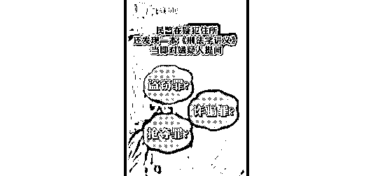
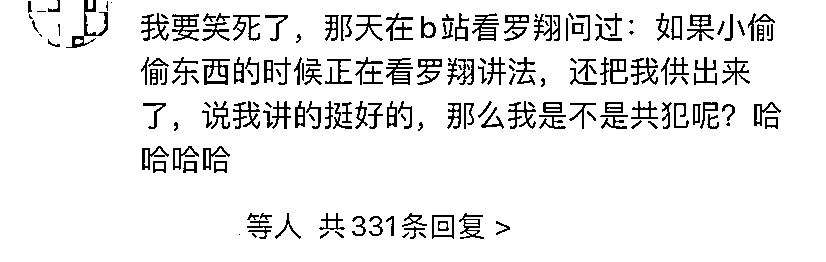

# 真“刑”！嫌犯被抓时正学习罗翔的刑法学讲义

> 原文：[`mp.weixin.qq.com/s?__biz=MzIyMDYwMTk0Mw==&mid=2247524938&idx=4&sn=a41bd483c5cfece37a42a6df159dca55&chksm=97cba972a0bc20641f0aa0e5a62240ffc670635393ccac27734c7661f8a45384ea460b599513&scene=27#wechat_redirect`](http://mp.weixin.qq.com/s?__biz=MzIyMDYwMTk0Mw==&mid=2247524938&idx=4&sn=a41bd483c5cfece37a42a6df159dca55&chksm=97cba972a0bc20641f0aa0e5a62240ffc670635393ccac27734c7661f8a45384ea460b599513&scene=27#wechat_redirect)

近日，

重庆渝中区大阳沟派出所

侦破了一起以教人刷单为名，

实施盗窃手机的系列案件。

在抓捕现场，

民警意外发现犯罪嫌疑人

**居然在学习罗翔所著的《刑法学讲义》，**

**还在画重点。**

[`mp.weixin.qq.com/mp/readtemplate?t=pages/video_player_tmpl&action=mpvideo&auto=0&vid=wxv_2155483572986576900`](https://mp.weixin.qq.com/mp/readtemplate?t=pages/video_player_tmpl&action=mpvideo&auto=0&vid=wxv_2155483572986576900)

民警忍不住问：

“你 15 日那天，拿人家的手机，

属于抢夺呢，诈骗呢，还是盗窃呢？”

嫌疑人回答属于“侵占他人财产”，

民警告知实际上这属于盗窃。

网友表示：

罗翔老师最担心的事终于发生了！

也有人说，

本着“实践出真知”的原则，

这位窃贼终于成了“法外狂徒”张三。

就是不知道他到底是学会了， 

还是学废了。 

警方提醒，

**学法知法虽有必要，**

**但守法才是问题的核心。**

来源：看看新闻 KNEWS

← 向右滑动与灰产圈互动交流 →

