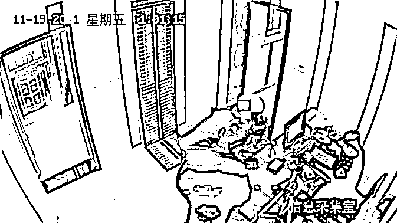

# 哭笑不得！网逃人员找民警核实是否“网逃”，结果……

> 原文：[`mp.weixin.qq.com/s?__biz=MzIyMDYwMTk0Mw==&mid=2247524992&idx=3&sn=17963fee807fa65ae6514c7339fd7512&chksm=97cba9b8a0bc20aedb3ec2f94f2c630e196168ed0b7bc4018bdb136f8e86dcf2d57a62dbccd6&scene=27#wechat_redirect`](http://mp.weixin.qq.com/s?__biz=MzIyMDYwMTk0Mw==&mid=2247524992&idx=3&sn=17963fee807fa65ae6514c7339fd7512&chksm=97cba9b8a0bc20aedb3ec2f94f2c630e196168ed0b7bc4018bdb136f8e86dcf2d57a62dbccd6&scene=27#wechat_redirect)

人们常说“贼人心虚”

不法分子干了见不得人的勾当后

是非常害怕被抓到

或者非常抗拒到派出所这些地方的

但是

近日，据江苏镇江新区警方介绍

一名陕西男子

却将自己送进派出所

最终被警方轻松“拿下”

这是怎么回事呢？ 

[`mp.weixin.qq.com/mp/readtemplate?t=pages/video_player_tmpl&action=mpvideo&auto=0&vid=wxv_2154626679330111489`](https://mp.weixin.qq.com/mp/readtemplate?t=pages/video_player_tmpl&action=mpvideo&auto=0&vid=wxv_2154626679330111489)

警方介绍

11 月 19 日上午

一名男子

走进镇江市公安局新区分局

丁岗派出所的办案大厅

随即很是“自信潇洒”地

把自己的身份证递给民警龚震

**男子要求帮其查询**

**“自己是否是网络在逃人员”**

**同时胸有成竹地表示：**

**“我怎么可能会是网络逃犯呢？”**

不查不知道，一查真可笑

**男子真是一名网络逃犯**

经询问才知

事发前

山西省太原市娄烦县公安机关民警

给该男子张某打电话

称他是网络逃犯要求其归案接受调查

张某接听后

认为一定是当地警方打错了电话

所以专程来派出所核实

警方告诉记者

经民警龚震核实发现

**张某因涉嫌帮助信息网络犯罪**

**目前被山西太原警方列为网上逃犯**

张某的真实身份水落石出后

当即被警方控制

目前

张某已被送往

山西省太原市第三看守所羁押

“这波‘送人头’的行为

可是为警察蜀黍省了不少事情

当真让人笑哭！”

派出所民警说

来源：扬子晚报，紫牛新闻，红网

← 向右滑动与灰产圈互动交流 →

