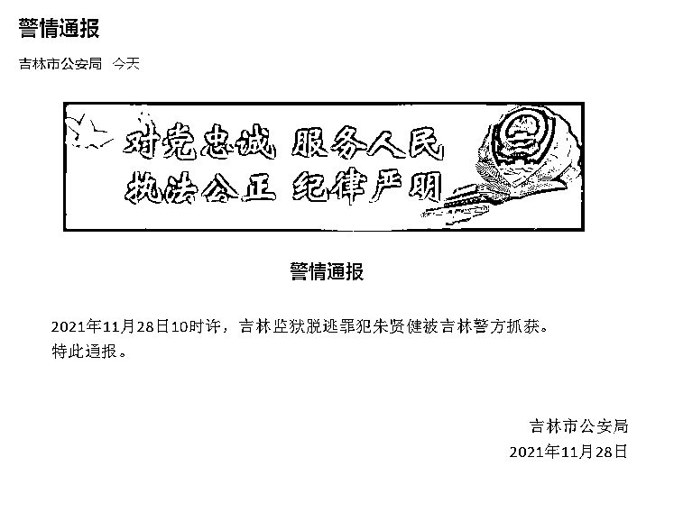

# 刚刚，越狱 41 天的朱贤健被抓获，发现者是一名钓鱼主播，已拿到 70 万奖金

> 原文：[`mp.weixin.qq.com/s?__biz=MzIyMDYwMTk0Mw==&mid=2247524992&idx=4&sn=78edaed8b76c716fc314cce5921f6871&chksm=97cba9b8a0bc20aeb6cbff1afebeac8d280989f268aff13ae5d8e7e088cf5d08db431891194b&scene=27#wechat_redirect`](http://mp.weixin.qq.com/s?__biz=MzIyMDYwMTk0Mw==&mid=2247524992&idx=4&sn=78edaed8b76c716fc314cce5921f6871&chksm=97cba9b8a0bc20aeb6cbff1afebeac8d280989f268aff13ae5d8e7e088cf5d08db431891194b&scene=27#wechat_redirect)

2021 年 10 月 18 日 18 时许，吉林监狱罪犯朱贤健利用收工时间，通过攀爬 AB 门雨棚翻至监墙，强行脱逃。

11 月 28 日，据吉林市公安局微信公众号消息，2021 年 11 月 28 日 10 时许，吉林监狱脱逃罪犯朱贤健被吉林警方抓获。

据称，发现朱贤健的是一名钓鱼主播，已拿到 70 万举报奖金，称从未见过这么多现金。

<mpvideosnap class="js_uneditable custom_select_card channels_iframe" data-pluginname="videosnap" data-id="export/UzFfAgtgekIEAQAAAAAAcQkvBj7hKQAAAAstQy6ubaLX4KHWvLEZgBPEhKM4VSwNCbz9zNPgMIsJ_8xG7IYwYrnZRW4jhm25" data-url="https://findermp.video.qq.com/251/20304/stodownload?encfilekey=rjD5jyTuFrIpZ2ibE8T7Ym3K77SEULgkiaXjIShSzleZaT7IwbibgLqt6vV6HD7mS9UBwlGQvo0AmNN62o1y1B97doYVJYUuujDPCqvUlOpc7k&amp;adaptivelytrans=0&amp;bizid=1023&amp;dotrans=0&amp;hy=SZ&amp;idx=1&amp;m=&amp;scene=0&amp;token=x5Y29zUxcibBaX3VZ67bicsmff7uZGeib6JInvIgYR65fA3sI8qxN9rnpCqpKkr4aZ23BwdVBYMnpE" data-headimgurl="http://wx.qlogo.cn/finderhead/P5kNAicLxofeTV0BHT6mSsAjfnGrXMM1eae8B1uy3ujk/0" data-username="v2_060000231003b20faec8c7e48d18c0d3cf00e535b077b970ef4be0ebf05b166451f023f9bfc1@finder" data-nickname="新闻晨报" data-desc="发现越狱逃犯朱贤健者是一钓鱼主播 ，疑似已拿到 70 万奖金！#越狱逃犯朱贤健被抓获" data-nonceid="10505499318283340855" data-type="video"></mpvideosnap>

[`v.qq.com/iframe/preview.html?width=500&height=375&auto=0&vid=h3311x07pev`](https://v.qq.com/iframe/preview.html?width=500&height=375&auto=0&vid=h3311x07pev)

据媒体此前报道，2021 年 10 月 18 日 18 时许，吉林监狱罪犯朱贤健利用收工时间，**通过攀爬 AB 门雨棚翻至监墙，强行脱逃**，下落不明。此后，警方曾悬赏 70 万元缉拿。 

中国裁判文书网可以查阅到被告人朱贤健犯偷越国境、抢劫、盗窃罪一案一审刑事判决书，此外，**朱贤健还曾两次获得减刑**。

一审判决书显示，2014 年 4 月，朱贤健因犯偷越国境罪、盗窃罪、抢劫罪，数罪并罚，决定执行有期徒刑十一年三个月，并处罚金 16000 元，驱逐出境。

2017 年，吉林省吉林监狱提出减刑建议书。建议书指出，该犯在服刑期间，能够认罪悔罪，认真遵守法律、法规及监规、监纪，积极参加思想、文化、职业技术教育，积极参加劳动，确有悔改表现。吉林省吉林市中级人民法院裁定朱贤健在服刑期间，认真遵守监规，接受教育改造，确有悔改表现，符合法定减刑条件，将罪犯朱贤健减去有期徒刑六个月。

2020 年，吉林省吉林监狱再次提出减刑建议书，吉林省吉林市中级人民法院经审理查明：罪犯朱贤健在服刑期间，获得表扬 5 次，能够认真遵守监规，接受教育改造，确有悔改表现，以上事实有执行机关提供的相关书证予以证明，经查属实，裁定对罪犯朱贤健减去有期徒刑八个月。

[`v.qq.com/iframe/preview.html?width=500&height=375&auto=0&vid=w3311dyib5j`](https://v.qq.com/iframe/preview.html?width=500&height=375&auto=0&vid=w3311dyib5j)

越狱犯朱贤健被捕：41 天发生什么？警方如何追逃？

来源：中国新闻网、新京报、新闻晨报、阻击诈骗

← 向右滑动与灰产圈互动交流 →

