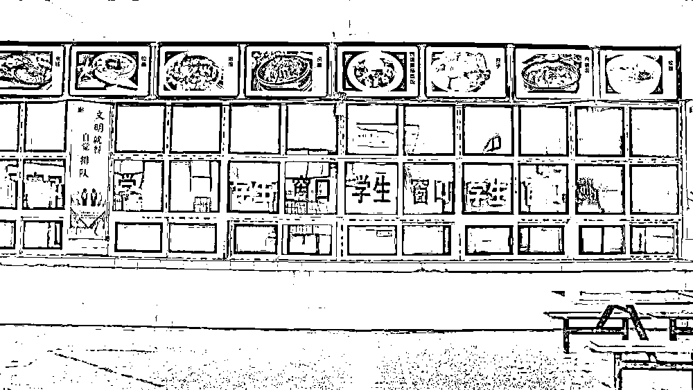

# 为何换不掉涉事配餐公司？“学生餐后呕吐”事件调查来了！

> 原文：[`mp.weixin.qq.com/s?__biz=MzIyMDYwMTk0Mw==&mid=2247524992&idx=5&sn=544ad6d9616a4132c8deed898fdb9ea6&chksm=97cba9b8a0bc20ae186d79eff96cb1a644e004161a4a2626b6a5720977b319a2e283e27b48c4&scene=27#wechat_redirect`](http://mp.weixin.qq.com/s?__biz=MzIyMDYwMTk0Mw==&mid=2247524992&idx=5&sn=544ad6d9616a4132c8deed898fdb9ea6&chksm=97cba9b8a0bc20ae186d79eff96cb1a644e004161a4a2626b6a5720977b319a2e283e27b48c4&scene=27#wechat_redirect)

[`mp.weixin.qq.com/mp/readtemplate?t=pages/video_player_tmpl&action=mpvideo&auto=0&vid=wxv_2156942784920911877`](https://mp.weixin.qq.com/mp/readtemplate?t=pages/video_player_tmpl&action=mpvideo&auto=0&vid=wxv_2156942784920911877)

近日，河南省封丘县“30 余名师生餐后集体呕吐腹泻”“校长痛哭称换不动送餐公司”成为网民热议话题。就公众关切的几个问题，记者进行了深入调查。

**焦点一：究竟哪个食物有问题？**

27 日，封丘发布消息，称“初步判定赵岗镇戚城中学部分学生出现餐后呕吐腹泻是一起食源性疾病事件”。所谓食源性疾病，主要是由患者进食了不洁食物导致。

三名住院学生表示，**中午吃的是大米和冬瓜肉片，饭后约一小时出现呕吐、恶心、发烧等症状**，医院初步诊断为急性肠胃炎。另一名吃了家常豆腐的学生反映，**豆腐有馊味。**

封丘公安机关调查发现，涉事配餐公司 11 月 23 日用了冷冻肉片，此前用的是新鲜肉，民警正在追查冷冻肉来源。此外，有关部门还对是否涉嫌投毒展开调查。

封丘县政府新闻发言人李安涛表示，根据检验，涉事公司大米和面条菌群超标，对事发当天留样的豆腐、冬瓜肉片、玉米羹检测结果未出。“到底是哪个食物导致呕吐腹泻，尚需进一步调查。”

**焦点二：为何换不掉涉事配餐公司？**

戚城中学把食堂托管给一四川企业经营，双方合作四年有余。今年 11 月 15 日，涉事公司北京志宏恒达商贸有限公司封丘分公司开始给戚城中学配送午餐。

一些师生和家长向记者反映，配餐不如学校食堂原来午餐做得好，**且配餐中发现过虫子、机器零件、塑料管等杂物。**此外，由于戚城中学距离配餐制作点约 9 公里，饭菜送到后已“不太热乎”。

戚城中学校长王永表示，他曾向封丘县教育体育局反映配餐问题，教体局食品管理办公室工作人员来到戚城中学陪餐，并组织各学校膳食管理委员会代表前往配餐制作点监督检查。

事发第二天，涉事公司仍给戚城中学配送午餐。封丘县委有关负责人表示，出现问题后没有第一时间停止配餐确有不妥，但也不能轻易换掉一个经过招投标程序选中的配餐公司。

**焦点三：涉事配餐公司管理水平怎么样？**

涉事配餐公司 9 月 22 日成立，办公场所在赵岗镇南常岗小学院内。记者 26 日探访发现，该配餐制作点由崭新的教学楼改造而成。房屋墙上悬挂有工作人员健康证明，屋内放置有食品留样柜，档案柜内存放着蔬菜进货台账、餐厅消毒记录、车辆消毒记录、货物检验检疫合格证明等材料。

据介绍，涉事配餐公司共为赵岗镇 24 所小学及戚城中学共计 3000 余名师生配送午餐。南常岗小学校长李锋、裴固小学校长张春明表示，配餐“还不错”“差不多”。

配餐制作点食品安全管理组副组长王玉华表示，自运营以来，每周都会有市场监管所工作人员前来检查工作。“对配餐制作点，原则上一个季度检查一次。由于是今年新投入运营的企业，我们加密了检查频次。”封丘县市场监管局副局长闫文峰表示。

记者调查还发现，**该公司虽成立时间不长，但员工流动性大，未接受过系统的岗位技能培训。**

**焦点四：涉事配餐公司无证经营是怎么回事？**

记者调查发现，涉事配餐公司 9 月 22 日成立，10 月 26 日取得营业执照。然而，该公司大约在 10 月 9 日后就已开始给一些小学配餐，且直到 11 月 25 日，也就是**事发后的第二天，才取得食品经营许可证。**

封丘县市场监管局调查发现，**涉事配餐公司厨师未取得厨师证。**

“由于教体局招标开始得晚，为了让学生享受到国家政策，出现了无证经营的状况。”封丘县市场监管局副局长闫文峰认为“涉事公司边供餐、边整改、边办证，这合情但不合法”。

**焦点五：招投标有没有“猫腻”？**

8 月 16 日，涉事配餐公司根据封丘县农村义务教育学生营养改善计划午餐采购项目（4 标段）招标文件，递交了投标文件，经评标委员会评审推荐并经采购人确认，被确定为该项目（4 标段）中标供应商。

“通过对招标文件进行审查，目前没有发现招标文件制作方面的问题。”封丘县纪委监委案件监督管理室主任王福京说。

据王福京介绍，下一步将对招投标的过程、投标企业的资质，以及是否存在违规违法行为等深层次问题进行调查。

“我们调查的对象包括封丘县教体局、公共资源交易中心、参与招标的企业、代理公司。如有必要，评标专家也会被列入调查范围。”王福京表示，由于涉及人员众多，**其中是否有“猫腻”有待进一步调查。**

封丘县委宣传部部长陈明 28 日表示，县里已为戚城中学挑选了新的餐饮供应方，相关工作已经展开，保证师生明天就可以吃上放心的热乎饭。

此外，新乡市教育局也已下发《关于进一步加强冬季学校食品安全工作的紧急通知》，对强化学校食堂监管、加强校外供餐管理等问题提出明确要求。

来源：新华社，央视新闻

← 向右滑动与灰产圈互动交流 →

