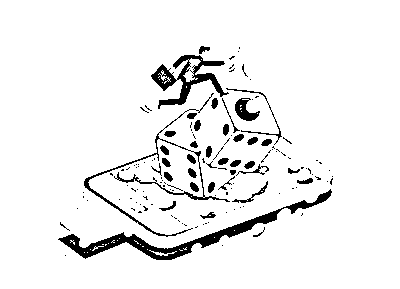
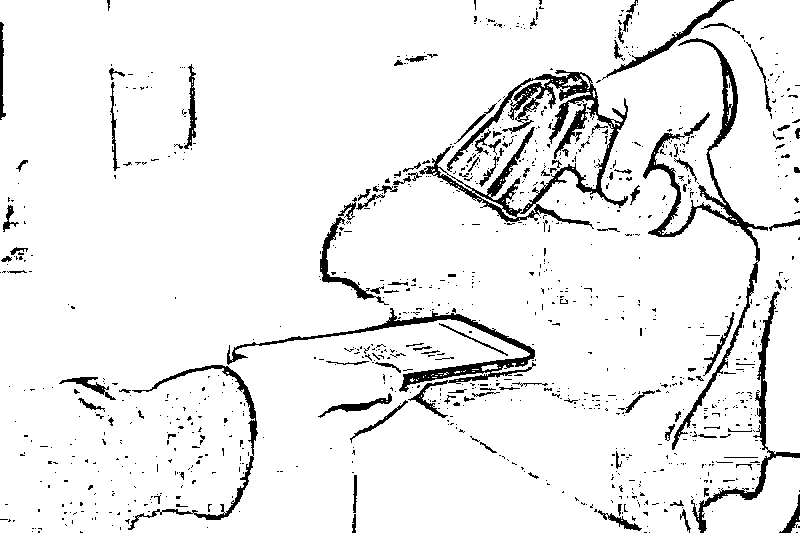

# “跑分平台”跑不动了！明年 3 月 1 日起，微信、支付宝个人收款码不能用于经营收款

> 原文：[`mp.weixin.qq.com/s?__biz=MzIyMDYwMTk0Mw==&mid=2247524992&idx=6&sn=f31a277d7a95157834335c88901e7d3a&chksm=97cba9b8a0bc20ae40d9f94d6c271cd5136dd70f5896d0f166c8c8ef8367eec39115ec05406f&scene=27#wechat_redirect`](http://mp.weixin.qq.com/s?__biz=MzIyMDYwMTk0Mw==&mid=2247524992&idx=6&sn=f31a277d7a95157834335c88901e7d3a&chksm=97cba9b8a0bc20ae40d9f94d6c271cd5136dd70f5896d0f166c8c8ef8367eec39115ec05406f&scene=27#wechat_redirect)

近年来，个人收款条码得到广泛运用，提高了资金收付效率，但也存在一些风险隐患。如一些不法分子利用“跑分平台”，以高额收益吸引大量人员使用个人静态收款条码与赌客“点对点”线上远程转移赌资，将赌资分拆隐藏于众多正常交易场景。

**   跑分是什么？**

所谓“跑分”即是使用自己的银行卡或微信、支付宝的收款码，帮助电信网络诈骗、赌博等违法犯罪团伙进行洗钱，随后赚取佣金的不法行为。该行为涉嫌帮助信息网络犯罪活动罪。

央行规范

在消费者的日常生活中，扫码支付等支付方式已不鲜见，这样的行为将被纳入监管。2021 年 10 月 13 日，央行官网发布《中国人民银行关于加强支付受理终端及相关业务管理的通知（银发〔2021〕259 号）》，从支付受理终端业务管理、特约商户管理、收单业务监测三个方面入手，对收单机构和清算结构提出了一系列的管理要求。与此同时，条码支付也被纳入监管，对个人收款条码的使用规范做出具体规定，并将于 2022 年 3 月 1 日起施行。 

《通知》对收款条码管理进行了说明，对于个人或特约商户等收款人生成的，用于付款人识读并发起支付指令的收款条码，应有效区分个人和特约商户使用收款条码的场景和用途，防范收款条码被出租、出借、出售或用于违法违规活动。对于具有明显经营活动特征的个人，条码支付收款服务机构不得通过个人收款条码为其提供经营活动相关收款服务。

《通知》还对远程非面对面收款进行了说明。条码支付收款服务机构应当采取有效措施禁止个人静态收款条码被用于远程非面对面收款。对于通过截屏、下载等方式保存的个人动态收款条码，应当参照执行个人静态收款条码有关规定。“将条码支付纳入监管，弥补了之前可能被洗钱利用比较多的条码支付通道漏洞。”特别是对个人收款码的管理，《通知》的要求会有效避免个人收款码通道被交易平台利用。

《通知》对消费者和小微商户有哪些影响？央行相关负责人表示，《通知》总体上有助于更好保护消费者合法权益，有利于防范不法分子通过改造支付受理终端、申请虚假商户等手段盗取消费者个人信息，甚至盗用账户资金，有利于提升银行、支付机构的对账单、交易信息查询等服务质量，充分保障消费者知情权，减少相关纠纷和投诉；长远来看，《通知》关于规范个人收款码的相关要求将进一步提升对个人经营者和小微商户的收单服务质量。

公安打击

01

案例一

2021 年 9 月底，江苏省泰州市公安局海陵分局在开展电信网络诈骗案件研判工作中发现，有多张银行卡存在帮助犯罪分子“跑分”洗钱的重大嫌疑，背后极有可能隐藏着一个黑灰产犯罪团伙。办案民警随即对相关账户信息和使用人进行深度研判，通过抽丝剥茧，警方最终锁定银行卡实际持有人陈某、窦某、仲某、吴某杰等 4 名犯罪嫌疑人。

经缜密侦查，办案民警很快掌握了这些“帮凶”的活动轨迹。10 月 8 日，海陵警方开展集中收网行动，一举抓获陈某等 4 名犯罪嫌疑人，当场查获银行卡 80 余张。经审查，犯罪嫌疑人供述另外几名团伙成员。10 月 12 日，警方再次出击，抓获高某、吴某宇、申某宇、申某祥等 4 名犯罪嫌疑人。10 月 13 日，犯罪嫌疑人掌某向公安机关投案。

办案民警对犯罪嫌疑人的大量银行账目流水进行仔细查询、梳理，有针对性地突破嫌疑人心理防线，最终陈某等人对自己办理银行卡为犯罪团伙提供资金转账的犯罪行为供认不讳。经调查，2021 年 7 月以来，陈某为了非法牟取暴利，先后找到窦某、仲某、吴某杰等人办理大量银行卡，设置统一密码，开通手机网银，再根据上家指示将这些办卡人员带至福建省帮忙“跑分”。到当地后，陈某等人将自己的银行卡和手机交由犯罪分子使用，并配合“跑分”团伙进行人脸认证，使得这些诈骗、赌博所得的非法资金转入犯罪嫌疑人指定账户，从而完成“跑分”洗钱任务。每次“跑分”，陈某等人可以拿到 0.5%左右的提成，发展下线还可以获得 300 元—500 元不等的好处费，“跑分”多时一天可赚 2000 元。经初步统计，短短 3 个月时间，该团伙“跑分”洗钱涉及全国百余起电信网络诈骗等案件，涉案资金流水达上亿元，累计非法获利十余万元。

明知自己的行为是为犯罪分子洗钱，仍在金钱的诱惑下铤而走险。目前，陈某、窦某等 9 人因涉嫌帮助信息网络犯罪活动罪被公安机关依法采取刑事强制措施，案件仍在进一步深挖中。

02

案例二

近日，央视财经报道，湖南省湘潭公安由一张准备销户的银行卡，顺藤摸瓜找到线索，发现了一个特大网络跑分平台，涉案金额高达 1.5 亿元。事件的开始是因为长沙银行湘潭九华支行，接到了一名客户钟某的业务办理需求，要求对其名下的银行卡进行销户，而这张银行卡却存在的一定的风险。在办理销户之前，这张银行卡已经被长沙银行列为了异常，原因是该银行卡高频交易，资金快进快出，持卡人的电话也一直无法接通，长沙银行总行对这张银行卡发起了风险预警。当银行工作人员向客户钟某询问相关情况时，钟某选择了回避，在慌忙之下离开了银行，钟某的行为让银行人员更加警觉。

被银行盯上的钟某并没有放弃，几天后再次来到长沙银行湘潭九华支行，与其一同而来的还有一名男子，男子主动告知银行这张银行卡平时是他在使用。男子让银行人员取出卡中的 3000 元钱并且将卡销户，银行为了防止风险，要求提供相关交易凭证，但男子却表示无法提供，还声称自己在其它银行的很多银行卡，销户时都没有受到限制。银行工作人员判断这名男子的用卡行为并不正常，拨打了反电诈中心的电话，湘潭公安开始对案件进行调查，将钟某以及这名男子带回警局，男子的真实身份曝光，是一个跑分团伙的小头目。

湘潭公安得知跑分团伙有多个犯罪窝点，为了将犯罪分子一网打尽，湘潭公安紧急采取了行动，前往跑分团伙居住的酒店，查获大量涉案银行卡和电脑设备，抓获 9 名犯罪嫌疑人。经过近一年的调查，另外三个犯罪窝点的人员也悉数落网，今年 5 月份，这个专门替境外赌博网站洗钱的跑分团伙彻底被端。

案例分析 

跑分平台通常打着高额佣金的旗号，收购或者租借支付宝收款码、微信收款码以及银行卡来漂白资金，使电信网络诈骗和赌博网站的资金能够顺利地转入和转出，减少银行对资金流向的监测。跑分平台通过 QQ 和论坛等渠道发布信息，吸引用户参与跑分，还有人员从用户手中收购、租借银行卡，承诺给予一定的费用，很多用户看到有钱赚便将银行卡借出。

这些被非法使用的银行卡，却在不知不觉中参与到了洗钱案件中，并且每张银行卡都会发生大量的资金交易，一旦被银行查到，不仅收购者会受到惩罚，出售银行卡的人员同样逃脱不了干系。过多的银行卡卷入到洗钱活动，给反洗钱工作增加了难度，因此**公安机关从跑分平台切入，对跑分平台各个击破，使涉诈涉赌资金失去漂白的通道，最大程度地限制电信网络诈骗和赌博网站的运营。**

**民警提醒：**

**因“断卡”行动被惩戒人员，5 年内禁用支付宝和微信支付，只能使用现金消费。同时，征信记录、银行贷款也受影响，名下所有的手机号码、固话号码等通信业务一律全部关停，未经公安机关许可不得恢复。广大市民必须警惕“跑分”陷阱，注意保护个人隐私信息。切勿因为眼前小利而出售、出借个人微信、支付宝账户信息或银行卡，一旦被不法分子用于诈骗、网络赌博或其他违法犯罪，将会受到法律的严惩。**

**来源：公安部刑侦局，熊猫反诈**

****

**← 向右滑动与灰产圈互动交流 →**

****