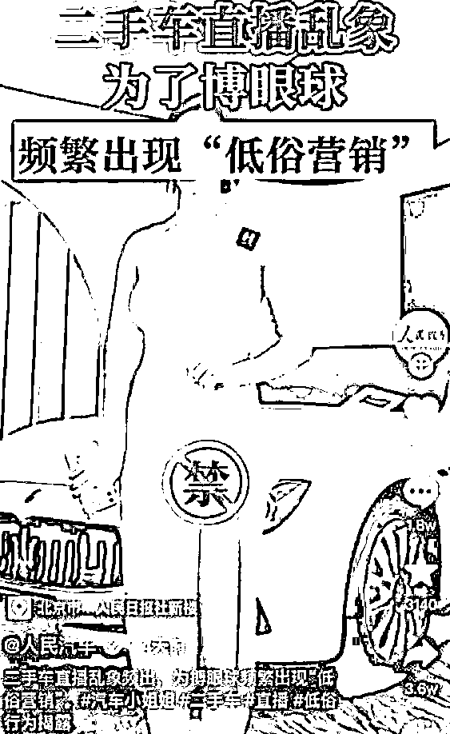
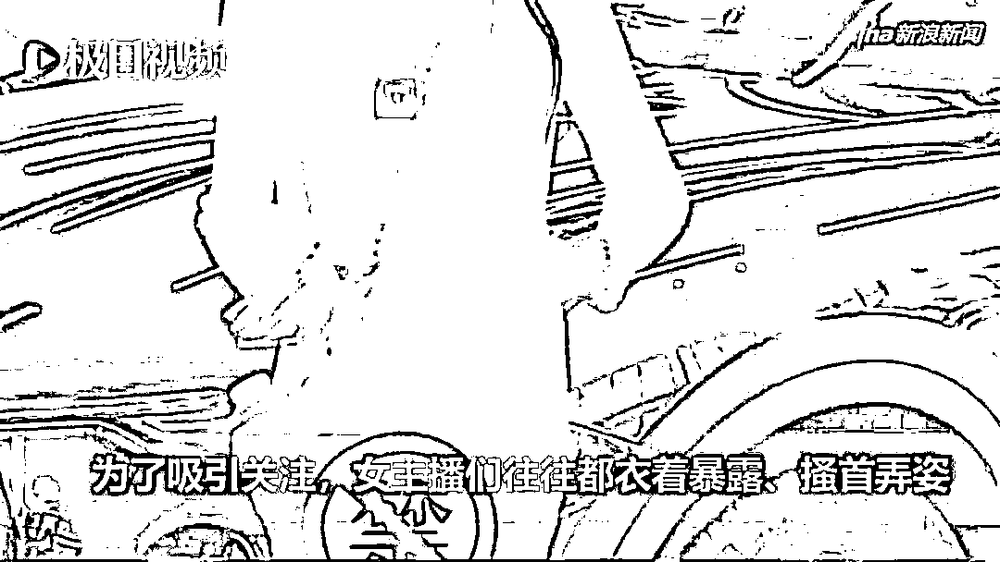
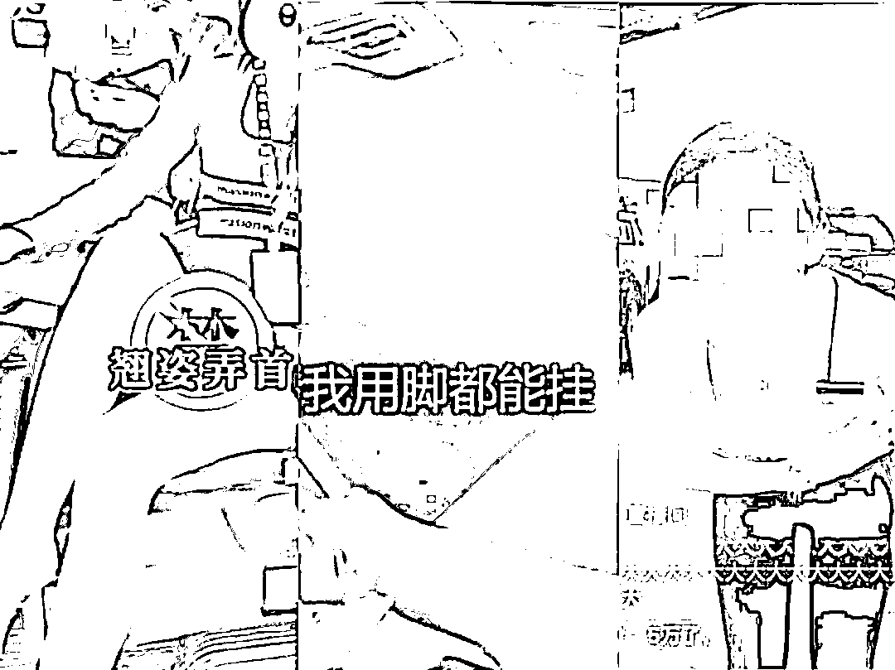
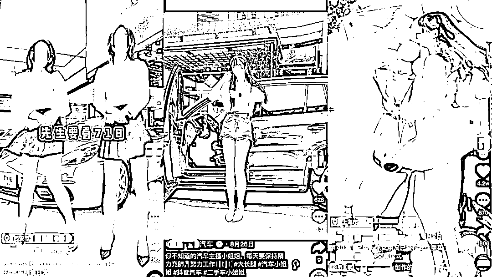
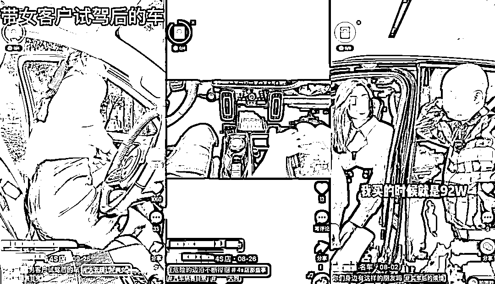
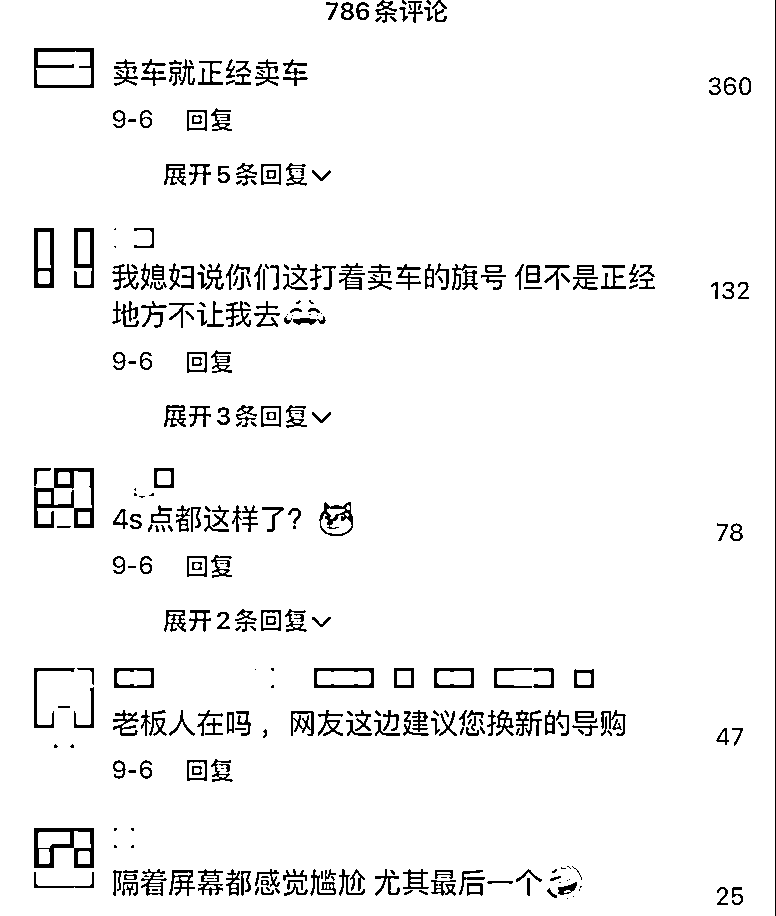
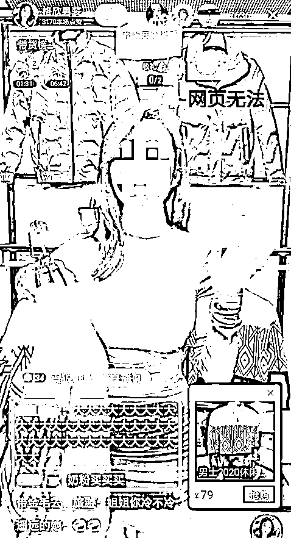

# “不雅”直播卖车尺度骇人，全网封禁

> 原文：[`mp.weixin.qq.com/s?__biz=MzIyMDYwMTk0Mw==&mid=2247525055&idx=1&sn=7c7dec9fba06bcef92bee43a93842a7d&chksm=97cba987a0bc209156225eeedb23d4389d31aacf1be7d9e4d00f9e4ccf1d8cbee1a49f4dba40&scene=27#wechat_redirect`](http://mp.weixin.qq.com/s?__biz=MzIyMDYwMTk0Mw==&mid=2247525055&idx=1&sn=7c7dec9fba06bcef92bee43a93842a7d&chksm=97cba987a0bc209156225eeedb23d4389d31aacf1be7d9e4d00f9e4ccf1d8cbee1a49f4dba40&scene=27#wechat_redirect)

10 月 22 日，人民日报社《民生周刊》旗下账号@人民汽车 就发布了一条视频，

斥责二手车直播带货中出现的这些低俗营销事件。

**她们在镜头面前衣着暴露、动作大胆、言语撩人，为的是讨好观众，把车卖出去，被评论区的网友称为“****二手车媛****”。**

为了博眼球，女主播们衣着暴露、搔首弄姿，

用撩人姿势和一些挑逗性语言来给二手车直播带货，打色情擦边球，以此获得更多的流量。

近期在短视频平台上，一些二手车销售账号频繁进行低俗营销，

出现了主播在直播间打着软色情擦边球卖车的情况。

**单看视频，很难将这样的直播画面与卖车联系起来**。

有网友反馈，这些女主播本身对汽车知之甚少、出镜表达基本靠背台词，但对直播打赏的玩法轻车熟路。

有的女主播为了收获打赏，喊“榜一”大哥“爸爸”。有评论称，这无疑是在诱导打榜氪金。

事实上，目前仍有部分汽车经销商利用类似的“车媛”跳舞短视频，在抖音、快手等平台上引流，获得了不少关注。

一些美女汽车销售不但衣着暴露，

**还展示出了一些擦边球的“暗示”动作**，

并在文案中标注着“在危险的边缘徘徊”的字样。

这类型短视频的剧情有一个通用套路：

一位“用户”身份的人，正在询问女销售汽车相关的问题，女销售一问三不知，“用户”问道，你这样如何把车卖出去？

女销售便开始摆出各种性感的姿势。评论区网友纷纷评价道，“这简直是知道答案的开卷考试”。“卖车都要走到这一步了吗？”

网友纷纷表示不解，**这些视频和账号的“卖车”定位，一点也不搭边**。

**业内称拉低了整个行业档次**

一些二手车业内人士对此类营销方式表达了自己的看法。

一名广东二手车商告诉极目新闻记者，他不反感请美女直播卖二手车，但通过暴露身体来吸引流量关注，有哗众取宠的嫌疑，这是一种不良的社会风气，需要有关部门加强监管。An 网、诡异故事、大案要案等，敬请关注。

在他看来，这种打色情擦边球的营销行为，拉低了整个行业的档次，使外界以为只要搔首弄姿就可以卖车，对二手车行业产生了一定的误解，“二手车交易本质上是靠品质。”

该车商还认为，现在全社会各个年龄层都在观看短视频及网络直播，成年人可能有一定的自控能力，但是未成年人由于心智不够健全，很容易受这种不良的短视频影响。“孩子们可能会认为，长大后也可以通过衣着暴露以及言语的性暗示获得收入，这是一种不正确的价值导向，对下一代负面影响很大。”

西安一名二手车商则称，自己身边也有不少同行在探索这种美女直播的营销模式。“这种营销方式目前来看确实获得了不错的流量，而我们采用传统的男主播说车模式，人气相较于他们会差一些。”他认为，请美女直播卖车没有什么问题，现在二手车行业竞争压力很大，这也算一种营销手段。但是如果通过“软色情”的方式来吸引流量，则不合适。

实际上，看似秀场实则带货的“媛”，不仅存在于二手车直播行业，在家装、电脑硬件、户外、茶具等以男性受众为主的带货直播间，也存在一批画风类似的“售货媛”。

例如，一位名叫“格欣男装搭配”的抖音带货主播，就曾借助秀场玩法，在 10 天内涨粉 20 万，且在账号开设初期阶段，就创造了 6 小时 30 万销售额的成绩。

“格欣男装搭配”直播间售卖的是男装，带货的是一位颜值女主播，这位主播几乎不会介绍衣服，只是手拿衣服，进行“秀场直播”风的表演——眨眼、弯腰、吐舌头，进而求关注、求下单。

而她的粉丝自称为“奶粉”，并常在评论区刷“大”字。 目前该账号已经停止更新，并在留言区引导用户去新账号购买男装。

实际上，多个平台对这类擦边球内容一直在加强管控力度，但很难彻底根除。

有短视频平台运营曾讲到，从平台角度出发，很难准确判定哪些内容是违规的，出现什么动作算低俗，而要让这个标准成为机器和算法的一部分，又加大了难度，所以目前平台主要依赖投诉反馈机制，做后置的处理。

要彻底杜绝‘售货媛’，让‘媛’不再被利用，需要用户、主播群体和平台一同努力。

来源：围脖那些事儿

← 向右滑动与灰产圈互动交流 →

