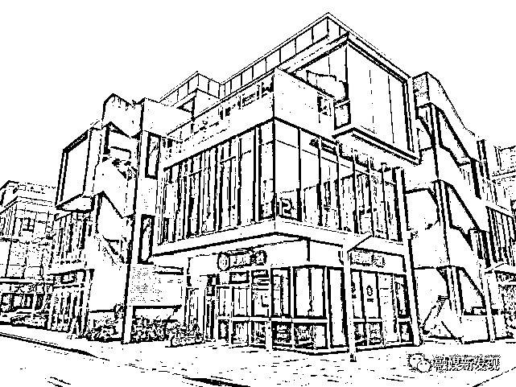

# 暗访上海“元宇宙沙龙”：号称投资 40 天翻 18 倍，在元宇宙真能日入上万？

> 原文：[`mp.weixin.qq.com/s?__biz=MzIyMDYwMTk0Mw==&mid=2247525055&idx=2&sn=3e4ffa580a5e391bbb17d067860f6384&chksm=97cba987a0bc2091ed3c554af828c17ce6a0933c9796d202080eb035c2b2122ac5e375adad5c&scene=27#wechat_redirect`](http://mp.weixin.qq.com/s?__biz=MzIyMDYwMTk0Mw==&mid=2247525055&idx=2&sn=3e4ffa580a5e391bbb17d067860f6384&chksm=97cba987a0bc2091ed3c554af828c17ce6a0933c9796d202080eb035c2b2122ac5e375adad5c&scene=27#wechat_redirect)

“知道最近网上很火的‘元宇宙’吗？”

“知道，听过。”

“我们打造的就是‘元宇宙’里面的经济系统…”

“上来没听几句话，就被他们给绕晕了...”

上海市民蔡女士回忆起了 11 月初参加申城某“元宇宙”沙龙讲座时的情景。或是过于天花乱坠的演讲让蔡女士起了疑心，今年 11 月 1 日，她致电 12345 市民服务热线，举报有人在“洗脑推广虚拟的元宇宙投资”，她怀疑这又是某种骗局。

元宇宙概念爆火后，从线上课程、到线下讲座，打着元宇宙旗号的内容和活动层出不穷。普通人还没来得及去了解元宇宙是什么，就已经担心自己错过了元宇宙的财富风口。

那么，这些沙龙讲座是不是洗脑骗局？听了这些讲座，能站上元宇宙的财富风口吗？记者进行了调查，买入元宇宙流通币 40 天翻 18 倍！

蔡女士告诉记者，之所以去听所谓的“元宇宙财富沙龙”，是听了一位朋友的力荐。

她偷拍了一张照片，当天的沙龙是在闵行区新龙路 1333 号 12 幢 93 号楼内举办的，“一条狭长的拼凑桌子，两边坐满了人，听一位‘老师’分享元宇宙。”

闵行区新龙路 1333 号 12 幢。

蔡女士提供的“元宇宙沙龙”照片。（非正常拍摄）

11 月 22 日下午，记者来到新龙路 1333 号 12 幢 93 号楼。这是一幢 3 层楼的办公楼，93 号位于整幢楼的东南角。入口处挂着一块“酒号营地”的牌子，透过门玻璃看到，底楼大厅的一角摆着一排排椅子，前方是一块白色幕布，似乎是一处讲座场所。玻璃门锁着，里面亮着灯，但无人活动。

难道元宇宙的风口已“吹”走了？

记者从外侧消防梯来到二楼，防火门没锁，入内是一间大办公室，一名女子正跷脚坐在一角的沙发上打电话，“你把钱包地址发过来，我给你转几个币过去”……定睛一看，女子正是蔡女士提供的沙龙照片中的“老师”。

透过门玻璃看到，底楼大厅的一角摆着一排排椅子，前方是一块白色幕布，似乎是一处讲座场所。

记者突然出现有些唐突，女子反复质问记者“什么事”“谁介绍的”。记者表示来寻找元宇宙的投资机会，好一番说辞打消了她的顾虑，她让记者坐在外侧候着。

里侧办公室内不断传来两人交谈声，不一会一男子将一名“顾客”送了出来，女子示意记者跟着他，去听他的介绍。男子将记者带到里侧一间办公室，坐在一张茶桌前。他先打了个电话，“你朋友投了一万……25 号开大会，带点人来……”似乎是在“汇报”刚才那位顾客的“投资”情况。

搁下电话，他转头问记者：“知道网上很火的元宇宙吗？”在接下来的一个多小时中，先后四位“老师”登场，或手机演示、或白板疾书，给记者上了一堂关于元宇宙的财富讲座。

从男子口中，记者得知他们正在推广一种名为“ME”的虚拟币。而在未来的元宇宙中，这种币将是虚拟世界中使用的货币。据称，这种虚拟币 9 月刚发行，目前已经进入了“第二阶段”。

男子解释了赚钱的方式：一旦买入币后，可以设置“质押挖矿”，“就像母鸡下蛋般每天给你产利润”；也可以参加二阶段的游戏，即将币冻结 40 天每天领取奖励，并用奖励的币去抽取 12 星座卡牌，“抽到不同的卡牌可以使投入的币翻不同倍数，最低是 2 倍”。奖励可以再冻结进去，“利滚利”。看记者听得云里雾里，男子总结一句话，“你买的币，一轮下来最差也是翻 3 倍。”

而即将进入的“第三阶段”才是真正的元宇宙。说到激动处，男子拉来一块白板，向记者描述名为“创世开篇”的元宇宙。这所谓的元宇宙将历经农业、工业、互联网等 6 个时代。以农业时代为例，系统将出售 200 个岛屿，“就像 QQ 农场一样，给你经营”。而购买岛屿、购买各类物资都需要使用元宇宙货币“ME 币”，当然经营也会产出“ME 币”，“但全球就限量发行 2100 万枚，未来很稀缺，它一定会涨”，男子信誓旦旦。

男子写满了一白板的内容，向记者描述名为“创世开篇”的元宇宙。（非正常拍摄）

此时，另一名男子出现，在白板上写下了整整一板的算式，强调在目前的卡牌阶段 40 天可以翻 18 倍，并非是此前接待记者的男子所称的 3 倍…

另一名男子在白板上写下了整整一板的算式，强调在目前的卡牌阶段投资 40 天可以翻 18 倍。（非正常拍摄）

就是早已有的“虚拟币”和“链游”

还“嫁接”了传销的模式

一边介绍，“老师”们主动添加了记者的微信，并发来各种链接，手把手地辅导记者一步步安装了电子钱包软件、申请了“币安智能链”的电子钱包并添加了“ME 币”，随后又在电子钱包软件中添加了使用“ME 币”的关联小程序、添加了名为“薄饼”的交易所小程序、添加了浏览“ME 币”实时价格的页面等等。

一番操作下来，记者早已被这一个个从未接触过的概念、页面和小程序弄得晕头转向。“老师”们不断催促，让记者按美元的实时汇率尽快从他们手中购入名为“USDT”的虚拟代币，随后再在交易所中买入“ME 币”开始赚钱，赚取的“ME”币随时可兑换提现……若对区块链领域缺乏了解，几轮下来怕是已深信不疑，直接交出手机请对方“代劳”了。

据“老师”们称，类似的“元宇宙沙龙”每天都会在线上线下举办。图为入夜后，闵行区新龙路 1333 号 12 幢 93 号楼内仍灯火通明。

打开“ME”币的关联小程序，处处都能看到硕大的字，强调着元宇宙元素，如“将区块链浸入元宇宙”“构建元宇宙生态”等等。

这些天花乱坠的概念，真的与元宇宙有关系吗？记者请教了熟知的一名区块链行业资深投资者。他告诉记者，现在网络上鼓吹的“元宇宙生态”，都是由来已久的“虚拟币”和“区块链游戏”（下简称“链游”），只是装在了元宇宙的“壳子”里炒作推广而已。

打开“ME”币的关联小程序，处处都能看到硕大的字，强调着元宇宙元素。

据专业人士介绍，“ME 币”是利用了“币安智能链”平台发行的一款虚拟币，这样的币在网络上有着无数种。而所谓的“元宇宙经济系统”，就是俗称的“链游”，即基于区块链技术开发的游戏。专业人士体验后告诉记者，第二阶段元宇宙的卡牌系统，就是一款网页游戏，开发者将上述发行的虚拟币关联进游戏中，抽取到不同卡牌后让持有的币数量发生变化，仅此而已。

记者以“元宇宙”作为关键词，在 QQ 平台搜索发现，有着数量众多的“元宇宙交流群”。记者加入了其中几个群发现，群内不断有人进来推广形形色色的“元宇宙生态”，细看清一色都是一款虚拟币和一款链游的标配。一些游戏制作粗劣，看起来就是十余年前流行于网络上的农场种植、宠物养成和企业经营类游戏，但往往都打着“元宇宙风口的最强黑马”的旗号。

记者加入了几个元宇宙投资群发现，群内不断有人进来推广形形色色的“元宇宙生态”，细看清一色都是一款虚拟币和一款链游的标配。

在记者体验的元宇宙沙龙中，“老师”们还提醒记者复制系统内的邀请链接给他人，可以赚取收益，鼓动记者将感兴趣的人带去 25 日的“大会”现场。调查发现，这些“元宇宙生态”为了实现推广，还“嫁接”了传销的模式。如一款虚拟币设置的“推广计划”声称，随着推广的人数越来越多，可以最多享受到 12 代会员给予的不同百分比的收益。

图为“老师”给记者发来的“元宇宙沙龙”邀请。

一些“元宇宙生态”为了实现推广，还“嫁接”了传销的模式。图为一款虚拟币设置的“推广计划”。

网友：你馋他利息，他馋你本金

投资元宇宙赚钱？

警惕落入庞氏骗局

投资这样的“元宇宙”，真的如宣传所称可“打游戏日入上万”？专业人士指出，揭开元宇宙的壳子，警惕里面本质上都是“庞氏骗局”，崩盘是迟早的事。

一方面，网络上流行的“链游”，往往都算不上是真正的游戏，不具备传播力。只是通过简单的操作，让投资者持有的虚拟币“假装”在不断增加。同时，游戏会设定种种机制，让投资者持有的不断增值的虚拟币被“锁”住，如承诺你冻结返还奖励，如质押挖矿赚取收益，避免投资者将赚取的虚拟币兑换提现，拉长“骗局”的周期。而即便有人提现，也是用后入场的人支付的钱来填补窟窿。

另一方面，区块链骗局中一个典型的特点就是投资者的“对手”就是发币方。尽管虚拟币表面上进入某个交易所交易，但投资者的买入、卖出均是和发币方发生关系。在这种情况下，发币方可以随意控制价格。一旦发币方觉得赚够了撤离，这些虚拟币或只能买不能卖，或干脆价格跌至一文不值，归根结底还是前些年“空气币”的那一套。

早在 2017 年 9 月 4 日，中国人民银行等七部委就发布公告明确指出，所谓“虚拟货币”，本质上是一种未经批准非法公开融资的行为，涉嫌非法发售代币票券、非法发行证券以及非法集资、金融诈骗、传销等违法犯罪活动。2018 年 8 月 24 日，银保监会等部门又联合发出风险提示，指出一些不法分子打着“金融创新”“区块链”的旗号，通过发行所谓“虚拟货币”“虚拟资产”“数字资产”等方式吸收资金，侵害公众合法权益。此类活动并非真正基于区块链技术，而是炒作区块链概念，行非法集资、传销、诈骗之实。2019 年 11 月 22 日，央行上海总部再次发布消息指出，虚拟币的炒作近日有抬头迹象，炒作花样翻新、投机盛行，价格暴涨暴跌，风险快速聚集。如今，同一套路的骗局又装进了“元宇宙”的壳子卷土重来。

随着网络的不断热炒，尽管已经耳熟能详，但元宇宙概念迄今仍没有清晰准确的定义。多元的声音不一而足，可以明确的一点是：虽然元宇宙似乎拥有广阔空间和多种可能，但目前还是一个尚未成型的新兴事物。

来源：上观新闻、新民晚报、网友评论

← 向右滑动与灰产圈互动交流 →

