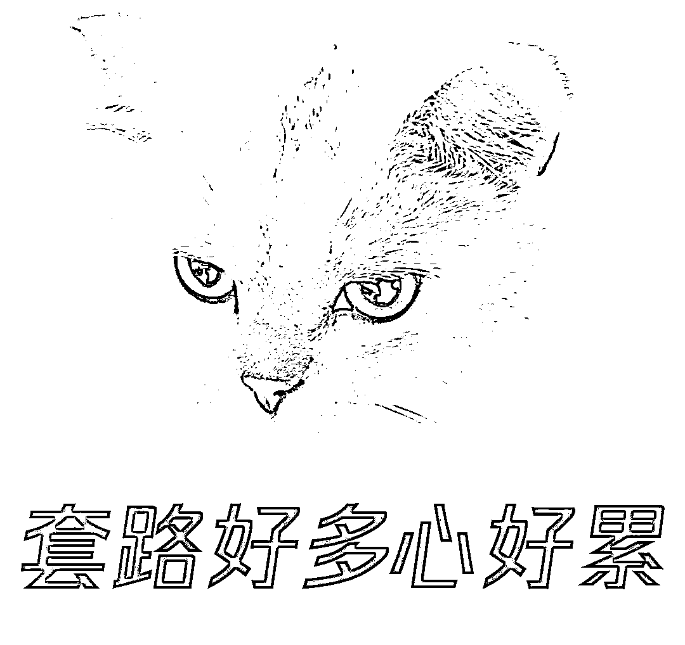
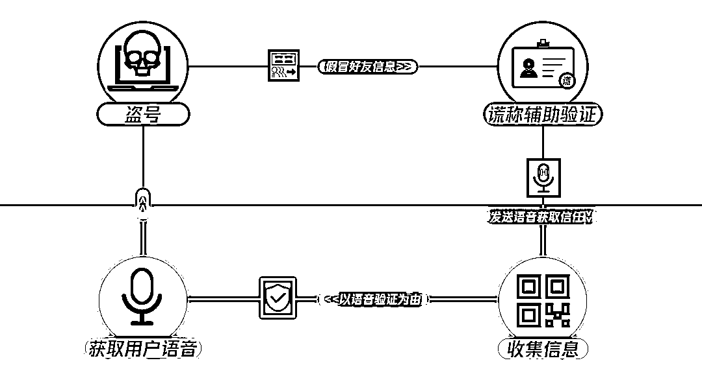
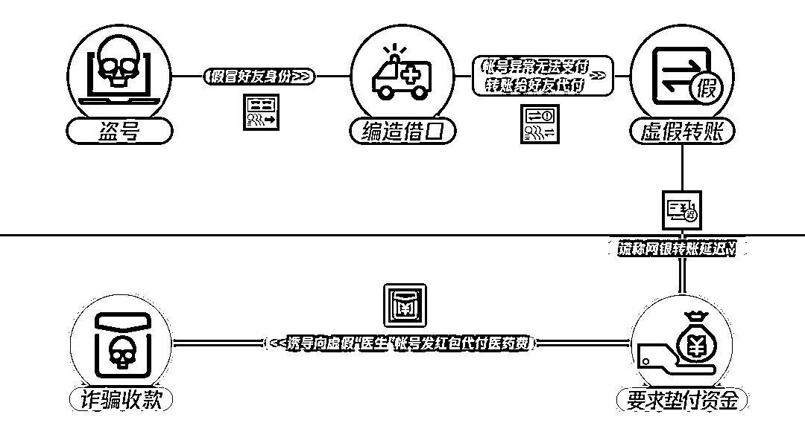

# 朋友，帮忙辅助验证一下

> 原文：[`mp.weixin.qq.com/s?__biz=MzIyMDYwMTk0Mw==&mid=2247525055&idx=3&sn=8800e79bea7d7076f2df6fa3ff24b2ee&chksm=97cba987a0bc2091db21c7eaba318a02300147c95985395aef1da4071f6f3585b0d207648288&scene=27#wechat_redirect`](http://mp.weixin.qq.com/s?__biz=MzIyMDYwMTk0Mw==&mid=2247525055&idx=3&sn=8800e79bea7d7076f2df6fa3ff24b2ee&chksm=97cba987a0bc2091db21c7eaba318a02300147c95985395aef1da4071f6f3585b0d207648288&scene=27#wechat_redirect)

为了冲一波业绩

骗子们又双叒叕升级了盗号欺诈的新手法

这一次，他们将黑手伸向了

风险意识薄弱、容易相信他人的群体

以帮忙辅助验证为由，设下天罗地网

这究竟是怎么回事？

**手法升级，套路更多**

在常规的盗号欺诈中，骗子通过盗取他人帐号，冒充帐号本人，以手机欠费代充、好友住院急用钱、代付商品等借口，让社交好友转账付款，从而骗取钱财。

而在新手法中，骗子不仅骗取钱财，还以辅助验证等为借口，雁过拔毛地**把列表好友的帐号也盗取了**，以便继续骗取钱财。

**欺诈环节之一：**

**一骗再骗，连环盗号**

在整个骗局中，盗号环节可谓是一切的开始。毫不夸张的说，一旦社交软件好友中有人被盗号，就有可能全员覆灭，呈现“人传人”的特征。 

骗子盗取小红（化名）的社交帐号后，冒充小红给好友小明（化名）发消息，以更换帐号信息为由，让其帮忙辅助验证。

当小明表示质疑时，骗子发送一段**提前录制好的小红的语音**，让小明放下防备，然后诱导小明登录到一个伪造的帐号安全中心验证界面，要求小明**填写帐号、密码、手机号、验证码**等信息。

以为这样就结束了？其实骗子的套路才刚刚开始。骗子又**以系统核实还需语音验证**为由，让小明**发语音自证身份**，连让小明说什么话都给安排得明明白白。在收到语音后，骗子迅速盗取小明的帐号，并把这段语音用于后续的连环盗号。

**欺诈环节之二：**

**真假李逵，诈骗收款**

骗子盗号到底图的啥？当然是奔着骗钱而来。

盗取小明的帐号后，骗子冒充小明的身份，开始向小明的社交好友实施诈骗。骗子谎称急需手术资金，但因受帐号登录受限而无法支付，表示自己先通过网银转账给好友，而后让好友代支付。

随后，骗子发送一张虚假的转账凭证，表示已打款，但网银转账有延迟。之后，以各种理由催促好友先行垫付资金，并诱导其添加虚假“医生”为好友，向“医生”发红包，以此代付医药费。

待好友察觉被骗后，骗子早已携款而逃，垫付的钱也拿不回来了。

**擦亮眼睛，谨防盗号**

这种连环欺诈套路，看似简单，实则杀伤力不容小瞧，已有不少人纷纷中招。为此，小编整理了三大化解招数，可供大家参考和分享。

**1.防范之心不可无**

遇到好友发来借款、辅助验证等求助时，应多渠道验证好友的真伪，通过打电话、开视频或当面询问等方式核实情况，千万不要冲动转账。

**2.安全提醒不忽视**

当对话窗口出现风险提醒时，要警惕该好友可能被盗号，如情况属实，尽快联系好友冻结帐号，并转告其他朋友，避免更多人上当。

**3.个人信息不泄露**

预防盗号是防范这类诈骗的关键，因此不要轻易向他人透露个人的敏感信息，如社交帐号密码、支付密码、银行卡账号/密码等，不点击不明链接，不扫不明二维码。

任骗子套路再多

只要防范有道，便可见招拆招

赶紧转发给需要的朋友或家人

一起防范盗号诈骗

来源：微信 110

← 向右滑动与灰产圈互动交流 →

