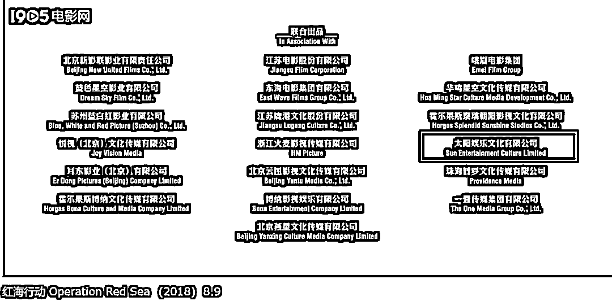
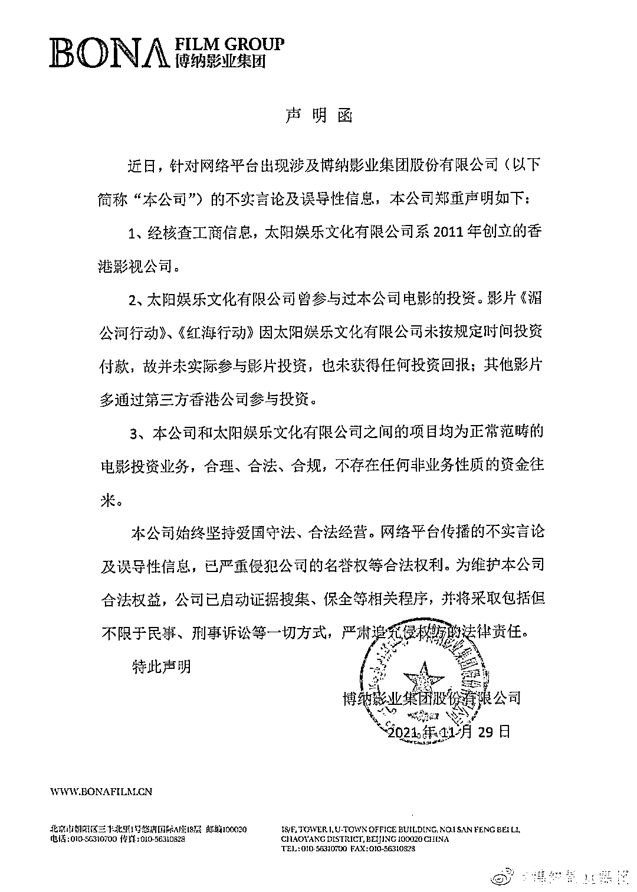

# 周焯华被指投资爱国电影洗钱，博纳影业回应

> 原文：[`mp.weixin.qq.com/s?__biz=MzIyMDYwMTk0Mw==&mid=2247525055&idx=4&sn=d766750e16c84b67ac75ec4dd25fa449&chksm=97cba987a0bc20910984bcc2190b5ecc26f4b2f8d613838c0d4e7c549baa830c3440b31b2a66&scene=27#wechat_redirect`](http://mp.weixin.qq.com/s?__biz=MzIyMDYwMTk0Mw==&mid=2247525055&idx=4&sn=d766750e16c84b67ac75ec4dd25fa449&chksm=97cba987a0bc20910984bcc2190b5ecc26f4b2f8d613838c0d4e7c549baa830c3440b31b2a66&scene=27#wechat_redirect)

“洗米华”周焯华近日因涉嫌在中国境内开设赌场，被批准逮捕。由于相关资料显示其曾参与联合出品《红海行动》《湄公河行动》等电影，引发公众生出“周焯华是否利用爱国电影洗钱”的质疑，并牵扯到电影的出品公司博纳影业。

29 日晚，@博纳影业 就此事发布声明，称**周焯华的太阳娱乐文化有限公司因未按时付款，并没有实际参与《红海行动》《湄公河行动》的投资，也没有获得任何投资回报。**

但至于在没有实际参投的情况下，为何电影和相关物料上仍然有太阳娱乐和周焯华的署名，这份声明并未做进一步解释，仅强调双方公司的合作业务均为正常范畴的电影投资业务，合理、合法、合规，不存在任何非业务性质的资金往来。

据港媒最新消息，周焯华等 5 名嫌犯已被依法采取羁押强制措施。经初步盘问后，各被捕人士均承认海外架设网上平台进行有关犯罪活动，即经营有关赌博活动网站及电话投注犯罪活动，但对其他调查拒绝合作。

人称澳门“小赌王”的周焯华，除此次案发的赌博业务外，也通过太阳城集团旗下太阳娱乐文化有限公司（后简称“太阳娱乐”）投资商业电影的方式涉足文娱产业。他还在 2015 年发起成立澳门影视制作文化协会并担任协会会长，连续 4 年与澳门特区政府旅游局合办“澳门国际影展暨颁奖典礼”，这也是澳门唯一的官方电影展活动。

据人民日报海外版 2020 年 1 月报道，周焯华以澳门影视制作文化协会会长的身份接受专访，介绍称他掌舵的澳门太阳城集团在过去的十几年中参与投资制作电影 65 部，集团还与内地电影制作单位紧密合作，曾联合出品《红海行动》《扫毒》《杀破狼》《湄公河行动》等电影。

太阳娱乐出品的代表作品中包括《湄公河行动》《红海行动》等 图自猫眼专业版

观察者网查询后发现，在**电影《湄公河行动》《红海行动》的影片片头和海报中，也的确都标注了周焯华和太阳娱乐分别是“联合出品人”和“联合出品公司”。**

****

截图自《湄公河行动》

《湄公河行动》宣传海报

截图自《红海行动》

由于《红海行动》《湄公河行动》等影片均为弘扬爱国主义的主旋律影片，因此周焯华涉跨境赌博事发后，不少网友质疑其利用投资爱国电影的方式洗钱，这还牵扯到了相关电影的出品方博纳影业集团。

不过 29 日晚，@博纳影业集团 却发布声明称太阳娱乐没有实际参投《红海行动》《湄公河行动》这两部影片。

这份声明表示，太阳娱乐的确曾参与过博纳影业出品电影的投资，但**在《红海行动》《湄公河行动》的项目上，太阳娱乐没有按规定时间投资付款，故并未实际参与影片投资，也未获得任何投资回报。**其他影片多通过第三方香港公司参与投资。

**对于在没有实际参投的情况下，为何电影和相关物料上仍然有太阳娱乐和周焯华的署名，这份声明并未做进一步解释，**仅强调双方公司的合作业务均为正常范畴的电影投资业务，合理、合法、合规，不存在任何非业务性质的资金往来。目前网络平台传播的不实言论及误导性信息，已严重侵犯其公司的名誉权等合法权利。

值得一提的是，其实早在去年 7 月太阳城集团负面信息爆发，与其有业务往来的博纳影业和明星经纪公司泰洋川禾就已经被牵扯进相关事件过。

当时周焯华曾专门拍视频回应，澄清称内地公安机关正在针对太阳城进行一项全国性的“反罪恶行动”的说法是谣言，太阳城资助香港“黑暴”分子的说法也是谣言，强调太阳城和自己“扎根澳门、心系祖国、守法经营”，从未派任何同事去内地从事过任何推广或进行任何博彩业务，也没有参与过任何地下资金转移的业务。

随后，@泰洋川禾 也发布声明称，公司始终坚持一个中国原则，反对一切分裂祖国的行径，也从未参与任何洗钱活动。@博纳影业集团  同时发布声明，表示已经启动证据保全措施，并保留追究法律责任的权利。

11 月 26 日，周焯华被捕后，@泰洋川禾 27 日又转发了去年 7 月的相关声明，强调公司和周焯华及太阳城集团无任何关系，对于一切诽谤侵权行为，依旧将依法追责到底。

但博纳影业这回的反应却晚了好几天，直到事发后 3 天才迟迟回应相关争议。

来源：观察者网

← 向右滑动与灰产圈互动交流 →

# 

> 原文：[`mp.weixin.qq.com/s?__biz=MzIyMDYwMTk0Mw==&mid=2247525055&idx=5&sn=1e2f817665f3d7e701c47bf7f8ffc68a&chksm=97cba987a0bc2091349978888ce8dde029301c221dba034ac61f379f72b96281c497c7b363d1&scene=27#wechat_redirect`](http://mp.weixin.qq.com/s?__biz=MzIyMDYwMTk0Mw==&mid=2247525055&idx=5&sn=1e2f817665f3d7e701c47bf7f8ffc68a&chksm=97cba987a0bc2091349978888ce8dde029301c221dba034ac61f379f72b96281c497c7b363d1&scene=27#wechat_redirect)