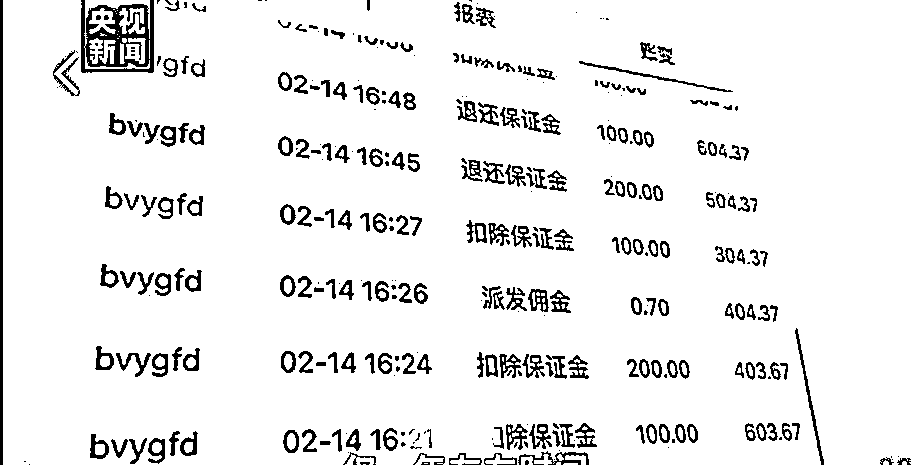
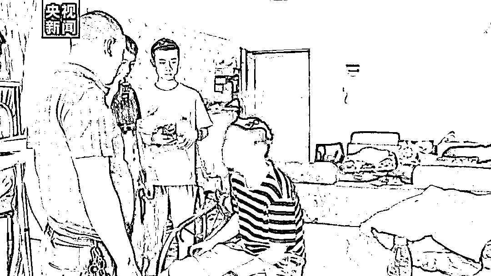
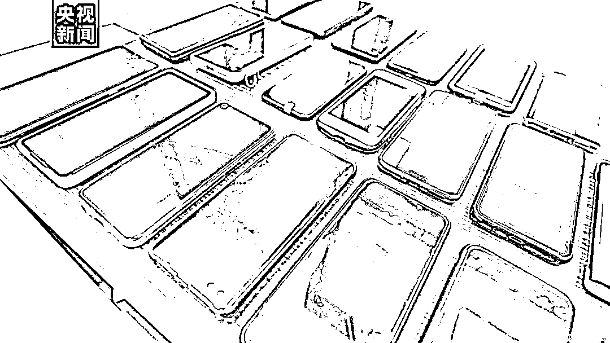
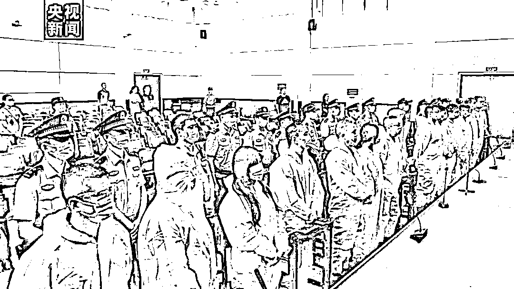

# 流水超 50 亿，抓捕 50 人……湖南破获“跑分”大案，17 人获刑！

> 原文：[`mp.weixin.qq.com/s?__biz=MzIyMDYwMTk0Mw==&mid=2247525055&idx=6&sn=99af593b21a23b787dcc93a3230c330c&chksm=97cba987a0bc2091b697694f729936f24c1e3454dbf67fbf0c98e4e4cf607fa4c329146752bb&scene=27#wechat_redirect`](http://mp.weixin.qq.com/s?__biz=MzIyMDYwMTk0Mw==&mid=2247525055&idx=6&sn=99af593b21a23b787dcc93a3230c330c&chksm=97cba987a0bc2091b697694f729936f24c1e3454dbf67fbf0c98e4e4cf607fa4c329146752bb&scene=27#wechat_redirect)

都知道“跑分”违法，

但还是有人心存侥幸铤而走险，

甚至声称自己只是最下游的用户，

要抓就应该抓“跑分”平台

背后的老板。

日前，

**流水超 50 亿元、抓捕 50 人、**

**17 人受审的**

湖南省第一起“跑分”平台案

宣判！

[`mp.weixin.qq.com/mp/readtemplate?t=pages/video_player_tmpl&action=mpvideo&auto=0&vid=wxv_2157219226313424901`](https://mp.weixin.qq.com/mp/readtemplate?t=pages/video_player_tmpl&action=mpvideo&auto=0&vid=wxv_2157219226313424901)

上传个人收款码，就能“人人赚”？

2020 年 2 月 19 日，湖南津市市公安局接到群众举报，称互联网上有一个名为“人人赚”的 APP 涉嫌参与“跑分”，这是一种为电信网络诈骗、赌博等犯罪活动搭建平台，使用微信、支付宝等支付途径将赃款分流洗白的犯罪行为。

软件通过发展码商（被高额佣金为诱饵吸引而来协助转移赃款，在“跑分”平台上注册会员上传收款二维码参与“跑分”的人被称为“码商”）**上传个人微信收款二维码、支付宝收款二维码、银行卡号等**，为博彩、电诈、色情网站等非法网站进行支付结算。

“跑分”平台界面

据了解，这种“跑分”平台不仅会**泄露公民个人身份信息**，风险巨大，还涉嫌**帮助信息网络犯罪活动罪、掩饰、隐瞒犯罪所得、犯罪所得收益罪**等，而且扰乱支付结算体系，影响金融市场的稳定，严重危害经济的健康发展，是国家严厉打击的行为之一。

平台背后隐藏完整黑灰产业链

通过侦查，公安部门发现，“人人赚”APP 的背后，暗藏着一条集源码开发、销售、维护、非法使用“跑分”平台为跨境赌博提供非法支付结算服务于一体的完整黑灰产业链条。他们不仅开发了**“人人赚”和“趣收米”两款 APP**用于国内发展码商及“跑分”，同时还开发了“通付”商户管理平台，用于管理黑灰产商户。

2020 年 3 月 15 日，津市市公安局“3.03”专案组集合 70 名办案民警分 19 个小组分别赶赴湖南长沙、辽宁大连、河南郑州、广西南宁等 10 余省市联合当地警方调查取证，**一举抓获涉案人员 19 名，后又陆续抓捕涉此案人员 31 名。**

据统计，该“跑分”平台吸引了遍布全国 30 个省区市的大量码商注册协助进行转账洗钱，控制个人、企业银行账户 400 余个，**接入商户超 900 家，博彩网站占比达 90%以上，**商户用于提现的银行账户超 2 万个，码商账号超 2.6 万个，上传的收款二维码与银行卡超 20 万个。

在**一年左右时间产生的交易流水多达 800 余万条，共计代黑灰产商户收款超 50 亿元。**

2020 年 5 月 21 日警方抓捕涉案人员

办案过程中警方共扣押手机 300 余台、银行卡 200 余张，打掉跑分窝点 14 个。

犯非法经营罪，17 人被判有期徒刑

庭审现场

2021 年 9 月 23 日，湖南津市市人民法院对该犯罪团伙（涉案共抓捕 50 人，其中 33 人相对不起诉）举行公开庭审。津市市人民法院以**犯非法经营罪****，判处主犯许某有期徒刑四年零六个月并处罚金，****另外 16 人**则依据情节轻重，**分别被判处拘役至有期徒刑十个月至四年不等。**

一审判决后，被告不服，提出上诉，11 月 10 日，经常德中级人民法院审核，决定驳回上诉，维持一审判决。

来源：央视新闻,红网

← 向右滑动与灰产圈互动交流 →

# 

> 原文：[`mp.weixin.qq.com/s?__biz=MzIyMDYwMTk0Mw==&mid=2247525055&idx=7&sn=73ccfffcce364b245d5f506ebbc63343&chksm=97cba987a0bc20919f14a6476545a4eaa3a9f5b4fd1e3cb87f334a9208ce334759208f60429c&scene=27#wechat_redirect`](http://mp.weixin.qq.com/s?__biz=MzIyMDYwMTk0Mw==&mid=2247525055&idx=7&sn=73ccfffcce364b245d5f506ebbc63343&chksm=97cba987a0bc20919f14a6476545a4eaa3a9f5b4fd1e3cb87f334a9208ce334759208f60429c&scene=27#wechat_redirect)