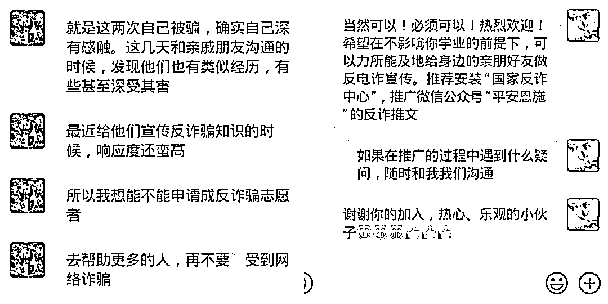
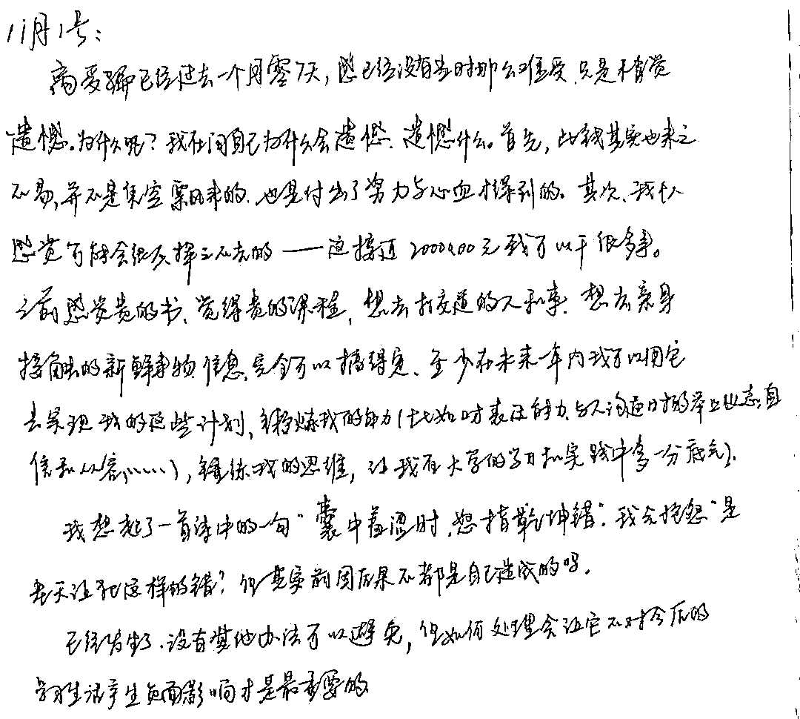
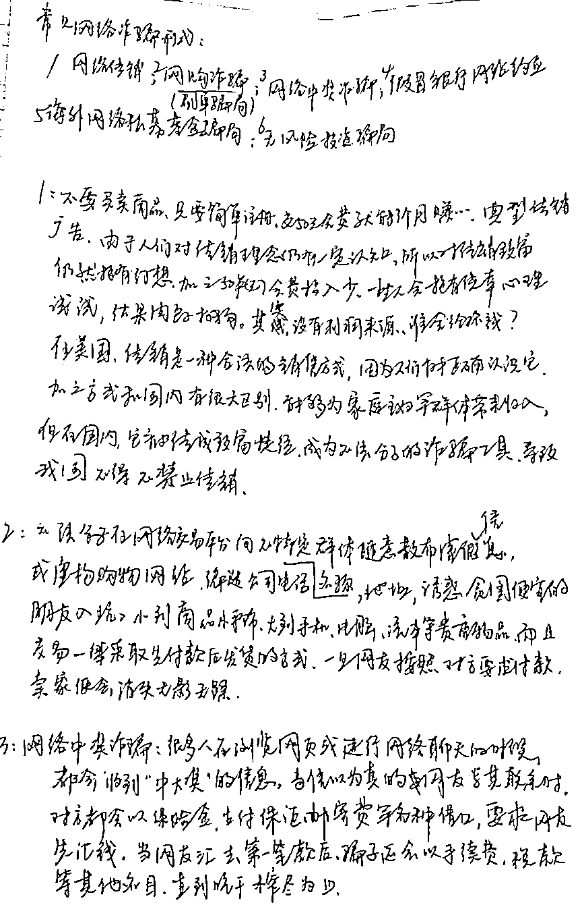
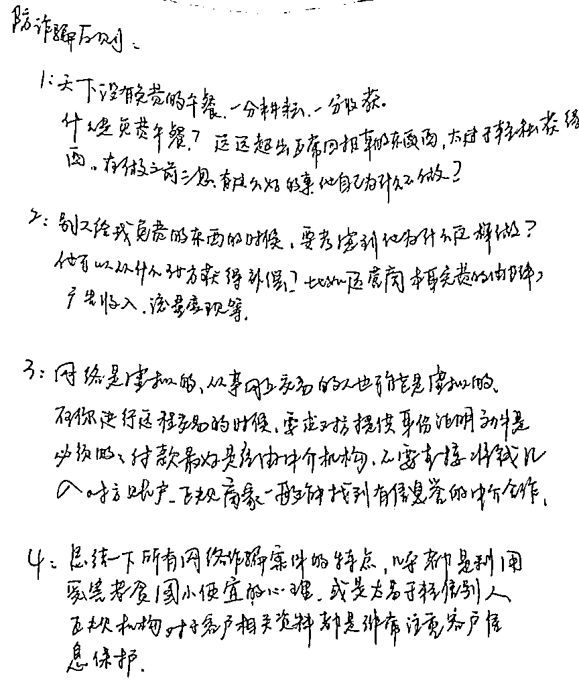

# 三天被骗两次后，211 大学生做了一个决定

> 原文：[`mp.weixin.qq.com/s?__biz=MzIyMDYwMTk0Mw==&mid=2247525105&idx=1&sn=17614071504a7f9a5c93ded2a4a8458c&chksm=97cba9c9a0bc20df52deb08b4643200d95090ab4e9850310200e135d5d2d072576f0e50770b8&scene=27#wechat_redirect`](http://mp.weixin.qq.com/s?__biz=MzIyMDYwMTk0Mw==&mid=2247525105&idx=1&sn=17614071504a7f9a5c93ded2a4a8458c&chksm=97cba9c9a0bc20df52deb08b4643200d95090ab4e9850310200e135d5d2d072576f0e50770b8&scene=27#wechat_redirect)

前段时间 

“平安恩施”发布了一条

某 211 大学在读大学生

小王同学自述三天内

连续 2 次被刷单返利类诈骗的推文

**（点击图片查看前文）**

被骗后，通过和反诈民警交流，小王同学了解到当前电信网络诈骗案高发、受骗者中不乏高级知识分子、绝大多数人不重视学习反诈知识等情况后，愈发觉得重视反诈、普及反诈知识的重要性和必要性。

于是他自发系统性地学习了防诈知识，并申请成为一名反诈义务宣传员，希望通过自己的努力呼吁身边人重视反诈，助力恩施州“全民反诈”工作。

（小王与民警的聊天）

**一个月过去了，来看看小王同学的反诈感悟**

被骗以后，我并没有过多的悲观，这并不是说这些钱对于我不重要，相反很重要，因为就目前而言，我可以拿它去做很多的事，但是，悲观没有任何作用，徒增烦恼而已。

在民警的指导下，我较为系统、深入的了解了防诈骗的知识，知道如何识别网络诈骗套路的窍门，我自己也做了一些功课。首先，了解了当下一些主流的网络诈骗的类型，借助的工具，实施诈骗方式，背后组织的架构，同时也分析了网络诈骗案件高发的原因，大致明白了公安机关在这一类型案件中的工作内容，理解了破案的难度和人民卫士的艰辛。

**因此，我认为反诈骗绝对不仅仅是国家机关和相关工作人员的事，被保护的我们必须充当好自己的角色，不能有旁观者的心态，更不能成为鲁迅笔下的“看客”，尤其是接受了或正在接受现代化教育的青少年，因为我们是社会日新月异的见证者，也是社会进步承上启下的践行人，理应要有强烈的同理心和责任感。**

（小王的来信）

于是我就从身边先尝试，鼓起勇气和自己的家人、亲戚朋友、同学老师同事讲述我的经历。开始复杂的心理斗争让我开不了口，毕竟不是光彩事，相信有过这样经历的，如和传销打过交道的朋友，应该熟知其中难以启齿的酸楚。然而，并没有人嘲笑我，收获的更多的是安慰和宽心。

有一次和隔壁学校老乡坐火车回家的时候谈到了这个事，讲到了这件事的前因后果，也听她讲了类似的案例，然后意想不到的是，旁边的乘客也被带入了进来。

从他们的口中，我感受到了和我一样作为亲历者的无奈、自责。像这样的讲述，有过很多次，每每分享完，我都会表明我的目的，有过这样经历的人欣然接受，甚至一起看了我当时保留的证据，当然也有很多人相信自己不会被骗，因为他们就觉得自己在社会上打拼这么多年，社会经验丰富，只有自己套路别人的分，不会上别人的当。

这也在我的意料之中，于是我提了一些问题。**比如，移动支付转账的时候会不会确认收款方，大多数人说没有，又比如什么是杀猪盘，有没有做过网络贷款，平台是不是正规，网络诈骗中骗子用得最多的身份、工具是什么，利用的什么心理……**

（小王自己总结的常见电信网络诈骗类型）

**做这件事直到现在，印象中是没有一个人能比较完整的回答完 3 个问题，其中不乏高收入的亲朋，也不乏深造于一流高校的同学，更有就职于政企单位长辈。** 

**而且我还发现，越是收入高、学历高的人，其实隐藏的风险更大。**

原因我认为有这么几点：**第一，越是收入高人群，从事的工作，需要接触更多的人，社交的圈子越大，他们的职业本身就是诈骗分子的首选目标，比如搞个人投资的、自由职业人、继续贷款进行资金周转的人；第二，对于风险的理性认知，降低了他们对于风险的敏感度，他们比什么都明白高风险高收益这个道理，甚至风险对于他们有莫大的吸引力，进了套就很难醒悟。**

通过这些案例我得出一个结论：**网络诈骗之所以高发，反诈骗工作之所以如此难以推进关键点不在于互联网这把双刃剑，而在于我们自己。**我相信都听说过一句话“只有经历过，才会明白”。这句话对，也不对，严格从逻辑上讲，是错的，假若所有的世间万物都要自己去验证，那些正确的经验和智慧又有何意义，用到防网络诈骗上就是：**高筑警戒线，切莫让自己被骗以后再醒悟。**

（小王自己总结的防诈原则）

当下，我们完全可通过自学，再以**平安恩施为例的公众号、视频知识共享平台、法治频道、国家反诈中心等渠道来提升自己防范网络诈骗的能力，甚至可以直接咨询公安机关**，同时不仅自己要看要学，还要将自己学到的及时分享给自己能影响到的人。

比如我在民警的建议下，和自己的家人朋友进行演练，我扮演诈骗者，让他们去分辨我是真是假,演完以后问他们我采用的是什么方式，抓住了哪个关键点能让诈骗成功实施等等。

**总之，反诈骗道路道阻且长，需要每一位公民参与，深入其中，受益其中，切勿当看客！**

注 意

**遇到下列情况，基本都是诈骗，如有疑问，请第一时间拨打反诈专线 96110 核实。**

1、声称网上刷单做任务、点赞可赚钱，需要垫付资金的。

2、网上办信用卡、贷款，让你先交保证金、解冻费、刷流水的。

3、网友自称有高回报高收益项目，带你投资理财的。

4、在微信、QQ 等社交工具上自称老板、领导要你转账汇款的。

5、自称客服，告知你网购有质量问题或包裹丢失，要为你退款理赔的。

6、自称公检法要你自证清白、要求你提供金融信息或转账到所谓“安全账户”的。

7、自称可以消除不良征信、校园贷款记录的。

8、通知中奖、领取补贴要你先交钱的。

9、购买网络游戏装备要求私下交易的。

10、陌生人向你索要银行卡信息、短信验证码、要求你开启“屏幕共享”功能的。

现阶段，反电诈治理工作是世界性难题，防范是最有效的应对办法。在此，我们呼吁大家，务必重视反诈、学习反诈，**关注微信公众号“平安恩施”的反诈专栏**，为手机**下载安装国家反诈中心 APP**，守好自己的钱袋子。

**特别是青年朋友们，我们诚挚地邀请你们成为反诈志愿者，提醒长辈和身边朋友防诈，全民反诈，共建“无诈恩施”。**

来源：平安恩施，阻击诈骗

← 向右滑动与灰产圈互动交流 →

