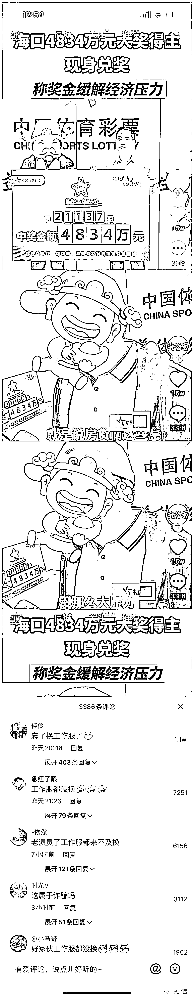

# 4834 万大奖得主穿中国体彩标志衣服被质疑，官方：为保护隐私

> 原文：[`mp.weixin.qq.com/s?__biz=MzIyMDYwMTk0Mw==&mid=2247525105&idx=2&sn=d8d8578e33354f9b665db9a01f1144af&chksm=97cba9c9a0bc20df80d7c949deb6da0d2adb49d4188e7676e57ae9e96ca114832483935894f8&scene=27#wechat_redirect`](http://mp.weixin.qq.com/s?__biz=MzIyMDYwMTk0Mw==&mid=2247525105&idx=2&sn=d8d8578e33354f9b665db9a01f1144af&chksm=97cba9c9a0bc20df80d7c949deb6da0d2adb49d4188e7676e57ae9e96ca114832483935894f8&scene=27#wechat_redirect)

工作人员解释称，11 月 30 日上午，王先生在兑换奖金时提出要更换衣服，“我们有一些做品牌宣传的衣服，在他提出要求后，考虑到他个人信息的安全，我们便找了一些给他换上了。”

11 月 29 日，体彩大乐透第 21137 期开奖号码为“02、07、13、14、19 + 04、05”。中得该期 3 注追加一等奖的海口中奖人王先生已于 11 月 30 日上午现身海南省体彩中心兑奖。据悉，其获奖金额高达 4834 万。

然而在媒体发出相关报道后，有部分网友发现，视频里兑奖的王先生身穿带有中国体育彩票标志的衣服，一些网友在视频下质疑中奖得主为体彩内部工作人员。

▲网友质疑海口 4834 万元的兑奖者系体彩内部工作人员。网页截图

12 月 1 日 17 时许，海南省体育彩票管理中心客服工作人员向新京报记者否认了上述说法。他表示，网友质疑的这些情况是不存在的，“为了保护领奖人的隐私，我们给他提供了两件（印有标识的）衣服——白色短袖和外面的黑色外套。”

此外，上述工作人员表示，他们还准备了印有品牌标识的口罩，但领奖当天王先生没有佩戴。工作人员解释称，在兑奖者领奖时，为了保护每位兑奖者的隐私，“我们会提供帽子、衣服、口罩等隐私保护装备，看兑奖者是否需要，不会强制要求他们穿戴。”

上述工作人员称，他们会提前询问兑奖者的意愿。“有些兑奖者是希望露脸的，有些则希望有全面保护，我们会尊重他们的意愿。王先生希望自己能够被保护起来，所以我们给他提供了短袖、外套和帽子，此外还在媒体报道中对他的脸部进行了遮盖。”

海南省体育彩票管理中心开发部一名工作人员也向新京报记者证实了上述说法。他表示，11 月 30 日上午，王先生在兑换奖金时提出要更换衣服，“我们有一些做品牌宣传的衣服，在他提出要求后，考虑到他个人信息的安全，我们便找了一些给他换上了。”

[`v.qq.com/iframe/preview.html?width=500&height=375&auto=0&vid=b3311vsqbct`](https://v.qq.com/iframe/preview.html?width=500&height=375&auto=0&vid=b3311vsqbct)

上述工作人员表示，针对网友提出的质疑，他们已经知悉，目前正在处理。

**延伸阅读：**

**[539 万元的中奖消息提前两天发出？网友：冠军被内定？广西福彩：系误操作](http://mp.weixin.qq.com/s?__biz=MzIyMDYwMTk0Mw==&mid=2247521589&idx=2&sn=2853e5c4f83bd3c774e1448dfee72aea&chksm=97cb5e0da0bcd71b8b7a4b1b27c26d5a8b491512a162e71a6b2fffbcd8e6105c0e298efbebf1&scene=21#wechat_redirect)**

来源：新京报

← 向右滑动与灰产圈互动交流 →

