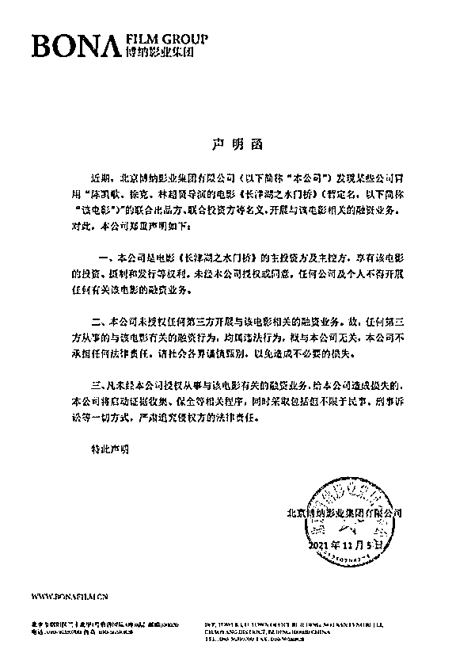
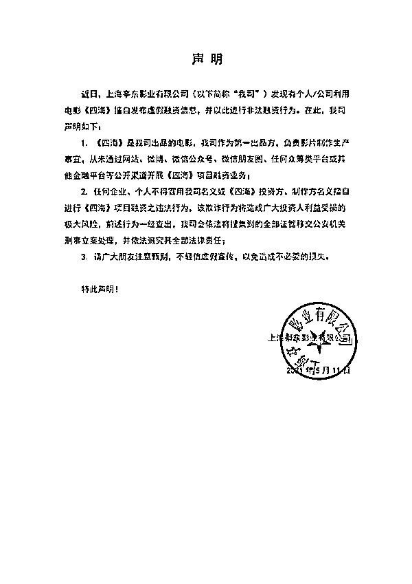
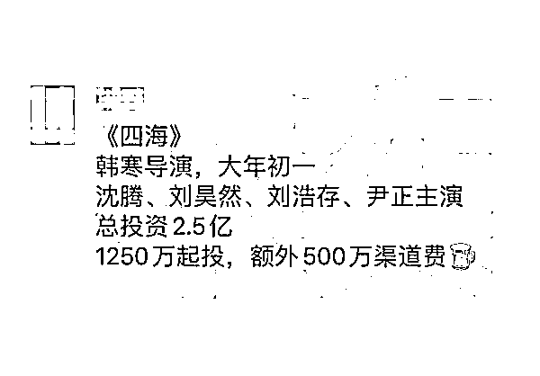

# 投资《长津湖水门桥》可获 300％的回报？骗局！

> 原文：[`mp.weixin.qq.com/s?__biz=MzIyMDYwMTk0Mw==&mid=2247525105&idx=3&sn=e756a71aa49a91d639a7fd630bfa3d82&chksm=97cba9c9a0bc20df37442badc6cea18207dd446b1b70e9f3842108c5ae3682dad6a973d66d84&scene=27#wechat_redirect`](http://mp.weixin.qq.com/s?__biz=MzIyMDYwMTk0Mw==&mid=2247525105&idx=3&sn=e756a71aa49a91d639a7fd630bfa3d82&chksm=97cba9c9a0bc20df37442badc6cea18207dd446b1b70e9f3842108c5ae3682dad6a973d66d84&scene=27#wechat_redirect)

《长津湖》荣登中国电影票房榜榜首，也让该片续集《长津湖之水门桥》备受期待。近日，多位电影业内人士向极目新闻记者爆料，称网上出现大量售卖《长津湖之水门桥》投资份额的信息，甚至承诺高达 300%的投资回报。

极目新闻记者就此向《长津湖》及《长津湖之水门桥》的主投资方博纳影业求证，对方郑重声明：“从未授权！”

6 万块钱当爆款投资人？

这几天，一则名为“不要投钱！电影投资诈骗最新套路”的短视频在电影圈内引发关注。该视频创作者讲述了他在社交平台结识了一位新朋友，对方自称得到了《水门桥》投资方的授权，引导他购买《水门桥》投资份额的全过程。

视频最后，这位创作者通过电影投资界人士确认这项投资存在巨大风险，并感慨如果不是自己尚有一些电影圈人脉，很可能就被这位新朋友的蛊惑带进“坑”里了。

这则视频走红后，一位参与了电影《长津湖之水门桥》投资的人士告诉极目新闻记者，“现在全国有一万多专业骗子在卖《水门桥》的份额！”

记者随后在网上搜索“投资《水门桥》”，出现了大量“急售《水门桥》投资份额”的信息，这些信息大多以《长津湖》票房超过 57 亿为背景，极力渲染《水门桥》投资机会的珍贵，并呼吁投资者下手要快，不要错过这个千载难逢的投资良机。

记者随机添加了一位林姓销售人员的联系方式，对方自称代表上海某影视公司，很快就给记者发来了合作细节。据其介绍，该公司手里握有少量《水门桥》的投资份额，6 万元起投，“你先给我打款，确认到账后，我们财务会把投资合同寄给你。等到电影下档，差不多 6 个月之后，最多不超越 9 个月就和你结算。”

这位销售人员表示，由于《长津湖》卖了 57 亿，《水门桥》的票房也不会太差，“我们的回报率差不多可以对标《长津湖》，就算《水门桥》最后卖不了 57 亿，也能保证你有 3 倍收益，比如你投了 6 万，最后至少可以拿回 18 万。” 

记者随后又联系了另外一家销售公司，销售代表张先生表示，他们是代表广州某影视公司出售《水门桥》的投资份额，同样是 6 万元起投。当记者提到能否与《水门桥》的主投资公司博纳影业签合同时，对方表示，“如果你能购买 2000 万元的份额的话，提前准备好资产证明，我就可以安排你去北京和博纳影业签。”

2000 万也买不了入场券

公开信息显示，《长津湖》及《长津湖之水门桥》的主投资方和主控方为北京博纳影业集团有限公司。极目新闻记者将从以上几家销售公司汇总的信息转述给博纳影业相关人士，对方斩钉截铁地表示，这些销售行为没有得到任何官方授权，请各位投资人一定要谨防骗局，以免造成不必要的损失。而对于“购买 2000 万就能到北京和博纳签合同”的说法，该人士更是表示“绝对不可能”。

博纳影业同时向记者出具了一份声明函，声明明确表示，博纳影业享有《长津湖之水门桥》的投资、摄制和发行等权利，“未经本公司授权或同意，任何公司及个人不得开展任何有关该电影的融资业务。”

该声明强调，博纳影业从未授权任何第三方开展与《长津湖之水门桥》相关的融资业务，所以任何第三方从事的与该电影有关的融资行为均属于违法行为。

江苏法德东恒律师事务所合伙人、南京市律师协会法律风险防控委员会委员蓝天彬律师接触过多起与电影融资相关的案例。他告诉极目新闻记者，尽管记者收到的销售合同貌似正规，但从《长津湖之水门桥》主投资方博纳影业发布的声明内容来看，这些民间销售行为很可能涉嫌非法集资或诈骗，而从投资常识来看，“任何投资都是有风险的，没有哪个正规的投资公司会跟你保证有 3 倍回报。”

据蓝律师介绍，这几年多部影片都出现过类似的份额投资风波，导致不少普通投资者血本无归。而今年上半年，韩寒执导的电影《四海》也发布过一个类似声明，“韩寒的公司是《四海》的第一出品方，但他们发现有很多人冒用《四海》投资方的名义，通过网站、微博、微信或者金融平台针对《四海》的电影项目进行非法融资业务，所以赶紧发了一个声明，提醒普通投资人不要轻信虚假宣传。”

天上掉馅饼，可能是陷阱

和电影圈毫无交集的普通人，有没有可能参与投资《长津湖》《长津湖之水门桥》这样的“头部大片”？

一位在影视投资领域深耕多年的业内人士果断地告诉极目新闻记者，可能性基本为零，“如果真有人把这么好的投资机会送到你面前，那我再送你一句话：天上掉馅饼，不是圈套就是陷阱。”

据这位业内人士介绍，中国电影市场每年的“头部”作品就那么几部，投资机会也都集中在几大影视巨鳄手里，有时候还要给明星、大腕预留一部分投资份额，作为吸引人家加盟演出的条件，“你说，大佬们都抢不过来的投资机会，怎么可能轮得到你一个圈外人？说句更难听的，人家怎么可能就差你这几万块钱……而且这些销售人员也说了，等到电影下档后，你可能还要再等大半年才能拿到回报。你想一想，到了那个时候，这个销售公司还会在吗？”

当然，普通老百姓也不是绝对不可能当影视投资人。据上述业内人士介绍，不排除一些中小成本电影确实会开放投资渠道，从民间寻找投资人。但从历年国产电影票房表现来看，针对此类电影的投资风险极大，“如果你手里有一点闲钱，就是想花钱买一个投资人的头衔，那你就放平心态，就当把钱砸到水里听个响儿过个瘾。反正我们圈里的人都觉得，你有这个精力，还不如干点其他的实在事。”

来源：极目新闻，互联网行业前沿资讯

← 向右滑动与灰产圈互动交流 →

