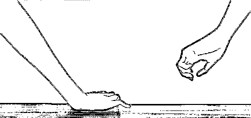

# 杀害女友后潜逃 15 年，被抓时已结婚生子资产千万，前天已被执行死刑！

> 原文：[`mp.weixin.qq.com/s?__biz=MzIyMDYwMTk0Mw==&mid=2247525105&idx=4&sn=6cb6b9d482e8bcc44df16c12dfbd298a&chksm=97cba9c9a0bc20df5c748152cf11c641dfe2500391191659e5e9ec05d648edf56ee340927c9c&scene=27#wechat_redirect`](http://mp.weixin.qq.com/s?__biz=MzIyMDYwMTk0Mw==&mid=2247525105&idx=4&sn=6cb6b9d482e8bcc44df16c12dfbd298a&chksm=97cba9c9a0bc20df5c748152cf11c641dfe2500391191659e5e9ec05d648edf56ee340927c9c&scene=27#wechat_redirect)

**近日各校友微信群被一张西安中院的布告引爆：**2002 年 10 月 7 日晚，西北政法学院雁塔校区一车内，一男一女，因情殇，男子杀了女子，后嫌疑人孙继龙犯案后逃逸，并漂白身份，2017 年 8 月 30 日在深圳被抓。**2021 年 11 月 25 日，西安中院遵照最高院的执行死刑命令，将罪犯孙继龙验明正身，押赴刑场，执行死刑。**

****//****

********

******案 情 回 顾******

****故意杀人犯孙继龙，曾用名孙小建，化名杨依晴，男，44 岁，1977 年 4 月 29 日出生于江苏省邳州市，汉族，大学文化，户籍地邳州市合沟乡(现江苏省新沂市合沟镇)吴家村，租住西安市雁塔区明德门南新区 2 号楼 1 单元 5 楼 1 号。系网吧经理。****

****罪犯孙继龙于 1996 年在江苏省邳州市与他人同居生子，同年前往西安上大学，2000 年毕业后在西安市“**口力米大**”网吧工作。2001 年，孙继龙与西北政法学院学生杨某(殁年 22 岁)恋爱。2002 年 8 月杨某提出分手，孙继龙予以纠缠。同年 10 月 7 日下午，孙继龙驾驶租赁的陕 AC7586 号富康牌轿车,携带当天购买的尖刀到西北政法学院雁塔校区借故接上杨某。其间，孙继龙试图与杨某复合未果。20 时许，孙继龙驾车停在学院操场旁，二人在车内因分手问题发生争执，孙继龙遂持刀捅刺杨某胸部，致杨某心、肺破裂、失血性休克死亡。孙继龙驾车将杨某尸体载至其租住的西安市雁塔区明德小区弃车逃离。**孙继龙潜逃期间化名杨依晴，2017 年 8 月 30 日在广东省深圳市被抓获。******

********罪犯孙继龙进行故意杀人犯罪活动，罪行极其严重，社会危害性极大。西安中院依照《中华人民共和国刑法》有关条款，以****故意杀人罪****判处该罪犯死刑，剥夺政治权利终身。罪犯不服，提出上诉，经陕西省高级人民法院裁定，驳回上诉:维持原判，并依法上报最高人民法院复核。最高人民法院核准判处上列罪犯死刑。西安中院遵照最高人民法院院长签发的执行死刑命令，****已于 2021 年 11 月 25 日将罪犯孙继龙验明正身，押赴刑场，执行死刑。********

********以下是来自微信公众号“平安雁塔”2017 年 9 月 6 日的报道：《这个杀手有点冷！杀害女友后潜逃 15 年 男子被抓时已结婚生子资产千万……》：********

****** 引 子：   ****** 

****18 岁时，对包办婚姻不满意****

****他抛弃妻子，从江苏逃至西安；****

****25 岁时，在西安与朋友合开网吧****

****他杀死交往一年多的女友；****

****40 岁时****

****历经漂泊且已洗白身份的他成为千万富翁****

****却仍难逃法网****

****被西安雁塔警方在深圳抓获****

******在校大学女生被杀 嫌疑人为其男友******

****孙某龙是江苏邳州人****

****18 岁时被父母包办婚姻并有了孩子****

****之后****

****对妻子甚为不满的他选择了逃离****

****在西安一个再教育项目完成学业后****

****孙某龙与朋友合伙开起了网吧****

****在此期间****

****孙某龙认识了来上网的在校大学女生杨某****

****两人关系逐渐亲密**** 

****成了男女朋友****

********

****2002 年 10 月 7 日晚上****

****西安城南一大学操场边的轿车内****

****一对年轻男女发生了激烈争吵****

****男子将女孩残忍杀害****

****接着****

****男子驾车将女孩的尸体拉至一小区后弃车而逃****

****第二天****

****小区保安发现了可疑车辆及车内的女孩****

****见女孩毫无反应即报警求助****

****公安雁塔分局民警在现场确认女孩已死亡****

****经过大量的排查****

****雁塔警方确认女孩正是在校大学生杨某****

****此时她刚 23 岁****

****而嫌疑人则被确认为孙某龙****

****这一年他 25 岁****

********

****▲ 当年案发地****

******15 年逃亡 嫌疑人成了千万富翁******

****杀害女友杨某后****

****孙某龙直接跑到西安火车站****

****选最近一列离开西安的火车逃至成都****

****一周后****

****孙某龙给生意伙伴写了一封信****

****诉说了自己杀害杨某的事实经过****

****称自己对不起杨某、对不起家人朋友****

****更重点指出****

****案发当晚的轿车是用舍友身份信息租的****

****但事情与舍友没有任何关系****

****说等料理完一些事情后****

****他要么去投案自首****

****要么就永远消失****

****然而这一等就是 15 年****

****经朋友介绍**** 

****孙某龙从成都前往青岛****

****在一个电脑城里打工****

****一个偶然的机会****

****他在云南红河州为自己漂白了身份****

****正式化身为“杨某晴”****

********

****有了新身份后****

****孙某龙扩大了社会活动****

****但他依然不敢去找正式工作****

****只好自己创业****

****在之后的几年里****

****他在北京、上海、深圳等地来回跑****

****既为了生意也为了逃避警方追捕****

****2012 年****

****孙某龙把主要精力放在了深圳****

****与人合做电子产品生意并越做越大****

****成为了一个科技公司的老板****

****资产过千万****

******15 年后的抓捕 民警碰见嫌疑人******

****案发后****

****雁塔警方多次实施抓捕****

****但由于孙某龙警惕性非常高****

****抓捕行动都没有成功****

****今年 8 月****

****西安雁塔警方成功比对出****

****“杨某晴”就是犯罪嫌疑人孙某龙****

****并基本确定了他的落脚地****

****公安雁塔分局局长唐建平、副局长梁伟****

****立即指示专案组民警展开抓捕行动****

********

****8 月 29 日 11 时许****

****抓捕小组抵达深圳后立即展开工作****

****8 月 30 日 14 时许****

****深圳市南山软件科技园一便利店门口****

****抓捕民警意外遇见孙某龙****

****民警叫了他现在的名字“杨某晴”****

****以为是熟人的他还笑着和民警握手****

****等民警再喊出“孙某龙”的名字时****

****他彻底僵住了****

****意识到是“老熟人”来了****

******15 年后的抓捕 民警碰见嫌疑人******

****被雁塔警方抓获后**** 

****孙某龙交代了自己当年杀人的动机****

****当时女友杨某提出分手****

****而孙某龙则死活不同意****

****并怀疑杨某有了其他人****

****见女友去意已决****

****失去理智的孙某龙就动了杀心****

****孙某龙说****

****在青岛他结识了现在的妻子****

****二人后来有了两个孩子****

****大的已经 7 岁小的 3 岁****

********

****孙某龙自认当时爱情观太狭隘、太冲动****

****并希望现在的年轻人引以为戒****

****千万不要因感情而冲动****

****作出不理智的行为****

****孙某龙还曾告诉民警：****

****逃亡的 15 年里****

****他从未和家里人联系过****

****母亲早已认为他已不在人世****

********

****如今****

****已踏入不惑之年的孙某龙****

****开始为他当年的恶行付出代价****

****希望年轻男女能如他希望的那样****

****以他的经历作为反面典型****

****在面对问题时****

****多一点从容与理智****

****少一点冲动与戾气****

******落幕：******

********2021 年 11 月 25 日，西安中院遵照最高院的执行死刑命令，将罪犯孙继龙验明正身，押赴刑场，执行死刑。********

********来源：青春都在西北政法，巴蜀反诈********

****************

********← 向右滑动与灰产圈互动交流 →********

****************