# “微商教父”龚文祥自称被罚“破产”，网友质疑：割韭菜的套路

> 原文：[`mp.weixin.qq.com/s?__biz=MzIyMDYwMTk0Mw==&mid=2247525155&idx=2&sn=222fec54a95d4cc1e0d4edfd5da8e4ff&chksm=97cba81ba0bc210d8d6bade25fccd0ac0d560fb2bf94f63f005574d4a341d3439d09caad8b91&scene=27#wechat_redirect`](http://mp.weixin.qq.com/s?__biz=MzIyMDYwMTk0Mw==&mid=2247525155&idx=2&sn=222fec54a95d4cc1e0d4edfd5da8e4ff&chksm=97cba81ba0bc210d8d6bade25fccd0ac0d560fb2bf94f63f005574d4a341d3439d09caad8b91&scene=27#wechat_redirect)

**自称为“微商教父”的龚文祥，估计真的要退出江湖了。**

12 月 2 日，红星资本局注意到，在社交网络上，一张龚文祥“致全体触电会老会员最后一封信”的微信消息截图显示，龚文祥社群内部称，将解散社群“触电会”，而退出微商行业的原因是被查税。

截图还显示，龚文祥自称公司已经破产，高额处罚个人已经到了负债累累的地步。

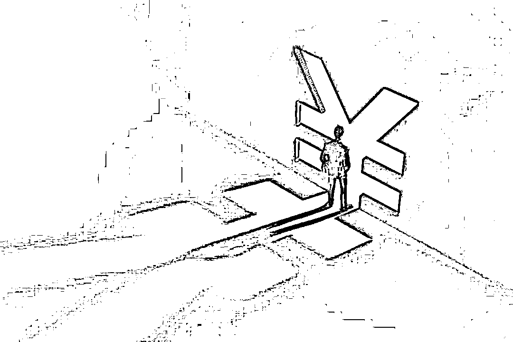

**“微商教父”龚文祥自称被罚破产**

**网友质疑：卖惨、割韭菜**

龚文祥作为深圳触电电子商务创始人、社群触电会创始人，不少年轻人对其已十分陌生。但在十年前，电商行业“南有龚文祥，北有李成东，中有鲁振旺”的说法广为流传，三个人被称为“电商三杰”。

除了“电商三杰”，这三人还有一个称呼——三大骗子。

但龚文祥对自己的有不一样的定位，他的微博信息中写着“我的标签：1，中国社群之父。2，中国微商教父。”

日前，一张龚文祥“致全体触电会老会员最后一封信”的微信消息截图在社交网络广为流传。在信中，龚文祥称：“我作为微商的代表性人物，收到了工商税务公安法院等专案组的联合查处，公司已经破产，高额处罚个人已经到了负债累累，卖房卖车，倾家荡产，身无分文的灭顶之灾地步。”

因此，他创立 8 年的个人微商社群触电会到了“寿终正寝”的时候。

公开信中还强调：“付费加入新社群一定要打公账，无论你过去 4 年还是现在只要是微信收款的，被大数据检测到未来一定是按照你微信收款总额 45%补交个人所得税。”

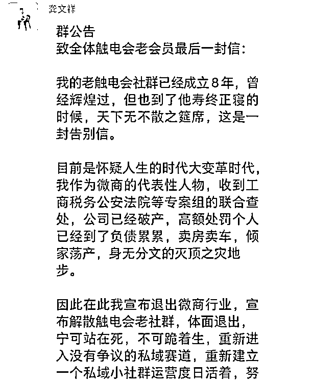

龚文祥在信中不无感慨地表示：“十年一觉扬州梦，前几周我还在人生顶峰，还在一个千人论坛指点江山，一夜之间所有资产被收走。”

近期，各地税务部门针对互联网新业态的查税行动有加强监管的趋势。日前，杭州市税务局稽查局对网红雪梨（朱宸慧）、林珊珊两名网络主播涉嫌偷逃税款问题进行查处，对雪梨追缴税款、加收滞纳金并拟处 1 倍罚款共计 6555.31 万元，对林珊珊追缴税款、加收滞纳金并拟处 1 倍罚款共计 2767.25 万元。

然而龚文祥破产的信息传出后，不少网友认为他只是在“卖惨”“割韭菜”，质疑其破产的真实性，认为这只不过是龚文祥“演得一出戏”。甚至直言“此人的话能信，母猪都能上树”“微商大多收智商税割韭菜赚钱，这些人不下地狱谁下地狱”。

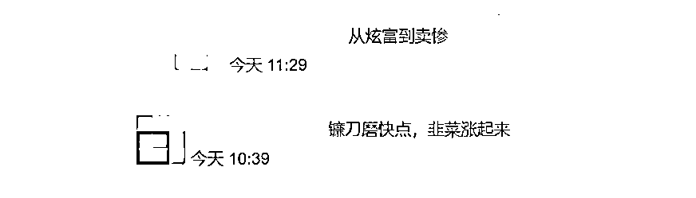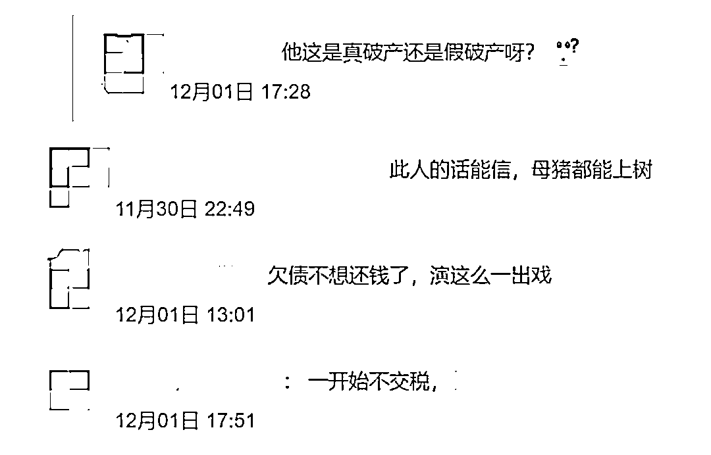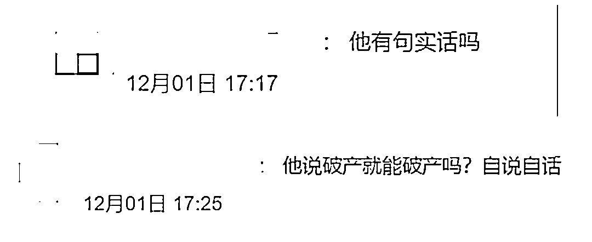

**曾因“炫富”出圈**

**龚文祥真的破产了吗？**

网友的质疑并非毫无根据，红星资本局查询后发现，**目前龚文祥担任法定代表人或股东的企业共有 5 家，只有深圳市南山区品牌先生策划工作室在 2018 年 10 月因决议解散而注销，其余 4 家均处于存续、开业状态，未显示有破产清算信息。**

仍存续的 4 家企业注册资本均较低，最高不超过 10 万元，且公示了 2020 年企业年报的深圳触电电子商务有限公司与吉安市井开区触电会商务服务有限公司，社保缴纳人数均为 0 人。

另一方面，龚文祥的对外形象一直是“财大气粗”。目前，龚文祥微博只能查看 2021 年的消息，但据中国基金报报道，龚文祥曾多次发微博炫富，称自己“买房如买菜”“在深圳一天买一套豪宅，每个月零花钱 600 万，每年发微信红包 300 万”。

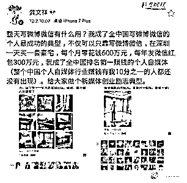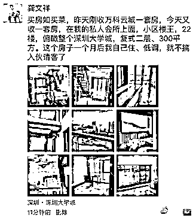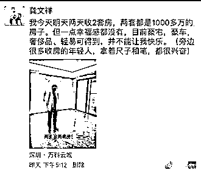

龚文祥本人也在公众号中称，自己“每年撒 300 万以上现金红包，成为全中国微信发红包最多的人，被称为红包一哥 。”

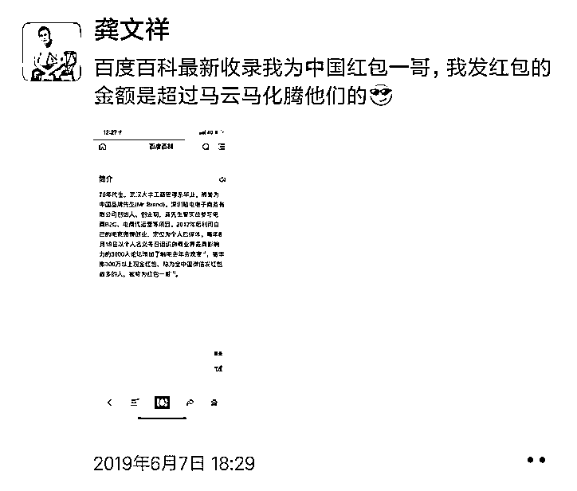

此外，龚文祥早在 2020 年 8 月就曾表示自己要“退出江湖”，原因居然是是“钱赚够了”。

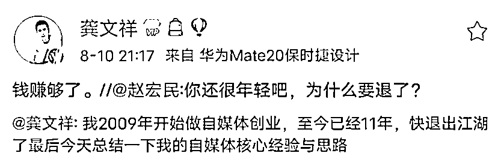

**破产是假，引流是真？**

**曾多次发文表示即将转型**

还有网友认为，龚文祥自称破产，只是为了营销炒作。

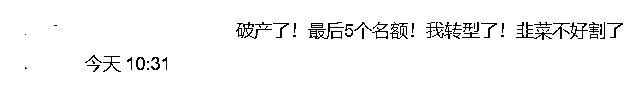

在公开信中，龚文祥除了表示要退出微商行业，还称将利用自己现有的资源运营私域小社群，愿意支持自己的可付费加入。

这样的赚钱套路对于龚文祥来说并不新鲜，早在 2009 年，龚文祥从代运营转型电商自媒体，积累粉丝，再通过粉丝效应，在朋友圈、微信群推荐各种电商。

他曾在微信公众号上发文回顾自己的创业史：“2011 年，我宣布自己为电商自媒体第一人。那个时候，我的自媒体影响力有了，阿里、京东、唯品会等中国前十电商平台，都成为我的客户，每个月付几十万。”2014 年，龚文祥宣布成立微商社群触电会。他在公众号中称：“全国 90%以上的微商老板都追随我，加入了我的触电会。最巅峰的时候，我以一己之力，举办了 3000 人的龚文祥个人论坛。”

2021 年 10 月 10 日，龚文祥在他的第八届个人论坛上说：“连我都很难赚到钱了，可见行业的萧条。”“我忽悠了 12 年，割了 12 年韭菜，现在也割不下去了。只能被迫转型。以后我再也不割韭菜了。”

之后，龚文祥就多次在微信公众号发文称，“自己将退出微商领域，退出视频号领域，不再发红包，删除所有花花草草，不再炫富，重回个体户运营，彻底转型私域新赛道。**”并在文末附上了 CEO 的微信二维码，称“欢迎大家加入我的新私域社群，新私域社群年费：原价 2 万，招新期 1 万。”**

不难看出龚文祥的年费收取很可能存在的税务漏洞，如果年费均通过个人微信转账收取，很难进行税务追踪。

事实上，他也提到了雪梨逃税被罚一案：“我了解到的信息是，有关部门已经掌握了上百万个带货主播的收入数据，并按照这个名单下派到各地机构。明年国家税务就是要查淘宝电商，直指交税。我也已经受到波及，细节就不再说了，我提醒大家，网红主播雪梨等被查，这仅仅只是一个开始，互联网人做好心理准备。”

← 向右滑动与灰产圈互动交流 →

