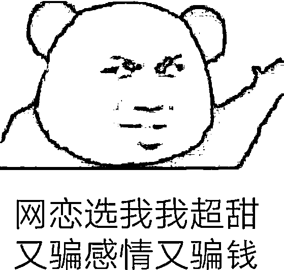
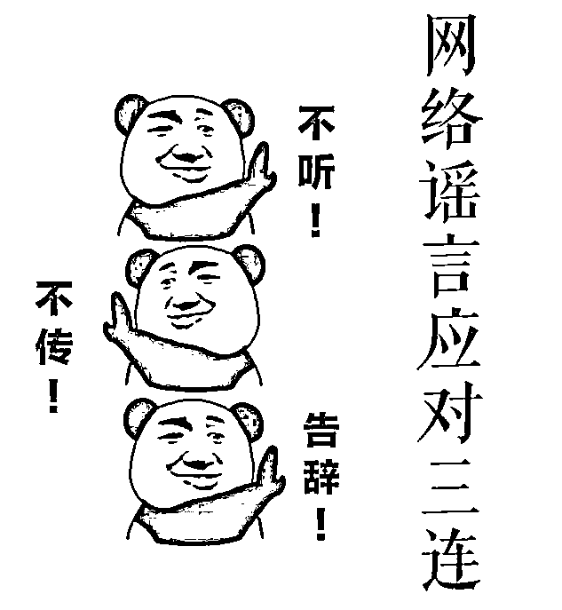

# 当心！有人正在“偷”你的声音

> 原文：[`mp.weixin.qq.com/s?__biz=MzIyMDYwMTk0Mw==&mid=2247525155&idx=3&sn=a3c08952688b74b7c308ec455c40cc5a&chksm=97cba81ba0bc210dd116d6239b2ce1b1a8d94a3790fc776657e38f9243ee0fa651a475889caa&scene=27#wechat_redirect`](http://mp.weixin.qq.com/s?__biz=MzIyMDYwMTk0Mw==&mid=2247525155&idx=3&sn=a3c08952688b74b7c308ec455c40cc5a&chksm=97cba81ba0bc210dd116d6239b2ce1b1a8d94a3790fc776657e38f9243ee0fa651a475889caa&scene=27#wechat_redirect)

大家好，我是鹅师傅。

**“解决自卑的办法就是搞钱，郁闷了寂寞了也是搞钱，追不到喜欢的人还是搞钱，没有安全感还是搞钱……”。**近期，一段以“搞钱万能论”为主题的视频在网络上疯狂传播。

**乍一看**，这段言论的**“发表者”**竟然是新东方教育科技集团的董事长俞敏洪先生。

[`v.qq.com/iframe/preview.html?width=500&height=375&auto=0&vid=p3301pg258o`](https://v.qq.com/iframe/preview.html?width=500&height=375&auto=0&vid=p3301pg258o)

但是随后，**俞敏洪先就通过其个人社交帐号发布了辟谣视频**，他表示**搞钱视频**里的话没有一句是自己说的，中间传递的价值观也是他最反对、最恶心的一种价值观。最后，他还表示将对造谣者追究相应的法律责任。

这下子可把鹅师傅说糊涂了，因为视频里的声音分明就是俞校长自己的啊？向小伙伴们打听之后，这才知道，**这段视频可能运用了一种叫做“语音合成”的技术**。

下面，鹅师傅就戴上厚厚的眼镜片，给大家唠唠这背后的猫腻。

***1***

**语音合成是什么**

顾名思义，语音合成就是**合成自己所需要的语音素材**。在此之前，我们首先需要了解语音是什么。

一般来说，语音包括**信息、音色和韵律**三大关键成分。信息就是指**说话人说了什么内容**，通常以文本形式呈现；而音色则是指**说话人声音上的某些特点**；韵律则是**说话人说话的方式**，比如声音的高低、快慢等。

从核心技术原理层面来进行剖析的话，语音合成包括三个层面：

一是**单元挑选波形拼接技术**。这项技术的基本思想是先储存合成语音的基元，在合成时根据合成文本要求，从语音库中读取基元，通过拼接、韵律修饰来得到合成的语音。其关键技术点包括**语料库设计和标注**，以及**目标代价和连接代价计算**。听不太懂？鹅师傅为大家举一个简单的例子：

比如我们现在想要合成一句俞敏洪先生被造谣视频里的“解决自卑的办法就是搞钱”。那我们首先需要**在语音合成数据库里挑选这句文本信息所包括的元素**，比如“解决自卑”“办法”“就是”等。

挑选完成后，把这些元素**按照一定顺序组合排列，并隐含声调、重音、发音速度变化等细微特性后，输出成我们想要合成的语音信息**即可。

二是**基于 HMM 的参数语音合成**。HMM 全称叫做 Hidden Markov Model，中文译名为“隐马尔可夫模型”，是统计模型的一种。相较于前者，这项技术在操作层面上会更加流程化。通常基于 HMM 的参数语音合成包括**训练流程**和**合成流程**两部分。它的关键技术点包括**高质量语音声码器**和**基于上下文的决策树模型**两部分。

简单来说的话，这个过程就是**给定一串音素**，然后去数据库里找出最符合这串音素的一堆小 HMM，通过一系列技术把它们串成一个**较长的 HMM**，**用它来代表整个句子**。然后根据这个组合出的 HMM，计算最有可能观察出的语音参数序列，并从这个参数序列里面合成出语音。

三是**基于深度学习的语音合成**。近年来，英国 Deepmind 这一著名人工智能企业提出了波形点建模方法，这一深度学习算法模型的数据利用率十分高，而且效果优势和能力更为突出，是在传统 HMM 模型基础上的又一里程碑式发展。

这个阶段的语音合成已经基本和**“AI 换声”**差不多了。以 AI 的深度学习能力为基础，操作者可以仅凭几分钟甚至几秒钟的音源就对目标声音进行推测和模拟，并构建文本进而输出成自己想要用目标声音说出的话。比起前面的 HMM 而言，这种 AI 换声已经不再拘泥于语音库那一点点小小的选择，而是**可以凭空杜撰出讲话人压根没有说过的字词！**

***2***

**让你如痴如醉的变声蝴蝶**

名侦探柯南里让毛利小五郎一跃成为“沉睡名侦探”的幕后大杀器——**变声蝴蝶结**相信大家都不陌生。鹅师傅小时候对这个可是如痴如醉，总是想着搞到一个蝴蝶结来侦破尘封千年的秘密。没想到的是，这玩意现在网上居然有卖，功能齐全还不贵。

只是没想到的是，变声蝴蝶结成为现实之后，遍地开花的可不是什么行侠仗义名侦探，而是变声诈骗的“沉睡小五郎”。

这种“变声诈骗”的惯用伎俩，主要有以下几种：

一是**通过社交渠道利用熟人语音进行诈骗**。在这种方式下，骗子通常是以广撒网的方式不停拨打骚扰电话，然后从中积攒足够的声音素材来进行拼接和伪造。随后将伪造的声音发送给受害人的亲朋好友以借钱等名义实施诈骗。

二是**通过变声软件进行恋爱诈骗**。这种骗术的受害对象一般是男性，其惯常套路是通过直播、游戏、聊天等远程语音交流方式接触受害人，在与对方建立恋爱关系后，以恋爱为名要求送礼、借钱等，但是无论投入多少，对方一直会以各种理由搪塞见面的邀请，直到销声匿迹。

去年 8 月，深圳新闻网就公布了这样一则案例。深圳打工的吴先生在网络平台上偶然认识了一名叫“萌芽”的女孩，几番交谈下两人很快确立了恋爱关系，每天听着女朋友打来嘘寒问暖的电话都让吴先生一天的辛劳化作甜蜜。网恋三年吴先生也为女朋友转了不下七八万块钱。但是始终拒绝见面的“萌芽”让吴先生心生怀疑，在警察的调查下，原来这位“萌芽”竟然是一个 24 岁的小伙子。

***3***

**诈骗造谣究竟如何反制？**

故事说到这，鹅师傅的小伙伴嘎嘎嘎的就开始问了起来：老鹅啊，你说这语音换声造谣咋就那么猖獗呢，难道就没有什么好的方法提前提放一下吗？看着他语重心长的小秃头，啊不是，忧郁表情，鹅师傅立马拿起了手边的电脑哗哗哗地翻阅起了资料，总结下来无非是以下几点：

**一是完善语音合成产品及服务的登记使用制度。**推了推眼镜的鹅师傅打开浏览器，检索了一下语音合成这个 key word，漫天遍野都是什么**“5 分钟教你学会”“5 秒音源即可复制声音”**等等。某网更是以平均不到 30 元的高价即可获得一份 AI 变声软件从下载到安装使用的保姆级教学。

**学习难度低、实施成本低**的双+优势，相信无论对于诈骗还是造谣来说都是一个天大的利好。如果在一定时间内利用语音合成手段制作造谣、诈骗音视频的现象增多，那么**考虑完善购买相关产品及服务的登记制度**未尝不是一条可行出路。

**二是在技术手段上加强语音合成识别类软件的开发工作。**从网络上流传的那段俞敏洪“搞钱”视频来看，如果这段视频真的是通过语音合成技术进行后期配音的话，在电子通话本就存在部分失真的前提下，别说是普通公众，恐怕就连视频本人单听声音都难辨真假。再在朋友圈和社交群聊一传十、十传百的转发效应下，辟谣跑断腿就是维权人的最大苦衷。目前已经有研究人员指出可以用 AI 技术反制 AI 语音合成的泛滥，如果大家需求强烈的话，鹅师傅向大家郑重承诺一定会督促小伙伴们尽快开发出一款高效、便捷且实惠的识别软件哦！

**三是构建语音合成音视频的标识制度。**在应对纷繁复杂的社会生活实际时，法律总是存在相当程度的滞后性。囿于立法条件的限制，语音合成作为一门新的技术手段被应用对视频创作领域时，立法者难以在短时间内做出适当反应来对这种造谣、诈骗行为做出较好的规制措施。在这样的背景下，2019 年 11 月，国家互联网信息办公室、文化和旅游部、国家广播电视总局联合印发了《网络音视频信息服务管理规定》，其中的第十条、第十一条、第十二条和第十三条明确表示以后若是你**制作了换脸换声的音视频，如果放到互联网上传播，必须注明这是后期加工制作，并且不得用这些音视频图像来进行造谣、诽谤、传播虚假新闻等。**

最后也最重要的是，鹅师傅想提醒大家，**务必提高网络防范意识，不听谣不信谣！**

← 向右滑动与灰产圈互动交流 →

