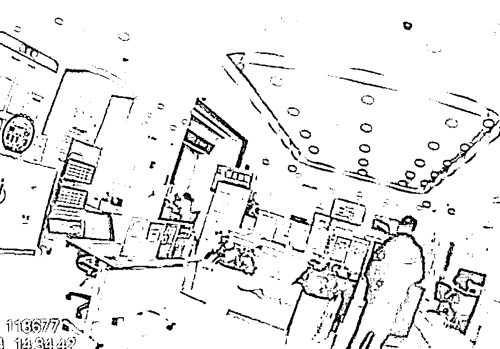

# “我喜欢给别人 10 万块钱，你有什么办法”

> 原文：[`mp.weixin.qq.com/s?__biz=MzIyMDYwMTk0Mw==&mid=2247525155&idx=4&sn=46146474e1110143951d3dff5a5e2f8a&chksm=97cba81ba0bc210dffe4fc25a44f217f7abe0a22fc4d4202896d574fc52c90a334a5a512ec54&scene=27#wechat_redirect`](http://mp.weixin.qq.com/s?__biz=MzIyMDYwMTk0Mw==&mid=2247525155&idx=4&sn=46146474e1110143951d3dff5a5e2f8a&chksm=97cba81ba0bc210dffe4fc25a44f217f7abe0a22fc4d4202896d574fc52c90a334a5a512ec54&scene=27#wechat_redirect)

近日 

杭州市公安局上城区分局

笕桥派出所

接到辖区工商银行的工作人员报警

称银行内有一位阿姨

执意要向未知账户汇款 10 万元

疑似遭遇电信诈骗

工作人员无法劝阻

请求警方支援

接到电话后

民警王生杰立即赶往现场

到达现场时

陆阿姨正坐在柜台前

银行的工作人员

正在和陆阿姨讲典型的

“庞氏骗局”的特征

陆阿姨显得十分自信

执意认为自己不是被骗

王生杰顺势插入话题

询问陆阿姨对方公司的信息

了解具体情况

陆阿姨说

这是一家旅游公司

现在有一项利息很高的产品

自己身边的很多朋友都有投钱进去

昨天该公司

还组织大家一同出去旅游了呢！

听完陆阿姨的介绍

王生杰愈发觉得这 10 万元

肯定不能汇出

旅游公司本就不该有金融方面的业务

便提出和陆阿姨一同到公司去看看

说如果确定公司情况靠谱就不再阻止

陆阿姨面对民警的劝阻

十分抗拒

不愿意带民警去公司

还一直在说

**“他根本不是骗子**

**你为什么不相信他呢”**

**“我喜欢给别人 10 万块钱**

**你有什么办法**

**你又没办法的”**

****

面对如此固执的陆阿姨

王生杰只好采用“拖延战术”

一边让银行工作人员

故意放缓给陆阿姨办理业务的速度

一边联系了陆阿姨的家人

在等待陆阿姨家人

过来的时间里

王生杰一刻不停

进行了长达 50 余分钟的劝说

耐心分析不法分子的诈骗手法

**陆阿姨的情绪**

**也在交谈中逐渐冷静**

**多次表示**

**“我知道你是为了我好”**

**转账的念头也开始消退**

等到家属到达现场

王生杰把陆阿姨的情况作了说明

家属对王生杰的认真负责道谢

离开后

陆阿姨的情况依旧

牵动着王生杰的心

当日他与陆阿姨的家属保持着联系

**听闻陆阿姨在自己离开后不久**

**就完全打消汇款的念头**

**他才彻底放下心来**

**你想着高收益**

**骗子看中却是你的本金**

**永远记住**

**天上不会掉馅饼！**

**同时**

**让我们一起**

**为负责的****银行工作人员**

**和民警王生杰点赞！**

来源：新华网，杭州公安，中国青年网微信

← 向右滑动与灰产圈互动交流 →

