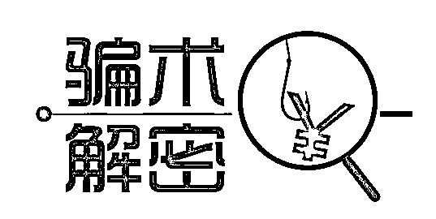
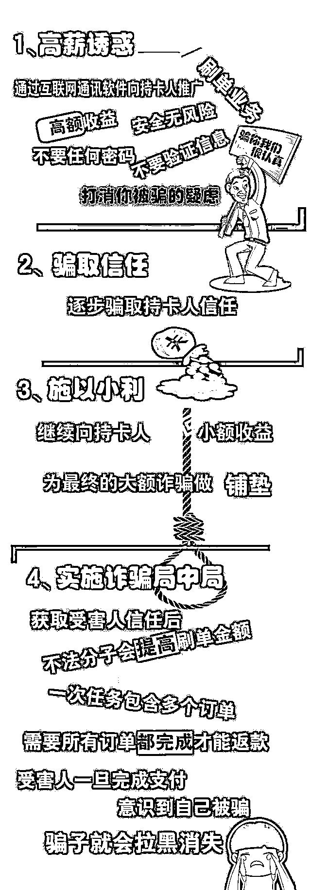

# 刷单骗局！一个网络刷单诈骗受害者的自述

> 原文：[`mp.weixin.qq.com/s?__biz=MzIyMDYwMTk0Mw==&mid=2247525155&idx=6&sn=d7099d172661b2a70dd456f3eddc0b6b&chksm=97cba81ba0bc210ddabf22b47c2f70d06e952383a25c348031ccdeeb27dfdffe03a87a92e3ca&scene=27#wechat_redirect`](http://mp.weixin.qq.com/s?__biz=MzIyMDYwMTk0Mw==&mid=2247525155&idx=6&sn=d7099d172661b2a70dd456f3eddc0b6b&chksm=97cba81ba0bc210ddabf22b47c2f70d06e952383a25c348031ccdeeb27dfdffe03a87a92e3ca&scene=27#wechat_redirect)

**网络刷单诈骗**

 “正规平台，诚邀刷单，按条结算，轻松上手” 

 “轻轻松松，动动手指，不用工作就能赚钱” 

  如果这时候看到这样的信息
  你可千万别动心啊
  因为，一动心就痛心....

今天这个故事的讲述者毛某某，她经历了一场网络刷单骗局，损失了 124000 余元。

今年 3 月 2 日下午 2 点左右，我在淘宝上浏览物品的时候，搜索到一条招聘广告，是一个自称在亚马逊平台刷单的兼职工作，兼职招聘上的待遇很优厚，心想每天除了上班时间还可以利用休息时间赚点钱，就准备试一试。

**下载 APP，赚取刷单“第一桶金”**

根据对方提供的链接，我下载了一个 APP，进入 APP 后，首先，填写了个人信息，注册了账号并登录进去。登进去后，系统上立即就有“业务员”联系我，并发来一条刷单流程和提现流程，看上去是很正规的。我按照流程进行操作，刷了几单后就赚了 35 元的佣金，我本着试一试提现功能的心态，将平台返的佣金和自己的本金成功提现，因提现成功，导致我对平台的兼职刷单深信不疑。

第二天，我用空闲时间开始继续刷单，进去后，发现派单的金额比第一天大了。系统提示，我必须要充值 3000 元进去才能继续开始刷单，我毫不犹豫的充值了 3000 元完成了刷单任务。两天时间，我的佣金就返了近 200 元，我很兴奋，但并没有将后面两天的佣金进行提现。

**升级成为“中级用户”，疯狂刷单**

第五天，系统提示我被选中，成为了中级用户，每天的单子变多，最多可以刷 150 单，意味着，我得到的佣金也会更多。一单 5000 元，二单 10000 元，三单 20000 元......我疯狂的进行着刷单任务，直到刷到 149 单时，我已经充值了 12 万多的金额进去了，我想先提现再刷第 150 单的时候，系统再次提示必须完成 150 单后，才能进行提现。但是，进入刷最后 1 单时，需要的资金竟是 25 万余元，我看了看自己卡里面的金额，已经没有多余的钱刷最后一单。

**深陷刷单迷局，向亲朋好友借钱**

此时，我完全没意识到自己被诈骗了，只想着自己已经投入了 12 万元多，必须要把自己的本金和佣金提现。我找到几个朋友，借了 5 万元，但离最后一单的 25 万还差很多。逼不得已，我告诉了自己的家人，希望家人能借钱给我，让我完成最后一单。当跟家人说后，家人告诉我，我可能被诈骗了，我完全不相信，一直强调我是验证过提现系统的，但家人还是坚持帮我报了警，直到警察告诉我，我是被骗了，我才瘫软的坐在地上，眼里含着泪水心情久久不能平静。

**除此之外
骗子关于刷单诈骗的套路还有**

**骗取押金**

在这种套路中，骗子经常在广告中以“一天最低利润数百元，一月最低收入过万元”等借口诱使人们上当，受害人一旦联系骗子，就会被告知如果想从事这份“工作”，就要交纳一定数额的押金。一旦有人上当交纳了押金，骗子就会消失得无影无踪，十分得简单粗暴。

**利用钓鱼网站诈骗**

在这类套路中，骗子既不需要押金，也不需要流动资金，仅仅需要你拍货，还承诺给你提供本金。他们会发一些钓鱼网站给你，你输入账号、密码后，对方就获取了你的账号和密码，然后转移你的资金。

**友情提醒**

再次提醒大家！
刷单是违法行为！
兼职刷单都是诈骗！
防骗和防疫同样重要！
千万别让骗子钻了空子！

来源：南溪公安,阻击诈骗

← 向右滑动与灰产圈互动交流 →

