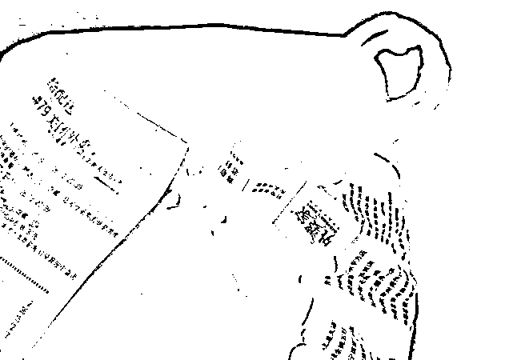

# 外卖员在餐盒里小便？原封盖好还晃几下！顾客得知时已吃完……

> 原文：[`mp.weixin.qq.com/s?__biz=MzIyMDYwMTk0Mw==&mid=2247525212&idx=2&sn=7a8de96c2458c88081c6fc90a32483e1&chksm=97cba864a0bc2172ee90be18e768787a39f6214a6297f3f5a99aa9a142f9fd7a2cd2f4c4f69f&scene=27#wechat_redirect`](http://mp.weixin.qq.com/s?__biz=MzIyMDYwMTk0Mw==&mid=2247525212&idx=2&sn=7a8de96c2458c88081c6fc90a32483e1&chksm=97cba864a0bc2172ee90be18e768787a39f6214a6297f3f5a99aa9a142f9fd7a2cd2f4c4f69f&scene=27#wechat_redirect)

11 月 30 日，一段“外卖员在电梯中向餐食中小便”的视频被广泛转发。

[`v.qq.com/iframe/preview.html?width=500&height=375&auto=0&vid=n3311nkr0q8`](https://v.qq.com/iframe/preview.html?width=500&height=375&auto=0&vid=n3311nkr0q8)

视频来源：九派新闻

此事发生在安徽省芜湖市镜湖区采薇苑小区。

据监控视频显示，**11 月 29 日晚 23 时 32 分，小区电梯轿厢中，一名外卖员脱掉裤子，向一份正在配送的麻辣烫外卖小便。**

该外卖员小便后，先是按下所到楼层的下一层，又在系好裤子后，将麻辣烫的盖子重新盖好并装入外卖袋中。

**该男子拿起外卖摇晃几下，闻了闻外卖的味道，到达所到楼层后，外卖员离开电梯进行配送。**

物业人员事后在监控中发现，电梯内该外卖员向外卖小便

外卖员小便后摇晃又闻了闻外卖，才入户配送

这是第二天物业保安查看监控发现该情况，并通知相关业主，但住户**“已将外卖吃掉”。**

请注意，这份外卖是麻辣烫，本身碗里就有很多汤和味道重，再加上摇匀后，搞不好还真的挺难发现。

**01** 

**顾客表示再也不点外卖**

在一张朋友圈截图内，该业主表示再也不点外卖了。

我们实在搞不懂，到底是什么样的人，内心能阴暗到，会往别人的食物里面撒尿。

是对方得罪了自己么？

是对方有什么出言不逊的地方么？

**都不是，一切都只是因为他内心的阴暗罢了。**

这事不光伤害顾客的身体健康，更重要是会产生严重的心理阴影。

**谁会想到，自己的外卖里，竟然会有别人的尿呢？**

根据后来的调查，事前外卖员和消费者并没有什么冲突。

也就是说，这位外卖员是无差别攻击，就是内心阴暗，就想要通过这种方式报复社会。

**而如果真是这样的话，这很有可能已经不是他第一次这么做了。**

**02** 

**类似事件已经不是第一次了**

**目前该外卖员因寻衅滋事被警方行政拘留 14 天。**

事实上，这并不是外卖员第一次小便了。

在这件事爆出来之前，就有多起报道称：

外卖员为了节省时间多跑几单，公然在电梯里小便。

只不过这次实在是太过分了，直接就在顾客的外卖里尿了。

近年来，个别外卖员的出格行为屡被媒体曝光。

比如偷吃顾客饭菜、饭菜散落一地继续配送等。

今年在吉林、广西、广东、上海等地，发生过外卖员往餐盒和外包装上吐口水的事件。

读书的时候，外卖 app 刚开始崛起，爸妈就曾告诫我少点外卖，多在家做饭。

**他们说，年轻时他们下馆子千万不能得罪厨师，不然有的厨师一言不合就往菜里吐口水。**

他们害怕同样的恶行，会发生在外卖行业上。

**当时我没太放在心上，现在想来还是有点道理的。**

**03** 

**如何点到一份放心的外卖**

我个人建议大家在点外卖时，尽量选择那些包装比较良好，且有「食安封签」的商家。

我点外卖有一家店铺做的就挺好，他们在外卖口袋封口处用纸质封条缠住袋口的，并且提示，封条破损，请拒收。这样的话，别人就很难做手脚了

什么是食安封签呢？就是下面这种。

**通过封签的完好程度，顾客能区分是否被人动过手脚。**

另外，“包装良好”的意思不限于打死结、用薄膜包装餐食等，总之让有心人揭不开盖就对了。

像下图这家店就做得很好，又打结又贴封签。

除了打上封签，用订书机将包装钉上也是一个好的方法。

**封签一旦破损，消费者有权拒收。**

可以预见，未来的外卖商家们将会愈发重视外卖包装的安全问题。

**如果以后你收到一个死活打不开的外卖，请不要对商家有过多的苛责，人家都是为了你好。**

**对于外卖员，那几个大平台不光要加强从业培训，还要对有过严重违法违规记录的外卖员全面拉黑，一次不忠永远不用！**

知道一些外卖内幕后，我现在也学乖了。

**一份十几块的外卖扣去的三分之一的平台抽成+配送费+包装费，真正用到食材上的有多少？**

建议低于 20 的外卖尽量不点，那些口味重但便宜的烤肉饭、卤肉饭啥的也不点，因为你永远不知道吃的是什么肉，或者是多少年前的肉。

现在我的外卖食谱，也就剩下拌粉拌面和各种炒饭了，蛋炒饭踩坑总不会太离谱吧？ 

**最后的最后，能自己做的，就尽量别点外卖！**

来源：昌南大队长

← 向右滑动与灰产圈互动交流 →

