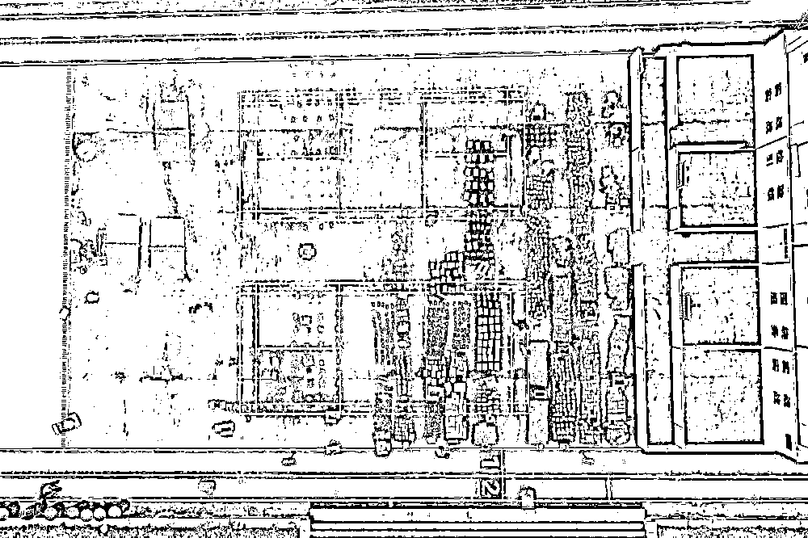
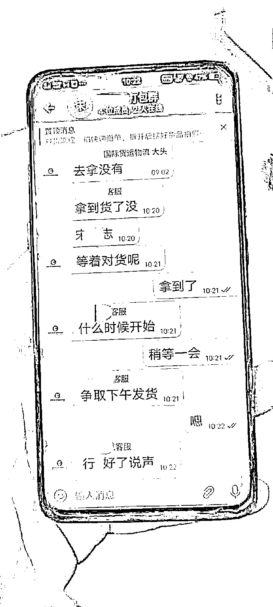
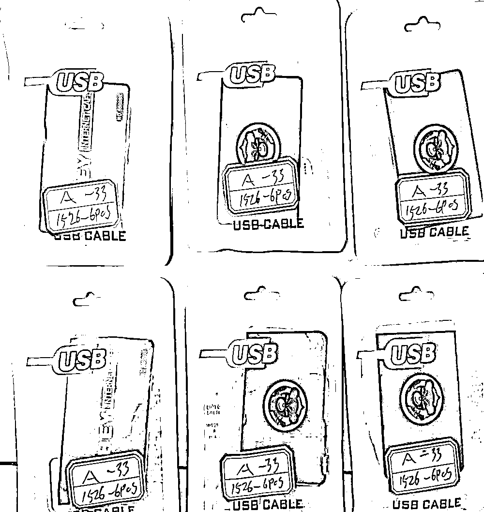

# 触目惊心！缴获的银行卡“四件套”铺满了半个操场

> 原文：[`mp.weixin.qq.com/s?__biz=MzIyMDYwMTk0Mw==&mid=2247525212&idx=4&sn=9d6e0e05f406d2fb3efada8e0e0f5f1d&chksm=97cba864a0bc2172f818604a4c2d41b66893787b58b3807d4428f0ee7060adeef776b04ab3b0&scene=27#wechat_redirect`](http://mp.weixin.qq.com/s?__biz=MzIyMDYwMTk0Mw==&mid=2247525212&idx=4&sn=9d6e0e05f406d2fb3efada8e0e0f5f1d&chksm=97cba864a0bc2172f818604a4c2d41b66893787b58b3807d4428f0ee7060adeef776b04ab3b0&scene=27#wechat_redirect)

非法开办贩卖银行卡“四件套”（手机卡、银行卡、U 盾、身份证复印件）是电信网络诈骗案件持续高发的重要原因之一。2020 年 10 月，“断卡”行动在全国范围内开展，意在从源头切断境外电信网络诈骗、网络赌博等团伙犯罪工具的来源。

在“11·18”特大妨害信用卡管理案中，犯罪团伙短短 4 个月间，运输贩卖银行卡“四件套”1 万余套至境外。安徽省马鞍山市含山县警方缴获可铺满半个操场的银行卡“四件套”7600 余套，价值超过 8000 万元，抓获犯罪嫌疑人 38 名。该团伙主犯罗某超是一位“00 后”，主要涉案人员也多以“95 后”“00 后”为主。

含山县公安局在“11·18”特大妨害信用卡管理案查获的银行卡“四件套”铺满半个操场。（含山县公安局供图）

（一）

2020 年 9 月，刚成年不久的职高学生张某向含山县公安局报警。

不久前，张某以每套 800 元的价格将自己的银行卡“四件套”卖给“发小”，几天后即发现银行卡被冻结。

[`mp.weixin.qq.com/mp/readtemplate?t=pages/video_player_tmpl&action=mpvideo&auto=0&vid=wxv_2161831100992536577`](https://mp.weixin.qq.com/mp/readtemplate?t=pages/video_player_tmpl&action=mpvideo&auto=0&vid=wxv_2161831100992536577)

“发小”的两条上线，20 岁出头的刁某谱和燕某，进入含山警方视线。

含山县公安局东关派出所教导员高峰介绍，燕某在广东务工时看到刁某谱收购银行卡“四件套”的小广告，与之联系并成为其下家；刁某谱返回含山老家后“业务”凋零，越做越大的燕某成为他的上家。不久，两人双双被警方抓获。

就在被捕前一天，燕某将一批银行卡“四件套”发给广东省中山市的上家“陈坤”。

了解到线索，含山警方奔赴广东中山。在快递站蹲守期间，20 余件全国各地寄给“陈坤”的包裹抵达。2020 年 12 月 14 日上午，“陈坤”出现，随即被抓捕，经核实为宋某志。

包裹中是电饭锅、音箱等小家电。民警拆解开小家电，从夹层中陆续取出上百套用锡箔纸包裹的银行卡“四件套”，大呼冤枉的宋某志低下了头。

民警发现，境外上家“大头”发信让宋某志准备装车发货，为避免打草惊蛇，民警一路追踪。

境外上家传给宋某志的“发货指令”。（含山县公安局供图）

物流车经停多处装货，在当晚 11 时抵达深圳市一家外贸仓库，共运载 11 箱 1400 余套银行卡“四件套”。

至此，一条“大鱼”正在浮出水面。

（二）

警方在境内“收网”后，终于摸清了这个“地下网络”的运作方法。由境外团伙头目“大头”统筹安排境内运输、送货出境。

宋某志并不知晓“大头”的真实身份。警方调查的证据，指向身在境外的罗某超。

据宋某志供述，他在境外上家“大头”指挥下建立“收卡集散点”，将来自全国各地的银行卡“四件套”逐个贴上黑色卡通图案贴膜，再把它们与普通读卡器混在一起伪装成出口电子产品。

“后续的办案过程中，身在境外的罗某超身份逐渐明晰，被确定为主犯。但没有想到涉案人数和运量会这么大。”含山县公安局经侦大队大队长朱虹键回忆。

警方侦查发现罗某超的女友余某涉案，正在国内探亲，即将再度出境，遂择机将其抓获。余某被捕时，微信、支付宝账户上尚有超过百万元的余额。

据悉，罗某超先后在境外赌博和物流行业务工，经济并不宽裕。罗某超和女友进入跨境运输银行卡“行业”后发现有利可图，于 2020 年开始单干。

警方介绍，罗某超团伙将银行卡“四件套”通过伪装报关等方式偷运出境，非法获利。境外卡商进而转卖给从事电信网络诈骗、网络赌博的犯罪团伙，从中谋取暴利。

有了巨额黑色收入，罗某超在境外购置豪车，还计划为家人购买别墅。却不想，这“美梦”被警方的追捕彻底打破。

“警方基于到案犯罪嫌疑人供述、资金流分析等证据，确定为赃款的，已依法予以扣押。只要实施违法犯罪活动，侵犯中国公民合法权益，人民警察必当一追到底。”朱虹键说。

警方查获的银行卡“四件套”，卡上已粘贴黑色贴纸进行伪装。（含山县公安局供图）

（三）

目前，针对罗某超的追捕活动仍在继续。

针对涉案人员多为“95 后”“00 后”这一现象，朱虹键颇为感慨：他们普遍没有受过较好的教育，法治意识淡薄，追求“快钱”的过程中缺乏对法律的敬畏。

“95 后”宋某志务农的父母对其寄予厚望，在其被捕前刚为他买了房子。“他们一生清清白白做人，没有任何污点，我觉得很对不起他们。”看守所里，宋某志懊悔不已。

含山县公安局副局长杨本玉表示，公安机关除会同人民银行向群众宣传非法买卖银行卡的危害性及惩戒措施外，也要会同物流运输主管部门加强监管，提高“断卡”类违法犯罪打击力度。

在电信网络诈骗等不法活动中，犯罪分子让受害人向指定银行账户汇款，一旦到账便迅速转款，在这个过程中银行卡“四件套”成为重要作案工具。

目前，银行和支付机构对买卖银行卡、支付账户的行为实施惩戒，5 年内不得为其新开立账户。明知他人实施电信网络诈骗，仍通过出售银行卡等形式提供帮助，情节严重的则构成犯罪。

在有关部门重拳打击的同时，社会公众也要增强法律意识，切勿出卖自己的银行卡、手机卡等，不要因贪图小利给违法犯罪团伙留下可乘之机。

来源：新华视点，巴蜀反诈

← 向右滑动与灰产圈互动交流 →

