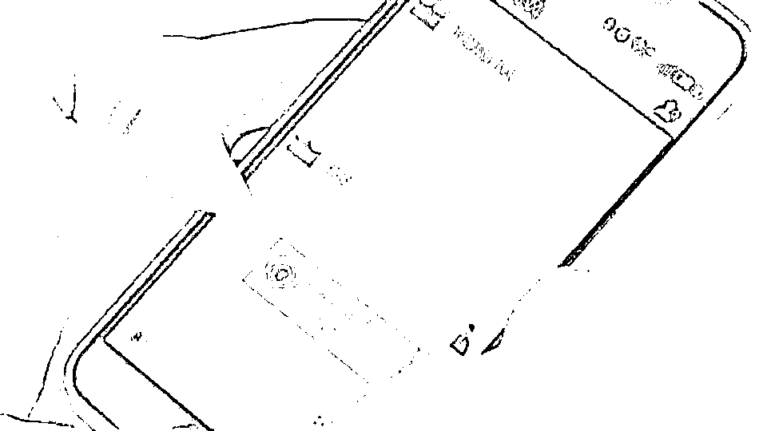
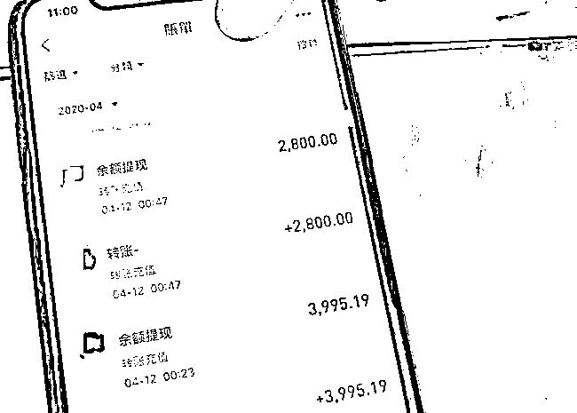
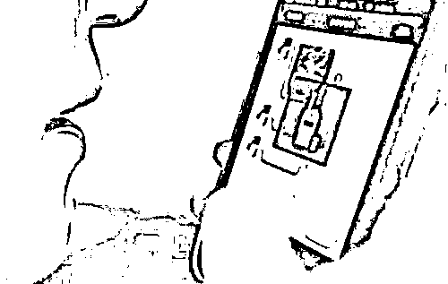
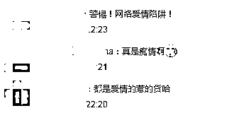

# 北京一痴心男对网恋女友连续转账后，女友突然死了?!

> 原文：[`mp.weixin.qq.com/s?__biz=MzIyMDYwMTk0Mw==&mid=2247525212&idx=5&sn=f550fa2be836c6b7a343afaef10adf18&chksm=97cba864a0bc2172a706b1faf68ace6f8828b4b747312cd5e783a5f672445cfe8e6663f5693d&scene=27#wechat_redirect`](http://mp.weixin.qq.com/s?__biz=MzIyMDYwMTk0Mw==&mid=2247525212&idx=5&sn=f550fa2be836c6b7a343afaef10adf18&chksm=97cba864a0bc2172a706b1faf68ace6f8828b4b747312cd5e783a5f672445cfe8e6663f5693d&scene=27#wechat_redirect)

**导 读** 

因工作原因张某长期在北京生活，闲暇之余热衷于在网上聊天。去年他在网络上遇到了自己的真爱，对方对自己嘘寒问暖，体贴周到，“奔现"之后爱的更是彻底了！为了帮心爱的人”排忧解难“，张某连续多次转账给对方。自己没钱了，向亲人、朋友借款，也要转账给心上人。但是没过多久，心上人突然在老家染上急症，张某又是一番“砸钱”治疗之后，她竟然"病故了"......直到张某家人追问钱款去向，他这才发现其中另有蹊跷！ 

已婚男子网上遇真爱

案发前，已婚有子的张某一直在顺义高丽营地区工作，工作之余**经常用社交软件和各色人等聊天，**期间认识了一位名叫“小嘉”的女子。由于和家人长时间分居，“小嘉”又经常与他嘘寒问暖，渐渐地两人越来越熟，**2020 年 6 月起，两人开始频繁的联系，确立了情人关系。并且很快“奔现”见面了。**和一般“奔现即分手”不同，二人相约见面后，关系倒是更密切了。

**网络配图，和本案无关**

心上人频频遇难事儿借钱也要帮上忙

确定关系之后，“小嘉”称自己离异，靠打零工度日。眼看情人每天为钱而奔波，张某顿起怜悯之心。此后一周，小嘉又联系张某，声称最近要交物业费，想借钱。张某立即打款 2000 元。**开了这个头，小嘉的难事儿越来越多：母亲生病、哥哥欠赌债，等等等等。只要她开口，张某有求必应。**

这个时候的张某俨然已成了移动提款机，一千、三千、五千、一万、两万……2021 年春节前后，张某告诉小嘉，**他已经为她花了近 20 万元。**虽然钱花了这么多，小嘉并未丝毫收敛，后面的事儿更离谱了。

**网络配图，和本案无关**

情人突发重病嫂子出来筹药费

2021 年 5 月，一个名叫刘娜（化名）的人用小嘉的微信联系了张某，她自称是小嘉嫂子。刘娜说，小嘉正病重住院，估计得花好多钱。张某立刻说要去她的老家探望，但是刘娜一口回绝，只是要求张某帮忙筹措医药费。

过了些日子，刘娜突然说，小嘉已经病故。

张某哀恸不已，吵嚷着一定要去见最后一面，但是刘娜给出了各种理由，把他挡了回去。虽然逐渐“接受现实”，但是眼看着不到一年的时间里，那好几十万的转账，他又坐不住了。

要账不行和联系人又擦出爱的火花

**7 月起，张某开始给刘娜打电话，索要之前的数十万款项，但电话那头，刘娜表示，如果想要钱，只能找到小嘉的哥哥，也就是她自己的老公。刘娜说，小嘉有一套房子在哥哥手上，如果想拿到这处房产，必须花钱请律师来打官司。就这样，张某又给刘娜转账近 10 万元。然而这二位在沟通如何要回房子的时候，却也慢慢摩擦出了“爱情的火花”！**

**频频借钱终于被家人识破骗局**

****

****“火花”没闪耀太久，张某的哥哥发现不对劲，找到他，开门见山询问一年来从亲友手中借来那么多钱，都干什么用了。张某起初嘴硬，但是架不住哥哥的逼问，于是全都招了。**张某的哥哥一听，立刻判断“你是碰到骗子了”！立刻带着他到高丽营派出所报了警。******

****根据张某提供的相关信息，**顺义民警在石景山一小区内成功将“小嘉”抓获。******

****讯问中，“小嘉”供述，她叫石某某，今年 41 岁，河北人，并承认了诈骗张某几十万元的事儿。**据石某某交代，自从认识张某后，她编纂各种理由向张某要钱，连她自己也想不到，每次只要她开口，张某从不推辞，每次都给。而且张某就算出去借钱，也要“补贴”给她。**到最后，她实在技穷，**发现所有的理由都用完了，就干脆说“我死了”，**换了一个“嫂子”的身份继续 搞暧昧，而且还使用变声软件与张某通话。****

******网络配图，和本案无关******

****在对嫌疑人石某某的手机数据分析后，民警发现，她与张先生经济来往高达 60 多万元，在这其中大部分钱款都用于了娱乐场所消费和旅游，而且在与张某交往的同时，**石某某还跟另外几名男性保持着不正当男女关系。******

****让民警们相当诧异的是，事主张某始终对“小嘉”深信不疑，甚至在来派出所报案之前，一直坚信“小嘉”死了。“我没被骗！”报案时，他对民警说。****

****目前，犯罪嫌疑人石某某因涉嫌诈骗已被顺义警方依法刑事拘留。****

****对此网友表示，难道这就是“爱的代价”？！看来网恋需谨慎啊。**** 

********

********

****使用微信、QQ 等交友软件时****

****一定要谨慎交友****

****稍有不慎就有可能会遭遇骗局****

****一旦发现被骗****

****请及时报警并收集证据****

****转发**** 

****谴责骗子、支持严惩****

****来源：北京日报，阻击诈骗****

********

****← 向右滑动与灰产圈互动交流 →****

********