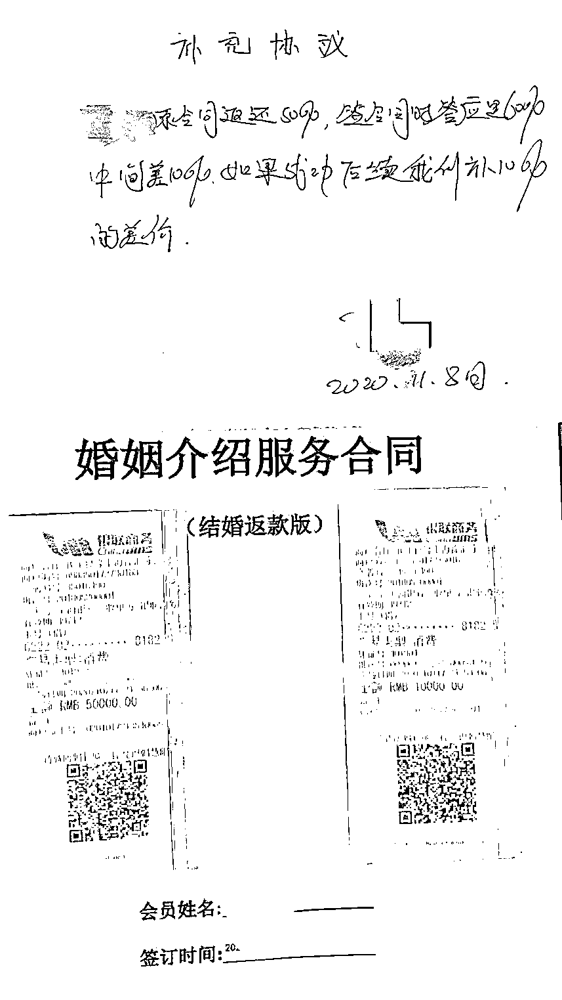
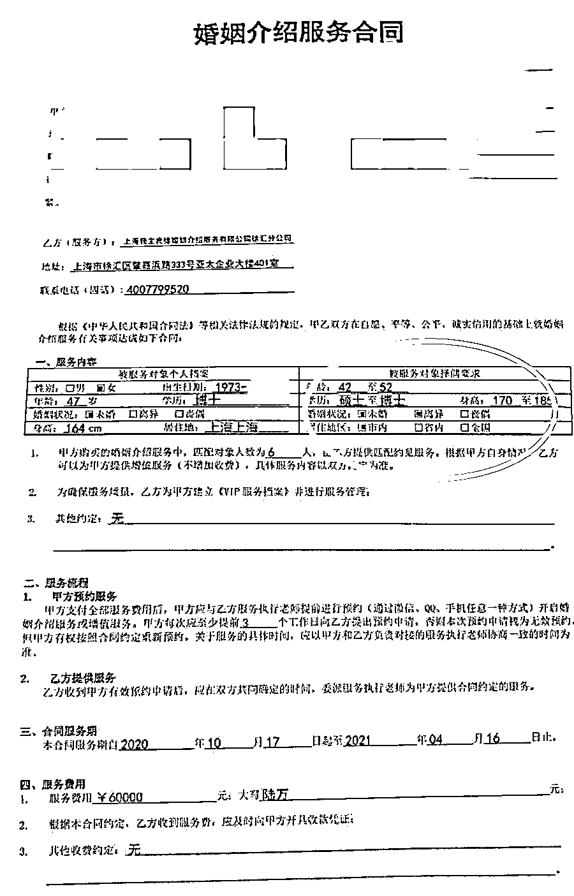
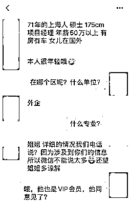
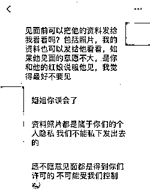
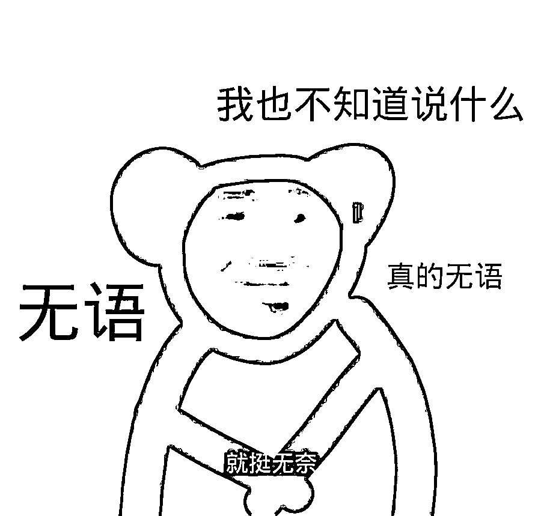
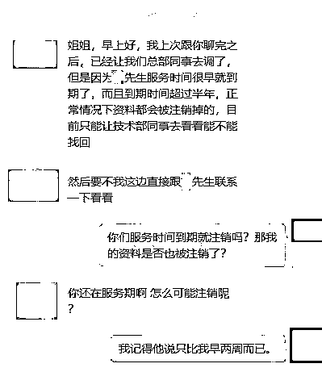
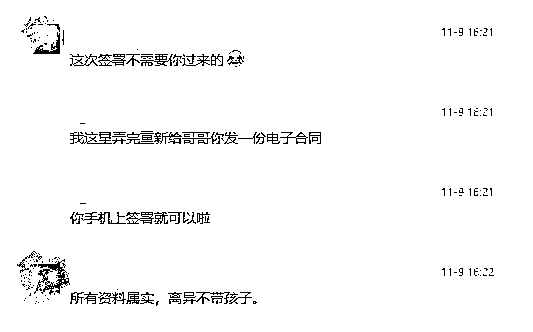
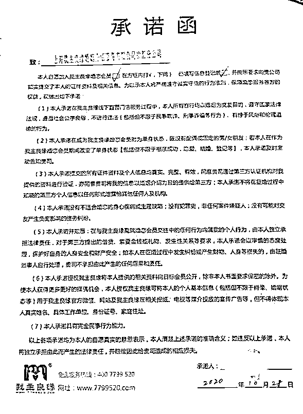
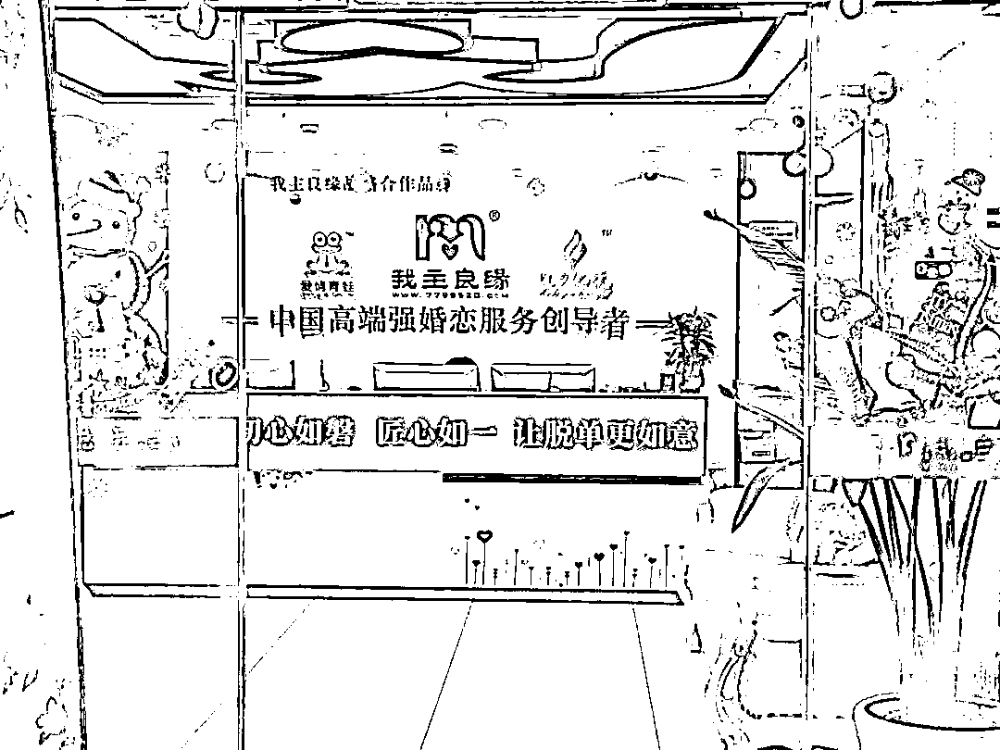

# 悲催！花了 6 万元找婚介，高校女教授险成“第三者”！

> 原文：[`mp.weixin.qq.com/s?__biz=MzIyMDYwMTk0Mw==&mid=2247525212&idx=7&sn=d4302d73ef57fc75ae45cf8e01d84627&chksm=97cba864a0bc21728f5eb9ccab52019f16ff589d088b17cd760bdfef23387dc9546d424fc023&scene=27#wechat_redirect`](http://mp.weixin.qq.com/s?__biz=MzIyMDYwMTk0Mw==&mid=2247525212&idx=7&sn=d4302d73ef57fc75ae45cf8e01d84627&chksm=97cba864a0bc21728f5eb9ccab52019f16ff589d088b17cd760bdfef23387dc9546d424fc023&scene=27#wechat_redirect)

**我花了 6 万元真心诚意寻觅伴侣，谁知到头来差点成了“第三者”。”**

上海的王女士今年 47 岁，

在高校工作，

虽然平时工作繁忙，

但仍然对婚姻和爱情心存向往。

**去年她在机构花费 6 万元**

**希望求得一份靠谱的缘分。**

**虽然“红娘”反复强调审查严格，**

**但最后还是介绍了一个**

**“未离异”男子，** 

**王女士险成“第三者”！**

女教授支付 6 万元入会婚介

对方反复强调自己“很靠谱”

去年 6 月，王女士所在高校工会与“我主良缘”开展线上交友活动，根据当时填的资料，此后王女士多次受到对方的短信和电话。去年 10 月 17 日，她终于答应去肇嘉浜路婚介机构徐汇门店面谈。

王女士回忆，当时在一个密闭的小房间里，“红娘”告诉王女士，他们作为一家“高端”婚介机构，在全国有 60 多家门店，其中上海有 2 家，他们**对会****员要求高、审查严，还列举许多大龄会员成功结婚案例。**

“红娘”表示，考量到年龄因素，王女士的择偶范围比较窄，所以婚介费定价高，需要 5 万元。随后，对方又提出一种方案，**称只需再多付 1 万元，就可以享受“婚介返款”优惠活动，****即只要王女士在一年内登记结婚（伴侣条件不限），机构就会退还她六成的婚介费。**

两三名“红娘”轮番游说下，

王女士稀里糊涂交了 6 万元会费，

事后才补签了合同。

从这份婚姻介绍服务合同中，

大家可以清楚看到

**王女士要求择偶对象婚姻状况**

**为“未婚”或者“离异”，**

**匹配对象人数为 6 人↓**

**即使“红娘”反复表示**

**会员审查审查严格，**

**但没想到不久后还是翻了车...**

婚介对象身份存疑，

王女士：他感觉像个托...

10 月底，“红娘”向王女士介绍了 49 岁张先生，称对方离异、国外旅居多年，目前在外企担任项目经理，年薪 50 万元以上。

王女士本想在见面前，先看一下彼此的相关资料，但“红娘”以保护个人隐私为由拒绝。

在和男子线上交流的过程中，王女士开始慢慢觉得异样，对方虽然一直和他聊天，但从不约见面。**就在王女士向机构提出换人要求的当天，对方立刻约见面了。**

但随着进一步接触，

王女士愈发觉得不对劲。

**她发现张先生工作不稳定，**

**一直在求职面试。**

今年年初，心生怀疑的王女士向婚介机构求证男方信息，两位“红娘”言之凿凿，**前期已审核过相关材料，男方的行业受疫情影响，才导致工作不稳定。**

王女士表示，每每和张先生聊到结婚话题，他总是语焉不详。他表示和前妻在国外分居半年以上，在当地等同于离婚。**但王女士追问，既然视为离婚，那以后能否办结婚手续时，张先生却不作答。**

**而当把这一情况告知“红娘”时，**

**对方立刻提议给她重新换对象。**

崩溃！男方原来没离婚

今年 9 月，王女士要求婚介中心出示张先生相关材料证明，但工作人员以男方合同服务到期为由，证明资料可能都已注销来搪塞。

向机构交涉，工作人员表示男方资料可能都已注销

后来，张先生本人向王女士坦言，**最初没有向婚介机构提交离婚证明。**他只是强调国外婚姻状态和国内不一样，并表示这些信息没有向机构隐瞒。

相关负责人杜女士向记者出示了张先生签署的单身承诺函和电子合同，并强调工作人员和他通过微信确认资料属实，但确实没有审查过离婚证明，并表示“**如果会员不愿提供，机构也无权强迫。**”

工作人员和张先生微信确认资料属实

张先生签署的单身承诺函

记者进入婚介中心暗访！

原来介绍“成功”才能拿提成

近日，记者来到肇嘉浜路婚介机构徐汇分公司暗访。一走进店内，只见前台醒目张贴着“中国高端强婚恋服务创导者”几个大红字。

起初，前台颇为警觉，表示他们只接待和“红娘”提前沟通预约过的客户。

随后记者被领入一小房间，一名自称是婚恋咨询师的女士向记者介绍，，**会员费用主要由择偶需求和实际情况来决定，没有统一收费标准**。并透露她每天差不多接待四五位客户，**如果聊下来觉得成功率不高就不介绍，毕竟只有成功才能拿提成。**

律师指出，

此类合同勿信“口头承诺”

**那么婚介中心和客户签署的** 

**承诺函能否成为单身的合法证明？**

上海市金茂律师事务所的梅颖达律师指出：自行签字的承诺书不能成为单身的合法证明，**能证明离婚的依据只有离婚证、判决书或调解书，****婚介机构不能仅凭男方签署了承诺书就完成了其查询的居间义务**。

“在给求偶者推荐对象前，婚介服务公司应督促相关个人提供合法有效的证明材料，作好尽职调查。”

“即使出于保护个人隐私考虑，不向求偶者提供相关适配人的证明材料，但还是应当说明已收集核实哪些材料，详细告知相关适配人未提供的材料及对应的风险。”

**在徐汇区消保委和记者的介入下，**

**婚介机构目前**

**已同意向王女士全额退费。**

然而，类似这样成功退费的案例还是少数。记者从 12345 市民服务热线了解到，关于婚介机构投诉屡见不鲜。收费标准不设限、监管措施不到位、法律规定不明确……求偶者屡屡上当，举证艰难，投诉无门。

**法律人士提醒，**

**单身男女如果寻求婚介服务，**

**一定要注意一下几点↓**

1、 正当的婚介需求应落实在合同中，不要听信他人的口头承诺。

2、提供的个人资料最好打上“仅供婚介服务公司备案”的水印，以防资料流失造成自身损失。

3、需谨防“婚托”诈骗，若发现婚介服务公司或有关异性有可疑的借款、借名、代签等行为，应当严词拒绝，并向公安等相关部门上报。

如今不论是线上还是线下交友，

婚介市场需求火爆，

但监管力度似乎并没有跟上。

谁能给婚介机构套上”紧箍咒“？

谁能让单身那女们不再”踩坑“？

大家对此怎么看？

欢迎评论区留言！

来源： 新闻坊，潇湘晨报

← 向右滑动与灰产圈互动交流 →

