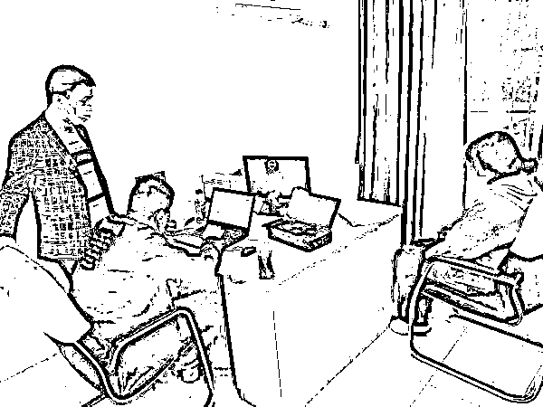
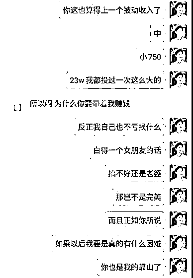
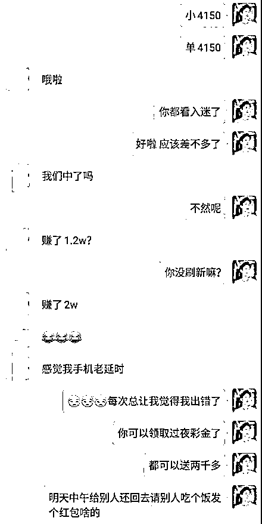

# 被骗 60 万、丢了情郎、差点没命……直到警察找到她，她才知道自己是“猪”

> 原文：[`mp.weixin.qq.com/s?__biz=MzIyMDYwMTk0Mw==&mid=2247525279&idx=3&sn=2d3dfd182ccd15f19173d8d29f71992d&chksm=97cba8a7a0bc21b1615b2de167925ef1c549cf426447b20fc22cb5d238ffa7598910bef3721b&scene=27#wechat_redirect`](http://mp.weixin.qq.com/s?__biz=MzIyMDYwMTk0Mw==&mid=2247525279&idx=3&sn=2d3dfd182ccd15f19173d8d29f71992d&chksm=97cba8a7a0bc21b1615b2de167925ef1c549cf426447b20fc22cb5d238ffa7598910bef3721b&scene=27#wechat_redirect)

千万不要相信网上情缘

网上的“浪漫邂逅”

可能是电诈犯罪分子

精心布局的“玫瑰陷阱”

他们口中日进斗金的投资平台

就是吃人不吐骨头的赌博网站！

一位涉世不深的女子小雯遭遇

“杀猪盘”电信诈骗

不仅负债累累

还身心遭受巨大创痛

回想起那段时间

她泣不成声

[`mp.weixin.qq.com/mp/readtemplate?t=pages/video_player_tmpl&action=mpvideo&auto=0&vid=wxv_2119789357560594433`](https://mp.weixin.qq.com/mp/readtemplate?t=pages/video_player_tmpl&action=mpvideo&auto=0&vid=wxv_2119789357560594433)

该案相关受害人配合民警调查取证

 “单身宅女”邂逅“阳光型男”

小雯家住安徽合肥，今年 24 岁，长相普通性格文静，大学毕业后先后找了几份工作都不理想，索性辞职回家做一些网络兼职。闲暇时间里小雯很喜欢浏览各种社交平台，分享日常生活，与网友互动交流，感觉自己一成不变的生活也变得多姿多彩起来。

2020 年 6 月，小雯在“soul”交友网站结识了一位名叫“陈彦明”的男子。第一次刷到他的主页，小雯就觉得莫名好感。用小雯的话来说，陈彦明身形高大、相貌俊朗、气宇不凡，外形条件就是很多女生的“理想型”。他的主页展示了很多健身、自驾游、朋友聚会之类的个人动态，还经常分享自己在家照顾宠物，陪伴家人，制作美食的视频，给人的感觉就是一个很阳光开朗，温暖正能量的“高质量”男性。

可能看到小雯经常关注，陈彦明主动添加好友，并在线打起了招呼。在平台上聊了不久，陈彦明很礼貌的提出跟小雯互加微信，小雯正求之不得。陈彦明自称自己今年 30 岁，从事金融中介服务，有车有房收入颇丰。得知小雯单身居住，善解人意的陈彦明每天嘘寒问暖，恰到好处的关心提醒和体贴叮咛，让小雯感受到了前所未有的脉脉温情。

“为爱打拼”计划“双向奔赴”

通过一个多月的热线联系，小雯与陈彦明感情日渐升温，小雯一度顾虑重重，觉得自己无论是外貌还是职业，跟陈彦明都存在很大落差，陈彦明试着提出“奔现”见面，小雯也怕脱离了美颜滤镜，真实的自己会让对方大失所望。陈彦明仿佛看穿了她的心思，反过来温柔地安慰她，说自己欣赏的就是小雯这样善良朴实，文静内秀的女孩，小雯现在经济不能自立没关系，彦明是专业理财师，可以带小雯做赚钱最快的“网络理财”项目，用专业技术规避风险保赚不赔。

该案一受害人被骗聊天记录

在彦明的大力推介下，小雯扫码下载了“**摩根”网络投资 APP，彦明手把手地教小雯充值、看盘、下单。其实这就是个赌博网站，充值后通过“押大小”方式进行赌博投注。在彦明的指导下，小雯连连获利，第一次充值试水的 520 元本金很快翻倍，彦明马上让小雯提现，并告诉她平台 100%保证兑付资金绝对安全。彦明在语音里温柔地说：“小傻瓜，你看你也会赚钱了，等你赚到房子的首付，我们就到你的家乡买套房，以后就是我们的夫妻共同财产了！”

“人财两空”又遇“祸不单行”

体贴的恋人，财富的诱惑，美好的愿景，小雯被突如其来的幸福冲击得不知所措，在彦明的授意下，积蓄不多的她陆续找父母朋友借了数万元又充值到了平台，从最初的 520 元，到 1314 元、5200 元。彦明没有食言，果然又用专业技术带她获利颇丰，而这些颇具爱情寓意的数字投资，让小雯同时感受到了“爱情”的甜蜜。过了几天，小雯想见好就收，准备撤出本金让利润在里面滚，谁知点击“提现”，系统却通知其银行卡号有误。为避免错误支付，需交纳相同数额的保证金更正卡号后再“返回全款”。

看到小雯急得快哭了，彦明说自己的钱都用来投资了，手头没有现金，不过可以帮小雯快速借钱救急。在彦明的推荐指导下，从未接触过网贷的小雯，身不由己的下载了 10 多个网贷 APP，随着申请的高息贷款到账，很快被彦明诱导着投入了所谓的网络投资平台。

“一次保证金就是 68000 元，再下一次，就要翻倍的保证金。”小雯说，她不是没有丝毫怀疑，但是看着越投越多的钱，和越欠越多的债，她害怕，一旦停止投入，就会血本无归。

可是这些钱就像泥牛入海一样有去无回，平台以“手续费”、“结帐周期”等种种理由拖延兑付，这时小雯已经在平台陆续投入了 60 多万，几乎全部是亲朋好友的借款和高息网贷。

而这个过程，不到两个月。

接下来的故事就像每一个“杀猪盘”的尾声，小雯眼巴巴等着系统放款，突然有天发现再也不能登陆了。她赶紧联系陈彦明，每天都陪着自己安慰自己的那个声音却变成了永久的盲音，所有的联系方式都被拉黑，仿佛这个人从未出现过一样。只有网贷公司每天狂轰乱炸的催款电话，让小雯绝望又清醒意识到，**自己原来只是电信诈骗“杀猪盘”里那头被榨干了最后一滴骨血的“猪”。**

由于借款时抵押了个人信息和通讯录，小雯原来平静的生活被无孔不入的网贷公司彻底搅乱。所有的亲朋好友和社会关系都接到了催款电话，铺天盖地的指责和流言压得小雯喘不过气来，每天窝在家里以泪洗面。有一天，小雯出门时，总感觉后面有人对自己指指点点，神情恍惚之下不小心被车撞倒，导致颅脑损伤，在医院躺了十多天。看着年迈的父母因为自己背负了巨额债务，还要衣不解带的照顾自己，小雯羞愧难当，万念俱灰，甚至一度起了轻生的念头。好在父母每天寸步不离守着女儿，鼓励她振作起来重新面对生活。

当荆门“6·11”电信诈骗专案组千里迢迢找到受害人小雯调查取证时，面对民警的询问，小雯忍不住痛哭起来，那段不堪回首的经历一旦触及便痛彻心扉。办案民警告诉小雯，她是遇上了典型的“杀猪盘”，“陈彦明”只是团伙成员精心打造的一个人设，每天跟小雯聊天的可能是不同的“键盘手”，他们的诈骗流程和话术都经过精心设计，针对不同人群“对症施策”，众多受害人不知不觉被“糖衣炮弹”击中，一头栽进“玫瑰陷阱”。正如团伙内部所言：“不怕猪有文化，就怕你不会说情话”。

2021 年初，湖北荆门警方通过开展缅北涉诈回流人员摸排工作，发现重大电诈犯罪线索，经过近半年的秘密侦查，于 2021 年 6 月 11 日启动集中收网行动，抓获团伙成员 93 人，打掉一个盘踞在缅北勐波县的电信诈骗集团。该案受害者遍布全国 20 多个省市，涉案金额 3000 多万元，小雯便是其中一位。办案民警说，每一位 “杀猪盘”的受害者都有一段不为人知的伤痛故事，他们为“网上情缘”付出全身心的真情与巨大代价，最后落得人财两空名誉扫地，身心的创痛可能一辈子都很难痊愈。这些活生生的案例与教训，希望能给世人以警示与思索。

来源：反欺诈金钟罩、荆门公安、昆明反电信网络诈骗中心

← 向右滑动与灰产圈互动交流 →

