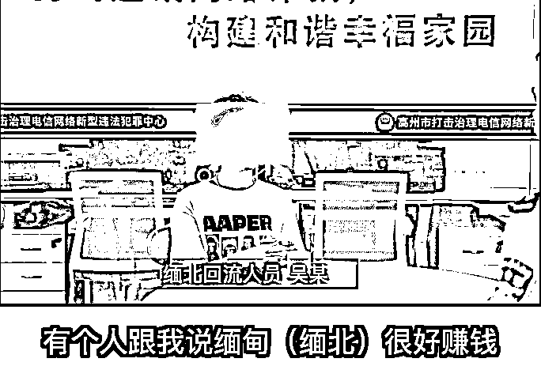
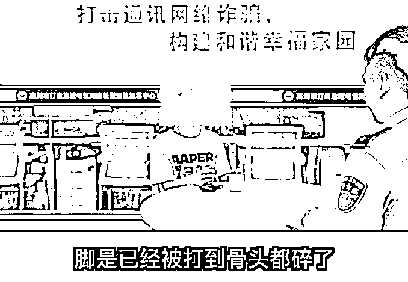
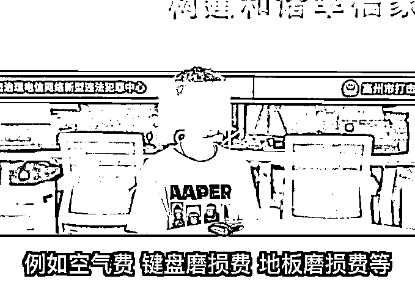
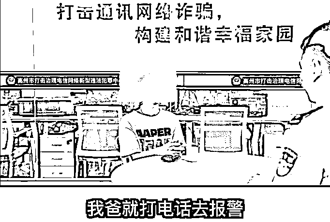

# “在缅北，他们告诉我，就连呼吸也是要收费的......”

> 原文：[`mp.weixin.qq.com/s?__biz=MzIyMDYwMTk0Mw==&mid=2247525279&idx=4&sn=ffa3c838bba487e5bc3777d9f1a1ffc6&chksm=97cba8a7a0bc21b1b40d4c4273fcd863d874f3919cefd5f1c98934739a0cc606247028b2e648&scene=27#wechat_redirect`](http://mp.weixin.qq.com/s?__biz=MzIyMDYwMTk0Mw==&mid=2247525279&idx=4&sn=ffa3c838bba487e5bc3777d9f1a1ffc6&chksm=97cba8a7a0bc21b1b40d4c4273fcd863d874f3919cefd5f1c98934739a0cc606247028b2e648&scene=27#wechat_redirect)

“每天工作 19 个小时” 

“诈骗不成功就会被殴打”

“同伴被打得脚骨都碎了”

“想离开要交空气费......”

......

近日

高州籍缅北回流人员吴某

向民警讲述了自己的“缅北噩梦”

1.**难抵诱惑 误入狼窝**

吴某今年 24 岁，高州人，初中辍学后一直处于无业状态。2020 年 11 月中旬，吴某在广州某酒吧和朋友喝酒时，结识了一位自称李某的男子。吴某发现李某出手阔绰，便和其攀谈起来，李某自称有可以轻松赚大钱的门路，**到缅北做“游戏客服”，月入轻松过万、甚至十几万。工作环境也是繁华商业区、高档写字楼，只要吴某愿意去，机票、车费食宿全包。**

一开始，吴某并没有接受李某的邀请。半个月后，吴某和家人发生争吵，独自在外的他手头拮据，出于对巨额财富的向往，吴某想起了李某的邀请。于是向李某打听去缅北的办法以及工作的具体事项。

很快，李某为吴某联系好了偷渡事宜，并为他购买了从湛江到云南边境的机票。同时联系好了“蛇头”带着吴某从云南边境翻山越岭、频繁变换摩托车、汽车等交通工具，辗转偷渡来到了缅北。

2.**幡然醒悟 为时已晚**

刚刚到达缅北，吴某的手机、身份证就立即被没收，所谓的“繁华商业区、高档写字楼公司”只是位于山上的一个巨大的诈骗窝点。当吴某反应过来，想要离开时，已经为时已晚。因为“公司”有着 3 米高的围墙，围墙上布满了铁丝网，出入口到处都是持枪的武装人员把守，根本不允许踏出“公司”半步。**而所谓的轻松月入过万的“客服”工作，其实就是“杀猪盘”诈骗。**

“公司”为吴某配发了两台安装了微信、QQ、婚恋平台等各种社交软件的诈骗手机。工作内容就是在各类社交平台上大批量添加受害者，和对方“谈情说爱”，获得对方信任后，就引诱其进入诈骗平台进行“投资赚钱”。当对方投入大量资金后，就会将其拉黑，从而实施诈骗。

如果长时间没有开出“业绩”（诈骗成功），就会遭到管理人员的各种殴打折磨。吴某曾被管理人员殴打到一个星期都难以起床，逃跑的人如果被抓到，就会受到更加严厉的惩罚**。“他被当着众人的面打断了手脚，然后仍在了宿舍里面，因为动不了，只能和自己的排泄物躺在一起，好心一点的‘员工’会偶尔帮他带点饭，没有医生、没有药物，他只能在等死”**吴某曾亲眼目睹一名逃跑失败的“员工”被疯狂折磨，**“在那边生命是最不值钱的，人只是商品，是可以被贩卖的，你如果想活下去，只能不断为诈骗团伙带去金钱。”**

3.**试图离开 先交“空气费......”**

因长时间未能“开单”，吴某经常被管理人员殴打、体罚，想离开窝点，却被告知**“先把你呼吸的空气费交了......“**。此外，还有“键盘磨损费、地板磨损费、偷渡费、机票费、车费、住宿费、伙食费”等“赔偿”，只有交清楚了才能离开。这笔费用算下来最低 5 万，假如管理人员发现你拿得出，就会不断加价。吴某身边的一个“员工”，就被勒索了 12 万，最后被折磨得不成人样，压榨干了才能离开诈骗公司。自知无法交出“赔偿”的吴某，只得想办法逃走。

4.**侥幸逃脱 重回国门**

在之后的“工作”中，吴某时刻留意“公司”可以翻墙的地方。在一次上厕所时，吴某发现厕所的一个窗户竟然可以拆开，于是趁管理人员不注意，翻出窗外，在山野一路狂奔，离开了诈骗窝点。最后利用手机与其父亲取得联系，父亲报警后，在国内公安机关和缅甸当地大使馆的帮助下，历时一个多月才得以重返国门。

**“缅北真的不是他们所说的天堂，那是地狱！我奉劝有过去淘金想法的人，赶快打消念头，你不单赚不到钱，更有可能死在那边......。”**10 月 17 日，吴某主动到公安机关说明了情况，在谈话最后，吴某表达了自己真实的感受，**奉劝大家千万不要前往缅北。**

吴某只是众多缅北回流人员中的一个

他们无一不是经历了地狱般的折磨

有的甚至永远也不能回来

缅北

究竟是淘金的天堂？

还是人间的地狱？

看了吴某的遭遇

相信每个人的心里都已经有了答案

想要高薪诱惑、香车美女……

须知这个世界上

从来就没有从天而降的馅饼

**剥夺你的尊严**

**伤害你的身体**

**夺走你的性命**

**这才是缅北致富面纱下的真实面目！**

来源：高州公安、西宁刑警，巴蜀反诈

← 向右滑动与灰产圈互动交流 →

