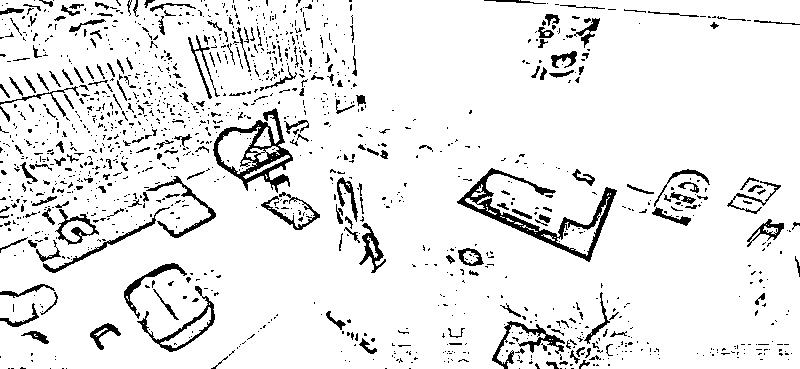
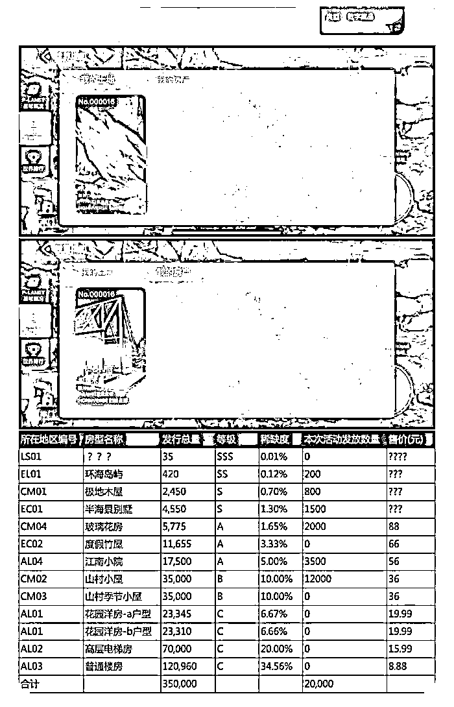
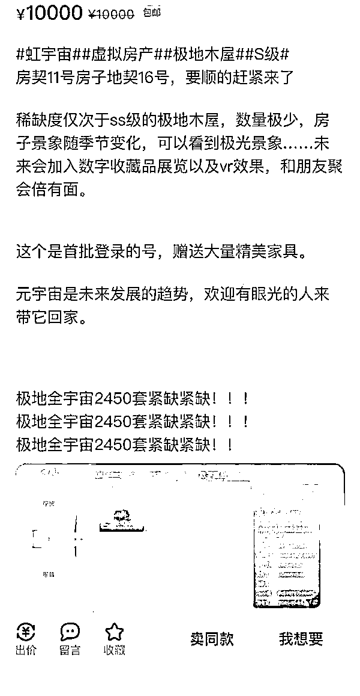

# 元宇宙“炒房”实录：430 万美元“地王”价格比肩一线城市，玩家：我在虚拟世界也没赶上炒房风口

> 原文：[`mp.weixin.qq.com/s?__biz=MzIyMDYwMTk0Mw==&mid=2247525279&idx=5&sn=e77cac56f338faa0764060d3d52a9c1e&chksm=97cba8a7a0bc21b1b7b4c61536dd93d9f7a56e7fcd4527704ae5cb616a4454049ad53585b9de&scene=27#wechat_redirect`](http://mp.weixin.qq.com/s?__biz=MzIyMDYwMTk0Mw==&mid=2247525279&idx=5&sn=e77cac56f338faa0764060d3d52a9c1e&chksm=97cba8a7a0bc21b1b7b4c61536dd93d9f7a56e7fcd4527704ae5cb616a4454049ad53585b9de&scene=27#wechat_redirect)

Honnverse 房屋图片。图源自 Honnverse 官方微博

“我以为在元宇宙能够实现‘居住自由’，但没想到那里的房价和一二线城市差不多，我照样买不到心仪的房子。”元宇宙玩家 Chloe（化名）对《华夏时报》记者说。Chloe 在今年 5 月份就关注到了元宇宙概念，但等到 11 月份入局时还是晚了。她说：“我在虚拟世界里，也没能赶上炒房的风口。”

房地产不会错过任何一个热点。自从元宇宙概念“破圈”之后，Chloe 发现，虚拟土地和虚拟房产的价格越来越高。大型资本的进入使得元宇宙成为了投资新宠儿。但质疑声也随之而来，这究竟真的是一个具有投资价值以及可以改变人类生活的新产品，还仅仅是用来“割韭菜”的一场游戏？

地产再次站上风口

公开在网络上抨击“元宇宙”概念的科幻小说《三体》作者刘慈欣曾说：“在人类的面前有两条路，一条向外，通往星辰大海；一条对内，通往虚拟现实。”脸书自从宣布将专注于元宇宙领域发展并将公司改名为“Meta”后，元宇宙热潮迅速席卷全世界。

百度百科对“元宇宙”的解释为整合多种新技术而产生的新型虚实相融的互联网应用和社会形态，它基于扩展现实技术提供沉浸式体验，基于数字孪生技术生成现实世界的景象，基于区块链技术搭建经济体系，将虚拟世界与现实世界在经济系统、社交系统、身份系统上密切融合，并且允许每个用户进行内容生产和世界编辑。

实际上，元宇宙在社交系统、身份系统上的联系与融合目前尚未有明显体现，但是在经济系统上的联系已经是体现得“淋漓尽致”。12 月 2 日，A 股元宇宙概念报收 1487.45 点，跌幅为 3.4%。但相比较 9 月份初期，元宇宙概念整体呈现大幅上涨的态势。

很多人认为，元宇宙是当下的风口，而站在这个风口上，除了一些科技股之外，还有房地产。现实中的房地产行业正在艰难“过冬”，融资、政策等方面的收紧让房企正面临困境。随着年关将近，销售成为了房企充裕现金流的主要方式。

不过，半路“杀出”的元宇宙让许多人将投资目光转向虚拟地产，房企再迎“对手”。资本已经走在了前列。专注于囤地的 Republic Realm 在 19 个虚拟世界拥有约 2500 宗虚拟土地，其中一部分将等待升值，不会进行开发，而另一部分已经着手用来在虚拟世界开发设计成为住宅、购物中心等。

听起来像是一个大型的经营游戏，有网友表示：“这和摩尔庄园有什么区别，都是买地建房子啊。”但是，Republic Realm 的联合创始人 Janine Yorio 公开表示：“公司通过在多个不同的虚拟世界中购买土地分散投资来降低风险，设计完成的地块会交给游戏开发商进行建造，我们则可以像房东一样，收取租金。”也就是说，在元宇宙打造出的虚拟世界中，不仅有人扮演房企的角色、扮演购房者的角色，甚至未来，会有人扮演“贝壳找房”的角色。

430 万美元的“地王”

现实世界中，一二线及热门城市的房价一直“居高不下”，但在虚拟世界，房子也成为了一个高消费产品，房价甚至比肩一二线城市。

11 月 23 日，数字资产投资集团的 Tokens.com 的子公司 Metaverse Group 耗资约 243 万美元在 Decentraland（分布式大陆）买下了一宗数字地块，当时创下了虚拟地产交易新纪录。Decentraland 是一个在以太坊区块链上进行运营的虚拟现实平台。2020 年 2 月份，该平台正式上线，注册用户可以在这一平台上完成购买土地、旅游、购物等多个活动，也可以与其他玩家进行交流等。目前，Decentraland 与 Sandbox（沙盒）是业内认为的发展较为成熟的元宇宙产品。

Metaverse Group 是用加密货币 Mana 付款，买下的这宗地块面积约为 565.8 平米。按照人民币汇率进行计算，这宗地块的单价约为 2.74 万元/平米。对比来看，北京第三批集中供地中最低的起拍楼面价约为 2.8 万元/平米，虚拟世界的地价可以称得上与一线城市比肩。

如此大数额的交易可以看出，元宇宙“炒房”已经不是一场“过家家”，投资者的数量越来越多。值得关注的是，11 月 23 日，歌手林俊杰在推特上宣布，已经在 Decentraland 购买了 3 宗虚拟土地。根据外媒报道，这 3 宗虚拟土地大约花费 12.3 万美元。

当 Metaverse Group 花费 243 万美元买虚拟土地时，业内外都在感叹“原来房价的天花板在元宇宙”。但“地王”更新得很快。11 月 30 日，正在各个虚拟世界中不停囤地的 Republic Realm 表示，公司以约 430 万美元的价格购入了 Sandbox 内的一宗地块。据悉，Republic Realm 是从视频游戏公司 Atari SA 手中购入的这宗虚拟土地，两家公司计划合作开发其中的地产项目。

游戏小木屋卖到 1 万元

1992 年，科幻小说《雪崩》面世，“元宇宙”一词也正式诞生。放到现在来看，整个小说所描述的理念仍然十分超前。在那个巨大的虚拟现实世界中，人类可以打造数字化身，并通过这一化身来进行社会竞争等活动。

大部分人都在热捧元宇宙，但刘慈欣发出了反对的声音，他认为“元宇宙将引导人类走向死路”。“人类的未来，要么是走向星际文明，要么就是常年沉迷在 VR 的虚拟世界中。如果人类在走向太空文明以前就实现了高度逼真的 VR 世界，这将是一场灾难。”刘慈欣在一次演讲中表示。

虚拟难免与“幻想”一词联系在一起，但无论元宇宙能否发展完全，它已经在资本市场上掀起了一场巨变。2021 年 7 月份，在淘宝造物节上，上海一对 95 后情侣买入了一套虚拟房产当作婚房。

《华夏时报》记者了解到，该套虚拟房产位于“不秃花园小区”，开发商为“秃力富房产公司”。该开发商与艺术家黄河山联合发行了 310 套虚拟房产，并在 2 天内售罄，总价超过 36 万元，每套约为 0.12 万元。

不过，虚拟房产的价格越来越高。11 月 1 日，虚拟社交元宇宙-Honnverse（虹宇宙）上线。Honnverse 首批用户仅有 500 人，用户此前通过参与官方预约抢号活动获得登陆权限，且能够获得产品中的限量版虚拟房产和土地。

在这个社交产品中，用户可以创造自己喜欢的虚拟人物，即“捏脸”，还能够按照自身的审美喜好打造住宅，同时和好友实现线上互动。Honnverse 玩家 Lynn 对《华夏时报》记者说：“我喜欢玩类似的虚拟世界游戏，之前是 The Sims（模拟人生）的骨灰玩家。在 The Sims 中我也可以按照喜好去打造人物，建造房子，但是我们只能和 NPC 进行互动，没有办法和自己的好友互动。The Sims 已经十分真实，但是 Honnverse 更真实，更开放，也更有独特性。”

用 Lynn 的话说，“我在那里过上了理想中的生活”。《华夏时报》记者了解到，Honnverse 推出的虚拟房产有数量限制，这也就导致了很多稀有房屋的价格在二手市场上越来越高。闲鱼上，S 级的极地木屋被炒到 1 万元/套。在这套房屋中，用户可以看到极光景象，感受到四季变幻，未来房屋中还会加入数字收藏品等。

Honnverse 各类房屋发行数量及价格

Honnverse S 级极地木屋在闲鱼上的售价

“极地木屋的发售量很少，应该是只有 2000 多套，卖完也就买不到了。”Lynn 对《华夏时报》记者说。Lynn 为自己在 Honnverse 中购入了一套半海景别墅，这套房屋发行量也不过 5000 多套，Lynn 买的二手产品价格为 2500 元。相比较来看，发行量高的普通楼房和高层电梯房官方售价很低，不过 20 元/套左右。

Lynn 说：“我很喜欢这个游戏。玩 The Sims 的时候我经常会把一些人物的性格设置得与自己不同，让她去做一些我在现实生活中不会尝试的事情。现在以北京的房价来说，我肯定是买不起了。但是我晚上坐在 20 平米的出租屋里，装扮着自己在 Honnverse 的海景别墅，还是很开心的。”

来源：华夏时报李凯旋 李未来 北京报道

← 向右滑动与灰产圈互动交流 →

