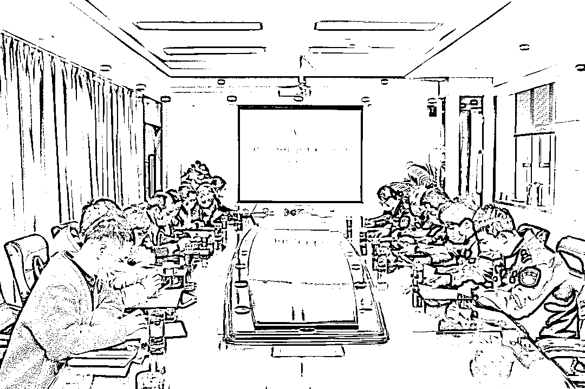
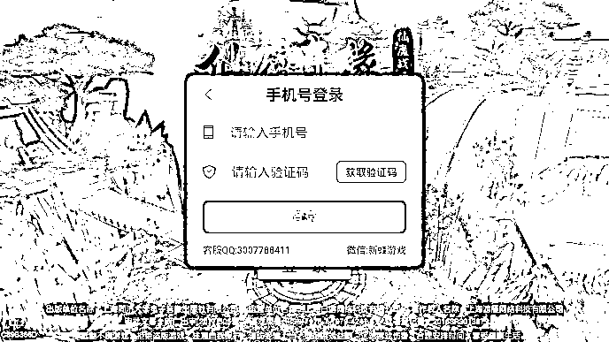
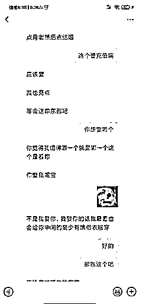
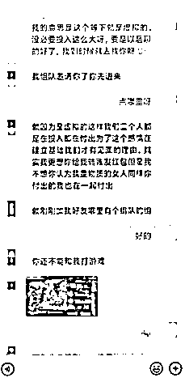
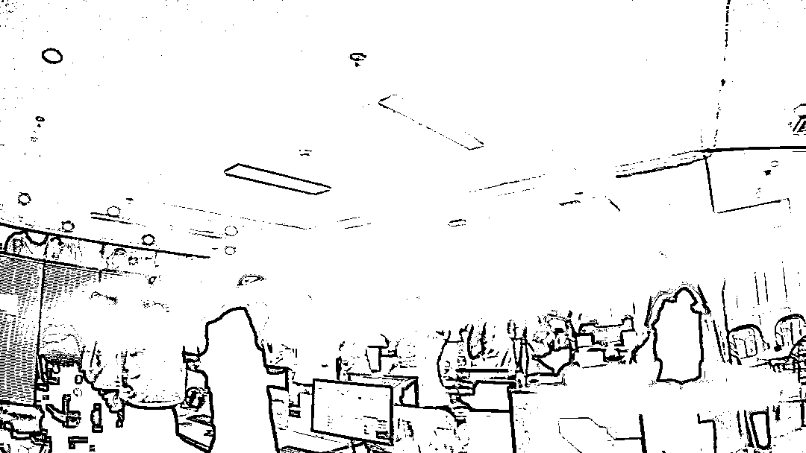
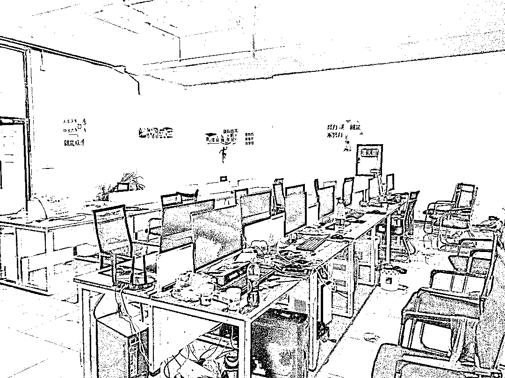

# 诈骗超千万，受害者遍布全国各地，这个团伙被端了！

> 原文：[`mp.weixin.qq.com/s?__biz=MzIyMDYwMTk0Mw==&mid=2247525279&idx=6&sn=06c8887d4d9e7434cde78c312e7dea9a&chksm=97cba8a7a0bc21b1cc2534a32b08e7a74b65634eb8583ab5eabd3f3c9f866ebf578222c78cb4&scene=27#wechat_redirect`](http://mp.weixin.qq.com/s?__biz=MzIyMDYwMTk0Mw==&mid=2247525279&idx=6&sn=06c8887d4d9e7434cde78c312e7dea9a&chksm=97cba8a7a0bc21b1cc2534a32b08e7a74b65634eb8583ab5eabd3f3c9f866ebf578222c78cb4&scene=27#wechat_redirect)

日前，苏州警方通过深挖数据、缜密侦查、合力攻坚、周密部署，一举捣毁一个打着恋爱交友的幌子，通过社交软件专门寻找有经济基础的单身男性，诱骗他们进行手机游戏充值从而非法获利的诈骗团伙，**抓获犯罪嫌疑人 54 人，涉案金额高达 1000 余万元。**

近日，警方召开破获“游戏托类杀猪盘”诈骗案新闻通气会，并发布反诈提示。**以爱之名 “修正果”，****谁料是“游戏”一场**

苏州市吴中区的小李今年 28 岁了，家境殷实工作稳定的他唯一遗憾就是至今还没交过女朋友。今年 6 月，他通过聊天软件认识了网友韩某。韩某自称是河南洛阳人，从事外贸售后的人事工作，年轻温柔、知性大方，二人谈天说地聊得非常投机。韩某甚至多次表现出对小李的好感，这让小李觉得“自己的爱情到来了”。

没多久，韩某说有一款非常好玩的游戏刚刚上线，邀请小李一起玩结个伴。心上人推荐，小李二话不说直接点击韩某发的链接下载了游戏，二人便开始组团练级打怪，仅花了 20 分钟左右小李已经升到了 80 级，这时韩某便提出了二人可以在游戏里结婚。然而这个做工粗糙、画质模糊、体验感极差的游戏里，东西价格却不便宜，**例如要获得游戏内结婚的绝版称号“三生三世”需要经历 3 个阶段，累计花费 12752 元宝，折合人民币近 1300 元。**

接下来的日子，韩某开始不断怂恿小李往游戏里充值，一会儿建家园系统，一会儿买装备。虽然从未与韩某见过面，也没有视频，甚至语音都只是仅有的几次，但小李已默默喜欢上了韩某。为了让心上人开心，小李只好一次一次的充值，将自己一直保持在全服战斗力榜前列，**在“相恋”不到 20 天时间，小李前前后后加起来累计花费了近 2 万人民币。**

然而，慢慢地当小李再也拿不出钱充值时，韩某的态度就开始 180 度大转弯，不仅不理不睬经常发脾气，后来还直接在游戏里解除“婚姻”关系，社交平台里的好友也被删除了。失去了女朋友还没了钱，这时小李才逐渐醒悟，自己遇上“骗子”了，赶紧报了警……

在后续调查中，民警发现还有市民有相似遭遇，小李的遭遇并不是个例。**办案民警介绍，这起案件的背后，其实隐藏着一个“游戏托”犯罪团伙，而这个充值的游戏平台，就是犯罪团伙用来实施诈骗的工具。**

**兵分多路严打击，跨省追踪一举破案**

接到报警后，警方高度重视，迅速组织精干警力成立专案组。通过运用新型侦查技战法和对同类警情的梳理研判，成功牵出一组织结构清晰、层次分工明确的网络交友诈骗团伙，确定了该团伙位于河南、四川等多地的 8 个窝点，并逐步掌握了其活动规律。

在与当地警方取得联系、制定抓捕方案后，专案组在河南郑州、洛阳、湖南邵阳、吉林长春、四川遂宁等地同时展开收网行动，多警出动、重拳出击，**当场抓获诈骗嫌疑人 54 名，基本皆为男性，扣押作案所用电脑 63 台、手机 66 部。**不少团伙成员正在以冒充的“女性人设”与受害人进行着聊天时，就被警方当场抓获了。

据办案民警介绍，这个诈骗团伙明面上打着互联网科技公司的旗号，背地里却实施着“游戏托”的诈骗行为。

**包装学习套路深，非法牟利终落法网**

据嫌疑人供述，公司会为所有入职员工提供工作电脑、手机号码并开展“培训”，包括学习“如何营造女性人设”“利用怎样的话术获得玩家的信任”等等，下发专业的“话术脚本”，针对不同的情况设置相应的回答。

接着，他们需要通过各个渠道来接触到“客人”。有的会选择在游戏平台、游戏论坛等玩家聚焦的地方，以寻游戏好友的借口“引流”；有的会用网图把自己的账号包装成年轻漂亮、工作稳定的女子，挑选合适的目标男子撒网聊天。

以“恋爱交友”名义培养感情，撒娇卖萌、陪玩陪聊，逐步与玩家建立暧昧关系，之后诱使其进入指定的游戏平台，想方设法利用游戏中的各种配套环节促使对方充值消费，例如在小李的案例中，韩某以与自己在游戏中“结婚”为借口，让小李在游戏里获得“抱得美人归”的满足感，从而使他更多、更大方地在游戏中消费。

**该诈骗团伙自 2018 年年底搭建至 2021 年 9 月，涉案资金达到 1000 余万，受害人遍布全国各省各地，超过 2400 名。**目前，涉案犯罪嫌疑人均已被采取刑事强制措施，案件仍在进一步侦办中。

**警 方 提 示**

“游戏托”、“婚恋交友理财”都是比较常见的**网恋****杀猪盘**类型，杀猪盘诈骗相比较刷单、网贷、冒充公检法类型的电信网络诈骗更有过程，不法团伙提前设计好的人设、剧本非常全面，受害人一旦陷入骗局后自身很难识别。

**步骤一：**不法分子通过各类交友软件寻找潜在受害群体，在聊天过程中展现出加倍的关心和关爱，以此获取受害人的信任。

**步骤二：**确定明确的恋爱关系后，不法分子会以一切手段引诱受害人向他们自制的虚假游戏平台内充值，并通过后台操作修改数据，让其获得所谓的游戏排名或者盈利返现。

**步骤三：**受害人投入大量金额后，对方又会刻意制造矛盾谎骗继续充值来解决这些问题。等受害人察觉自己可能被骗并想和对方交涉的时候，对方就不见了踪影。

在此警方也提醒广大市民：防范“网恋杀猪盘”骗局，首先要提高防范心理，对于突然出现的“优质”网友一定要**提高警惕耐心观察**，因为诈骗团伙最缺乏的就是耐心。如果发现被骗，一定要**保存好银行流水、对方账号等相关证据**，第一时间**拨打 110 报警**。

来源：吴中公安微警务，阻击诈骗

← 向右滑动与灰产圈互动交流 →

