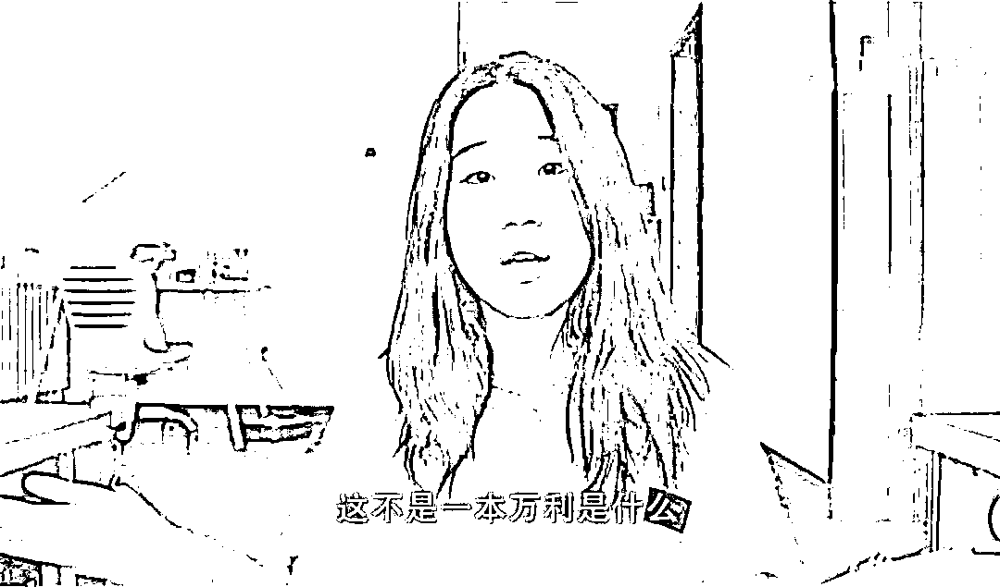
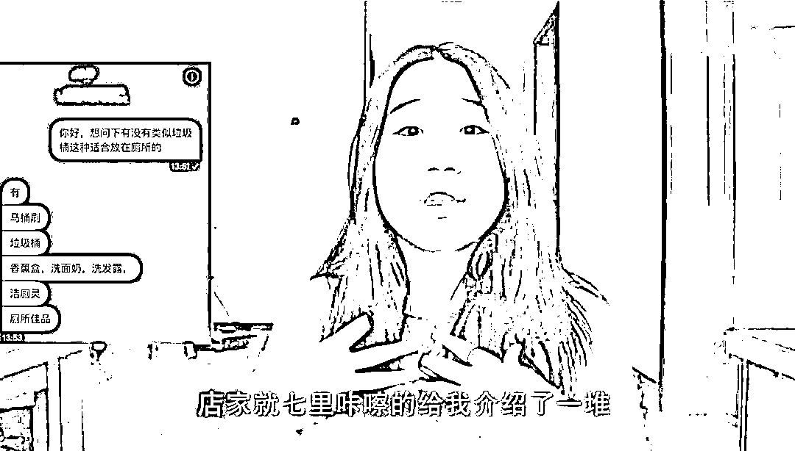

# 中国版“N 号房”：隐匿在黑暗中的无数双眼睛

> 原文：[`mp.weixin.qq.com/s?__biz=MzIyMDYwMTk0Mw==&mid=2247525315&idx=1&sn=0b7df7179063bb0cb693a0c20cf2f580&chksm=97cba8fba0bc21ed92f26dab729307e023ca61e7bb318fbb1be21a376e80140e720b10ea52f6&scene=27#wechat_redirect`](http://mp.weixin.qq.com/s?__biz=MzIyMDYwMTk0Mw==&mid=2247525315&idx=1&sn=0b7df7179063bb0cb693a0c20cf2f580&chksm=97cba8fba0bc21ed92f26dab729307e023ca61e7bb318fbb1be21a376e80140e720b10ea52f6&scene=27#wechat_redirect)

其实，让人脊背发凉的“N 号房事件”不仅发生在韩国。

12 月 3 日晚，B 站知名 UP“扒妹儿无聊的朋友们”发布的一则视频引起了社会强烈反响。

**她机缘巧合下卧底进了偷拍组织，发现了隐匿在黑暗中的无数双眼睛。**

如今，女性被偷拍的新闻时常登上热搜，受到广泛关注。

扒妹儿做这则视频的导火线，是一位粉丝向她披露了自己学校发生的一则偷拍事件。

为了求证，扒妹儿主动搜寻了该账号，意外发现了各种各样角度刁钻的偷拍视频，让她脊背发凉了好几天。

除了该账号之外，通过关键词的搜索，还能搜出许多让人目瞪口呆的违法偷拍画面，**所涉及的偷拍场景包括学校、公园、公司、商场、医院、网吧等等，这些人们平日生活娱乐的必经之地，不知何时开始，成了犯罪者的温床。**

而每个热爱生活的女性，也不知道在哪一个瞬间，成为犯罪者背地里讨论的对象。

**更让人气愤的是，偷拍者会将女性的高清正面照和偷拍画面一起传送到互联网上。**

为了找到这些犯罪者的据点，深扒背后的产业链，扒妹儿加入了几个聊天室，里面有成千上万人，入群可以选择免费或缴费两个等级。

扒妹儿形容道：**“在免费的情况下我都不知道用什么词来形容（视频画面），用不堪入目这个词都是对陌生女孩的二次伤害。”**

如果群成员选择缴费的话，就有各种套餐可供选择。群内还会有专门的人员，偷拍一些女孩的私密画面，用来盈利。

靠偷拍来盈利的还不止这种私密聊天群。扒妹儿还发现，花费一元下载某摄影 app 后，就可以在上面上传并浏览他人偷拍的画面，一个视频浏览的话需要花费 40 元，对于该软件开发者而言可以说是一本万利。

扒妹儿还暗访了某售卖偷拍器材的店，所售卖的东西可以说是只有我们想不到，没有店家做不到的，让人细思极恐，防不胜防。

<mpvideosnap class="js_uneditable custom_select_card channels_iframe" data-pluginname="videosnap" data-id="export/UzFfAgtgekIEAQAAAAAAS1IsM_VeJAAAAAstQy6ubaLX4KHWvLEZgBPE24JQYhwADYf9zNPgMIvCCFFOuD_JvqG85v9rA7a3" data-url="https://findermp.video.qq.com/251/20350/stodownload?encfilekey=okgXGMsUNLEibHKtCw1bRNicxw6C1zsevQXj6bjfUpEQ0uIzGtZ6zicSGTRsXLh0z5bJrWRyTzUlvcMaWkZdLxR5VLITXtbly5qjP0mIyicRtCA209Yqv29rD7J5sDOZ0LwUiaVrcxxcRl9p8ISP74NJgPB2R7ibJI7GFM&amp;adaptivelytrans=0&amp;bizid=1023&amp;dotrans=0&amp;hy=SH&amp;idx=1&amp;m=2da07d69d1d25ac30d1b49ca67a12c6c&amp;token=AxricY7RBHdX1sicbicSCbGgrj46nHWoV8w0AS28mqDickBciaWnXPicSg546sMBhWKyW3s9bcylibib120" data-headimgurl="http://wx.qlogo.cn/finderhead/PiajxSqBRaEISAKibugHhUQs74zK9sdqn9QvawbxCzU7AuxCgU4kpS0A/0" data-username="v2_060000231003b20faec8cae18b1bcad5cb00e937b0779ef044c516b0481d185bbca60dd9c21f@finder" data-nickname="灰产圈" data-desc="每次遇到“厕所偷拍”的新闻，大家都在告诉女生要提高警惕保护自己，但只有千日做贼，哪有千日防贼？偷拍摄像头防不胜防……马桶刷、垃圾桶 、香氛盒，洁厕灵……你说我们能防得住哪一瓶？你当然可以告诉我们提高警惕保护自己，但总不能让我们害怕在外面使用公共厕所吧 #灰产圈@灰产圈 " data-nonceid="1454119116955397016" data-type="video"></mpvideosnap>

视频曝光后，许多网友、大 V 自发转发该视频内容，警醒更多的人出门在外注意安全。

还有不少人也呼吁有关部门可以积极采取措施，不让犯罪有滋生的土壤。

2020 年初，韩国 N 号房事件在全世界引起强烈反响，不少明星出面声援受害者，希望严惩涉案人员。

**“当偷拍成为一种产业链，每一个女性都无处可逃。”**

如今，“N 号房”的缩影或许就存在于日常生活的每个角落，我们能做的就是不当冷漠的旁观者，不抱着好奇心去窥探、去伤害。

对于女性而言，穿漂亮的短裙、在月光下独自漫步，这些都不应该成为一种错误。

**法网恢恢疏而不漏，我们也希望这些躲藏在黑暗中的人，终有一天会受到法律的严惩。**

来源：盖饭娱乐官方号，昌南大队长

← 向右滑动与灰产圈互动交流 →

