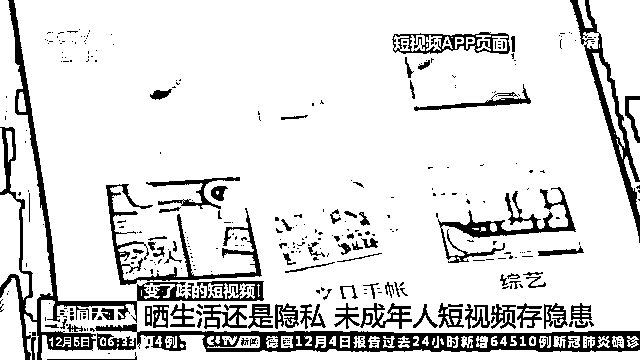
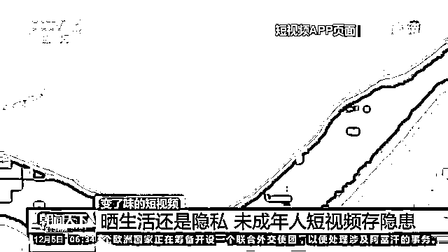
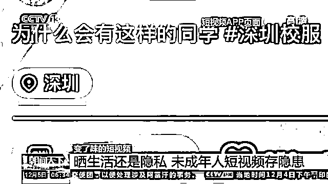
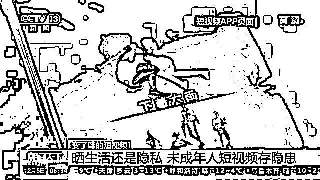
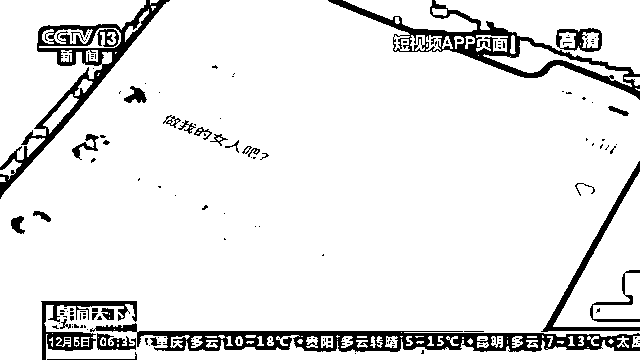
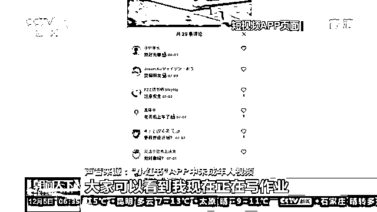
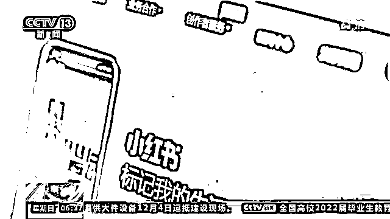

# 推送未成年人身体隐私短视频？

> 原文：[`mp.weixin.qq.com/s?__biz=MzIyMDYwMTk0Mw==&mid=2247525315&idx=2&sn=22de00bf6e0292174ee67f5950169970&chksm=97cba8fba0bc21ed4259e67d903dd252c89494ad39e1e100ceaa0638362671d5a765df71c199&scene=27#wechat_redirect`](http://mp.weixin.qq.com/s?__biz=MzIyMDYwMTk0Mw==&mid=2247525315&idx=2&sn=22de00bf6e0292174ee67f5950169970&chksm=97cba8fba0bc21ed4259e67d903dd252c89494ad39e1e100ceaa0638362671d5a765df71c199&scene=27#wechat_redirect)

今年 9 月，成都的小学生家长蒋先生在“小红书”App 上搜索亲子乐园时发现，这个 App 不时给自己推送含有大量未成年人生活的短视频，起初蒋先生以为是平台推荐了一些青少年用户的体验，但越来越多明显泄露未成年人身体隐私的视频被推送过来，让蒋先生感到担忧。

[`v.qq.com/iframe/preview.html?width=500&height=375&auto=0&vid=o3312wjyltm`](https://v.qq.com/iframe/preview.html?width=500&height=375&auto=0&vid=o3312wjyltm)

**四川成都小学生家长：**他们就经常发一些在家里穿的，类似于居家服那种睡衣之类的一些短视频，发到 App 上面去展示出来，我作为孩子家长觉得很不放心。

记者在今年 9 月下载了“小红书”App，进入这个 App 的界面后便提示记者注册账号。而记者选择了用户年龄为“20 岁”的成年人，随后，App 推荐记者选择兴趣板块，记者选择了“读书”“文具手账”等。完成注册进入 App 短视频页面后，记者发现页面已经推荐了不少和“日记手账”相关的短视频，而记者在几次刷屏操作后，一些以未成年人图片为封面的短视频就被 App 推荐过来。

在几条短视频中，记者发现，视频拍摄者都是未成年人本人，拿手机自拍时镜头直接对准了自己的隐私部位。

在一个短视频中，位置坐标显示为深圳，该短视频下方加注了“深圳校服”字样。而记者发现，这条长约 1 分钟左右的短视频，内容是尾随一名身穿校服的女学生，一路走过教室，最终进入了女厕所。视频提供的“弹幕功能”中，有人留言问“这是哪所学校的校服”，还有人要求短视频发布者“介绍一下”。

在 App 页面上，大量以未成年人为主角的短视频中不时还夹有网络游戏介绍的短视频，其名称和封面带有极强的性暗示。这个名为“游戏解说”的视频账号发布了一个游戏介绍的短视频，直接用女性角色裸露的身体作为封面，视频中还标注了“不穿衣服跳舞”的解说字幕。

而一些封面为衣着暴露的女性视频和大量包含未成年人的短视频也夹杂在一起，用户无法选择设置区分。

记者发现在含有未成年人的短视频中，还有大量的用户留言、弹幕，有的留言带有强烈的性暗示。

在一个未成年人拍摄介绍自己正在写作业的短视频下方，有 29 条评论，其中有人留言称，“妹妹，喜欢大叔吗？”还有人留言“交个朋友”“处对象吗？”还有人问这位未成年人的联系方式。

**审核存漏洞 未成年人“被带货”**

记者查询发现，“小红书”App 在其官网上表示用户数超过了 3 亿人。在记者持续两个多月的浏览中，发现该平台存在泄露未成年人隐私，留言审核不严的乱象。平台究竟如何对短视频进行管理，青少年是怎么进入平台后发布视频的呢？

有家长表示，在对约 100 个包含未成年人视频的账户进行浏览梳理后发现，“早熟”“交友”等不适合未成年人年龄段的内容平台的内容出现在“小红书”App 中，对平台的审核提出了质疑。

**四川成都小学生家长：**我觉得这个 App 应该首先要审核一下这种未成年的视频是否适合发出来，发出来之后下面有很多不堪入目的留言，孩子会不会分享他的位置，让一些不法之徒有机可乘？

记者将一些出现在“小红书”平台上的未成年人短视频问题向“小红书”App 进行了举报并了解相关情况。

**记者：**我看平台给我推送了很多未成年人，这是怎么回事啊？

**工作人员：**您这边注册的时候会让你选择你喜欢的一些类别，您选择了会根据您选择的去进行推荐。如果您没有选择的话，系统会随机推荐。

**记者：**比如说有一些成年人的短视频，就穿着也比较暴露的一些女孩，还有一些秀内衣内裤的，都混在一起。

**工作人员：**确实抱歉了，如果说有相关内容的话，可能这边是没有监管到。如果看到的话，建议您可以去举报。

**记者：**我举报了以后你们才能处理是吧？

**工作人员：**因为有一些同一时间发布的这些“笔记”会比较多，我们这边很多都是系统去进行审核的，有些可能是没有审核到。

“小红书”工作人员表示由于短视频数量多，造成了审核的漏洞。而记者发现，在“小红书”App 的用户协议中特别指出“重视青少年儿童的个人信息保护”，但在其《儿童青少年个人信息保护规则》协议中却注明，“监护人在使用社区、晒单及其他信息发布功能时，如主动向我们提供儿童青少年的个人信息，即表示已经同意我们收集和按照本政策的内容使用未成年人的个人信息。”

有法律学者表示，如此的用户协议意味着，平台对短视频中出现未成年人的内容默认为有监护人监护，一经发布则意味着监护人同意。而记者在对“小红书”平台的工作人员进一步采访中得到回复却是“短视频平台面向未成年人开放注册，并不需要实名注册”。

**“小红书”App 工作人员：**我们现在平台注册对未成年人没有要求。目前因为没有实名认证的要求，所以基本上有手机号、QQ、微信这些都是可以注册的。

一边是未成年人自己可以注册使用拍摄并发布短视频，另一边在用户协议中却又说明，视频默认是在监护人监护下发布。法律学者指出，如此的做法，平台涉嫌将责任推卸给未成年人的监护人，也造成了目前内容审核出现的问题。

**中国政法大学传播法研究中心副主任 朱巍：**因为小朋友对自己的一些私密信息没有办法来判断，作为未成年人来讲，身心可能还没有发育完全成熟，可能不太了解发出这个视频之后的影响到底会怎么样。但是对于平台来讲，对未成年人账号一定要额外地监管，没有监管随便发布任何内容，有可能会对未成年人身心健康造成很大的损害。

除了存在未成年人隐私被泄露的问题，记者还发现一些小学生也成为“小红书”平台入驻商家的“带货主播”。在该平台一个名为“酥一一”的用户中，一名身穿某小学校服的女生面对镜头，介绍一款内衣的使用感受。

记者查询发现，这个名为“酥一一”的短视频用户为一个内衣品牌。在该 App 中，“酥一一”发布了 37 条短视频，其中 6 条视频中含有未成年人，内容大都是介绍内衣的穿着体验。而在一个短视频账号中，也出现了多张未成年人穿着内衣展示的图片，同时还附上了网购商品的名称和截图。有网友留言表示，账号“为卖衣服，也不该把别人的娃发到网上”。

**短视频平台应严格履行法律规定**

日前，文化和旅游部出台关于加强网络文化市场未成年人保护工作的意见，明确严禁借“网红儿童”牟利，严管严控未成年人参与网络表演，对利用儿童模特摆出不雅姿势等吸引流量、带货牟利的账号依法予以严肃处理。

数据显示，截至今年上半年，我国网民中短视频用户规模达 8.88 亿人，而据中国青少年研究中心发布的《中小学生短视频使用特点及保护》调查报告显示，近七成的未成年人使用过短视频。法律学者指出，在短视频受众不断增加的背景下，网络平台应该严格履行法律法规规定，切实保护未成年人权益。

今年 6 月 1 日实施的新修订的未成年人保护法中明确要求，网络服务提供者对用户和信息加强管理，发现违法信息或者侵害未成年人的违法犯罪行为及时采取相应的处置措施等。而对于短视频平台提供未成年人注册的渠道，法律学者表示，平台应当严格落实未成年人保护法的规定，对涉及未成年人内容的短视频进行专门分类管理，不能放任其账号与成年人账号混杂在一起，更不应该主动推荐给陌生用户。

**中国传媒大学教授 北京市网络法学研究会副会长 王四新：**我们有一个原则性的要求，就是必须确保未成年人的信息安全，还有他（她）因为线上而产生的线下行为的安全，只要存在安全漏洞，不管是什么方面的误导性的信息，或者说诱导青少年采取不正当行为，这些平台都有责任去避免，也都有责任去做积极的防范措施。如果平台没有做好防范措施，或者说没有能力去做好，我们的处罚就要及时地跟上去。

而对于实名注册的问题，自 2017 年 6 月 1 日网络安全法实施以来，涉及互联网社区的管理规范相继出台，明确了在互联网论坛社区服务、跟帖评论服务、群组信息服务以及公众账号信息服务中实行“后台实名、前台自愿”原则。法律学者指出，网络平台忽视相关的法律法规，造成未成年人权益受损，也必将受到法律问责。 

**媒体：小红书道歉**

据中国经济网 12 月 5 日报道，近日央视新闻报道称，小红书涉嫌泄露未成年隐私及内容审核不严问题。对此，**小红书对报道提及审核漏放情况致歉，并透露平台将于近期启动新一轮未成年治理专项**。

小红书回应称，报道中提及的部分内容，在平台此前的未成年专项回查中已经被处理。对于实名认证问题，平台严格按照相关规定，对用户要求实名认证，包括新注册用户及发布笔记、评论用户均需绑定个人手机号，专业认证、带货用户需上传个人身份证。

据悉，按照《未成年人保护法》及相关法规政策，小红书先后成立了多个未成年治理专项，包括升级和优化青少年模式，严禁未成年人直播、打赏，严禁炒作“网红儿童”、诱导未成年人打赏及其他不符合正向价值观的内容等。

“我们深知未成年问题无小事，需要持续提升治理能力，加大治理力度。”小红书相关负责人表示，近期平台将启动新一轮未成年治理专项，提升未成年用户和相关内容的识别能力，并重点针对未成年短视频内容、评论区画风等问题展开治理。

“我们也恳请广大用户，通过平台举报渠道，对影响未成年人身心健康的内容及账号进行举报，平台将在第一时间进行处理。”相关负责人表示。

来源：央视新闻客户端、中国经济网、红网

← 向右滑动与灰产圈互动交流 →

