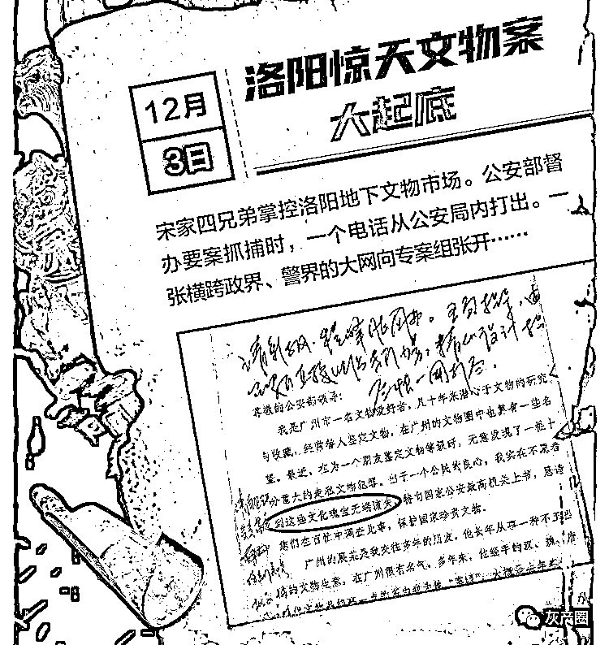
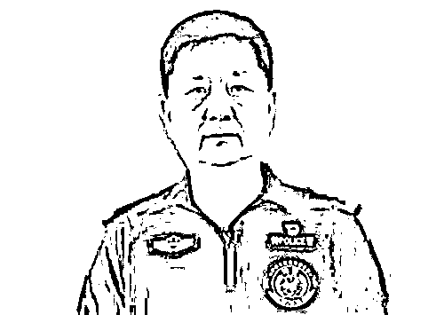
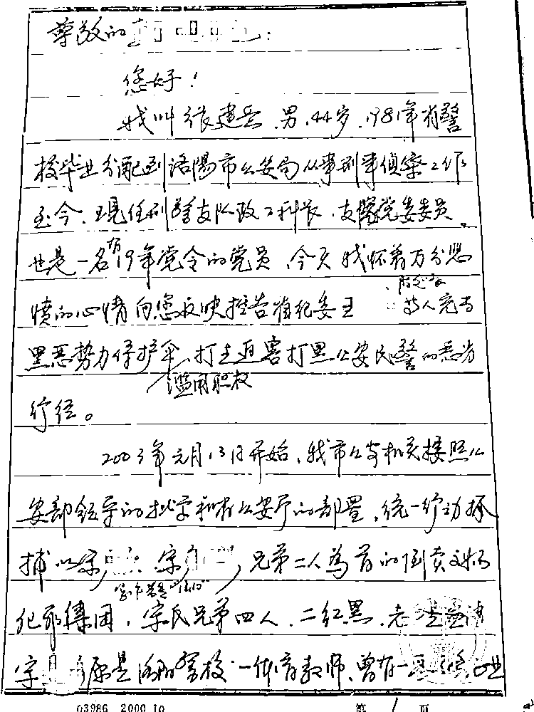

# 河南省司法厅原厅长被查牵出惊天文物大案

> 原文：[`mp.weixin.qq.com/s?__biz=MzIyMDYwMTk0Mw==&mid=2247525315&idx=3&sn=409b24de2cf2b50701d264807e06a430&chksm=97cba8fba0bc21edd38163c6d9a3fe0b4d07338d0bdf3149e80da13aa651807a6f05aa90e01b&scene=27#wechat_redirect`](http://mp.weixin.qq.com/s?__biz=MzIyMDYwMTk0Mw==&mid=2247525315&idx=3&sn=409b24de2cf2b50701d264807e06a430&chksm=97cba8fba0bc21edd38163c6d9a3fe0b4d07338d0bdf3149e80da13aa651807a6f05aa90e01b&scene=27#wechat_redirect)

**2021 年 12 月 2 日，河南省洛阳市公安局发布通告，公开征集宋彦彬、宋彦海、宋彦庆、宋彦洪四兄弟违法犯罪线索。**

此前一天，宋氏四兄弟之一的宋彦海，被洛阳市纪委调查（时任洛阳市公安局二级高级警长）。而之前的 7 月 14 日，河南省司法厅原厅长王文海被省纪委立案调查。这意味着搁置十几年的“12·10”洛阳惊天文物大案终于开始重启侦查。

上游新闻记者梳理了这起大案从立案到侦破到不了了之的全过程，数度惊叹于其中的重重内幕和惊心动魄，也感叹于原专案组成员十多年不屈不挠的申诉和曝光，结合媒体公开报道和上游新闻记者获得的专案组成员的申诉材料，我们分三篇文章来解析这一重见天日的奇案。

**【一】两兄弟藏品超过洛阳博物馆**

**要点提示：这是一个掌控了洛阳盗墓地下市场和文物倒卖市场的涉黑集团，宋氏四兄弟“两红两黑”，宋老大和宋老三负责文物盗掘和倒卖，宋老二和宋老四在洛阳市警方任职，有负责疏通关系和提供保护的嫌疑。该团伙经过十余年的经营，获取暴利无数，并用金钱在河南政界、警界织就了一张强大神秘的关系网。**

***1 *****地下文物“掌眼人”的举报信**

2002 年年末，公安部接到一封举报信，署名是“一名爱国的文物爱好者”，该信由海外寄出。

这封信写了什么？

2018 年 6 月 22 日，上游新闻记者沈度对这个案子曾经做过调查，这封信的内容令人震惊。

举报者自称是一名文物爱好者，经常替人鉴定文物，在文物圈里有一些名气。他和广州的展某是多年的朋友，展某长期从事一种不正当的文物生意。举报人是展某经手汉、魏、唐等文物的“掌眼人”。

2001 年春天，展某从洛阳买回一批文物，请其去鉴定，他看到了两匹 85 公分高的五彩加蓝釉马、两匹 90 公分高的三彩骆驼、两头唐三彩狮子、一个三彩鸡头壶等一批文物。他一眼就认出这些是正宗的唐代文物，价值不菲。他后来听说展某以 1200 万元的价格卖到了澳门。

2002 年 11 月，展某又将其带到洛阳老城附近的一栋堪称“精品文物世界”的民宅，内有汉唐文物 200 多件，一匹 1.2 米高的三彩马堪称是国宝。他研究收藏了一辈子文物也没亲眼见过如此精品，如果卖出去价值至少在 5000 万元以上。

展某告诉他，文物是洛阳的宋氏兄弟存放的。此次洛阳之行，他还在金水湾大酒店里与宋老大（宋彦彬）和宋老三（宋彦庆）、洛阳市公安局刑警支队缉私队队长曲某（曲金华，已被立案调查——编者），一起吃了饭；他还去参观了洛阳市文物博物馆，但他发现宋家兄弟所私藏的文物数量和品位，远超博物馆。

回到家后，他良心不安，如果不彻查此事，国家将蒙受巨大损失。举报信的末尾，还附上了展某和宋家兄弟的电话。

在有关媒体后来的采访中发现，这个发明了洛阳铲的地方盗墓现象十分猖獗，时任洛阳市第二文物队队长朱亮说：“如今的邙山古墓群，已经是十墓九空，甚至是九九空。”

***2 *****触目惊心的调查结果**

时任公安部副部长白景富在举报信上批示：“由河南省公安厅直接组织专门力量，精心设计指挥、尽快一网打尽。”公安部刑侦局召集河南、广东两省公安厅负责人召开会议，要求破获这条洛阳通往广东的文物盗掘倒卖通道。

该案件由洛阳市公安局具体负责侦破，“12•10”专案组随之成立，本案也成为公安部督办案件。时任洛阳市公安局局长张太学和副局长兼刑侦支队支队长李小选组织精干警力侦办此案。

根据专案组民警后来向各级部门递交的申述材料显示，通过秘密侦查发现，宋氏兄弟共四人，老大宋彦彬和老三宋彦庆，从 1990 开始从事盗挖、倒卖、走私文物犯罪活动；老二宋彦海，时任洛阳市孟津县公安局政委、后任局长；老四宋彦洪，在洛阳市公安局刑侦支队工作，其岳父是洛阳市主管组织工作的市委副书记。

时任洛阳市孟津县公安局政委、后任局长的老二宋彦海

经专案组进一步侦查证实，宋氏兄弟在洛阳市公安局刑警支队缉私队队长曲金华的扶持下，其势力日渐强盛，已成集团化管理。该团伙主要成员按照古墓葬的区域分布每人都有自己的势力范围，手下雇佣打手和当地的盗墓人员，对古墓进行疯狂盗挖，盗挖出来的文物全部交宋氏兄弟，他们在洛阳和广州各设有专门仓库保存文物，然后由宋氏兄弟联系广东、港澳等地区的文物贩子进行交易。如有意外，缉私队队长曲金华则以宋氏兄弟是他的线人为名进行保护。

在新京报 2004 年的调查报道中，记者曾当面采访了曲金华，他辩解说，在他担任缉私大队长时，曾在整个洛阳文物黑市发展多个线人，由此才能掌握诸多线索进行破案。

当时专案组向上级的汇报材料显示，专案组调查发现，在洛阳，农民在自家地里挖出的文物也要低价卖给宋氏兄弟，否则要么遭到殴打，要么由曲金华出面收缴、罚款。而广东来洛阳收购文物的贩子只要是从宋氏兄弟手里买文物就会十分安全，否则曲金华就会抓人罚款，收缴文物。有一次，宋氏兄弟的马仔陈宾到一农民家里收购文物，因价格发生激烈争执，陈宾随手拿起五连发猎枪把那名二十多岁的农民打死在家中。2000 年，宋氏兄弟的手下买了一对梅瓶和一个瓷碗，发觉是假文物后，带人持铁棍、尖刀将卖主带到宾馆将其腿打断；2001 年，宋氏兄弟的手下发生内讧，有人被抢打死，宋老三赶到现场善后。

该团伙经过十余年的经营，已获取暴利数千万元，并用金钱在河南政界、警界织就了一张强大神秘的关系网。宋氏兄弟在洛阳开歌厅、桑拿、酒店、搞矿山、办古玩城，整日一帮打手陪伴左右十分威风，他们有时去港澳地区做文物交易，曲金华都会全程陪同，还将宋氏兄弟介绍给港澳警方的同行。宋氏兄弟经常在公开场合自称为洛阳黑道老大，在洛阳没有他们办不成的事情，做人十分高调。

大量的证据专案组已收集在案，其中部分案子后来被法院审判定罪。

接下来，就该抓人了。

**【二】绝密抓捕中的诡异电话**

要点提示：一次绝密的抓捕，却因为行动前一个从公安局打出去的神秘电话，导致主要嫌疑人逃脱。尽管锁定了报信嫌疑人，却无法采取任何行动。同时，一名纪委系统的副厅级官员也被牵涉入此案。

***3 *****走漏风声的绝密抓捕**

2003 年 1 月 13 日晚的大抓捕，本来是一次绝密行动。

行动之前，全洛阳市只有书记、市长、公安局长等不超过 5 个人知道。行动指挥机构特意设在市郊邙山一个部队招待所。“行动之前才通知各县分局一、二把手开会，人到齐了还不知道要开啥会。”一位原专案成员在接受媒体记者采访时说，直到当晚正式行动的时候，各人才领到自己的任务，“要抓的是哪一位，人现在哪个地方，都给大家说得清清楚楚。”

然而，行动进行到翌日凌晨，抓捕信息陆续反馈回来后，洛阳市公安局局长张太学黯然回家，这次行动抓到该团伙成员 20 多人，收缴各类文物 200 多件，但主要嫌疑人宋氏兄弟逃脱。

“后来调查得知，布置抓捕行动时，有一个电话从公安局打了出去，像电视剧《人民的名义》里的那个电话。”2018 年的采访中，刑侦支队长李小选对上游新闻记者说。

在申述材料中，这个电话直指洛阳市公安局刑警支队缉私队队长曲金华，认为是他通风报信。但对曲金华的调查却无法进行下去，因为此时他正借调省纪委第五监察室，拒不接受审查，和专案组玩起了躲猫猫。同时，宋家老二和老四也被调查，是否有通风报信的情况，一个月后调查无果。

半个月后，宋家老三宋彦庆被抓捕归案，而老大宋彦彬一直潜逃无踪。

在接受媒体记者采访时，宋彦海和宋彦洪自称对于宋家老大和老三涉嫌盗掘和倒卖文物的情况毫不知情。“如果之前知道三哥倒卖文物，肯定会予以制止，如果他不听，我们肯定就翻脸了。”宋彦洪说。

专案组核心成员介绍，截至 2004 年初，“12·10”专案组共抓获嫌疑人 91 名，掌握该团伙各类刑事犯罪案件 164 起，涉及文物达 1116 多件，有 14 人被判刑。宋彦庆被判五年半，罚金 10 万元。

据上游新闻记者 2018 年采访到的情况，宣判后仅过了两个月，宋彦庆就保外就医。老大宋彦彬一直外逃至 2016 年才向警方投案自首，但不久后就出来了，多人在矿场和 KTV 里见过他。

***4 *****厅级干部卷入此案**

除了曲金华，这起案子还牵出另一个人。

专案组的调查显示，该案主犯与时任河南省纪委一名副厅级干部王某过从甚密。

根据专案组的举报材料显示，2004 年 3 月，关在看守所一年之久的文物案另一名主犯蔡武堂为了立功，突然告诉看管民警，他有重大事情要举报，只向市公安局局长张太学举报。张太学带着另一名民警去见了蔡，蔡武堂说要举报河南省纪委的王某，王某所在部门主管洛阳、三门峡等豫西地区。蔡武堂的举报内容涉及王某的诸多方面，重点举报了 1998 年的交通事故“顶包案”。

七年后（2011 年），专案组成员张建岳等三人对王某进行实名举报，才揭示了这一“顶包案”的内幕：1998 年 6 月 22 日夜 11 时 50 分左右，王某酒后驾驶省纪委办案暂扣的奥迪轿车途经郑州市经五路与纬一路交叉路口，闯红灯将骑两轮摩托正常行驶的郑州市市民史英光撞倒，撞人后轿车继续前行，后撞到旁边的一棵大树才停下。史英光左小腿当场被撞成两截。事发后王某下车在现场短暂停留，并与人手机通话，然后离开现场。……在文物贩子蔡武堂的帮助之下，王某找来了当时刚刚刑满释放不久的洛阳籍商人高和平，当晚，几人经过商议，由高出面为王某顶包。“专案组派人对蔡武堂的举报进行了调查。但后来纪委调查时，蔡武堂和高和平突然翻供，这导致对王某的处理未能及时作出。”曾担任“12·10”专案组成员的一位警察回忆。

2011 年，南方都市报记者调查此事时与时任河南省司法厅厅长的王某通了电话，通完电话后不久，该记者的手机莫名被充了 3000 元话费。而郑州交警一大队一位负责人表示，这起交通案当年的卷宗在多年的机构改革过程中，已经灭失。

2021 年 7 月，河南省纪委通报：河南省司法厅原厅长王文海涉嫌严重违纪违法，接受调查。文物案侦办期间，他担任河南省纪委第五纪检监察室主任（副厅级）。

然而，这起案件到这里远远没有结束。

**【三】消失的专案组**

要点提示：文物案侦办过程中，专案组突遭袭击，多名专案组成员被“双规”，核心成员全部被调离警界，专案组事实上解散。该案从 2004 年起搁置，没人敢接手，直到现在都未能结案。据专案组的举报材料称，该案遭到时任河南省纪委第五纪检监察室主任王文海（副厅级）的插手，为“12·10”专案主要嫌犯充当保护伞。

***5 *****专案组平地起风波**

尽管洛阳文物案的侦办遇到各种意外，但洛阳市公安局局长张太学还是顽强地推进下去。

直到风波突起。

这是电视剧里才会出现的场景：专案组成员全部“出问题”了。

2004 年 3 月前后，河南省纪委突查洛阳市公安局刑警支队“小金库”。受“小金库”问题影响，2004 年 5 月前后，直接管理账目的工作人员，如会计、出纳受到相应处罚、处分。支队秘书科科长尤益民调出支队，进入巡警支队任职副大队长。文物案主办侦查员张建岳被“双规”，后来调出市局，调任分局副局长。6 月，洛阳市公安局局长张太学突然接到调令，调任河南省人防办副主任（副厅级）。同年年底，洛阳市公安局副局长、刑警支队支队长李小选调出公安系统，进入市委政法委，任副县级调研员。

由于尤益民当时负责文物案的全部案卷和材料，张建岳此前任支队大案大队队长，时任文物案的主办侦查员，李小选任刑警支队支队长，张太学是专案组总指挥，这些人都属于专案组的骨干力量，他们的突然被处理，自然使得专案组“不撤自销”。

吊诡的是，张建岳当时被“双规”，他趁工作人员看守不紧，偷偷逃了出来，去北京上访。上访回来后，却在单位正常上班，而他“双规”后出逃的事，却无人追查，最后不了了之。

“查‘小金库’是幌子，他们的真实目的就是整人，阻止我们继续查案！”2011 年 3 月 21 日，张建岳激动地向《瞭望东方周刊》表示。这一年，他和洛阳市公安局原副局长李小选、民警尤益民实名举报河南省司法厅厅长王文海，举报其充当文物案主要嫌犯的保护伞。遗憾的是，直到前几年去世，张建岳都未能看到本案重启的一天。

（张建岳给河南省领导写的反映材料）

上游新闻记者拿到的专案组民警申诉材料叙述：（“小金库”案）由省纪委第五纪检监察室挂帅，洛阳市纪委配合工作，专案组先后有四名同志被双规审查，其余的同志有的被长期叫去配合调查不准回家，有的被停职检查，一些办案车辆被扣，多数同志的办公室被突然强行搜查，存有专案大部分材料的笔记本电脑也要收缴，唯一一名专案内勤尤益民同志因拒绝交笔记本电脑而遭到处分调离。很多专案人员被反复叫去谈话，他们甚至公开训斥“12·10”专案人员：“你们为什么要抓曲金华，谁让你们抓曲金华？我们搞死你们几个科处级小官就像踩死几只蚂蚁一样。”几年来他们精心策划了一起又一起“违纪门”事件，致使多名专案骨干受到处分。而每一次、每一名专案骨干受到纪委查处前，曲金华和宋彦海（宋家老二）总要在一定场合散布：“某某某快出事了，纪委很快就要查他。”而他俩的预报每次都有省、市两级纪委的查处得到验证。……在此情况下，包括省厅领导在内的专案领导和民警都产生了严重的畏惧心理，感受到了极大的压力，侦查工作被迫停止，李小选和多名专案骨干进京到公安部上访，汇报专案民警遭遇到的迫害，在刑侦局领导的多次协调下，在公安部和河南省委领导的关心和帮助下，李小选等同志才敢从北京回洛阳上班。

至此，“12·10”专案事实上被搁置了。申诉材料叙述说，专案的卷宗，洛阳的民警谁都不愿保管，并找出种种理由推托，说这是部督案件，案卷应该由省厅保管，可省厅也不愿沾手此事，最后，经市局领导和省厅领导多次协商，市局出资 80 万元，才将卷宗交到省厅刑侦总队保管。

该案作为公安部部督大案，一直到现在都未结案。

***6 *****小金库是历史遗留问题**

那么“小金库”问题到底是什么问题？

纪委调查显示，1994 年至 2004 年的 10 年间，洛阳市公安局刑侦支队共存有总额约 1600 多万元的账外资金。

“这是一个体制遗留问题。当时管理不严，全国很多公安局都是这样做的。这些钱经过队里的会计，都用于办案了。”李小选介绍，当时刑侦支队每年需要经费 250 万，但财政拨款每年只有 40 万元左右。经争取，市局给予支队“返还罚没款 40%’的政策，同时，支队和烟草局、电业局联合成立办案中队，每年由两部门各提供 50 万元的办案经费；和交警部门开展防盗抢业务，每年收入 90 万元。历年累加，达到了 1600 多万。

关于“小金库”问题，记者拿到一份来自专案人员一方的说明情况材料，材料说：“实事求是地讲，刑侦支队在财务管理上存在一些问题。……以上经费的来源和用途是经市领导协调，市公安局领导同意，刑侦支队党委集体研究，并建立了严格的管理制度，每年都经审计部门、财务部门审计。”

当年，专案组核心成员有 10 余人受“小金库”问题影响，均被调离刑侦支队。而纪委对“小金库”问题的处理，也仅限于随后展开的一轮人事调整。

“多年来，没有看到案件继续查办下去。曾经锁定的个别疑犯，却堂而皇之走在大街上。”一名原专案组人员告诉记者，偶尔看见这些人，心里不是滋味，“觉得自己很冤”。

这似乎是一场你死我活的斗争。不过，专案组人员也庆幸当初的“小金库”属于历史遗留的普遍问题，“如果个人被查出问题，恐怕早就被送进监狱去了。”

事实上，自专案组解散以来，部分专案组成员就无数次向有关纪检、公安部门喊冤，10 多年寄出近 2000 封举报信，一是要求文物案能够彻查到底，二是对于已经审问出来的官员违纪违法线索要查个结果，给个说法。

“12·10”文物案从 2004 年开始，先后有新京报、南方都市报、华商报、瞭望东方周刊、上游新闻等全国性媒体实地调查报道，人民网、新华网等转发报道，报道前后延续了 17 年，舆论影响不可谓不大，该案却离奇地始终处于搁置状态。

直到日前王文海和宋彦海相继落马后，该案才重新启动。

来源：上游新闻，巴蜀反诈

← 向右滑动与灰产圈互动交流 →

# 

> 原文：[`mp.weixin.qq.com/s?__biz=MzIyMDYwMTk0Mw==&mid=2247525315&idx=4&sn=86cf27d055cae8f9224d506235505afa&chksm=97cba8fba0bc21ed19c859ec3b19713b6947cb921395522ef51cdbc69ed3f901d198f18001fa&scene=27#wechat_redirect`](http://mp.weixin.qq.com/s?__biz=MzIyMDYwMTk0Mw==&mid=2247525315&idx=4&sn=86cf27d055cae8f9224d506235505afa&chksm=97cba8fba0bc21ed19c859ec3b19713b6947cb921395522ef51cdbc69ed3f901d198f18001fa&scene=27#wechat_redirect)