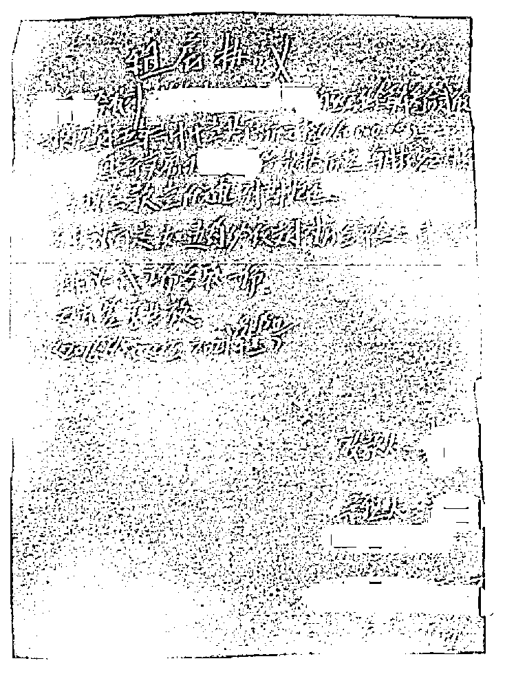
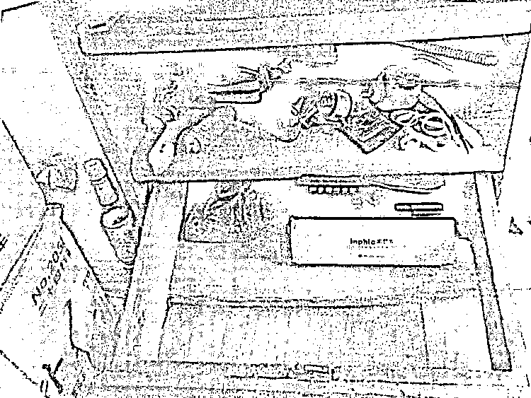

# 女房东一夜白头，租金没收到还倒欠租客 10 万元？

> 原文：[`mp.weixin.qq.com/s?__biz=MzIyMDYwMTk0Mw==&mid=2247525315&idx=5&sn=223b13c671a2fb59575e09f31a94168e&chksm=97cba8fba0bc21ed91b25a3a61dad49685901eff83973098291f217e33d5e1cbaec3172adc28&scene=27#wechat_redirect`](http://mp.weixin.qq.com/s?__biz=MzIyMDYwMTk0Mw==&mid=2247525315&idx=5&sn=223b13c671a2fb59575e09f31a94168e&chksm=97cba8fba0bc21ed91b25a3a61dad49685901eff83973098291f217e33d5e1cbaec3172adc28&scene=27#wechat_redirect)

在将门面房外租十多年后 

40 多岁的上海女子倪某找到租客廖某

提出要涨租金

不久之后

廖某却拿出一张借条

**要求倪某还款 10 万元**

由于借条上确有倪某**本人签名**

**倪某为此急到一夜长出满头白发**

法院判决倪某败诉后

她持续上访

**坚称自己被冤枉了**

5 年后

在检察机关介入下

这起案件发生了**“大反转”**

**空白纸条上签字留后患**

2019 年 9 月，上海市青浦区人民检察院收到公安移送来的一起申诉案件。这是一起因欠债纠纷而产生的普通民事案件，人证物证俱全，法院已经结案，然而**被告却始终坚称自己被冤**，不服判决，持续上访。承办检察官发现，被告情绪十分激动，在叙述案情时甚至数次因血压升高、身体状况过差而晕厥，这令检察官对这起案件更加审慎办理。

这名被告正是倪某。2003 年起，她就将名下的一套门面房租给廖某开棋牌室，租金为 1.6 万元一年。几年后，廖某主动提出以收条代替租赁合同。**倪某文化程度不高，只会写自己名字，见收条简洁明了，便答应了。**此后十余年，廖某每年支付房租时，都会写好收条，再交给倪某签字。

2016 年 7 月，倪某打算置换房屋，但还差 3 万元，她与房主商量好，在收取当月房租后补款。随后，倪某告知廖某，**房租将涨至 3.2 万元**。廖某听后表示，需要一点时间去筹钱。8 月中旬，廖某通知倪某前来拿钱，倪某遂与房主一同前往。房主在棋牌室门外等候，倪某独自上楼找廖某，几分钟后，两人一同下楼。**三人在棋牌室内点清 3.2 万元现金，倪某按例在收条上签名。**

此时，**廖某却拿出一张折起的纸片**，要求倪某在上面签名并留下电话号码。倪某虽有些不解，但**还是照做了**。

**“真签名”导致败诉需赔偿**

一年后，倪某突然收到法院通知，**廖某起诉要求她还钱**。廖某拿出了一份两人的租房借款协议，上面写着：**倪某今收到廖某房租每年 3.2 万元，一次性付 5 年共计 16 万元整，并因新卖房向廖某借款 10 万元整，每月按 2%计息。**右下角还有倪某的签名，经鉴定确系本人所签。

涉事借条。图片来源：新闻晨报·周到 APP

得知此事后，倪某急火攻心，一度无法站起，**40 多岁的人却长出了满头白发**。

2018 年 1 月，该案一审开庭，**廖某不但有租房借款协议，还有数名证人出庭作证**。两人是当时在棋牌室内的顾客，证明亲眼看见倪、廖两人交割钱款“20 万余元”，另一名证人是廖某的妹夫，作证廖曾向他借款 10 万元用于借给房东，连交付时间、位置、储存的包等细节都清晰无比。

人证物证俱在，法院认可了这份协议的效力，**这就意味着，倪某不仅要把房子继续租给廖某 5 年，还要偿付廖某 10 万元借款及 2%的月利息。**

倪某不服判决，多次上访。2019 年 9 月，该案由公安机关移送至青浦检察院审查。

**妹夫良心不安成突破口**

曾出庭作证的**廖某妹夫宋某成了本案的第一个突破口**。在检察官多次询问案情后，早已良心不安的宋某道出了他所知的部分真相：**廖某不曾向他借 10 万元钱。**

宋某回忆，2017 年 1 月，案件开庭前，廖某找到他，表示房东倪某去年买房时曾向自己借钱。如今自己想向房东收取一些利息，但碍于十几年的情面不好开口，所以想请宋某帮忙，假装这笔钱是从宋某这里借的。当时，宋某琢磨着只是一点利息，不是什么大事，遂答应出庭作证，并提前商量好证词。法院判决后，宋某才意识到事情没这么简单，**自己也被廖某骗了**，逐渐生出后悔之意。

有了宋某的证词，公安机关以涉嫌诈骗罪对廖某立案侦查。但宋某的证词也只是一面之辞，真相依旧扑朔迷离。

在仔细研判后，检察官选定了几个调查方向。首先，对廖某经营收入进行合理评估，同时引导公安机关寻找专业绘图公司进行全屋布局绘制，谨慎分析来往人流路线图。绘制图显示，两名顾客不可能在短短一瞥之下就看清当时三人清点的钱款数目。其次，检察官到棋牌室现场勘查，**发现廖某声称用于存放大额现金的抽屉竟然从不上锁，且破损严重**，所在房间临近通向棋牌室的楼梯，平日人来人往，不像常人存放大量现金时会选择的地点。最后，检察官找到了向倪某出售房屋的房主，证实倪某下楼时身边并无大型拎包可以装下其余“23 万元”，他们收取 3 万元现金后，立即前往房地产交易中心办理手续，全程并未见到剩余的钱款。

综合多份证据，**2019 年 9 月，检察机关对廖某作出批准逮捕决定**。

用于存放大额现金的抽屉竟然从不上锁。图片来源：新闻晨报·周到 APP

**真相大白房客锒铛入狱**

2020 年 7 月，廖某因同一份借款协议再次走上法庭，不过这次是以刑事案件被告人的身份。庭上，廖某拒绝认罪，声称自己有证人可以作证。法庭遂决定暂时休庭，补充取证。

此时，宋某的证词已被其本人推翻，曾出现在棋牌室的那两名顾客的证言就显得格外重要。2020 年 8 月至 2021 年 4 月，检察机关指导公安机关对当时出庭作证的另两名证人予以重新取证，这才得知廖某的律师曾找过他们。当时，他们只见到廖某与倪某在点钱，并没有看清具体数额。僵持之下，律师却多次强调，廖某当时给了倪某 26 万元。**受律师影响，两名证人便以为这是真实数额，法庭上也如此作证。**

至此，民事诉讼时的所有证言都已被推翻，检察机关对证人新证言固定后要求其出庭作证。

**2021 年 9 月，法院全部采纳检察机关所递交证人证言及证物，对本案审理终结。法院认定，被告人廖某以非法占有为目的，虚构事实，隐瞒真相，骗取他人财物，数额巨大。以诈骗罪判处其有期徒刑两年半，并处罚金。目前，该判决已生效。**

由于廖某已被定罪，原来的民事判决书失去法律效力，廖某的代理律师因涉嫌违规诱导证人做伪证，也被所在地司法局严肃处理。倪某总算“沉冤得雪”。原来，倪某提出涨房租时，廖某正在筹钱给儿子在老家盖房，他觉得倪某是在趁人之危，遂设计报复。协议的内容是他在诱骗倪某在空白纸条上签字后，才写上去的。

来源：上观新闻、新闻晨报·周到 APP、潇湘晨报

← 向右滑动与灰产圈互动交流 →

