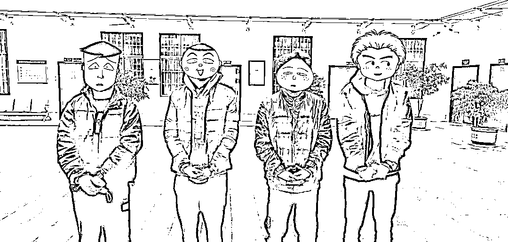

# 年度最奇葩，嫌疑人到反诈中心开证明，团伙成员询问情况，团灭！

> 原文：[`mp.weixin.qq.com/s?__biz=MzIyMDYwMTk0Mw==&mid=2247525371&idx=2&sn=848bc019a3bb22ea32e8477764c048bb&chksm=97cba8c3a0bc21d5b988ada95b8a4b1e9b28406e9049f7e646201087fc96d2ba9aa5e1f7188f&scene=27#wechat_redirect`](http://mp.weixin.qq.com/s?__biz=MzIyMDYwMTk0Mw==&mid=2247525371&idx=2&sn=848bc019a3bb22ea32e8477764c048bb&chksm=97cba8c3a0bc21d5b988ada95b8a4b1e9b28406e9049f7e646201087fc96d2ba9aa5e1f7188f&scene=27#wechat_redirect)

[`v.qq.com/iframe/preview.html?width=500&height=375&auto=0&vid=e331270fv4t`](https://v.qq.com/iframe/preview.html?width=500&height=375&auto=0&vid=e331270fv4t)

男子杨某银行卡被冻结到银行查询后，银行工作人员告知其银行卡是被公安机关冻结的，需到公安机关开具证明后才能办理解除冻结，12 月 2 日 16 时，杨某到昆明市公安局呈贡分局反诈中心反映其银行卡被冻结不能正常使用的情况。

经反诈中心民警查询，杨某名下多张银行卡因涉嫌电信网络诈骗被公安机关司法冻结，且该男子自称没有正当工作，且无法说明银行卡内资金来源。在发现异常情况后，民警立即将杨某传讯到办案区做进一步的调查。

当晚 19 时，一名自称王某的男子打电话到反诈中心询问杨某的情况，民警通知其到反诈中心实地了解情况，王某表示晚点过来。

12 月 3 日凌晨 1 时，王某及 3 名同案嫌疑人开车抵达分局反诈中心楼下，王某在下车后上楼向民警询问情况时，民警将在车内等候的另外 3 名同案嫌疑人一并抓获。 

经调查，王某为嫌疑人的朋友，不涉及犯罪。 

杨某万万没想到，自己本想到公安机关开个证明，却带上了团伙一起自投罗网，目前 4 人因涉嫌帮助信息网络犯罪活动罪已被公安机关采取刑事拘留强制措施，案件正在进一步办理中。

**警方提示：**

出租、出售电话卡、银行卡为通讯网络诈骗犯罪提供了“温床”，大量“实名不实人”的银行卡、电话卡等被骗子购买后用于诈骗犯罪，给人民群众造成了巨额财产损失。

市民朋友要增强法治意识和防范意识，重视自己的信息安全，切勿出租、出售、出借或者购买银行卡、线上支付账户，切勿参与任何形式的为电信诈骗团伙转账洗钱的活动，坚决拒绝从事违法犯罪活动，避免成为诈骗分子帮凶。如市民发现相关违法犯罪线索，请第一时间拨打 110 报警电话进行举报。

来源：呈贡警方发布，昆明反电信网络诈骗中心

← 向右滑动与灰产圈互动交流 →

