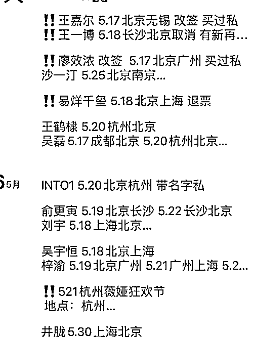

# 4 名追星族被抓！

> 原文：[`mp.weixin.qq.com/s?__biz=MzIyMDYwMTk0Mw==&mid=2247525371&idx=4&sn=11f8bb2a977550a65d48cbd9539c5f6e&chksm=97cba8c3a0bc21d502eee588f3ac41d18340229a6e086314059ddd1a0c0809cf3074318a0842&scene=27#wechat_redirect`](http://mp.weixin.qq.com/s?__biz=MzIyMDYwMTk0Mw==&mid=2247525371&idx=4&sn=11f8bb2a977550a65d48cbd9539c5f6e&chksm=97cba8c3a0bc21d502eee588f3ac41d18340229a6e086314059ddd1a0c0809cf3074318a0842&scene=27#wechat_redirect)

近日，杭州 4 名 00 后、95 后追星族贩卖肖战、王嘉尔等明星的航班信息，结果被抓了。

一条信息几十元

4 追星族售卖明星航班信息被抓

据钱江晚报新闻报道，近日，在杭州萧山机场周边窝点，杭州警方抓获了朱某某、赵某某等 4 名贩卖明星航班信息的犯罪嫌疑人。 

经调查，团伙利用非法手段搞到明星个人信息，然后在机场航站楼内自助值机机器上获取更多航班信息，再将这些航班信息拿到社交软件的追星群、后援团里出售，**一条信息卖几十元。**

此外，他们还售卖“送关机票”，只要粉丝购买了“送关机票”，就可以通过机场安检进入候机大厅，从而离明星更近，见面时间更长。

等过了安检，团伙会马上组织追星族退票**，中间扣几十元钱，作为“送机”的“费用”**。

9 月 28 日，朱某某、赵某某等 4 名犯罪嫌疑人被警方抓获。经过调查，**4 名嫌疑人都是 00 后、95 后，本身也追星，曾经也购买过自己“爱豆”的航班信息。**之后，自己也开始干。 

**他们从事贩卖有两三个月，贩卖过包括王嘉尔、肖战等明星的航班信息。**

网友看完纷纷要求严查严惩。

近年明星航班、酒店等信息泄露事件频发

其实，近年来，明星私人信息遭泄露、售卖事件频发。

2017 年 10 月，演员刘涛曾发文斥责航班消息被泄露，并呼吁有关部门管理此事。刘涛晒出的图片显示，其信息包括她往返北京、上海、三亚三地的工作具体行程及日期。

张若昀也曾发文痛斥私人信息遭泄露。

有记者调查发现，售卖明星各类隐私信息已成了黑灰色产业链，在网上很容易就能购买明星的各类隐私信息。一名卖家的朋友圈内，长期更新大量艺人的行程信息，其表示，只需 200 元，便可买到当红人气偶像的身份证号。

一些出售明星航班等隐私信息的卖家通常还会采用字母暗语代替所售商品。“sfz”即“身份证”，“sjh”手机号，“sg”即“刷关”，“hb”即“航班”等，以此来掩人耳目。

而明星航班信息遭售卖、泄露不仅给明星本人造成困扰，还可能导致机场追星事故的发生，扰乱民航飞行和机场公共秩序。

2019 年 4 月，上海虹桥机场的玻璃直接被追星粉丝挤碎了。

据报道，2017 年北京首都机场 T3 航站楼有记录的粉丝警情就达 20 起，粉丝规模都在 50 人以上；2018 年有记录的粉丝警情达 7 起。

其中，2018 年，上海有 20 多名粉丝为了追星，买了机票全程追踪。在虹桥机场登机时，粉丝为了拍摄明星，不听工作人员劝阻，堵在登机口导致航班延误超过两个小时。

非法获取明星航班信息

有“粉丝”获刑

今年 11 月 1 日正式实施的《个人信息保护法》第十条明确规定，任何组织、个人不得非法收集、使用、加工、传输他人个人信息，不得非法买卖、提供或者公开他人个人信息。

而今年 1 月 1 日实施的《民法典》第一百一十一条、第一千零三十四条和第一千零三十五条均明确自然人的个人信息受法律保护。据悉，泄露、出售公民个人信息，行为人应承担民事责任；偷窥、偷拍、窃听、散布他人隐私的，行为人可能需要承担行政责任。

《刑法》中对侵犯公民个人信息应受的刑事处罚也有明文规定：将处三年以下有期徒刑或者拘役，并处或者单处罚金；情节特别严重的，处三年以上七年以下有期徒刑，并处罚金。

今年 6 月，“粉丝”刘某某、王某某在首都机场航站楼尾随明星跟拍、非法获取 100 余条明星身份及乘坐航班信息，并将部分信息在“粉丝”微信群中转发。刘某某、王某某最终因侵犯公民个人信息罪，分别被依法判处拘役 5 个月、缓刑 5 个月，拘役 4 个月、缓刑 4 个月。

所以，追星族们还是理智些吧，切莫逾越法律底线，否则必将受到法律的制裁。

**延伸阅读：**

**[194 个未接电话！当明星被私生饭穷追猛打时，你以为你能逃过吗？](http://mp.weixin.qq.com/s?__biz=MzIyMDYwMTk0Mw==&mid=2247495940&idx=1&sn=9559e9b1b1f3bc3116e6970a4fb1c29c&chksm=97cb3a3ca0bcb32a1ecd7d58cd82f1abb70a1082fb829620568499e611dcb0d1f226def7eb31&scene=21#wechat_redirect)**

**[明星“健康宝照片”遭泄露 ，1 元可买 1000 位艺人身份证号](http://mp.weixin.qq.com/s?__biz=MzIyMDYwMTk0Mw==&mid=2247506926&idx=2&sn=52b11be84ec0341cd1d1f6a9872f7dbd&chksm=97cb10d6a0bc99c0d78683d25ab82e21341fbe5d1be96ce5eceb321f6dde10ab2a099fc56c7b&scene=21#wechat_redirect)**

来源：新闻晨报综合钱江晚报，红网

← 向右滑动与灰产圈互动交流 →

