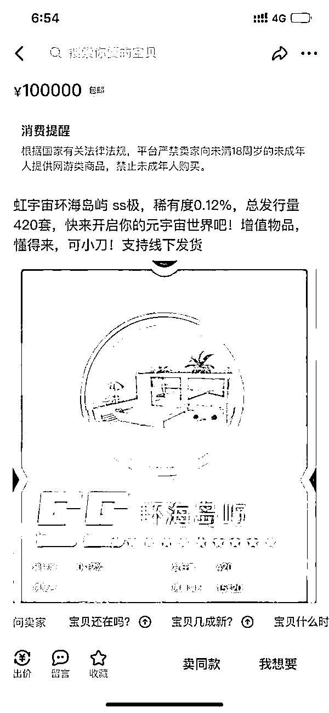
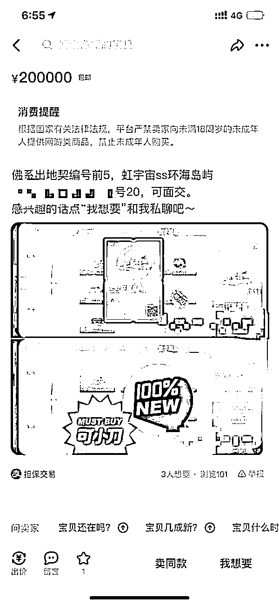
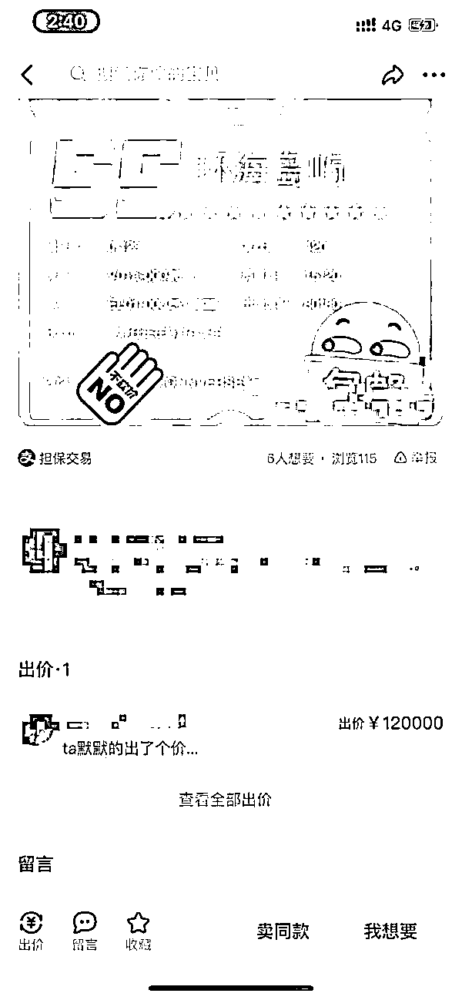
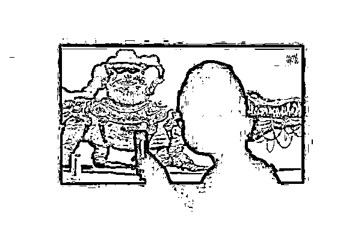
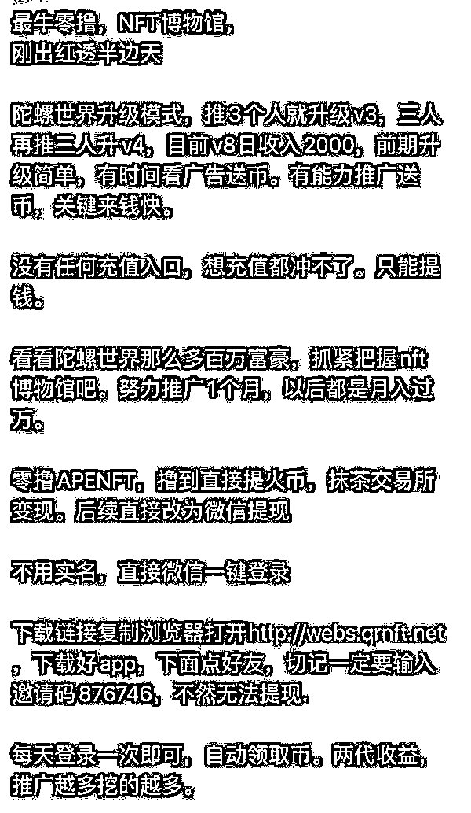
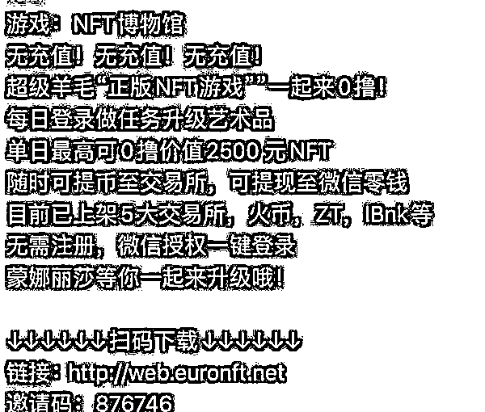

# 炒元宇宙的人怎么赚钱的？一套虚拟房卖 20 万，币圈“割韭菜”重现

> 原文：[`mp.weixin.qq.com/s?__biz=MzIyMDYwMTk0Mw==&mid=2247525371&idx=5&sn=33cae09969c458ca4668e1796bb22b79&chksm=97cba8c3a0bc21d57e97148c5d3cc7c7402aee37a063678e21483fe0c570d2a463a81ff3ac4f&scene=27#wechat_redirect`](http://mp.weixin.qq.com/s?__biz=MzIyMDYwMTk0Mw==&mid=2247525371&idx=5&sn=33cae09969c458ca4668e1796bb22b79&chksm=97cba8c3a0bc21d57e97148c5d3cc7c7402aee37a063678e21483fe0c570d2a463a81ff3ac4f&scene=27#wechat_redirect)

元宇宙火了。

一夜之间微信朋友圈、公众号文章、微博、小红书都开始讨论这个最早出现于科幻小说的词语。虽然目前业界尚未形成统一的定义，但在币圈、链圈、科技圈、创投圈，元宇宙已经以肉眼可见的速度迅速蹿红。

“元宇宙最早是在我国的资本圈轰动，催使这个概念爆红的原因莫过于‘财富效应’。”《元宇宙通证》作者、优实资本董事长邢杰接受《中国经济周刊》记者采访时说。

目前或许没有人能给元宇宙下一个确切的定义，但似乎很多人都相信它将是下一个财富神话，通过它能实现暴富。在巨大的财富效应下，泡沫与乱象也接踵而至。

虚拟海景房标价 20 万，元宇宙也炒房地产？

“在物理世界发生的事情，在元宇宙也会出现。”易宝支付联合创始人余晨告诉《中国经济周刊》记者，他也是《元宇宙通证》一书的作者之一。据他描述，在这个虚拟世界中，可以购买地产、举行派对、购物、工作、进行艺术创作等，这些行为与现实世界非常相似。“在物理世界里做的事，在元宇宙里可以再做一遍；在物理世界里做不了的事，在元宇宙里也可以做，因为元宇宙没有物理条件的限制。”他说。

作为现实世界的刚需， “住”也延续到了元宇宙世界。进入元宇宙先买块虚拟地，成为一些人口中的“致富经”。

而元宇宙的房地产炒作可能一点不比现实世界逊色。据外媒报道，基于以太坊区块链的虚拟世界 Decentraland 在 2017 年首次进行土地拍卖时，一些地块售价约为 20 美元，而仅仅 4 年后的现在，转手价格已经高达数十万美元。

近日，天下秀数字科技集团推出其研发的虚拟社交元宇宙 APP——Honnverse 虹宇宙，对首批用户开放登录。产品推出两周，预约测试人数已超过 13 万人。日前开放线上限量版虚拟房产的预约抢号活动时，因参与人数众多，服务器一度崩溃。

天下秀官方消息称，“虹宇宙”平台将总计发行虚拟房屋 350000 套，这些虚拟房屋根据 P 星球的不同地貌，有 13 种房型，每种房型的发行量和稀缺度都不同，房子的等级从高到低分为 SSS、SS、S、A、B 级，级别越高越稀有。

目前，在一些二手交易平台上，虹宇宙的一些“稀缺房产”价格被不断炒高。11 月 21 日，记者登录闲鱼 APP 发现，一套稀有度 0.12%的虹宇宙“SS 环海岛屿”虚拟房产，挂出的价格为 10 万元，下面有人出价 12 万元。更有用户挂出一套“地契编号前 5”的“SS 环海岛屿”虚拟房产，标价 20 万元，截至 11 月 22 日，共有 3 人“想要”。

一名抢占到虹宇宙虚拟房产的微博用户发帖称：“在虹宇宙里搞了一套毛坯房，现在价值几千。这段时间元宇宙概念炒得火热，看看过几个月这套房子能不能涨到几百万，如果能涨到几百万，我就把它卖了在北京买套房子。”

关于目前对该公司虚拟房产的炒作行为，天下秀方面对外公开表示：“我们是不支持也不鼓励的，虹宇宙作为一款实验室产品，目前还有较大的不确定性，希望用户能够理性对待。”

现实世界的房屋是物理空间实体，能够用于居住。这种实体的存在一旦被冠以虚拟之名，可能让人觉得有些不切实际。这样的虚拟房产究竟有什么用？

据悉，与物理世界的地产相似，元宇宙的土地可供用户在虚拟世界创建、投资、拥有、租赁、出售，既可作为居住空间，也可作为商业、工作空间。比如，在基于以太坊区块链的虚拟世界 Decentraland 中，用户购买虚拟地产后，可以在这块虚拟地皮上构建运营企业，如向其他用户收取访问费的夜总会、出售虚拟商品的商店等。

在元宇宙，地理位置和配套设施往往也是影响虚拟地产价格的最重要因素。在 Decentraland 中，通常靠近热门地区的地皮比其他地皮更有价值，而如果某块地皮周围修建了良好的配套商店或设施，该块地皮的价格也能提高——这都与现实世界相同。

据外媒报道，当韩国青年在元宇宙世界买房时，现实世界位于市中心的首尔江南区土地在虚拟世界依然最受热捧。

虚拟房产的火热也带动了相关虚拟货币的暴涨。日前，一款可用于购买元宇宙土地的虚拟货币 MANA 一度被炒高 4 倍。“元宇宙币里 MANA 和 SAND 是龙头。这两个币都是买卖土地的，意味着炒元宇宙也要从炒房地产开始。”一位长期关注虚拟货币的博主在微博如此发文。

币圈的“割韭菜”乱象又在元宇宙热潮里重现？

“不仅是房产，现实生活中能炒的许多商品，在元宇宙都被作为 NFT 不断被炒高。”在数字资产行业从业多年的潘达告诉记者。

所谓的 NFT 是 Non-Fungible Tokens 的缩写，意思是非同质化代币，是一种区块链数字账本上的数据单位，每个代币可以代表一个独特的数字资料。由于其不能互换，非同质化代币可以代表数字文件，如画作、声音、视频、游戏中的项目或其他形式的创意作品。虽然文件（作品）本身可以无限复制，但代表它们的代币在其底层区块链上能被追踪，从而为买家提供所有权证明。

简单来说，NFT 将数字艺术品和其他商品转化为独一无二的、可验证的资产，这些资产易于在区块链上进行交易。而这种独一无二的属性，也让 NFT 具备了和艺术结合的特性。

今年 3 月，插画家 Beeple 的数字艺术作品——一幅名为《每一天：最初的 5000 天》（everyday:the first 5000 days）的图片在佳士得拍卖会上拍出了 6390 万美元的天价。这张图片由 Beeple 在过去 13 年里每天的画作拼贴而成，被制作成 NFT 后，这幅图片从 100 美元起拍，最后以 70 万倍的价格成交。

而在我国，曾经的币圈“弄潮儿”波场创始人孙宇晨日前在社交媒体表示，自己以 1050 万美元购买了 NFT 微信头像，一时间引爆舆论场。

潘达告诉记者，在今年元宇宙大火后，他被拉入一个名为“Metaverse 探险队”的微信群。据他介绍，该群经常有人发布 NFT 的相关信息，邀请成员“做任务升级 NFT 艺术品”。“所谓的‘做任务’一般都是要成员到处转发推广吸引流量，接着他们就会不断开一些线上推广活动去炒作这个 NFT 的价格。”潘达告诉记者。

“跟艺术品拍卖一个意思，庄家互相倒手，哄抬物价，平台赚手续费，最后大家一起割韭菜。但好歹艺术品是有艺术价值的，现在很多 NFT 艺术品都是粗制滥造。”潘达说。

针对这些天价 NFT，一位不愿意透露姓名的元宇宙畅销书作者对记者说，他认为不必对这种现象表示惊讶。“这个价格是大家的共识所决定的，有人就觉得它值这个价。就像奢侈品一样，很多人也觉得这些名牌包、名牌首饰一文不值，但总有人愿意为之买单。”

对此，区块链与货币金融独立研究员龙白滔博士则持有不同观点。他认为，“基于共识创造价值”本质是一种通缩模型，传统的奢侈品、比特币、绝大部分数字货币（现在可以再加上 NFT 等数字艺术品），以及传统的传销和庞氏金融骗局，都具有通缩经济模型的特征。“我们承认在一定范围内，通缩经济模型有其存在的合理性和必要性，例如奢侈品行业，但它不可能作为大规模经济系统的基本指导经济模型。例如，人类社会的发展，不会随着生产力的发展而故意地减少粮食的生产，从而推高粮食的价格。这是一种不合理的经济模型。”

此外，龙白滔认为，NFT 和数字艺术品等有其存在的合理性和必要性，但不能作为大规模的经济现象而存在。“就像一个经济系统中，存在实体部分和虚拟部分，但如果虚拟部分的权重超过实体部分，这个经济体最终要塌陷。一个社会不会因为大家参与炒作 NFT，不断推高其价格，而创造更多的财富。NFT 和数字艺术品只是财富重新分配的一种手段而已，所有的一切可能都是为了让后来者能更加信服、舒适地以更高的价格接盘而已。”

“这个群里一些人我认识，都是以前‘币圈’的。”潘达告诉记者，这个“Metaverse 探险队”里大部分人都曾有过“炒币”的经历。

而现在群里许多挂着 NFT 名头的活动，其实也是“发币”的另一种方式。

“往往会有一个所谓的 NFT 活动消息邀请群成员参与，参与者可以得到‘虚拟货币’。发起人会要求参与者继续拉人传播，拉的人越多，在活动中的级别就越高，级别越高能够获得的币就越多。”潘达向记者展示了群里的消息。群里的聊天信息显示，多个微信用户发布了类似的活动信息，以“送币”为奖励号召其他成员拉人入会。

对此，龙白滔评论道：“这类追逐热点的项目，盈利模式无外乎用时髦的话术进行包装并吸引投资者参与，目的都是为了把项目以更高的估值出售给后来的投资者。”

这样的事情并非个例。近日《证券日报》报道，在多个超 1800 名成员的所谓与元宇宙相关的 QQ 群里，大家讨论元宇宙技术及培训几乎没有，多数是在探讨如何炒虚拟币、如何挖矿。

今年各地相关部门纷纷出台监管政策，要求甄别关停虚拟货币“挖矿”项目，并停止向该类项目供电，整肃虚拟货币已成大势所趋。在这样的环境下，元宇宙的大火可能给币圈带来了新的刺激点。

“割韭菜的都是一拨人，好多炒币的摇身一变，挂一个元宇宙的名号继续发空气币。不是说元宇宙不好，不好的总是那拨割韭菜的人。”邢杰说。

元宇宙热是怎样传播的？

几位元宇宙畅销书的作者在接受记者采访时均表示，目前还未形成元宇宙的统一概念，无人能够对元宇宙下一个确切的定义。但当被问及元宇宙是否会成为下一个财富神话，他们都表示了肯定。其中，有人将元宇宙比作了“1994 年的互联网”。“任何新的事物的出现和发展都会经历一定的泡沫，但这并不能阻碍它们发展的趋势。”

如今，元宇宙早已火出圈。据《元宇宙》和《元宇宙通证》的一位作者透露，其中一本书的销量已超百万。

而在今年以前，元宇宙这个概念只是在科技圈小范围内被讨论。那时，甚至没有“元宇宙”这个翻译，而是被称为“超元域”。让其成为焦点的重大节点，是有“元宇宙第一股”之称的 Roblox （RBLX. NYSE）暴涨。

“首要原因还是‘财富效应’。”邢杰说。今年上半年，Roblox 暴涨的消息大幅刺激了国内资本市场，元宇宙概念开始高频出现，相关概念股也迎来上涨。数据显示，9 月 1 日—11 月 17 日，A 股市场元宇宙 85 只概念股的平均涨幅为 24%；31 只个股累计涨幅超 20%，14 只个股累计大涨逾 50%。

据邢杰介绍，元宇宙的蹿红路径是资本圈—互联网—大众。原本作为科幻概念的元宇宙，在我国讨论最多的并不是科技圈，而是资本圈。对此，中关村大数据产业联盟秘书长赵国栋接受记者采访时表示，主要有两个原因：一个是我国应用的市场更大，机会更多；另一个则是目前我国的相关技术积累还不够充分。

龙白滔认为，面对当下的这股“元宇宙热”，应该去理解推动这股热潮背后的力量。“目前来看，这背后有很大一部分是一群在区块链和数字货币世界掌握了基础设施先发优势和话语权的力量，希望通过表面上去中心化，实现实际上的‘中心化、制度化’。现实世界主导资源分配、规范人类活动行为的机制是国家和法律；在虚拟世界中，如果没有国家边界，维持资源分配和规范人类活动的主体是什么？表面是‘代码’，实则是背后这群力量。”

“应该区分元宇宙进行的生产性活动、消费性活动和投机性活动。利用元宇宙技术和概念提升人类沟通和协同效率（例如远程会议、培训、操作等）就是生产性活动；利用元宇宙提供沉浸式游戏和感官刺激，就是消费性活动；利用元宇宙概念进行的各种金融活动，例如发币融资、交易等，可能就是投机性活动。基本原则应该是鼓励生产性活动、引导消费性活动和严格管控投机性活动。”龙白滔说。

此前多家元宇宙概念股股价的暴涨已经引发了监管层的关注。据媒体不完全统计，11 月以来，中青宝、盛天网络、天下秀、大富科技、易尚展示等多家公司收到了沪、深交易所下发的关注函或问询函。连续上涨多日的元宇宙板块也迎来了“降温”。11 月 18 日，元宇宙板块大幅收跌 3.34%，是 11 月 2 日以来该板块首次收跌。其中，14 只概念股大跌 7%以上，大富科技（300134.SZ）、盛天网络（300494.SZ）、顺网科技（300113.SZ）等跌幅居前。

来源：中国经济周刊，巴蜀反诈

← 向右滑动与灰产圈互动交流 →

