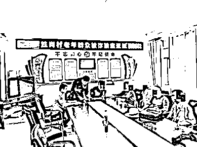
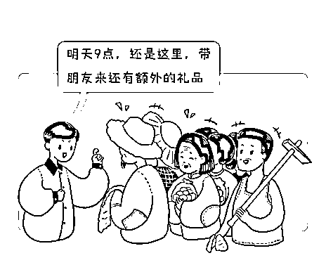
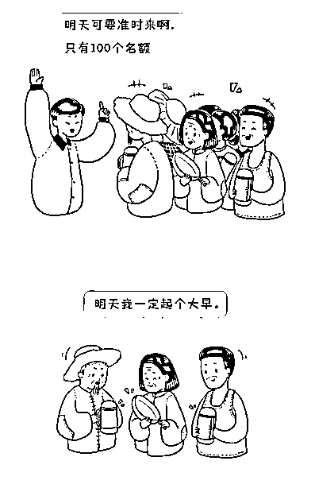
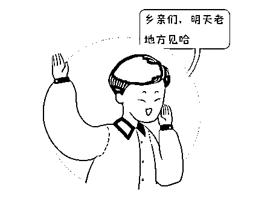
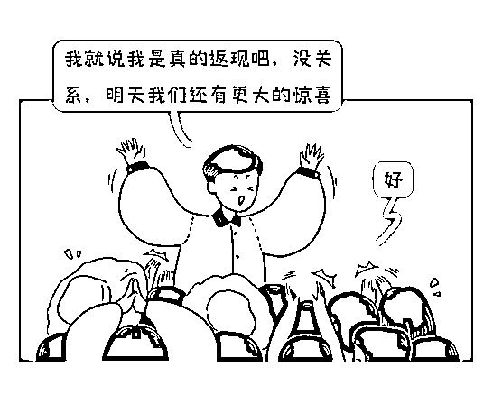
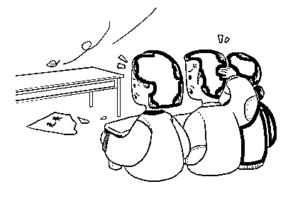

# 年底将近，告诉家里老人这些诈骗手法！！

> 原文：[`mp.weixin.qq.com/s?__biz=MzIyMDYwMTk0Mw==&mid=2247525371&idx=6&sn=29bb18ff99e86a60a48b20dc3cc96ebf&chksm=97cba8c3a0bc21d56137a7d791472e5bc6dec6624917bf35894203a68ad74270fc569d68ba1c&scene=27#wechat_redirect`](http://mp.weixin.qq.com/s?__biz=MzIyMDYwMTk0Mw==&mid=2247525371&idx=6&sn=29bb18ff99e86a60a48b20dc3cc96ebf&chksm=97cba8c3a0bc21d56137a7d791472e5bc6dec6624917bf35894203a68ad74270fc569d68ba1c&scene=27#wechat_redirect)

**导语**

**热情、阳光、无微不至；**

**送礼、陪聊、体贴有加。**

**这群人看起来“人畜无害”，**

**实则早已在每一份礼物的背后**

**标上了天价；**

**他们设下环环圈套，**

**“放血”养鱼，**

****仅用七天，****

****就骗光了一个村的老人。****

****

**11 日，安徽省合肥市庐江县公安局组织三年前上当受骗的村民在胜岗村村部现场归还被骗钱款。** 

**近日，**

**这起对老人进行诈骗的**

**诈骗团伙被法院依法判决。**

**现在我们用真实的案例，**

**来揭露农村特有的**

**“七天骗了一个村”骗局。**

****第一天：骗子进村****

**事情发生在 3 年前。2017 年 12 月的一天，犯罪嫌疑人顾某雇请了朱某、姜某等人进入安徽省合肥市庐江县泥河镇胜岗村。**

**骗子进村后，打着给农民送福利、送温暖的旗号，见人就发鸡蛋、牙膏等小礼品，顺便告诉你，明天几点几点到哪哪集合，还有更好的礼品发送大家，如果可以带其他人来，额外送鸡蛋。**

**村民们一听发东西就会心动，并且为了多要一件礼品，就喊上左邻右舍、大妈大婶大爷大娘，一个村子瞬间就传遍了。**

****第二天：开始表演****

**骗子履行承诺，给来的人都送礼品，不过礼品高级一些，比如毛巾、茶杯之类。他还告诉来领奖品的村民：明天准时来，还会有免费东西送，限量 100 名。**

****

****第三天：礼品升级****

**很多人已经对这帮人产生了信任，第三天便会拉上更多人早早地过来领奖品，有些甚至是一家老小都来了。**

**人来之后，顾某作为“宣传大使”，就要开始他的表演了，开始向村民们介绍起他们的神奇床垫和马甲，神奇床垫可以治疗关节炎、颈椎病，马甲是保健产品，可以保护我们的颈椎。村民们只要坐在那听顾某“说”一个小时，就能得到这些小奖品。**

**快结束时，骗子会说：明天还是同样的时间，还有更大的惊喜等着村民。**

****

****第四天：开始下套****

**到了第四天，来的村民更多了，顾某等人先抛出“引子”：今天的奖品是电水壶、电饭锅。然后再向大家介绍神奇的床垫和马甲，并且说原价 9000 元的“治病”床垫，今天现场购买只需要交 1000 元押金，并发放宝石鉴定证书；原价 598 元的“保健”马甲现场购买只需要交 300 元押金，并发放贵宾卡。**

**注意了，圈套来了：**交了押金的人只要明天带着宝石鉴定书和贵宾卡过来，押金全部返还，而且礼品还照样归你自己所有。**并辩称这样做的目的是要更多有诚信的人来体验他们公司的产品。**

**虽然肯定有很多人质疑，但也有一些人会掏出押金把东西拿回家。骗子承诺第五天老时间、老地点继续送礼品。**

****

****第五天：取信于”民”****

**不管是昨天买了的还是没买的，全都过来看是否会退钱。顾某等人等村民们到齐之后，会现场给拿着宝石鉴定书和贵宾卡的人原数退还押金，并且让他们把床垫和马甲拿回家用。**

**这样一来，很多昨天没有交钱的人就后悔了：没想到人家是真返现！就争着抢着问明天还有没有活动，骗子说明天还有更大的惊喜。**

****

****第六天：撒网收鱼****

**顾某等人经过前五天的宣传铺垫，到第六天时，本村甚至隔壁村、隔壁的隔壁村很多村民满怀期待地早早来到了老地点，顾某等人又开始说：公司是为了推广产品而采取的营销方式，先交押金，将产品带回家，第二天就全部返还。**

**有了前几天的铺垫，村民们对顾某等人深信不疑，争着抢着交钱。大家兴高采烈地把床垫、马甲拿回家，等待第二天去领钱。**

****第七天：骗子跑了****

**而当第二天，村民们带着宝石鉴定书和贵宾卡兴冲冲地来到老地方时，却再也等不到顾某等人了，因为他们昨天夜里带着村民们的 34900 元钱跑路了。**

**而所谓的 1000 元的“治病”床垫成本 160 元每床；“保健”马甲成本是 50 元每件。至此，一场“七天骗光一个村”的骗局形成。**

****

**来源：天天防诈骗**

****

**← 向右滑动与灰产圈互动交流 →**

****