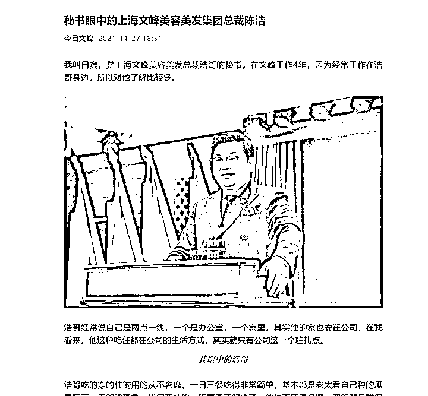

# 职场马屁“天花板”，狂赞老板“开天眼”

> 原文：[`mp.weixin.qq.com/s?__biz=MzIyMDYwMTk0Mw==&mid=2247525437&idx=1&sn=6f93552913d7727fcd21efa9f03ac2d1&chksm=97cbaf05a0bc2613d105eccfd80272305dbdaeb169879b87a9fb1a22abbe3c039b22c355d748&scene=27#wechat_redirect`](http://mp.weixin.qq.com/s?__biz=MzIyMDYwMTk0Mw==&mid=2247525437&idx=1&sn=6f93552913d7727fcd21efa9f03ac2d1&chksm=97cbaf05a0bc2613d105eccfd80272305dbdaeb169879b87a9fb1a22abbe3c039b22c355d748&scene=27#wechat_redirect)

该公众号已被封禁

还记得那个让 7 旬大爷 3 年消费 235 万的上海文峰美容美发店吗？如今再次出圈。 

近日，上海文峰集团微信公众号“今日文峰”发布的一篇名为《秘书眼中的上海文峰美容美发集团总裁陈浩》的文章引发热议。该公司总裁秘书在文中将该集团总裁陈浩称作“浩哥”，文章称，**陈浩掌握万物之规律，是首屈一指的三百六十行状元大满贯等，**“**浩哥是有天眼的**，只有浩哥的思想才是帮助我们成功的唯一方向。”在此篇文章的精选留言中，把陈浩比作**“卧龙凤雏”**。目前，此篇文章已被删除。

小编了解到，此前，因为消费者投诉较多，上海消保委已两次约谈上海文峰公司，并向社会警示，该公司商业模式或暗藏重大风险。

图片来源：视频截图 

秘书发文称老板“有天眼”

上海文峰美发美容引关注

说到上海文峰美发美容，不少市民可能没有什么印象。但是说起一家门头上印着一位梳着背头的西装男士照片，工作人员都穿着戴肩章的制服，门口还铺着红地毯的美发店，估计只要曾经路过，因为与周边商铺的画风太不同，消费者多少能有些印象。

图片来源：官网截图 

这家美容美发公司 12 月 5 日，因总裁秘书白寅为老板撰文变着花样夸他而上了热搜。

在这篇名为《秘书眼中的上海文峰美容美发集团总裁陈浩》的文章中，上海文峰美容美发总裁陈浩先是被描述成了**“吃穿用住都不奢靡”**，一心扑在工作上的人。具体表现为：

每天第一个来，最后一个走；衣服都是淘宝买的，一年才做一回新西服；十年前买的一套别墅也是空在那里；车是开了十年的。后面又被描述为一代“神人”：“掌握万物之规律”“凡事只要过了他的眼睛和大脑，一切都会变得通透”“是首屈一指的三百六十行状元大满贯”“XXX 方略实在是太牛了，这些知识到哪里都学不到，他的逻辑性、连贯性、完整性实在是无可挑剔”。 

但是在这篇文章中，不知为何白寅又在诸多描述中“啪啪打脸”，也让陈浩的人设在这篇文章中有点飘忽不定。白寅表示陈浩住在公司，所以不存在早来晚走的问题。感觉陈浩衣服多，是因为会搭配。陈浩外出也会住好一点的酒店，但“是为了去学习人家如何打造环境”。虽然陈浩号称全年无休，但每逢春节要去三亚，对此白寅称他是打着旅游的旗号出去探索。而陈浩也刚买了新车，白寅称这是陈浩为让自己母亲多出门走走看看。而根据介绍，陈浩今年已经 60 岁，父母结婚时是当时的大龄青年，但是没有透露其母具体年龄。

此外，白寅更是在文中“自曝”陈浩有很多名贵的树木和翡翠，并买了大量的商铺，但文章又称陈浩此举是为了“增强品牌影响力，给我们提供坚实的后盾去打造百年企业”。

而在这篇文章中，**对于有人与陈浩的思想稍有偏差，白寅则称：“浩哥是有天眼的，我们要相信他的安排，他的决策一定是最好的安排，你们不理解，说明没有悟透浩哥的思想。”**

这篇被网友誉为“拍马屁上热搜第一人”的文章被发现于“今日文峰”公众号。该公众号是上海文峰美发美容有限公司的官方账号，而该账号的简介为“主要面向文峰内部员工，用于浩哥思想、浩哥政令、文峰资讯的发布”。

网友直呼：职场彩虹屁天花板？

公司对陈浩的推崇

已经到了极高的程度

小编在上海文峰美发美容集团的官网上也找到了上述文章，但目前该文章已经被删除。不过，查阅各项资料可以看到，在该公司，对于陈浩的推崇已经到了极高的程度。首先，打开官网迎面而来的就是这个画面：

图片来源：官网截图 

据北青-北京头条，在陈浩将准备出嫁的表姐的聘礼——一个上海牌手表，一辆凤凰牌自行车带着“一溜烟跑了”出来炫耀，一个星期家里都找不到他的人，都被当做其“喜欢彰显自己”的例证。

图片来源：官网截图

在官网的“创始人简介”中，不仅长篇累牍的介绍陈浩的各种理念，还有**“未完待续”的创始人心路历程。**

图片来源：官网截图

而官网首页还有《创始人陈浩创业故事连载（一）》。在这篇第一人称的文章中写到“与身边的学生和亲友们讲述自己前半生传奇经历时百感交集：**苍天为之感动，大地为之震颠”。**

在陈浩的自述中，其父亲性格暴戾，经常离家出走，母亲嗜赌成性，其作为长子从小就担负起照顾两个妹妹和一个弟弟生活的重任。而在“创始人简介”中，又称“因为父亲不在家，农活缠身的母亲没有时间去给他送饭”，已经上学的陈浩只能挨饿。而陈浩才二三岁的时候，洗完澡必须穿新衣服，不穿就不高兴。

简介中，一会儿称从小学到高中，陈浩一直是班长，一会儿称其在高中当军体委员时，因鞋子破洞而不愿意去喊操。还称其因为穿了女同学的裤子遭嘲笑，又称其高中穿了别人给他的女士中跟皮鞋一直到高中毕业。而这种情景被该简介评价为“陈浩开始磨练自己坚韧不拔的品格”。

在简介中提及了陈浩的父亲患肺结核病后传染给了他母亲。对于二人为何得病，该文章称“因为两人性格都很急，没有文化，气大伤肝，怒大伤肺，他们两人经常发怒，结果都患上肺病”。文章还称，陈浩以黑芝麻、黄豆、核桃仁、紫苏、白糖为主要原料制作的产品，**“能够有效的防治肺病、肝炎”。**

该介绍中，还有“上苍赋予了他无限的智慧，开启了他的灵觉”等描述。

不仅如此，在该集团的微信公众号以及官网上，使用的陈浩开会时的照片均是陈浩站在小型讲台前，背景是分立两侧的十面红旗环绕着其大幅蓝白底照片。有网友认为这家公司的企业文化看起来像“传销”。

图片来源：今日文峰微信公众号（上图）；官网截图（下图）

上海文峰的内刊《今日文峰》，头版为总裁陈浩最近出席了哪些会议，到访了哪些城市，每次出行的影像文字资料都相当丰富，**从走出机场到店里全程都有鲜花掌声和红地毯。**在文峰美发的官网上，还能听到上海文峰美容美发集团 3 首企业歌曲《十颂浩哥》《文峰校歌》《歌唱我们的文峰》…

[`v.qq.com/iframe/preview.html?width=500&height=375&auto=0&vid=y3312nkuxe4`](https://v.qq.com/iframe/preview.html?width=500&height=375&auto=0&vid=y3312nkuxe4)

此外，在文峰官方账号上不难发现套路营销以及夸大宣传的一些痕迹。

文峰创始人陈浩口中自创的**六合还阳术，能够打通人体各个经脉，从而达到治病的效果，甚至可以让濒死、已死之人重新活一次。这样离谱的说法，显然缺乏科学依据。**

文峰创始人陈浩正在教授美容手法“六合还阳术”

公司已被消保委约谈两次

商业模式或暗藏重大风险

在此次上热搜前，上海文峰美发美容则因为被上海市消保委两次约谈而上热搜。

11 月 17 日，上海市消保委发文提示称，美容美发企业文峰商业模式或暗藏重大风险，建议相关部门进行监管，消费者也应谨慎消费。此前，文峰国际所属上海文峰美发美容有限公司已两次被上海市消保委约谈，涉及**“大额消费拒不退款、售后服务缺位、价格不透明、虚假宣传、强制消费”**等问题。

图片来源：上海市消保委

上海市消保委认为，**文峰以“产品+服务”的套餐预售，规避预付卡监管。**根据消费者反映，文峰公司以“产品+服务”的套餐名义向消费者推销，金额达到数万乃至数十万元。这种模式本质上就是预付性消费行为。

文峰通过这种套路规避了相关预付卡和预付资金监管的法律法规，由此可能会给消费者造成重大风险。消费者同时反映文峰门店不主动提供充值凭证和消费凭证，亦不明示其加盟店身份，加大了消费者的维权难度。

图片来源：上海市消保委 

上海市消保委称，据消费者反映，在购买“产品+服务”的套餐以后，按照店方要求产品放在门店，消费者无法深入了解产品功效合规性。店员的口头推销和非公开售卖产品的做法既造成了消费者维权困难，又逃避了政府部门的日常监管。

此外，文峰从门店推销到售卖自述有养生功能的产品服务套餐再到“文峰医院”形成了伪闭环，让众多消费者特别是老年消费者对其各种“调理方案”和“效果保证”深信不疑。而文峰医院为上海美妍康医疗美容门诊部有限公司。文峰通过层层导流使众多老年消费者深陷其中。

图片来源：上海市消保委

[`v.qq.com/iframe/preview.html?width=500&height=375&auto=0&vid=y0898d0d95c`](https://v.qq.com/iframe/preview.html?width=500&height=375&auto=0&vid=y0898d0d95c)

前店长举报“文峰”门店违规，多部门介入:门店并未整改到位

上海市消保委透露，据相关数据显示，今年 6 月到 11 月初，**上海市消保委共受理文峰美发美容相关投诉 193 件，投诉量居高不下，**其中很多消费者投诉反映，被文峰公司诱导消费后，多次与该公司沟通要求退款，一直无果。

今年 3 月，在上海有一位七旬的老大爷，三年期间在文峰理发店消费竟**高达 235 万。**

另据新黄河，记者了解到，2020 年 3 月，**文峰集团因在新冠肺炎疫情期间以“抵御病毒”为卖点，**对旗下的一款化妆品进行虚假宣传被上海市杨浦区市场监管局作出行政处罚，责令停止发布违法广告，并处罚款 50 万元。

公开资料显示，上海文峰美发美容有限公司成立于 1997 年，注册资本 30 万元，法定代表人周树兵。而在 2019 年 4 月之前，陈浩还是该公司的法定代表人。陈浩通过控制该公司大股东上海锦恩工贸有限公司 60%的股权，仍旧是该公司实控人。

上海文峰美发美容有限公司从 2016 年开始约 14 次左右被行政处罚，其中大部分是虚假宣传或广告违法。被处罚事由包括“发布广告使用国家机关和国家机关工作人员的名义”“发布广告含有淫秽、色情、赌博、迷信、恐怖、暴力的内容”“在广告中涉及疾病治疗功能，以及使用医疗用语或者易使推销的商品与药品、医疗器械相混淆的用语的”“对商品或者服务作虚假或者引人误解的宣传”等。

此外，该公司也是官司缠身，涉及司法案件 61 个，其中 67.21%是被告，近 3 成是服务合同纠纷。

来源：每日经济新闻、北青-北京头条、新黄河、上海文峰美发美容有限公司官网、今日文峰 、央视网

← 向右滑动与灰产圈互动交流 →

