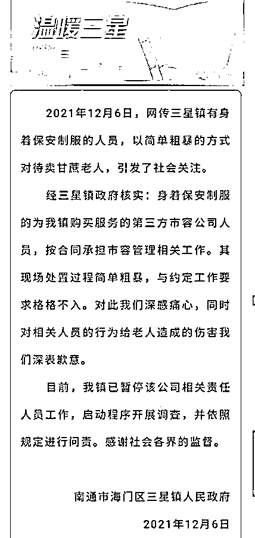
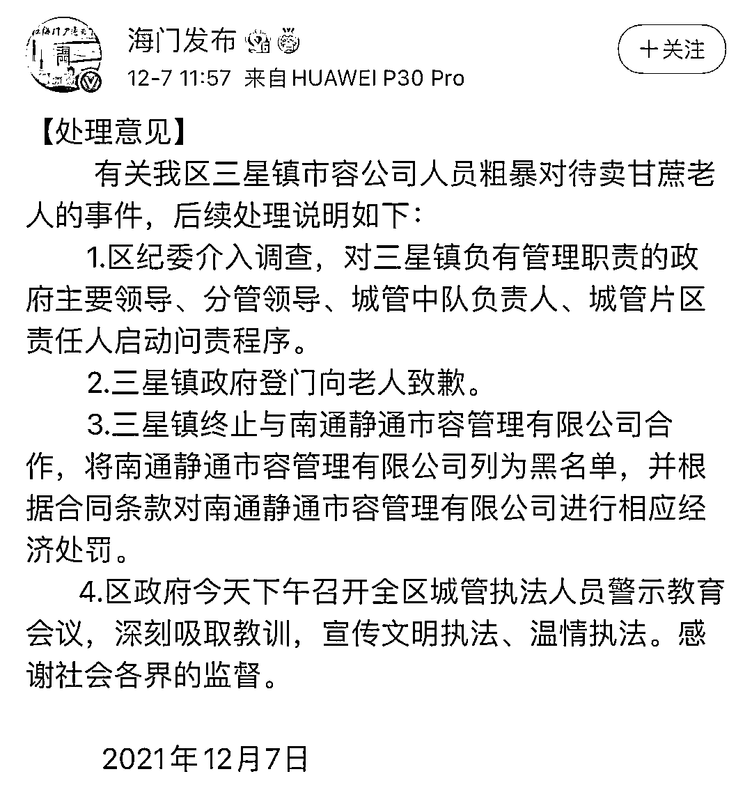
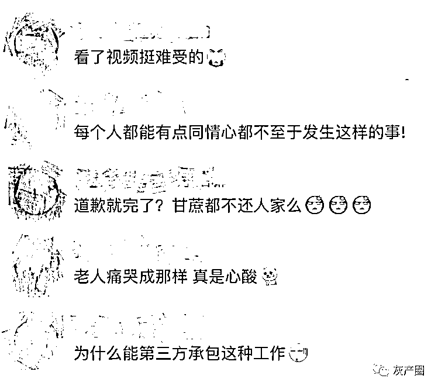

# 哄抢老人甘蔗，是谁给的权力？

> 原文：[`mp.weixin.qq.com/s?__biz=MzIyMDYwMTk0Mw==&mid=2247525437&idx=3&sn=e822a1c81ffea55c5c8f73f47196439d&chksm=97cbaf05a0bc2613570b68686ac376f1b42283e25da66b2eae52cfbcec962d30199208d92171&scene=27#wechat_redirect`](http://mp.weixin.qq.com/s?__biz=MzIyMDYwMTk0Mw==&mid=2247525437&idx=3&sn=e822a1c81ffea55c5c8f73f47196439d&chksm=97cbaf05a0bc2613570b68686ac376f1b42283e25da66b2eae52cfbcec962d30199208d92171&scene=27#wechat_redirect)

该公众号已被封禁

12 月 6 日，一段“数十名穿市容制服人员围抢老人甘蔗”的视频引发关注。 

**视频显示，一群身穿保安制服的年轻小伙将一名老人团团围住，然后将老人的甘蔗全部拿走，老人急得痛哭。**

视频还显示，这些人员的制服上印着“静通市容”字样，他们将甘蔗拿走后，扔到了贴有“静通市容”的车上。

**视频戳↓↓**

[`mp.weixin.qq.com/mp/readtemplate?t=pages/video_player_tmpl&action=mpvideo&auto=0&vid=wxv_2168513896913911816`](https://mp.weixin.qq.com/mp/readtemplate?t=pages/video_player_tmpl&action=mpvideo&auto=0&vid=wxv_2168513896913911816)

视频来源：青蜂侠 

据了解，这件事发生在江苏南通。12 月 6 日深夜，南通市海门区三星镇政府发布情况通报：

12 月 7 日，江苏海门市委宣传部官方微博@海门发布 公布“处理意见”

**涉事老人孙女：担心爷爷身心状况**

据报道，7 日凌晨，记者联系上老人的孙女张女士。她介绍，6 日晚 9 时许，表姐发来上述视频，她才发现被收走甘蔗的是爷爷。

张女士表示，爷爷今年 73 岁了，平时在家务农，也种植甘蔗，这个时候正是甘蔗收获的季节。爷爷经常骑车，从南通市通州区川港镇老家带着甘蔗四处售卖，事发的三星镇距离家不算太远。

“这些人员有没有权力没收甘蔗，这样算不算暴力执法。”张女士表示，现在她最担心的是爷爷身心状况。

**网友评论：**

来源：光明网、海门发布、中国青年网出品

← 向右滑动与灰产圈互动交流 →

