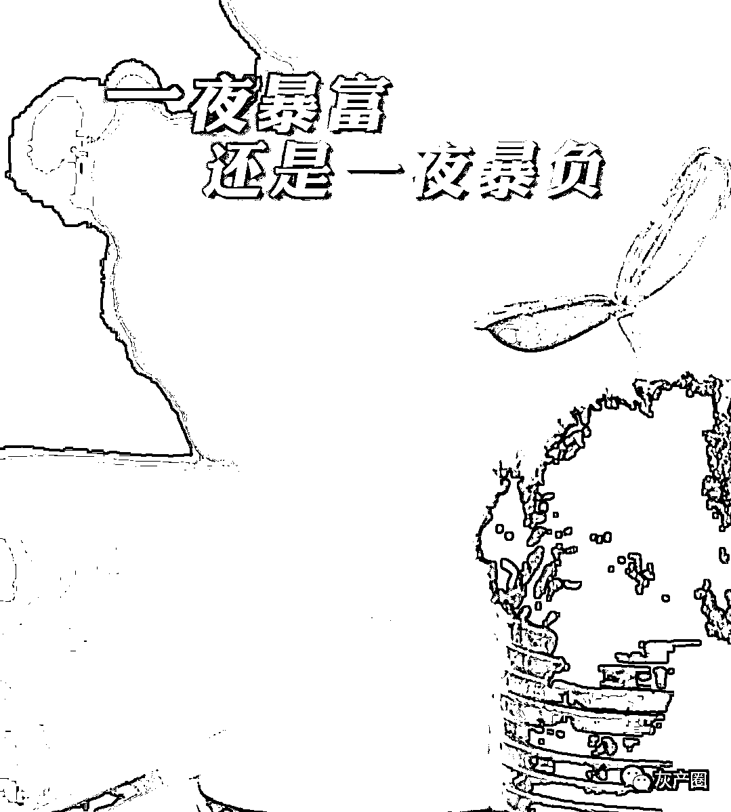
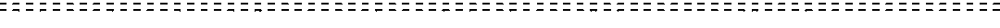
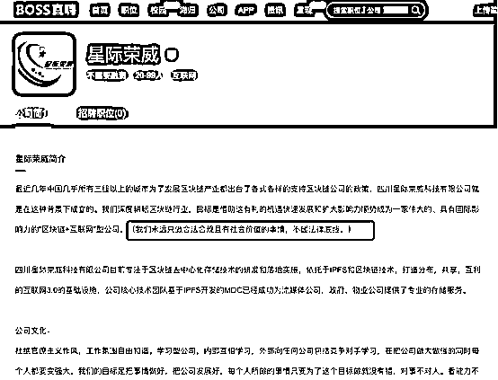
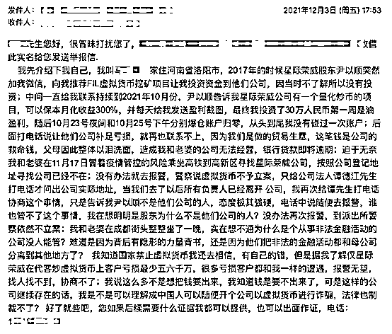
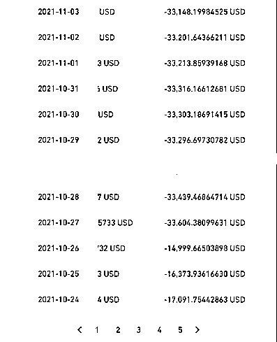
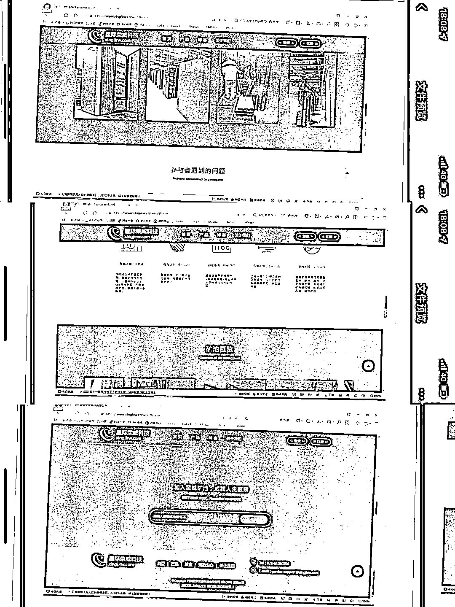

# 小心被炸！区块链炒币手捧雷

> 原文：[`mp.weixin.qq.com/s?__biz=MzIyMDYwMTk0Mw==&mid=2247525437&idx=4&sn=5a8e3bbc74b580350c34612366b7e355&chksm=97cbaf05a0bc26131776f298bce15eddd5be50c6ccda809d78af4029f3cc2759d0e2db4eed53&scene=27#wechat_redirect`](http://mp.weixin.qq.com/s?__biz=MzIyMDYwMTk0Mw==&mid=2247525437&idx=4&sn=5a8e3bbc74b580350c34612366b7e355&chksm=97cbaf05a0bc26131776f298bce15eddd5be50c6ccda809d78af4029f3cc2759d0e2db4eed53&scene=27#wechat_redirect)

****************保底收益 300%？求求你，别再傻傻当韭菜了！天上只会掉雷，不会掉馅儿饼。**************** 

 

骗子这一行，十分地讲究与时俱进，什么行业发展得火热，他们就涌入哪个行业。 

近几年，随着区块链技术的火热，骗子们也打起了区块链的主意，借着暴富的名义开始了他们的区块链骗局。

实际上，它就是“老套路”穿上区块链的“新马甲”，但普通投资者没有这个敏感度，轻易一忽悠，就上了钩，意图通过此实现财务自由，走上人生巅峰。但事实上，它们可能是一个深坑，什么所谓的保底收益 300%？最后可能就是血本无归。

2018 年年初，腾讯安全反诈骗实验室负责人李旭阳称，利用区块链概念搞的传销平台已超过 3000 家。而根据 CNNIC 于今年 9 月 15 日最新发布的第 48 次《中国互联网络发展状况统计报告》显示，在网民遭遇各类网络安全问题的比例中，除了个人隐私信息泄露占比 22.8%外，遭遇网络诈骗的网民比例排在第二位，为 17.2%。

**然而，今年 9 月中旬，央行等十部门联合发文严禁虚拟货币非法金融活动，并重申虚拟货币相关业务全部属于非法金融活动，一律严格禁止，坚决依法取缔。但是，禁令发布几个月以来，依然有部分机构违规向我国居民提供“代客炒币”服务，相关投诉屡有发生。**

智商税研究中心在此提醒广大读者：求求你，擦亮自己的眼睛，想要一夜暴富是不可能的，一夜暴负倒是很有可能，可别再傻傻当韭菜了！

**如何被圈进去的？** 

想要一夜暴富？快来入局区块链炒币挖矿吧，安全高收益，稳赚不赔！

智商税研究中心借助一个案例，来为大家深度揭秘代客炒币的大骗局。

近日，河南洛阳的马先生辗转向智商税研究中心发来了一段自己的伤心往事，一家名为“星际荣威”的成都公司，其股东尹以顺打着公司名义，向外界搞出“保本月化收益 300%”的投资理财承诺，向他非法提供“代客炒虚拟货币”服务，最终导致他 30 多万元积蓄化为乌有。

**一切要从 2017 年开始说起，这一年马先生正在深圳创业，偶然接到了自称成都“星际荣威”公司打来的电话。据他回忆，对方可能是通过企业工商查询类软件找到他的联系方式。**

当时，星际荣威在经营所谓 IPFS 业务，也就是打着分布式存储旗号的区块链货币 Fil（Filecoin，基于比特币的数据存储网络和电子货币）。

*星际荣威一度以 IPFS 业务为主业，自称“不碰法律底线”

* * *

在该公司股东尹以顺推荐下，马先生以考察名义赶赴成都，与星际荣威公司董事长谭德江见面。由于对方希望马先生把钱打到星际荣威账户参与炒币投资，马先生出于安全考虑并未直接同意对方请求。

**直到今年，尹以顺再次致电马先生，称星际荣威 IPFS 挖矿业务因国家明令禁止而关停交易，但他们推出了一个新的代客炒币投资项目，他声称该项目并不触犯国家法律，且年回报率极高，公司还承诺保本。**

和上次被要求直接打款到对方公司账户不同，尹以顺表示，马先生这一次可以直接将投资款打到境外虚拟货币交易所的个人钱包账户。在获得马先生授权后，尹以顺就以马先生名义在境外交易所开通了账号，并开始全程帮助马先生炒币。马先生本人除了多次充值外，并没有做过其他操作。

**高额****回报承诺，全程保底，再加上个人账户，马先生自以为找到了通向财富的安全捷径。最初，马先生只是试着向账户打了 5 万元，在获得部分盈利后，他后续充值总额超过 30 万元。**

*马先生误信星际荣威尹以顺参与炒币投资的邮件， 

以及他的亏损账户之一

* * *

但悲剧很快就接踵而来，10 月 23 日到 25 日期间，马先生的账户连续两次爆仓，他个人账户的 30 多万元很快变得一分不剩。马先生随后联系尹以顺，对方表示“如果该我负的责任我一定会负的”，给马先生吃了一颗“定心丸”。但没想到一个月后，对方将微信朋友圈清空，并且拒绝接听马先生的联系和电话。他去联系董事长谭德江，对方也拒接电话。 

11 月 17 日，马先生与怀孕的妻子冒着疫情的风险，一起跑去成都与对方公司交涉，却发现星际荣威公司已经人去楼空。绝望之下，马先生赶赴当地派出所报警。由于涉及境外虚拟货币交易，警方表示无法立案，但表示愿意协助马先生寻找星际荣威公司的最新办公地址。

当地警方参与交涉后，后续的沟通依然不顺畅——谭德江先在电话里向马先生虚报了一个地址。经过多次折腾，马先生与妻子如愿找到星际荣威公司所在地。根据马先生回忆，谭德江却在电话谎称：他已经在 1 个小时前赶到了西藏，其甚至还说，想告你就告，想报警就报警，反正就是拒绝兑现保底承诺。

马先生夫妻二人后续维权的努力均告失败。他们更换派出所报继续案，并联系当地媒体，但并没有取得任何进展。马先生向智商税研究中心透露，他甚至冲动地想：要不要爬到对方公司楼顶去静坐？

在成都寒风渐起的秋夜，绝望的马先生与妻子在成都的路边枯坐了整整一夜。

**智商税研究中心随后委托律师，给星际荣威公司董事长谭德江打去电话，谭德江对于马先生所述情况予以否认，第一他表示星际荣威公司只是一家软件公司，从来没有参与过炒币业务，也不可能直接与马先生有交易，第二这些是尹以顺的个人行为，与公司无关，如果涉嫌诈骗，可以向有关部门举报，第三目前尹以顺已经三个月没来上班，目前找不到人。**

目前，通过天眼查可以看见，目前尹以顺还是四川星际荣威科技有限公司的自然人股东，持有 5%股份，但是据谭德江透露，尹以顺都没有实缴，是当年公司才成立时的后遗症。

受害人马先生称，深圳很多商人都投资了星际荣威的炒币业务。但由于该公司一直采取一对一的联系方式，他无法找到更多受害人的联系方式，也无法拿到更多星际荣威尹以顺涉嫌欺诈和违法交易的证据。据他估算，相关受害者总损失至少超过五千万。

这些究竟只是尹以顺个人行为还是星际荣威科技有限公司的战略，目前还扑朔迷离，无法评判。

**到底为何是个骗局？** 

## 当下被炒得火热的区块链技术究竟是何物？区块链技术其实是一个中立的、分布式技术，它是一个底层的技术体系，解决的是零信任的问题，说白了就是其不需要有一个信任的中间点，比如说陌生人之间的相互交易，通过区块链技术可以实现分布式记账，以及信息的存证共享等。

据知情人士透露，现在因为区块链技术出来之后，其最先试应用于挖币和交易币，包括很多黑市交易、跨国资金周转、洗钱、黑市毒品交易，其实都会用这种虚拟币。现在很多国家都严厉打击这种虚拟货币交易，因为它也挑战法币地位。

我国对虚拟货币交易也有明确的界定，2021 年 9 月 15 日，中国人民银行、中央网信办、最高人民法院、最高人民检察院、工业和信息化部、公安部、市场监管总局、银保监会、证监会、外汇局等多部门发布《关于进一步防范和处置虚拟货币交易炒作风险的通知》，通知中显示：

**（二）虚拟货币相关业务活动属于非法金融活动。**开展法定货币与虚拟货币兑换业务、虚拟货币之间的兑换业务、作为中央对手方买卖虚拟货币、为虚拟货币交易提供信息中介和定价服务、代币发行融资以及虚拟货币衍生品交易等虚拟货币相关业务活动涉嫌非法发售代币票券、擅自公开发行证券、非法经营期货业务、非法集资等非法金融活动，一律严格禁止，坚决依法取缔。对于开展相关非法金融活动构成犯罪的，依法追究刑事责任。

**（三）境外虚拟货币交易所通过互联网向我国境内居民提供服务同样属于非法金融活动。**对于相关境外虚拟货币交易所的境内工作人员，以及明知或应知其从事虚拟货币相关业务，仍为其提供营销宣传、支付结算、技术支持等服务的法人、非法人组织和自然人，依法追究有关责任。

**所以上述提及的尹以顺事件，其实就是披着区块链的外衣，进行挖矿和炒币的虚拟货币交易行为，还提供相关营销宣传、支付结算等，是不合法的。**

*星际荣威公司官网此前对矿池的介绍 

就像上文说过的，不怕骗子差，就怕骗子有文化！此前星际荣威公司是自己在国内挖币，其公司官网中有关于星威矿池的相关简介，政策出台后，公司高管尹以顺依然诱导用户进行虚拟货币交易。另外据智商税研究中心了解到，在今年 Fil 币已经从最高 183 美元一枚跌至最近不足 40 美元，客户想从中赚钱实属不易。

**投资有风险，入市需谨慎** 

智商税研究中心问了周边很多的人，其实大多数人对区块链技术都是一知半解，知道它很火，但它究竟是什么，却也说不出什么所以然，小编也是做了大量的功课才对其有了一些概念。那放到马先生夫妇这样的受害者也是一样，他们当初可能并没有真正理解区块链，就被骗子的话术诱导而盲目入局。

骗术经年不变，概念年年翻新，区块链与诈骗的奇妙结合，某种程度上讲其实是一种必然。因为无论什么时候，一夜暴富的话术都适用，许多人觉得自己已经错过了当年股票基金投资的风口，想成为区块链投资风口上的猪，能从中分一杯羹，实现财富自由。**尤其是在经济下行的当下，人人对自己的财富充满了焦虑和不安，不想成为韭菜，却又管不住自己的手，不知不觉中成了“韭菜”。**

投资本身就是有风险的一件事，请在选择之前对自己做一个谨慎的评估，问问自己：我懂这个吗？我愿意承担其中的风险吗？我能接受自己可能血本无归的代价吗？

**投资需谨慎，智商税研究中心在此为大家奉上投资防骗指南：**

1\. 如果不明白这个行业或者投资的概念到底是什么，就不要去买，这个世界上还有很多赚钱的事情可以做，有很多东西比在投资圈里混更有价值。

2\. 如果评估了自己有这个能力赚到钱，那就请做好这方面的功课，也做好相关的心理准备，只赚不赔基本很难实现。

3\. 请选择正规的交易机构进行投资行为，切勿轻信民间的所谓高利率、0 成本、0 手续费等等。

4\. 如果已经在投资圈子里，不要太过相信自己，不要把大势涨给自己带来的财富回报，认为是自己的能力强，产生错觉。

5\. 任何事物总是会回归客观规律的，这个世界上啥也不干，就能一夜暴富的事情绝对不是常态，切勿抱有任何侥幸心理，踏实做事才是赚钱的不二法门。

马先生向智商税研究中心表示，他知道自己的钱很可能已经无法追回了。虽然他的公司急等着现金救命，他的家人每天都在抱怨，但他现在最大的愿望并非追回自己的积蓄，而是想要联系到更多被星际荣威尹以顺坑害过的受害者，一起收集证据共同发声，促使相关部门尽快介入，避免未来有更多人陷入到星际荣威编织的骗局中，让更多人能逃过倾家荡产的噩运。

如果你也恰好也是这场诈骗的受害者之一，可以在文章留言。

投资有风险，入市需谨慎，一定要管住自己的手，别再傻傻当韭菜了，好不好？

← 向右滑动与灰产圈互动交流 →

