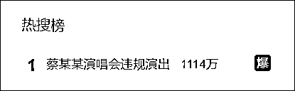
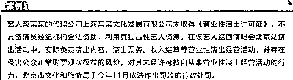
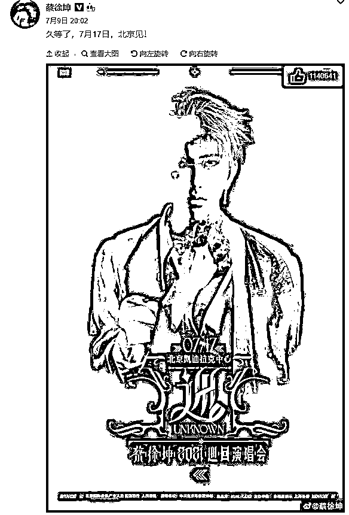
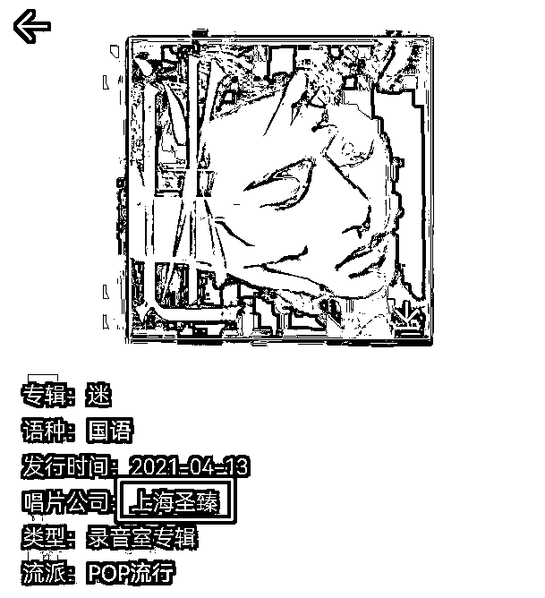
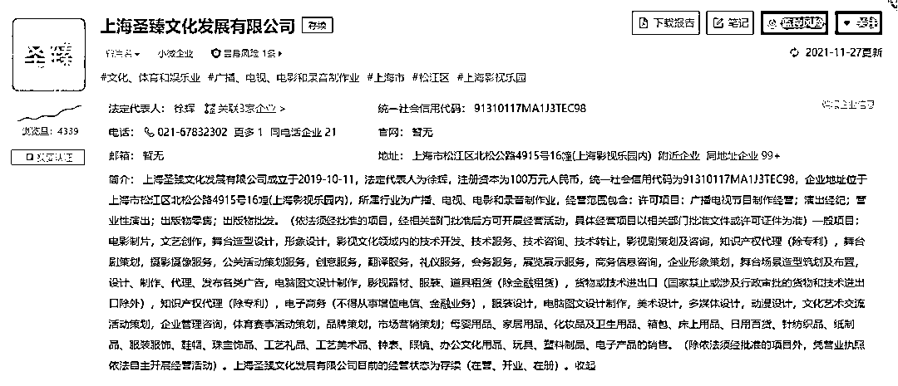
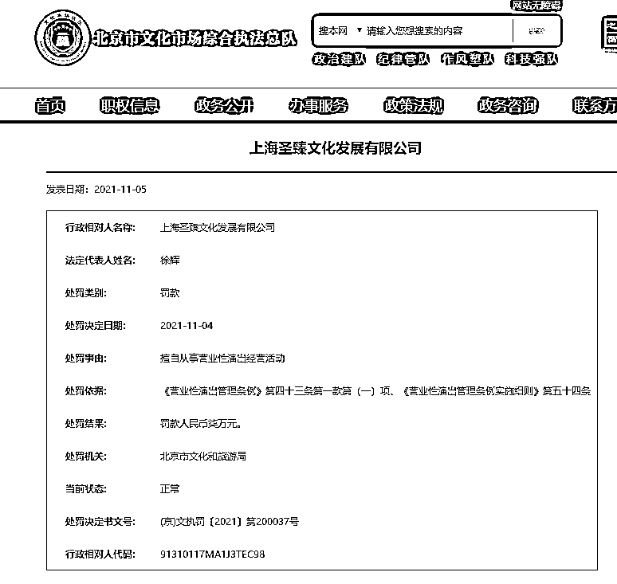

# 蔡徐坤被通报！

> 原文：[`mp.weixin.qq.com/s?__biz=MzIyMDYwMTk0Mw==&mid=2247525437&idx=5&sn=9d17e34fbbb0784abc8aeeae6e2c20ee&chksm=97cbaf05a0bc261380663be3977cbd3c9fc47173de7b20435656e5cdbc8a988829ea65fe81e1&scene=27#wechat_redirect`](http://mp.weixin.qq.com/s?__biz=MzIyMDYwMTk0Mw==&mid=2247525437&idx=5&sn=9d17e34fbbb0784abc8aeeae6e2c20ee&chksm=97cbaf05a0bc261380663be3977cbd3c9fc47173de7b20435656e5cdbc8a988829ea65fe81e1&scene=27#wechat_redirect)

近日，文化和旅游部通报 

今年部分演出市场典型指导案例

其中一例**“蔡某某演唱会违规演出”**引发关注

今天登上热搜第一

通报中提到，艺人蔡某某的代理公司上海某某文化发展有限公司未取得《营业性演出许可证》，**不具备演员经纪机构合法资质，**利用其独占性艺人资源，在该艺人巡回演唱会北京站演出活动中，实际负责演出内容、演出票务、收入结算等营业性演出经营活动，**并****存在侵害公众正常购票观演权益的风险。**

对其未经许可擅自从事营业性演出经营活动的行为，北京市文化和旅游局**于今年 11 月依法作出罚款的行政处罚。**

****

**据悉，“艺人蔡某某”即为艺人蔡徐坤**

**据其微博内容显示**

**蔡徐坤曾于 2021 年 7 月 17 日**

**举办巡回演唱会北京站**

**该演唱会主办单位之一为“上海圣臻”**

****

**“上海圣臻”同时也是蔡徐坤所属的唱片公司。**

****

**据企查查网站，上海圣臻文化发展有限公司成立于 2019 年 10 月 11 日，注册资本为 100 万元人民币，所属行业为广播、电视、电影和录音制作业，经营范围包含：许可项目：广播电视节目制作经营；演出经纪；营业性演出；出版物零售；出版物批发。**

****

**据北京市文化市场行政执法总队官网显示，今年 11 月 5 日，该网站公布了对上海圣臻文化发展有限公司的一则处罚通告，因擅自从事营业性演出经营活动 ，该公司**被罚款人民币 7 万元。 ****

****

**通报中还有两个案例引起关注：**

**陕西西安某酒吧并非演出场所经营单位，未取得《营业性演出许可证》，也未委托有资质的演出经纪机构举办演出，却**擅自举办艺人王某（艺名“PGxxx”）参加的演出活动，引起不良社会反响。**对其未经许可擅自从事营业性演出经营活动的行为，陕西省西安市文化和旅游局于今年 3 月依法作出罚款的行政处罚。

山西晋城某酒吧并非演出场所经营单位，未取得《营业性演出许可证》，也未委托有资质的演出经纪机构举办演出，却擅自举办演出活动，还曾**邀请网红郭某某参加，后因郭某某被公安机关逮捕未能成功。**对其未经许可擅自从事营业性演出经营活动的行为，山西省晋城市文化和旅游局于今年 4 月依法作出没收演出器材和罚款的行政处罚。**

**具体通报案例如下：**

****案例 1****

****陕西西安****某酒吧**并非演出场所经营单位，**未取得《营业性演出许可证》，也未委托有资质的演出经纪机构举办演出，却擅自举办艺人王某（艺名“PGxxx”）参加的演出活动**，引起不良社会反响。对其未经许可擅自从事营业性演出经营活动的行为，陕西省西安市文化和旅游局于今年 3 月依法作出罚款的行政处罚。**

****案例 2****

****山西晋城某酒吧**并非演出场所经营单位，未取得《营业性演出许可证》，也未委托有资质的演出经纪机构举办演出，**却擅自举办演出活动，还曾邀请网红郭某某参加**，后因郭某某被公安机关逮捕未能成功。对其未经许可擅自从事营业性演出经营活动的行为，山西省晋城市文化和旅游局于今年 4 月依法作出没收演出器材和罚款的行政处罚。**

****案例 3****

****安徽省淮北市相山区某音乐餐厅**在未取得当地文化和旅游行政部门批准文书的情况下，擅自在其场所内举办“八一建军节大型主题派对”活动，**以建军节为噱头吸引观众，且现场演出节目中包含低俗违规内容**，造成恶劣社会影响。对其未经批准举办营业性演出的行为，安徽省淮北市文化旅游体育局于今年 8 月依法给予其罚款和吊销《营业性演出许可证》的行政处罚。**

****案例 4****

****天津某文化艺术发展有限公司**未取得《营业性演出许可证》，在天津市某酒吧举办名为“绑定派对”的演出活动，**表演伴随着 DJ 音乐对女性实施捆绑、滴蜡、抽打等性虐待行为的内容**，显著危害社会公德。对其未经许可擅自从事营业性演出经营活动且营业性演出有《营业性演出管理条例》禁止内容的行为，天津市文化和旅游局于今年 8 月依法作出罚款的行政处罚。**

****案例 5****

****艺人蔡某某的代理公司****上海某某文化发展有限公司未取得《营业性演出许可证》**，不具备演员经纪机构合法资质，利用其独占性艺人资源，在该艺人巡回演唱会北京站演出活动中，实际负责演出内容、演出票务、收入结算等营业性演出经营活动，**并存在侵害公众正常购票观演权益的风险**。对其未经许可擅自从事营业性演出经营活动的行为，北京市文化和旅游局于今年 11 月依法作出罚款的行政处罚。**

**文化和旅游部文化市场综合执法监督局有关负责人介绍，下一步将继续指导各地文化市场综合执法队伍推进文娱领域综合治理有关工作，加强演出市场执法监管，持续做好违规演出内容营业性演出活动查处工作，切实维护风清气正的社会文化环境。**

**来源：新闻晨报、文旅之声、极目新闻、信息时报、中国新闻周刊、长沙晚报**

****

**← 向右滑动与灰产圈互动交流 →**

****