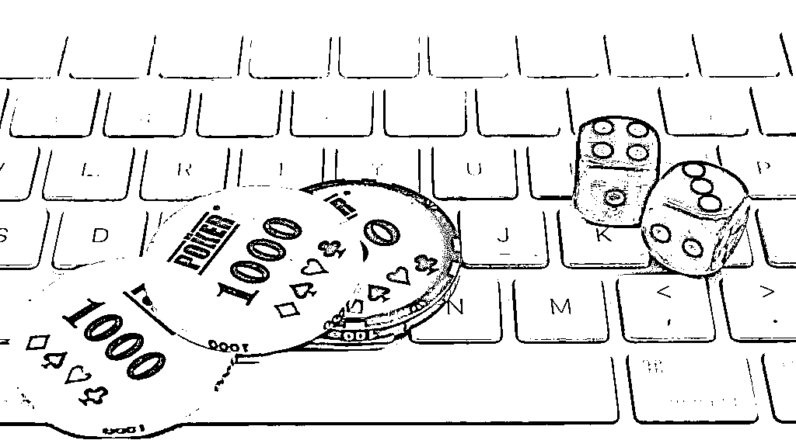

# 真的有毒，专盯年轻女性下手的诈骗！

> 原文：[`mp.weixin.qq.com/s?__biz=MzIyMDYwMTk0Mw==&mid=2247525437&idx=6&sn=b8b38d07586471938192312cee227971&chksm=97cbaf05a0bc2613bcab2c430a36b5ec58a9c652e965e228e67c81af510d1c7839472bfd5a70&scene=27#wechat_redirect`](http://mp.weixin.qq.com/s?__biz=MzIyMDYwMTk0Mw==&mid=2247525437&idx=6&sn=b8b38d07586471938192312cee227971&chksm=97cbaf05a0bc2613bcab2c430a36b5ec58a9c652e965e228e67c81af510d1c7839472bfd5a70&scene=27#wechat_redirect)

梦溪（化名）就陷入了一起“杀猪盘”。今年 6 月，一场“网恋”让她背负了十四万的网贷。

**调查发现，隐藏在“杀猪盘”背后的黑色产业链：**建站、广告引流到粉丝买卖等逐渐浮出水面。除了婚恋交友网站，招聘网站、色情网站也是其用来拉人引流的渠道。可操纵开奖结果的博彩网站正在成为“杀猪利器”。有从事博彩网站开发的人士称，“5000 块钱一条龙全包。”

被这个庞大的黑产拉扯的，是被引诱一步步走进赌博深渊的年轻面孔。在东南亚从事这一黑产的家辉（化名）表示，“我们都有专门的话术指导，教我们怎么一步步让玩家输钱。”有反赌人士指出，“赌博就像溺水，喊不出救命。”

公安机关也多次提醒，增强识骗防骗意识，避免上当受骗。

1

**网恋遇上“杀猪盘”，**

**90 后女医生被骗 14 万** 

“我被骗了。”指针拨回六月中旬，梦溪在一款社交软件——Soul 上，掉进博彩的坑。

梦溪，一个 1992 年生的女孩，是山西某医院医生。6 月中旬，梦溪通过 Soul 与小狼相识。

梦溪清晰地记得，从萍水相逢到相见恨晚，她和小狼只用了几天时间。她以为自己碰到了“白马王子”，不久便和小狼“坠入爱河”。

小狼在当时的聊天中提到，白天忙餐厅里的事务，晚上会做“副业”。小狼的“副业”，便是玩彩票。**“我一晚上就能赚你一个月的钱。****”**小狼告诉梦溪。

据梦溪回忆，小狼给她发过来一个二维码，扫码后便进入一个博彩网站。为了取得梦溪的信任，小狼带着梦溪在中华彩普通厅里玩了几把。“都赚钱且成功提现了。”

**“第一次不建议你玩大的，投五百块钱就可以。****”**小狼表示。在恋情和金钱的双重吸引下，梦溪没有在小狼身上嗅出任何欺骗的味道。

赌博网站的客服告诉梦溪，**该网站还有过夜彩金，一万块钱存一晚上可以赚 888 元。**转账截图显示，6 月 22 日晚，她第二次投注，分两次通过微信转账一万；6 月 25 日下午，她再次分十批投注，总计金额五万。

“饼画得特别大。”梦溪说。彼时，她每天好几次去网站看余额，十分开心。但好景不长，梦溪发现，网站账户中的余额迟迟不能提现。

“客服说我恶意套取彩金，账户已经被封。”梦溪告诉记者，**“必须充值 8 万，才能解封。”**当她将求助的手伸向小狼时，却遭到小狼拒绝。“你先想办法贷款，实在不够我再借给你。”最终，梦溪在多个网贷平台借了 14 万。她的平均月工资只有四千。

6 月 29 日至 7 月 1 日，利用网贷和信用卡，梦溪分次向赌博网站注入资金八万，但依旧未能提现。“充值后，客服改口，变成了**‘得需要十倍流水才能解封’。**”

见到梦溪已被榨干，小狼“消失了”。

梦溪不知道的是，她掉入的是叫做“杀猪盘”的骗局。据羊城晚报 8 月份报道，今年以来，仅在深圳市龙岗区，涉及各大婚恋平台和交友 APP 的交友诈骗案就有 463 宗，涉案金额近 6000 万元。

龙岗警方介绍，这种新兴骗局在东南亚骗子圈中称为**“杀猪盘”**。骗子们在国内婚恋网站以谈恋爱为名接近大龄男女，平日里的嘘寒问暖、谈情说爱就是骗子们口中的“养猪”，时机成熟，骗子们便会以网络赌博为借口，“杀猪”骗钱。

公安部表示，今年以来，各地连续发生多起“杀猪盘”网络投资诈骗案。此类案件主要特点为不法分子通过各种社交平台诱导受害人观看投资类直播，通过让受害人获得小利等方式，诱骗受害人在直播平台不断投入钱款；待受害人无追加投资能力时，不法分子将其拉黑，并关闭投资或赌博平台卷款失联，进而实施诈骗。由于被骗人数较多、涉案金额巨大，造成恶劣社会影响。 

2

**5000 元可建赌博网站，** 

**输赢“庄家说了算”**

**在柬埔寨，家辉（化名）从事**“菠菜局”**已有月余。家辉告诉记者，**他们每天的工作就是和女孩聊天，骗她们入局。**

家辉口中的菠菜局，即发生于赌博网站的骗局，与博彩二字谐音。据家辉介绍，菠菜局从业者的门槛并不高，菠菜网站，有的是找人定制的网站，有的则是买的源代码做的（赌博网站）。

记者在网上与一家做开发建站业务的店主德鹊（化名）取得联系。当记者询问是否能做博彩网站时，对方发送给记者一个微信号，表示“加微信详谈”。

**“5000 块钱一条龙全包，包括服务器（租赁）、域名、售后维护等。”**在德鹊的朋友圈中，记者发现多条已经做好的赌博网站小视频和转账记录。

德鹊透露，**博彩网站的服务器一般都是租赁的香港的，可容纳几十个人同时在线。**“如果你需要服务器配置大一点，就得多交钱。每月 1500 元的服务器，可以容纳几百个人（同时在线）。”

德鹊还表示可以做与网站匹配的 APP。“做配套 APP 需要另加 1500 元。”**

****

**据其发送给记者的一个名为“大富彩票”的网站后台截图显示，该后台有系统管理、数据统计、电子银行、会员管理、真人视讯、管理员管理、活动管理、内容管理、运维管理等多个功能。借助该系统，**网站管理者可以操纵开奖并且对网站的会员充值赌资。**

**通过真人视讯功能，赌客可以观看到真实赌场的直播，下注赌博，实况开奖。**长期从事公益反赌的龙祥（化名）认为，真人视讯往往对赌徒有更大的吸引力。随之而来，每局流水也更大。**“手中没有筹码，没有下注的感觉，输红了眼，钱只是数字。”**龙祥说。

虽然真人视讯功能让网站的运营者在一定程度上不能操纵开奖，但这并不意味着赌客可以赢钱。“大部分网站的真人视讯功能都是买的 AG 的接口（注：AG，东南亚的一家娱乐城），但是所有玩家输赢都是你的。”德鹊表示。

赌客真的赢了钱怎么办呢？**“坐庄哪有输的，输赢都是你的，玩家充值的钱给你了，你赔不赔他，就是你自己的事了。”德鹊说，“钱在你手里，你说了算。”****

**从技术上，做一个博彩网站的成本有多高？知道创宇 404 实验室副总监隋刚告诉记者，**“稍微懂点代码的就会做，只不过是违不违法的问题。”**

“在《最高人民法院、最高人民检察院、公安部关于办理网络赌博犯罪案件适用法律若干意见》中明确规定，利用互联网、移动通信终端等传输赌博视频、数据、组织赌博活动的，达到一定情形的就构成开设赌场罪。一些不法分子就采取将服务器架设境外，想以此达到逃避监管的目的。”京师上海国际总部专职律师徐延轩说。**

**3**

****兼职广告暗藏网络赌博，**** 

****色情网站也是引流工具**** 

**记者在调查中注意到，一些招聘平台正在成为博彩局的引流工具。** 

**8 月 8 日下午，记者在一家招聘网站 APP 搜索关键词“兼职”时，看到一条标题为“2 佰一天在线兼职当天工作”的招聘广告。发布该广告的公司信息显示为“珠海斗门超毅实业有限公司”，行业分类为互联网/电子商务领域。

点击申请职位之后，对方以“详情请加人事扣扣”为由要求记者添加了一位昵称为“依依”的网友。依依简单询问情况后，再次向记者发送了一个微信号，并称“她会给你详细介绍”。

按照“依依”提供的微信号，记者添加了“接待客服——紫烟”。“紫烟”称，**“我们是帮助其他平台做人气和流量的”，并表示“在手机 APP 上做任务，工资一单一结，直接打在 APP 账户，一小时 30-60 元，做久了会更多”。**

**“紫烟”口中的“任务”，便是参与网络赌博。**随后，紫烟提供了一个名为新凤凰彩票网的网址链接，并要求记者注册。

为了吸引赌资，在主页右侧，滚动着“最新中奖”的情况，从十几元至数万元不等。

注册之后，**对方表示需要先存款 20 元才可激活账号。**“这些钱也可以用来投注。你放心，包赚的。”紫烟说。注册步骤完成之后，紫烟发送给记者一位“老师”的 QQ 号，并称“老师会带你赚钱”。

过程中对方反复强调要“跟着老师的计划”，并要求记者添加其语音账号。随后在语音中，“老师”邀请记者进入一个交流群。群内网友消息滚动，满屏尽是“跟上”、“跟上计划”、“计划又中了”等消息。“老师”会在群里定期发布计划，带领玩家下注。

“走势分析很专业，没必要考虑这么多，先进群操作两把。”见到记者略显迟疑，“老师”催促。记者尝试下了一注并中了一个数字，按平台规则赚得 9.6 元。随后，平台运作下一期彩票，记者并未投注。而此次群里的“计划”并未猜中开奖数字。

8 月 9 日，**在一家招聘网站的兼职板块，记者****搜索关键词“一天 2 佰”后对网页显示的 104 条兼职广告进行统计发现，均涉嫌网络赌博。**

8 月 30 日晚，上述招聘网站相关工作人员回应新京报记者称，公司业务部门对涉嫌为网络赌博引流的企业账户已封号处理。

除招聘网站外，记者发现，色情网站往往是网络赌博的引流利器。记者发现在一家付费色情网站上，有多条“乐橙娱乐”的广告，点击后发现，“乐橙娱乐”实际上是一个带有真人视讯功能的赌博网站。

**“色情是最大的引流渠道，有人在观看色情资源的时候上面显示一些赌博网站的地址。色情网站最大的收入来源就是背后的赌博。”**腾讯守护者计划安全专家施秀云说。**

****

**4**

****黑产诱导兼职粉买彩票，**** 

****一步步让玩家输钱**** 

**在博彩黑产中，粉丝买卖也早已成为链条。

“小公司都是直接买（粉丝），大公司有专门的推广部门。”家辉说。在柬埔寨，家辉从事的岗位被“业内”称为“狗推”。狗推是行话，指博彩团队的一个职位，主要负责粉丝的转化。“简单来说，狗推就是负责引导加过来的这些人（粉丝）去买彩票。”

据介绍，兼职粉的主要来源是招聘网站。“目前一个兼职粉的价格在 40 元左右。”家辉说，“我们都有专门的话术和思路指导，教我们怎么一步步让玩家输钱。”家辉透露，“大概就是，**自称是负责帮实体彩票店刷流水刷销量，前期先给他返现，后面养肥了（注：****每单金额变大）就杀。****”**

家辉透露，其所在公司管理严苛。为了防止员工逃跑，新人一踏进公司的大门，护照就会被收走。“所有人都是叫小名儿，甚至都不知道同事的真名叫什么。不准拍照，尤其是同事的脸。”

家辉提供给新京报记者的照片显示，其宿舍为一个被黑色铁栅栏围着的三层楼房。每天早上，他和“同事”会乘着一辆大巴车去公司上班。公司就设在赌场上面，但是公司规定严禁入内。

家辉工作的公司在西哈努克港，位于柬埔寨西南海岸线上。在柬埔寨“掘金”的卡修（化名）告诉新京报记者，“这里遍地都是赌场。”

记者卧底进入一个名为“西港的味道”的微信群，群资料显示，该群共有 263 人。每天，该群中与博彩相关的广告不断刷屏。

“WZ 加粉、CP 直推！QP 跑量、BC 引流！”一位昵称为“阁天勿”的网友在群中发布消息。据家辉介绍，WZ、CP、QP、BC 分别为网赚、彩票、棋牌、博彩。

记者以赌博网站运营者的身份与阁天勿取得了联系。“老板，我们兼职粉是二十一个。五十个起步，数量少的话是试不出效果的。”阁天勿说，“兼职粉引流到彩票转化率较低，可以购买网赚粉，直接引导注册。”

阁天勿还发来一份粉丝转化话术。话术中记录了多个易询问问题及相应的最佳答案。话术显示，当客户犹豫时，要用“半小时实现收益，且 100 的本金，团队最少带你稳赚本金的百分之 30 以上”来引诱客户。

除了正在找兼职的尚未走出校门的学生，一些意图上岸的老赌徒也未能幸免。新京报记者注意到，在戒赌群中，也有不少博彩局的“卧底”。

记者就收到一位昵称为“我是一只凯蒂猫”的 QQ 网友通过“网赌受害者小家”的群发来的广告，称其平台有多种博彩游戏，并且还招募代理。群中另一位自称为汇川娱乐、英雄汇娱乐两个平台的负责人表示，她负责公司推广、处理问题、招商等工作。

“每天玩两三把就收，稳赚。资金你放心，安全可靠，我们这边是大平台。”该“负责人”表示，还可以做代理，“你拉人来也是有待遇的。”** 

**5**

****“赌博就像溺水，喊不出救命”**** 

**7 月初，梦溪来到山西省晋城市某辖区派出所报案并做了笔录。8 月 22 日，新京报记者拨通了该派出所电话，值班的赵姓民警表示，该案件已经立案调查。

而在 8 月 21 日晚，家辉告诉新京报记者，已经要回了护照，办完离职即将回国。

赵警官向新京报记者表示，侦破此种案件存在一定难度。“现在洗钱方式多种多样，往往较难追踪。”

“网络赌博有引流、支付、技术服务、代理等多个环节，这些赌博团伙为了规避我们国内线下打击，现在基本上都是转移到柬埔寨、越南和菲律宾等东南亚国家。”施秀云说。

“由于操盘手多在境外，公司化运营方式，警方破案难度大，收集证据存在困难，并且违法行为多发酵于网络，隐蔽性强，受害者也有赌博成分，抱有获利性，遭受损失后报案倾向性小。”北京炜衡律师事务所周浩律师说，“这个产业链实际上涉及多重违法犯罪问题，比如赌博罪、开设赌场罪、诈骗罪、侵犯公民个人信息罪、非法利用信息网络罪、帮助信息网络犯罪活动罪等等。”

周浩同时指出，“《网络安全法》第 47 条规定，网络运营者应当加强对其用户发布的信息的管理。网络运营者发现法律、行政法规禁止发布或者传输的信息的，应当立即停止传输该信息，采取消除等处置措施，防止信息扩散，保存有关记录，并向有关主管部门报告。”

周浩认为，“监管部门适时打击，加强监管，同时增强多部门协同应对能力；受害者也要提高反诈骗、反赌博意识；网络平台需要加大审核用户发布信息内容，屏蔽相关信息。”

反赌人士龙祥（化名）指出，不少人因陷入博彩局背负巨额债务，而被迫走上靠赌翻身的道路。“这些人往往身上都有十几万甚至上百万的债务，他们在别的场合已经很难翻身了，赌博自然而然成为唯一出路。有些人即便已经知道这个东西是骗局了，但是他们仍妄想着靠赌来翻身。赌博就像溺水，喊不出救命。”**

**来源：十堰人民路派出所**

****

**← 向右滑动与灰产圈互动交流 →**

****