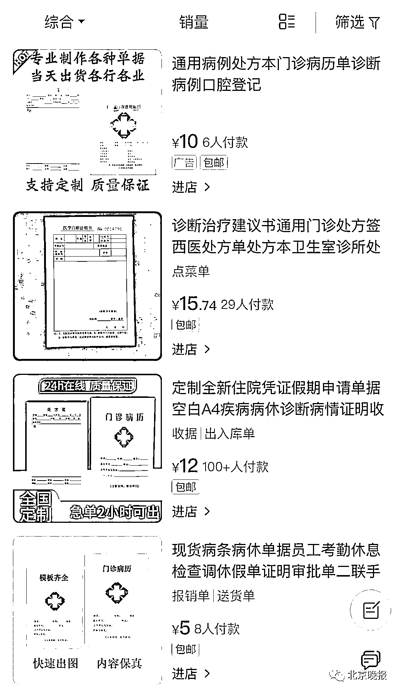
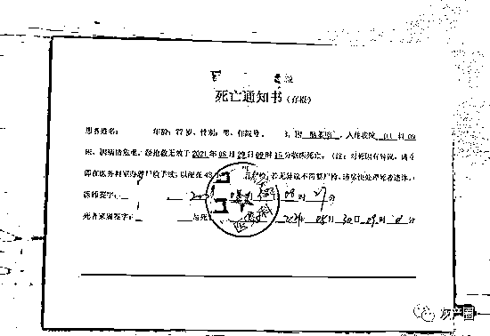
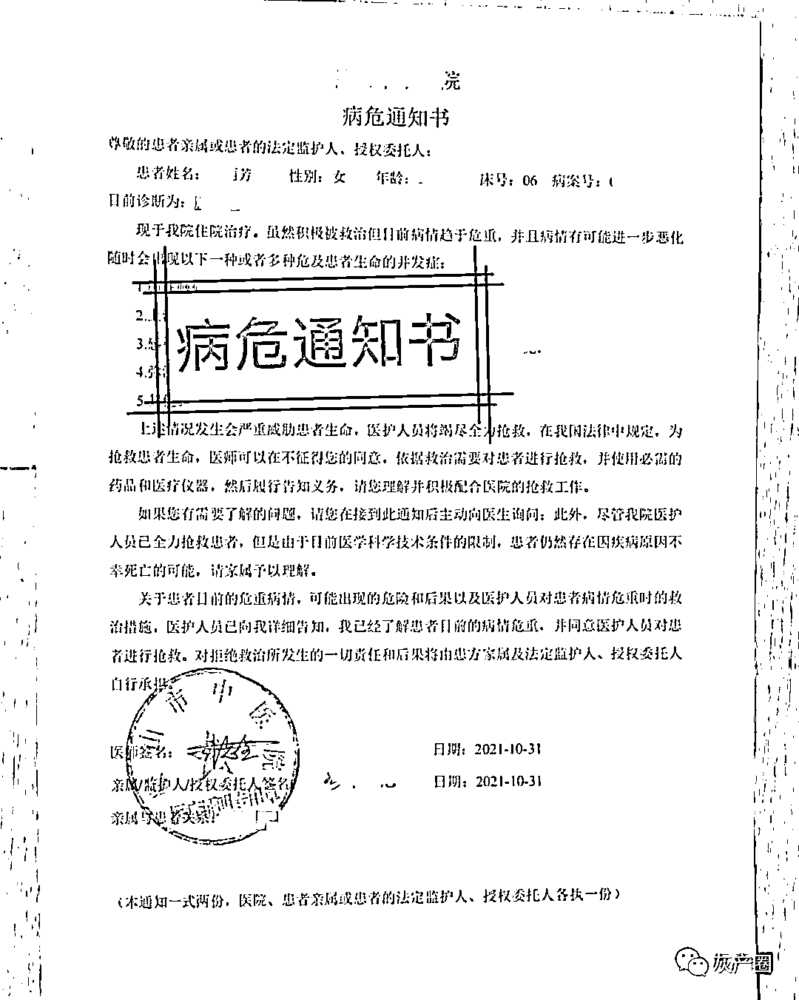

# “死亡证明”网上就能买？有店铺月销 3000 件……

> 原文：[`mp.weixin.qq.com/s?__biz=MzIyMDYwMTk0Mw==&mid=2247525492&idx=4&sn=238f42eabcf39689ec54edf6c2309945&chksm=97cbaf4ca0bc265ab39fe0af943370e48800807524d278fe94583ab8de9a7a14208610676893&scene=27#wechat_redirect`](http://mp.weixin.qq.com/s?__biz=MzIyMDYwMTk0Mw==&mid=2247525492&idx=4&sn=238f42eabcf39689ec54edf6c2309945&chksm=97cbaf4ca0bc265ab39fe0af943370e48800807524d278fe94583ab8de9a7a14208610676893&scene=27#wechat_redirect)

**“260 元一张死亡证明，130 元一张病危通知书，专业医师现做现盖章，保真。”**电商平台上，一家经营定制“门诊病历”的网店客服向记者介绍了这些没有写在产品介绍里的业务。

记者近日调查发现，只要花上一两百元，就能在网上轻松买到“死亡证明”“病危通知书”“手术通知单”“医学出生证明”等重要文书，令人不寒而栗。

什么医院的章都能盖 

众所周知，**死亡证明意味着一个人权利义务资格的终止、法定继承的开始、保险合同的履行，以及一系列民事权利义务发生变动**。而有人却将办死亡证明做成了生意。

记者在电商平台上搜索“处方”“诊断”等关键词后，便出现了很多以门诊病历本为封面的产品列表。这些产品标题通常突出“定制”“住院凭证”“诊断病情”“证明”等关键词，**销量较高的店铺一个月售出了 3000 件**，产品标价多为 10 至 20 元不等。

然而，当记者翻看产品详情页时，却发现几乎没有什么介绍，往往只留下一句：“请您联系客服后根据提示操作，私自拍下我们一律不予发货，此标价并非最终价格。”

当记者进入客服咨询页面时，一条写着“你需要的我们都有，请直接加微信 xxx”的回复便自动跳了出来。

记者按此方式加了 5 家此类网店客服的微信，并询问是否可以办理“死亡证明”，得到的回复都是“可以”。一家店铺客服直接发了一张已经做好的“死亡证明”给记者，并热情地表示：**“所有医院都可以做，章就是根据您提供的医院名字现做的。”**

不止能开“死亡证明” 

记者加了其中一家店铺客服微信后，该客服很快发来了一张产品清单，足足有 16 项，其中包括**“病危通知书”“手术知情同意书”“手术通知单”“住院证明”“化验单”**等。随后，客服发来了一张“病危通知书”模板，上边还盖有鞍山市中医院的印章以及医师签名。客服表示：“**‘病危通知书’有三种版本，PDF 版本 80 元，拍照版 100 元，邮寄 120 元**。办理‘病危通知书’仅需提供姓名、性别、年龄和诊断疾病即可。”

另一家店铺客服也表示：**“可指定任何病情、任何医院、任何时间段。”**还说，如果模板中的诊断医师不确定就随机写。在这位客服的朋友圈中还能看到，他们不止能开“死亡证明”“病危通知书”，还可以为满足顾客**缓考、补考、逃军训、免体测、处理银行逾期**等需求提供相关的证明、证书。         

办假买假严重违法 

上述电商所提供的“死亡证明”“病危通知书”等文书证明能够蒙混过关？记者采访了两位医疗从业者，他们均表示，**这些医疗相关证明“一看就是假的”。有的死亡证明甚至连身份证号等关键信息都没有**。

然而，妄图通过在网上购买相关证明来获得非法利益的案件并不少见。去年，江苏省泰州市一男子就为逃避刑罚，花钱办理死亡证明，最后该涉事男子被判诈骗罪与伪造国家机关公文证件印章罪数罪并罚，受到了法律的严惩。

北京法律咨询热线的律师告诉记者，根据我国治安管理处罚法规定，有伪造、变造或者买卖国家机关、人民团体、企业、事业单位或者其他组织的公文、证件、证明文件、印章行为的，将视情节**处 5 日以上 15 日以下拘留并罚款**。 

根据现行刑法的规定，伪造、变造、买卖或者盗窃、抢夺、毁灭国家机关的公文、证件、印章的，视情节**可处最高十年有期徒刑，并处罚金**。

从售卖的角度来说，电商平台也要承担起监管责任。根据电子商务法，电子商务经营者销售的商品或者提供的服务应当符合保障人身、财产安全的要求和环境保护要求，不得销售或者提供法律、行政法规禁止交易的商品或者服务。网店通过销售伪造的“死亡证明”获利，电商平台如视而不见，也将承担相应法律责任。

来源：北京日报，长沙晚报

← 向右滑动与灰产圈互动交流 →

